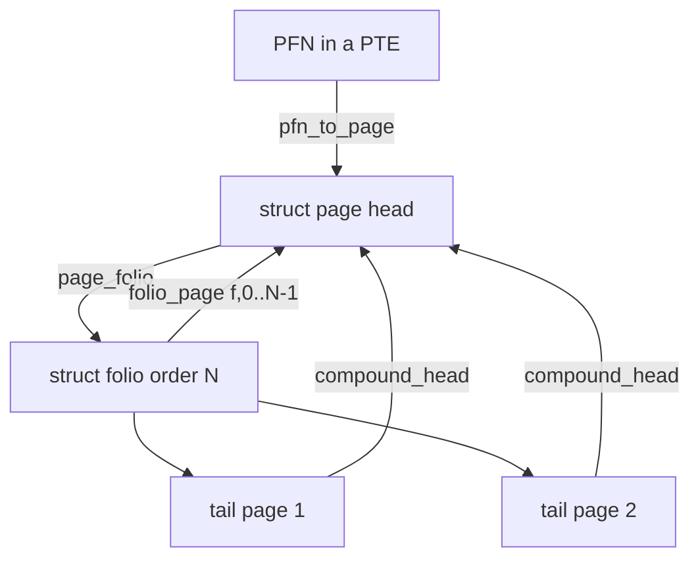

# Q2 — `struct page`, Folios, and Memory Descriptors

> **Subsystem:** Virtual Memory · **Files:** `include/linux/mm_types.h`, `include/linux/page-flags.h`, `mm/folio*.c`, `include/linux/mm.h`
> **Interviewer is really probing:** Do you understand the **per-page metadata** model, **why folios**
> were introduced, the **refcount vs mapcount** distinction, and where the kernel is heading (memdescs)?

---

## TL;DR Cheat Sheet

- **`struct page`** is the kernel's **per-physical-page metadata** (one per 4 KiB frame). The whole
  array (`mem_map` / vmemmap) is indexed by **PFN**: `pfn_to_page(pfn)` / `page_to_pfn(page)`.
- It's a **heavily overloaded union** — the same 64 bytes mean different things depending on the page's
  role (page cache, anon, slab, page-table, buddy free, compound tail). This overloading is the source
  of much complexity and bugs.
- A **`struct folio`** is a **typed handle to a head page** of 1 or more contiguous pages (order-N). It
  replaces the ambiguous "is this a head page or a tail page?" guesswork with a **compile-time-clear**
  type. Folios are how the kernel handles **large pages uniformly** (page cache, anon, THP) without
  per-subsystem "compound page" hacks.
- **`_refcount`** = total references that keep the page alive (page-cache, GUP pins, kernel users).
  **`_mapcount`** = how many **PTEs** map it. Free requires both to drop appropriately (Q-rmap).
- **Page flags** (`PG_locked`, `PG_dirty`, `PG_uptodate`, `PG_lru`, `PG_writeback`, …) live in
  `page->flags` (plus some in the upper PFN bits: node/zone/section).
- The **memdesc** effort is shrinking `struct page` to a single typed pointer and moving role-specific
  fields into **separate per-type structs** (`folio`, `slab`, `ptdesc`, …) — folios are step one.

---

## The Question

> Explain `struct page`. Why were folios introduced, and what problem do they solve? What's the
> difference between `_refcount` and `_mapcount`?

What they want: the **PFN-indexed metadata array**, the **union overloading** problem, the **folio**
motivation (large-page handling + head/tail clarity), and **refcount vs mapcount** semantics.

---

## Why per-page metadata exists (and why it became a problem)

The kernel manages physical memory at **page granularity**, and for **every** physical page it needs a
little bookkeeping: is it free or used? dirty? locked? on an LRU list? how many users? what's its role?
That bookkeeping is **`struct page`** — one descriptor per frame, in a giant array indexed by PFN, so
given any physical address the kernel can find its metadata in O(1).

The catch: **memory is scarce metadata-wise**. With 4 KiB pages, the `struct page` array is ~1.5% of
RAM. To keep it tiny (~64 bytes), the kernel **overloaded** the struct as a **union**: the same bytes
mean "page-cache index + mapping" for a cache page, "freelist pointer + slab info" for a slab page,
"buddy order" for a free page, "compound head pointer" for a tail page, etc. This saved memory but made
`struct page` a **minefield**: code had to *know* a page's role to interpret its fields, head-vs-tail
confusion caused real bugs, and large (compound) pages needed fragile "is this the head?" checks
everywhere.

**Folios solve the head/tail and large-page problem.** A `struct folio` is a **type** that is *always*
the **head** of a (possibly multi-page) allocation. APIs that take a `folio *` can't be accidentally
handed a tail page; large pages (THP, large page-cache folios) are handled with the **same code path**
as single pages. This removed a whole class of bugs and is the stepping stone to **memdescs** — the
long-term plan to slim `struct page` to one pointer and split role data into dedicated structs.

---

## When do these types matter?

- **`struct page`** — any time you deal with a **physical frame**: `alloc_pages`, page-table entries
  (PFN), DMA, the LRU, page cache.
- **`struct folio`** — modern page-cache, anonymous memory, reclaim, and THP code increasingly takes
  **folios**; new MM code is written folio-first. Filesystems use folios for the page cache (Q11).
- **`_refcount`** — taken/dropped on **`get_page`/`put_page`** (or `folio_get`/`folio_put`), GUP pins,
  page-cache insertion. Page is freed when it hits zero.
- **`_mapcount`** — adjusted as **PTEs** map/unmap the page (fork CoW, mmap, reclaim unmap via rmap).

---

## Where in the kernel

```
include/linux/mm_types.h     <- struct page (the union), struct folio, struct slab, struct ptdesc
include/linux/page-flags.h   <- PG_* flags, PageXxx()/folio_test_xxx() accessors, policies
include/linux/mm.h           <- get_page/put_page, page_ref_*, compound_head, folio helpers
mm/folio-compat.c, mm/*      <- folio APIs, conversions (page_folio(), folio_page())
include/asm-generic/memory_model.h <- pfn_to_page / page_to_pfn (depends on memory model, Q6)
```

---

## How it works — the mechanics

### 1. The PFN-indexed array

```
Physical RAM:   frame0   frame1   frame2 ...   (each 4 KiB)
mem_map / vmemmap:  page0   page1   page2 ...   (one struct page each)
   page_to_pfn(page)  = index ;  pfn_to_page(pfn) = &mem_map[pfn]
   (exact mapping depends on memory model: FLATMEM vs SPARSEMEM-vmemmap — Q6)
```
A PTE stores a **PFN**; `pfn_to_page` recovers the `struct page` to read flags/refcount. The
**top bits** of `page->flags` encode the **node/zone/section** so the page allocator and reclaim know
where a page belongs without extra lookups.

### 2. The union overloading (why folios were needed)

```c
struct page {
    unsigned long flags;          /* PG_* + node/zone/section bits */
    union {
        struct {                  /* page cache / anonymous */
            struct list_head lru; /* or other anchors */
            struct address_space *mapping;
            pgoff_t index;
            unsigned long private; /* buffer_heads, swap entry, ... */
        };
        struct {                  /* slab (SLUB) */
            struct slab *slab_page; /* ...freelist, counters... */
        };
        struct {                  /* compound tail page */
            unsigned long compound_head; /* low bit set; points to head */
        };
        struct {                  /* buddy free page */
            unsigned long buddy_order;
        };
        /* page table page (ptdesc), device page (ZONE_DEVICE), ... */
    };
    union { atomic_t _mapcount; ... };
    atomic_t _refcount;
};
```
The same 64 bytes mean different things by role → you must know the role to read a field safely. A
**tail page** of a compound allocation has `compound_head` pointing at the head; `compound_head(page)`
normalizes any page to its head. This is exactly the ambiguity folios remove.

### 3. Folios — a typed head-page handle

```c
struct folio {
    /* memcpy-compatible head: flags, lru, mapping, index, private */
    unsigned long flags;
    struct list_head lru;
    struct address_space *mapping;
    pgoff_t index;
    /* folio-specific: */
    atomic_t _mapcount, _refcount;
    unsigned int _folio_order;    /* 0 = single page; N = 2^N pages */
    /* ... */
};
```
- `page_folio(page)` returns the folio (head) for any page; `folio_page(folio, n)` gets the Nth page.
- `folio_order(f)`/`folio_nr_pages(f)` give the size. A folio of order 0 is a single page; order 9 is a
  2 MiB THP; large page-cache folios sit in between.
- APIs like `folio_get`, `folio_put`, `folio_lock`, `folio_mark_dirty`, `folio_test_uptodate` replace
  the page-level equivalents and **work identically for any size** — no compound-page special casing.

### 4. `_refcount` vs `_mapcount` (the classic question)

- **`_refcount`** counts **everything** that must keep the page alive: a page-cache entry holds one, a
  **GUP pin** holds one (or many — `pin_user_pages` biases by a large constant), each kernel user that
  did `get_page`. When `_refcount` hits **0**, the page is freed back to the allocator.
- **`_mapcount`** counts how many **user PTEs** map the page (i.e. user mappings, found/maintained via
  **rmap**). `-1` means "not mapped by any PTE."
- Relationship: a mapped page-cache page has `_mapcount >= 0` **and** `_refcount >= _mapcount + 1`
  (mappings + the page-cache reference). Reclaim must **unmap** (drive `_mapcount` to -1 via rmap) and
  then drop the page-cache ref before the page can be freed.
- **Why two counters?** They answer different questions: *"can I free this page?"* (`_refcount`) vs
  *"is this page still mapped into any process, and how do I find those mappings?"* (`_mapcount` +
  rmap). Migration/reclaim need both; a page **pinned** (high `_refcount` from GUP) **cannot be
  migrated** even if `_mapcount` is low — the GUP-vs-CoW and pinning bugs hinge on exactly this (Q4).

### 5. Page flags

`page->flags` holds state bits with carefully defined **policies** (which apply to head vs tail vs any):
`PG_locked` (I/O in progress / exclusive), `PG_uptodate` (contents valid), `PG_dirty` (needs
writeback), `PG_writeback` (under writeback), `PG_lru` (on an LRU list), `PG_reserved`,
`PG_slab`/`PG_head`. Folio accessors (`folio_test_dirty`, `folio_set_locked`) make head/tail semantics
explicit.

---

## Diagrams

### page ↔ folio ↔ PFN



### refcount vs mapcount lifecycle

```
page-cache insert:  _refcount=1, _mapcount=-1   (cached, unmapped)
mmap'd by 2 procs:  _refcount=3, _mapcount=1     (2 PTEs share -> mapcount counts mappings;
                                                   refcount = 2 mappings? no: cache(1)+... )
GUP pin (DMA):      _refcount += PIN_BIAS        (pinned -> cannot migrate, Q4)
reclaim:            unmap all PTEs (mapcount->-1) then drop cache ref -> refcount 0 -> free
```

---

## Annotated C

```c
/* Convert any page to its folio (head); convert back. */
struct folio *folio = page_folio(page);
struct page  *p     = folio_page(folio, 0);

/* Size of a folio. */
unsigned int order = folio_order(folio);     /* 0=4K, 9=2M THP ... */
long npages        = folio_nr_pages(folio);

/* Refcount management (keep-alive). */
folio_get(folio);        /* _refcount++  */
folio_put(folio);        /* _refcount--, free at 0 */

/* Map/unmap is reflected in _mapcount via rmap (Q-rmap), not called directly. */
int mapcount = folio_mapcount(folio);  /* number of PTEs mapping it */
int refcount = folio_ref_count(folio); /* total references */

/* Flags via type-clear accessors. */
if (folio_test_dirty(folio))  folio_clear_dirty(folio);
folio_lock(folio);  /* PG_locked */  folio_unlock(folio);

/* GUP pinning biases refcount heavily so pins are distinguishable & block migration. */
pin_user_pages(addr, n, FOLL_LONGTERM, pages); /* _refcount += GUP_PIN_COUNTING_BIAS */
```

> Senior nuance: **`_refcount` answers "is it safe to free?"; `_mapcount` answers "who maps it?"** A
> page can have `_mapcount == -1` (no PTEs) yet `_refcount > 0` (still in page cache or pinned). Pins
> (large `_refcount` bias from `pin_user_pages`) are precisely what make a page **unmovable** — the
> root of CoW-vs-GUP corruption and CMA/compaction failures.

---

## Company Angle

- **NVIDIA (GPU/HMM/DMA):** GUP vs `pin_user_pages`, `FOLL_LONGTERM`, refcount bias, and why pinned
  pages break migration/CoW (Q4/Q23); device pages (`ZONE_DEVICE`, `dev_pagemap`) reuse `struct page`.
- **Google (scale/large folios):** large page-cache folios for throughput, folio conversion of
  filesystems, reducing per-page overhead; the **memdesc** direction to shrink `struct page`.
- **AMD (large memory):** `struct page` array cost at TiB scale (vmemmap, Q6), huge folios for TLB
  reach (Q18).
- **Qualcomm (low-RAM):** metadata overhead vs RAM, compound pages, careful refcount/mapcount handling
  in drivers.

---

## War Story

*"A driver did `get_page()` on user pages for DMA and released them with `put_page()` on completion —
but under memory pressure we saw **data corruption** after **compaction**. Root cause: the driver
should have used **`pin_user_pages(FOLL_LONGTERM)`**, not `get_page`. A plain `get_page` raises
`_refcount` but **isn't recognized as a long-term pin**, so the migration code (compaction/CMA) believed
the page was movable, **migrated** it to a new frame, and updated the PTEs — while the device kept DMAing
to the **old** physical frame. Switching to `pin_user_pages` set the **pin bias** on `_refcount` so the
migration path saw a long-term pin and **refused to move** the page. The interviewer's follow-up —
*'why didn't mapcount save you?'* — let me explain that `_mapcount` tracks **PTEs**, not **kernel/DMA
pins**; only the **refcount pin bias** tells the migrator 'hands off.' This is exactly the distinction
folios + the GUP rework were designed to make explicit."*

---

## Interviewer Follow-ups

1. **What is `struct page` and how is it indexed?** Per-physical-page metadata in a PFN-indexed array
   (`pfn_to_page`/`page_to_pfn`); ~64 bytes, heavily unioned by page role.

2. **Why folios?** A typed handle to a **head** page that always represents 1+ contiguous pages,
   removing head/tail ambiguity and letting large pages (THP, large cache folios) use one code path.

3. **`_refcount` vs `_mapcount`?** `_refcount` = total references keeping it alive (free at 0);
   `_mapcount` = number of PTEs mapping it (-1 = unmapped). Different questions, both needed.

4. **Why can't a pinned page be migrated?** `pin_user_pages` biases `_refcount`; the migrator detects
   the pin and refuses to move it (else DMA hits the old frame — corruption).

5. **head vs tail page?** A compound/large allocation has one head and N-1 tails; tails point to the
   head via `compound_head`; `page_folio`/`compound_head` normalize to the head.

6. **Where do page flags live?** In `page->flags`; some bits (node/zone/section) are reserved for
   locating the page; folio accessors clarify head/tail policy.

7. **What's the memdesc plan?** Shrink `struct page` to a single typed pointer; move role data into
   per-type structs (`folio`, `slab`, `ptdesc`); folios are the first step.

8. **`get_page` vs `pin_user_pages`?** `get_page` is a generic ref; `pin_user_pages` is a **long-term
   pin** with a refcount bias that blocks migration and is the correct API for DMA/GUP.

9. **How big is the metadata overhead?** ~1.5% of RAM for 4 KiB pages; large folios and `ZONE_DEVICE`
   tricks (and memdescs) reduce it.

---

## 30-Minute Talk Track

| Min | Cover |
|-----|-------|
| 0–3 | Why per-page metadata; PFN-indexed array; size/overhead pressure |
| 3–8 | The union overloading by role; head/tail compound pages; the bug surface |
| 8–14 | Folios: typed head handle, page_folio/folio_page, order/nr_pages, uniform large-page code |
| 14–18 | Page flags and their head/tail policies; node/zone/section bits |
| 18–24 | _refcount vs _mapcount: semantics, relationship, free condition, rmap link |
| 24–27 | GUP pinning, refcount bias, why pins block migration (link Q4/Q23); ZONE_DEVICE |
| 27–30 | memdesc direction + war story (get_page vs pin_user_pages corruption) |
