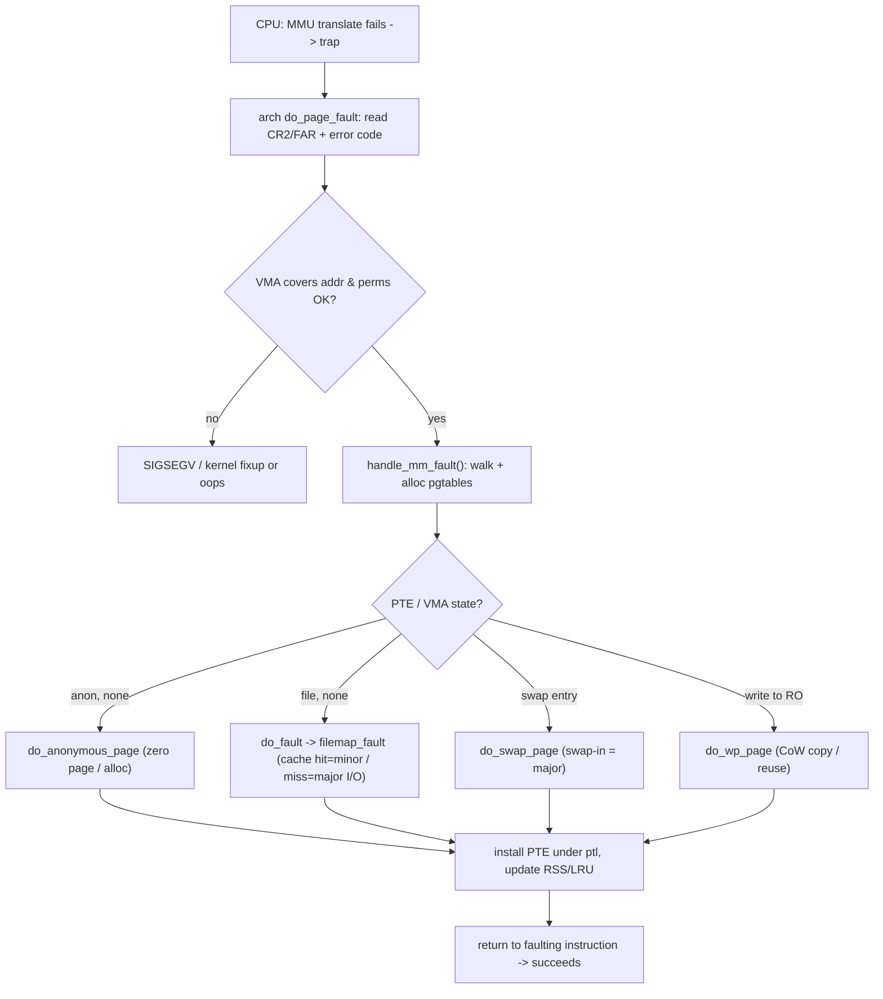

# Q3 — Page Fault Handling End-to-End

> **Subsystem:** Virtual Memory · **Files:** `arch/*/mm/fault.c`, `mm/memory.c`, `mm/huge_memory.c`, `mm/filemap.c`
> **Interviewer is really probing:** Can you trace a fault from the **hardware trap** through
> `handle_mm_fault()` to a **resolved PTE**, classify **minor/major/CoW**, and explain **per-VMA locks**?

---

## TL;DR Cheat Sheet

- A **page fault** fires when the MMU can't translate a VA (no PTE, or a permission violation). The CPU
  traps into the arch handler (`do_page_fault` on x86, `do_mem_abort`/`do_page_fault` on ARM64).
- The handler: read the **faulting address** (`CR2` / `FAR_EL1`) and **error code** (read/write/exec,
  user/kernel, present/not), find the **VMA**, check permissions, then call **`handle_mm_fault()`**.
- **Fault taxonomy:**
  - **Minor fault** — page already in memory (page cache, shared, or just needs a PTE): cheap, no I/O.
  - **Major fault** — page must be fetched from **disk/swap** (file read-in or swap-in): expensive, I/O.
  - **CoW fault** — write to a read-only shared page → copy it (Q4).
  - **Demand-zero** — first touch of anonymous memory → map the **zero page** / allocate on write (Q5).
  - **Invalid** — no VMA / no permission → **SIGSEGV** (or kernel oops / fixup).
- **Per-VMA locks (6.4+):** the fast path takes only the **VMA's** lock under RCU
  (`lock_vma_under_rcu`), avoiding the process-wide **`mmap_lock`** → faults on different VMAs scale.
- `handle_mm_fault()` walks/【allocates】 page-table levels (`__pud_alloc`/`pmd_alloc`/`pte_alloc`),
  then dispatches: `do_anonymous_page`, `do_fault` (file), `do_swap_page`, `do_wp_page` (CoW),
  `do_huge_pmd_*` (THP).

---

## The Question

> Walk through what happens, end to end, when a process touches memory and takes a page fault. Cover
> minor vs major vs CoW faults, the role of the VMA, and how `handle_mm_fault` resolves it.

---

## Why page faults are central

Page faults are the **engine of virtual memory** — almost everything lazy and on-demand happens via a
fault:

- **Demand paging:** we don't load a program's pages until touched; the fault brings them in. This
  makes `exec` fast and memory usage proportional to the **working set**, not the full image (Q5).
- **CoW:** `fork` shares pages read-only; the **write fault** copies only the pages actually modified
  (Q4) — making fork cheap.
- **File mapping:** `mmap` of a file installs no pages up front; faults pull pages from the **page
  cache** (or read them from disk = major fault).
- **Swap:** a reclaimed anon page is faulted back in from swap on next access (major fault, Q14).
- **THP, NUMA balancing, userfaultfd, mlock population** — all hook the fault path.

So the fault handler is where the kernel **lazily materializes** memory and enforces protection. It must
be **fast** (it's on the hot path of every first-touch), **correct under concurrency** (many threads
fault simultaneously), and able to **classify** the fault to do the minimal work. That classification —
minor (no I/O) vs major (I/O) vs CoW vs invalid — is exactly what interviewers want you to articulate,
because it maps directly to **performance** (`/proc/<pid>/stat` minflt/majflt) and **latency**.

---

## When does each fault type occur?

| Trigger | Fault type | Resolution |
|---------|-----------|------------|
| First touch of anon memory | **minor** (demand-zero) | map zero page / `do_anonymous_page` |
| Read of mmap'd file page in cache | **minor** | install PTE from page cache (`do_fault`) |
| Read of mmap'd file page not cached | **major** | read from disk → page cache → PTE |
| Access to swapped-out anon page | **major** | `do_swap_page` swap-in |
| Write to CoW/shared read-only page | **CoW (minor)** | `do_wp_page` copy (Q4) |
| Write to clean file page (shared) | minor | mark dirty, set writable, writeback later (Q12) |
| Access with no VMA / bad perms | **invalid** | SIGSEGV (user) / fixup or oops (kernel) |
| THP-eligible anon fault | minor | `do_huge_pmd_anonymous_page` (2 MiB) |

---

## Where in the kernel

```
arch/x86/mm/fault.c          <- do_page_fault(): CR2, error_code, vma lookup, send SIGSEGV
arch/arm64/mm/fault.c        <- do_page_fault()/do_mem_abort(): FAR_EL1, ESR_EL1
mm/memory.c                  <- handle_mm_fault(), __handle_mm_fault(), do_anonymous_page,
                                do_fault, do_swap_page, do_wp_page, finish_fault, fault PTE install
mm/filemap.c                 <- filemap_fault(): file-backed fault, readahead, page cache
mm/huge_memory.c             <- do_huge_pmd_anonymous_page, THP faults
include/linux/mm.h           <- struct vm_fault, vm_fault_t return codes (VM_FAULT_*)
```

---

## How a fault is handled — step by step

### 1. Hardware trap → arch handler

The MMU fails to translate the VA and raises a fault exception. The CPU saves state and jumps to the
arch handler:
- **x86:** `#PF` → `do_page_fault()`; faulting address in **`CR2`**, cause in the **error code**
  (bits: P present, W write, U user, I instruction-fetch, etc.).
- **ARM64:** data/instruction abort → `do_page_fault()`; address in **`FAR_EL1`**, syndrome in
  **`ESR_EL1`** (WnR = write-not-read, fault status code).

The handler first decides: is this a **user** or **kernel** address, a **read/write/exec**, and was the
PTE **present** (permission fault) or **absent** (mapping fault)?

### 2. Find the VMA (per-VMA lock fast path)

```
fast path:  vma = lock_vma_under_rcu(mm, addr)   -> takes only vma->vm_lock, no mmap_lock
            if it covers addr & perms OK -> proceed (scales across VMAs)
slow path:  down_read(&mm->mmap_lock); vma = vma_lookup(mm, addr); ...
```
If there's **no VMA** covering the address, or the access **violates `vm_flags`** (e.g. write to a
read-only VMA, exec of NX), it's an **invalid** access → **SIGSEGV** for user mode (or kernel
exception-table fixup / oops for kernel mode). The **stack** special case: a fault just below the stack
VMA may **grow** it (`expand_stack`, Q1).

### 3. `handle_mm_fault()` → walk/allocate page tables

```c
vm_fault_t handle_mm_fault(struct vm_area_struct *vma, unsigned long addr,
                           unsigned int flags, struct pt_regs *regs);
```
It builds a `struct vm_fault` and calls `__handle_mm_fault`, which **walks the page-table levels**,
allocating missing intermediate tables (`p4d_alloc`, `pud_alloc`, `pmd_alloc`, `pte_alloc`). At the PMD
level it may take the **THP** path (map a 2 MiB folio). Then it inspects the leaf **PTE** state and
**dispatches**:

### 4. Dispatch by PTE/VMA state

- **PTE none + anonymous VMA → `do_anonymous_page`** (demand-zero): for a **read**, map the shared
  **zero page** read-only (cheap); for a **write**, allocate a fresh zeroed page, set up rmap
  (`anon_vma`), install a writable PTE. → **minor** fault.
- **PTE none + file VMA → `do_fault`** → `vma->vm_ops->fault` (usually `filemap_fault`): look up the
  page in the **page cache**. **Hit** = minor; **miss** = allocate a page, kick **readahead**, read
  from disk = **major** fault, then `finish_fault` installs the PTE.
- **PTE present but not in RAM (swap entry) → `do_swap_page`**: read the page back from **swap**
  (consulting the **swap cache**), install PTE. → **major** fault (unless still in swap cache → minor).
- **PTE present, write to read-only (CoW) → `do_wp_page`**: if the page is shared (CoW after fork, or a
  KSM page), **copy** it and install a private writable PTE; if it's the **only** owner, just flip it
  writable (the "reuse" optimization). → Q4.
- **THP: `do_huge_pmd_anonymous_page` / `do_huge_pmd_wp_page`** for 2 MiB folios.

### 5. Install the PTE & finish

The chosen handler **installs/updates the leaf PTE** (under the **page-table lock** `pte_offset_map_lock`)
with the right PFN and permission bits, updates **RSS** counters and the **LRU**, flushes the TLB entry
if needd, and returns a **`vm_fault_t`** (`VM_FAULT_MINOR`/`MAJOR`/`OOM`/`SIGBUS`/`RETRY`). The arch
handler then **returns to the faulting instruction**, which now succeeds.

`VM_FAULT_RETRY` is important: the slow path may **drop `mmap_lock` and retry** (e.g. to wait for I/O
without holding the lock), which is how the fault path avoids holding locks across blocking I/O.

---

## Diagrams

### End-to-end flow



### Minor vs major cost

```
minor fault:  fault -> find page in RAM/cache -> install PTE        (~microseconds, no I/O)
major fault:  fault -> read from disk/swap (block I/O) -> install   (~milliseconds, I/O wait)
CoW fault:    fault -> copy 4K page -> install private PTE          (minor + a memcpy)
```

---

## Annotated C

```c
/* The fault descriptor threaded through the handlers. */
struct vm_fault {
    struct vm_area_struct *vma;
    unsigned long address;     /* faulting VA (page-aligned variant: pgoff etc.) */
    unsigned int flags;        /* FAULT_FLAG_WRITE / _USER / _RETRY_ALLOW / _VMA_LOCK */
    pmd_t *pmd; pud_t *pud;
    pte_t *pte;                /* leaf PTE pointer (when mapped) */
    spinlock_t *ptl;           /* page-table lock for the leaf */
    struct page *page;         /* resolved page to install */
};

/* Arch entry (x86, simplified). */
void do_page_fault(struct pt_regs *regs, unsigned long error_code, unsigned long address)
{
    struct vm_area_struct *vma = lock_vma_under_rcu(mm, address);  /* per-VMA fast path */
    if (!vma) { /* fall back to mmap_lock + vma_lookup, or SIGSEGV */ }
    if (access_error(error_code, vma)) { bad_area(); return; }     /* perms -> SIGSEGV */
    vm_fault_t ret = handle_mm_fault(vma, address, flags, regs);
    if (ret & VM_FAULT_RETRY) { /* dropped mmap_lock; retry */ }
    if (ret & VM_FAULT_OOM)   { pagefault_out_of_memory(); }
    if (ret & VM_FAULT_SIGBUS){ force_sig(SIGBUS); }
}

/* Demand-zero anonymous fault (core of Q5). */
static vm_fault_t do_anonymous_page(struct vm_fault *vmf) {
    if (!(vmf->flags & FAULT_FLAG_WRITE))
        return map_zero_page_readonly(vmf);   /* read: share the zero page */
    folio = vma_alloc_zeroed_movable_folio(vmf->vma, vmf->address); /* write: allocate */
    /* set up anon_vma rmap, install writable PTE */
}
```

> Senior nuance: the **per-VMA lock** (`FAULT_FLAG_VMA_LOCK`) is the modern scalability story — most
> faults never touch `mmap_lock`. And **`VM_FAULT_RETRY`** is how the handler does **blocking I/O
> without holding `mmap_lock`**, avoiding a giant serialization point during swap/file read-in.

---

## Company Angle

- **Google (scale/latency):** minor vs major fault rates as a latency signal; **per-VMA lock**
  scalability for threaded servers; major-fault storms during memory pressure; `userfaultfd` for live
  migration / snapshotting.
- **NVIDIA (HMM/GPU):** device faults and **`mmu_notifier`** invalidations interacting with the CPU
  fault path (Q23); GPU page faults mirroring CPU demand paging; huge mappings.
- **Qualcomm (Android/low-RAM):** major faults from zram/zswap swap-in (Q14), fault latency on slow
  storage, working-set behavior under memory pressure.
- **AMD (NUMA):** NUMA-hint faults (AutoNUMA, Q20) ride the fault path to sample/migrate pages; THP
  faults and their NUMA placement.

---

## War Story

*"A latency-sensitive service had sporadic multi-millisecond stalls in request handling. `/proc/<pid>/stat`
showed **major faults** (`majflt`) spiking during the stalls — the service `mmap`'d a large data file and
touched cold regions, taking **major page faults that blocked on disk I/O**. Two fixes: (1) we
**`madvise(MADV_WILLNEED)`** the hot ranges to trigger **readahead** so accesses became **minor** faults
(page already in cache), and for the truly hot set used **`mlock`** to keep it resident; (2) we confirmed
via `perf trace`/ftrace that the faults were serializing — on the older kernel every fault took
**`mmap_lock`**; moving to a kernel with **per-VMA locks** removed that contention so concurrent faults on
different regions didn't queue. Stalls dropped sharply. The interviewer's follow-up — *'how would you tell
a CoW fault from a major fault?'* — let me explain CoW faults are **minor** (no I/O, just a copy) and show
up as `minflt`, whereas disk/swap-in are `majflt`."*

---

## Interviewer Follow-ups

1. **Minor vs major fault?** Minor = page already in RAM/cache, just install a PTE (no I/O); major =
   must read from disk/swap (I/O, ~1000× slower). Tracked as `minflt`/`majflt`.

2. **Where's the faulting address and cause?** x86: `CR2` + error code; ARM64: `FAR_EL1` + `ESR_EL1`
   (WnR, fault status).

3. **What does `handle_mm_fault` do?** Walks/allocates page-table levels, then dispatches to
   `do_anonymous_page`/`do_fault`/`do_swap_page`/`do_wp_page`/THP based on PTE+VMA state; installs the PTE.

4. **What's the per-VMA lock and why?** A lock on the individual VMA taken under RCU
   (`lock_vma_under_rcu`) so faults on different VMAs don't serialize on the process-wide `mmap_lock`.

5. **What is `VM_FAULT_RETRY`?** A signal to drop `mmap_lock` and retry — lets the handler block on I/O
   (swap/file read) without holding the lock.

6. **How is a demand-zero read different from a write?** Read maps the shared **zero page** read-only
   (no allocation); write allocates a real zeroed page and installs a writable PTE (Q5).

7. **What turns a fault into SIGSEGV?** No VMA covers the address, or the access violates `vm_flags`
   (write to RO, exec of NX) — user mode gets SIGSEGV; kernel mode uses the exception table or oopses.

8. **How does the file fault find the page?** `filemap_fault` looks in the **page cache** (xarray,
   Q11); hit = minor, miss = allocate + readahead + disk read = major.

9. **How does THP change the fault?** `do_huge_pmd_anonymous_page` maps a **2 MiB** folio at the PMD
   level in one fault, reducing fault count and TLB pressure (Q18).

---

## 30-Minute Talk Track

| Min | Cover |
|-----|-------|
| 0–3 | Faults as the VM engine: demand paging, CoW, file map, swap, NUMA |
| 3–7 | Hardware trap → arch handler; CR2/FAR + error code; read/write/exec, present/absent |
| 7–11 | VMA lookup: per-VMA lock fast path vs mmap_lock; invalid → SIGSEGV; stack growth |
| 11–16 | handle_mm_fault: walk/allocate pgtables, build vm_fault, dispatch |
| 16–22 | The handlers: do_anonymous_page, do_fault/filemap_fault, do_swap_page, do_wp_page, THP |
| 22–25 | Install PTE under ptl, RSS/LRU, return code; VM_FAULT_RETRY and blocking I/O |
| 25–28 | Fault taxonomy & cost (minor/major/CoW); minflt/majflt observability |
| 28–30 | War story (major-fault stalls → readahead/mlock + per-VMA locks) |
