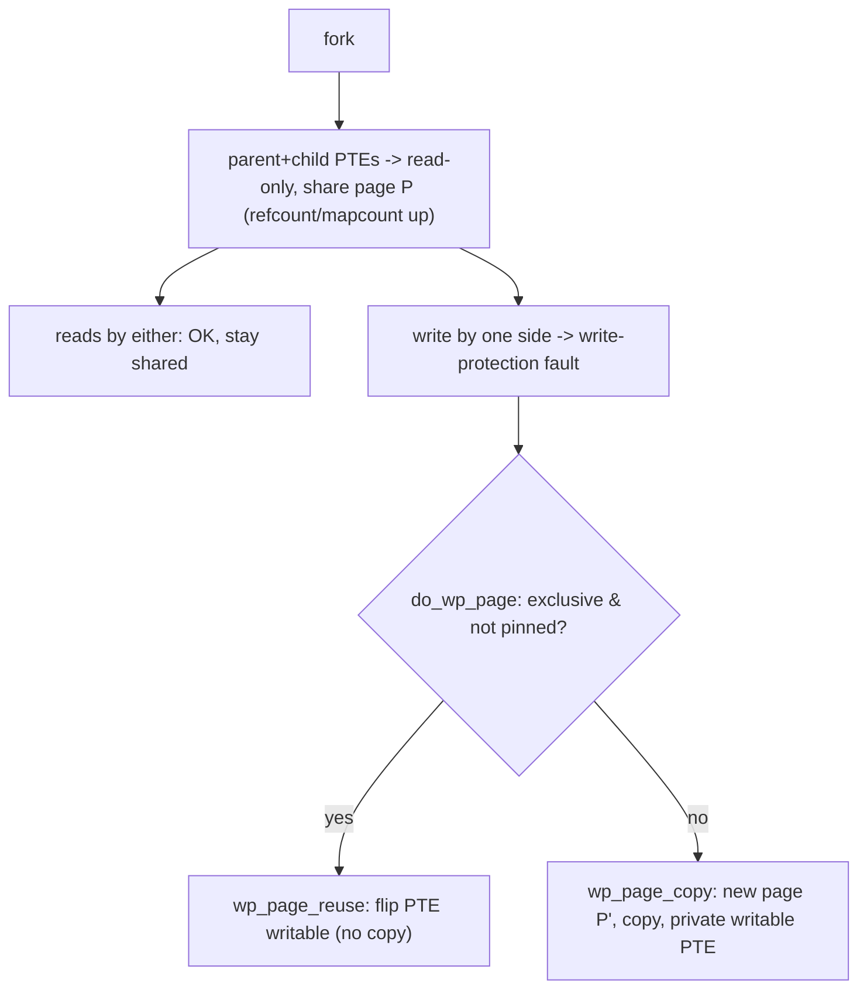

# Q4 — Copy-on-Write (CoW): fork, Reuse, and the GUP-vs-CoW Bug

> **Subsystem:** Virtual Memory · **Files:** `mm/memory.c` (`do_wp_page`, `wp_page_copy`), `kernel/fork.c`, `mm/gup.c`
> **Interviewer is really probing (NVIDIA favorite):** Do you understand **why fork is cheap**, the
> **write-fault copy/reuse** logic, and the subtle **pinning (GUP) vs CoW** data-corruption class?

---

## TL;DR Cheat Sheet

- **Copy-on-Write** lets `fork()` give the child a copy of the parent's address space **without
  copying any pages**: both share the same physical pages **read-only**, and the kernel **copies a page
  only when one side writes** to it (a write fault).
- Mechanics: at fork, all private (`MAP_PRIVATE`/anon) PTEs in **both** parent and child are made
  **read-only** and the shared pages' `_refcount`/`_mapcount` bumped. A later **write fault**
  (`do_wp_page`) either **copies** the page (if shared) or **reuses** it in place (if the writer is the
  sole owner).
- The **"reuse" optimization:** if `do_wp_page` sees the page is mapped only once (no other sharer,
  not pinned), it just **flips the PTE writable** instead of copying — avoiding a needless memcpy.
- **The GUP-vs-CoW bug class:** if the kernel/device has a **long-term pin** (`pin_user_pages`) on a
  page and CoW then **copies** it for the writer, the pin keeps pointing at the **old** page while the
  process now uses a **new** copy → **lost writes / corruption**. The fix reworked CoW to **never
  copy a pinned page** (and fork to honor pins), keying off the **pin count** (Q2).
- **THP CoW** copies/splits at the 2 MiB folio granularity (`do_huge_pmd_wp_page`).
- Related: **`vfork`** (no CoW, shares mm until exec), **KSM** pages are CoW (Q24), the **zero page** is
  CoW for anon reads (Q5).

---

## The Question

> Explain copy-on-write. How does `fork` use it, when does the actual copy happen, and what is the
> CoW-vs-GUP pinning problem?

---

## Why CoW exists

`fork()` semantically gives the child a **complete, independent copy** of the parent's memory. Doing
that **literally** — eagerly copying every page — would be catastrophic: a process with gigabytes of
memory would take a long time and double its RAM just to fork, and the most common case
(**`fork` immediately followed by `exec`**) throws that copy away instantly. That's pure waste.

**CoW makes the copy lazy.** Share the pages read-only and **defer** the copy to the moment a page is
actually **modified**. Benefits:

- **Cheap fork:** only page tables (marked read-only) are set up; no data copied. `fork` cost is
  proportional to address-space *structure*, not size.
- **Memory savings:** pages never written by either side stay **shared forever** (e.g. read-only data,
  code, untouched heap).
- **fork+exec is nearly free:** exec replaces the address space before most pages are ever written.

The cost/risk: a write triggers a **fault + copy** (slightly slower writes post-fork), and — the senior
gotcha — CoW interacts dangerously with **long-term pins (GUP/DMA)**, because copying a page out from
under a device that's still pointing at the original frame causes **silent data corruption**. That
interaction is the heart of this question.

---

## When does the copy actually happen?

| Event | What happens |
|-------|--------------|
| `fork()` | private PTEs (parent **and** child) set **read-only**; pages shared; refcounts bumped |
| Read by either side | no fault (pages are readable) — stays shared |
| **Write** by either side | **write-protection fault** → `do_wp_page` |
| `do_wp_page`, page shared (>1 user) | **copy** the page (`wp_page_copy`), install private writable PTE |
| `do_wp_page`, sole owner, not pinned | **reuse**: flip PTE writable in place (no copy) |
| `do_wp_page`, page **pinned** (GUP) | must **not** corrupt the pin — special handling (see below) |
| THP write after fork | `do_huge_pmd_wp_page`: copy/split the 2 MiB folio |

---

## Where in the kernel

```
kernel/fork.c            <- copy_mm -> dup_mmap: clone VMAs, copy_page_range marks PTEs RO/CoW
mm/memory.c              <- copy_pte_range (fork side), do_wp_page / wp_page_copy / wp_page_reuse
mm/huge_memory.c         <- do_huge_pmd_wp_page (THP CoW)
mm/gup.c                 <- pin_user_pages, FOLL_LONGTERM, gup-vs-cow handling
include/linux/mm.h       <- folio_maybe_dma_pinned(), page pin accounting
```

---

## How CoW works — step by step

### 1. At `fork()` — share read-only

`dup_mmap()` clones each VMA into the child; `copy_page_range()` walks the parent's PTEs and, for
**private** mappings, **write-protects** the PTE in *both* parent and child (clearing the writable bit,
setting a "this was writable / soft-dirty"-aware CoW state) and increments the page's `_mapcount`
(another PTE maps it) and `_refcount`. Shared (`MAP_SHARED`) and read-only file pages need no special
CoW — they're already shared/handled by the page cache.

Result: parent and child both see the **same physical pages**, mapped **read-only**. Reads work for
both; the first **write** by either traps.

### 2. The write fault — `do_wp_page`

A write to a CoW (read-only) page raises a **write-protection fault** (error code: present + write).
`handle_mm_fault` routes it to `do_wp_page`, which decides **copy vs reuse**:

```
do_wp_page:
  if page is exclusively owned by this mm (mapcount == 1) AND not pinned/KSM/shared:
        wp_page_reuse()   -> just set PTE writable in place   (NO copy — fast path)
  else:
        wp_page_copy()    -> allocate a new page, copy contents, set up new anon_vma rmap,
                             install a private writable PTE; drop a ref on the old page
```

- **Reuse** is the key optimization: after the *other* side has already copied (or exited), the
  remaining owner is exclusive, so flipping writable is correct and avoids a memcpy. Recent kernels
  track exclusivity precisely (the `PageAnonExclusive`/`PAE` bit) to reuse safely.
- **Copy** path allocates a fresh page, `copy_user_page`s the data, establishes a **new** `anon_vma`
  mapping for the writer's private copy, and points the writer's PTE at it. The other sharer keeps the
  original.

### 3. The GUP-vs-CoW corruption (the marquee gotcha)

Consider: a process calls **`pin_user_pages(FOLL_LONGTERM)`** on a buffer (e.g. for **DMA** / RDMA /
GPU). The kernel/device now holds a **long-term pin** on those physical pages and will read/write them
directly. Then the process **`fork`s** (or a CoW is otherwise triggered) and **writes** the buffer:

```
BEFORE FIX (the bug):
  parent pins page P  (DMA target)               device DMAs into P
  parent fork()s      -> P becomes CoW (RO) in parent & child
  parent writes buf   -> do_wp_page COPIES P to new page P'
                         parent's PTE now -> P'        (CPU sees P')
                         but the PIN still -> P         (device still writes P)
  => parent reads/writes P', device reads/writes P  -> LOST DATA / corruption
```

The page the **process** uses (P') and the page the **device/pin** uses (P) have diverged. This caused
real, hard-to-debug corruption (RDMA, io_uring, vfio, GPU).

**The fix** (upstream rework): CoW must **never silently copy a pinned page out from under the pin.**
The kernel now:
- at **fork**, detects pages that are **DMA-pinned** (`folio_maybe_dma_pinned()`) and **copies them
  eagerly** for the child (or keeps them exclusive to the parent) so the **pin and the writer stay on
  the same page**;
- tracks **`PageAnonExclusive`** so `do_wp_page` knows whether reuse is safe;
- ensures `pin_user_pages` and CoW agree on which mm "owns" the pinned page.

The senior framing: **a long-term pin and CoW both want to be the authority on a page's physical
identity; the kernel must guarantee the pinned process and the device never end up on different
copies.** This is *why* `_refcount` pin-bias exists (Q2) and why `pin_user_pages` ≠ `get_user_pages`.

### 4. THP and special cases

- **THP CoW** (`do_huge_pmd_wp_page`) copies/splits at the **2 MiB** folio level; if a sub-page needs a
  private copy, the huge page may be **split** into 4 KiB pages first.
- **`vfork()`** deliberately **shares** the parent's mm (no CoW) and **suspends the parent** until the
  child execs/exits — used for fast spawn; writing arbitrary memory in the child is undefined.
- **Zero page:** anonymous **read** faults map the shared **zero page** read-only; the first **write**
  is a CoW from the zero page to a real allocation (Q5).
- **KSM** merged pages are CoW: a write **un-merges** by copying (Q24).

---

## Diagrams

### CoW after fork



### GUP-vs-CoW divergence (pre-fix) vs fix

```
PRE-FIX:  pin->P ;  fork ; write -> copy to P' ;  CPU uses P', device uses P  => CORRUPTION
FIX:      fork sees folio_maybe_dma_pinned(P) -> copy EAGERLY for child,
          keep parent (the pinner) + device both on the SAME page P  => consistent
```

---

## Annotated C

```c
/* fork side: write-protect private PTEs so future writes trap (mm/memory.c copy_pte_range). */
static void copy_one_pte(...) {
    if (is_cow_mapping(vm_flags) && pte_write(pte)) {
        ptep_set_wrprotect(src_mm, addr, src_pte);  /* parent PTE -> read-only */
        pte = pte_wrprotect(pte);                    /* child PTE  -> read-only */
    }
    /* if the folio is DMA-pinned, COPY eagerly instead of CoW-sharing (gup-vs-cow fix) */
    if (folio_maybe_dma_pinned(folio))
        return copy_present_page_eagerly(...);       /* keep pin & writer on same page */
    folio_get(folio); /* +refcount */ /* +mapcount via rmap */
}

/* write-fault: copy vs reuse (mm/memory.c). */
static vm_fault_t do_wp_page(struct vm_fault *vmf) {
    struct folio *folio = page_folio(vmf->page);
    if (folio && folio_test_anon(folio) &&
        PageAnonExclusive(vmf->page) && !folio_maybe_dma_pinned(folio))
        return wp_page_reuse(vmf);     /* sole, unpinned owner -> just make writable */
    return wp_page_copy(vmf);          /* shared/pinned -> allocate + copy */
}

/* The correct API for long-term DMA pins (NOT get_user_pages). */
long pin_user_pages(unsigned long start, unsigned long nr, unsigned int gup_flags,
                    struct page **pages);  /* gup_flags includes FOLL_LONGTERM */
```

> Senior nuance: the reuse-vs-copy decision hinges on **exclusivity** (`PageAnonExclusive`) and
> **pin state** (`folio_maybe_dma_pinned`). Get either wrong and you either **leak a copy** (perf) or
> **diverge a pinned page** (corruption). That's why the GUP-vs-CoW fix touched **both** fork and the
> write-fault path.

---

## Company Angle

- **NVIDIA (the headline):** RDMA/GPU/`vfio` long-term pins + fork/CoW corruption is a real bug they
  care about. Know `pin_user_pages` vs `get_user_pages`, `FOLL_LONGTERM`, `folio_maybe_dma_pinned`, and
  why pinned pages must not be CoW-copied or migrated (Q2/Q23).
- **Google (io_uring/containers):** io_uring registered buffers are pinned; fork semantics in
  multi-threaded/containerized services; `MADV_DONTFORK`/`MADV_WIPEONFORK` to control CoW behavior.
- **Qualcomm (Android):** `fork`/`zygote`-style spawning relies on CoW sharing for fast app start and
  memory savings; CoW interplay with low-RAM and KSM.
- **AMD (scale):** CoW cost and THP CoW/split behavior under large memory; reuse optimization for
  write-heavy post-fork workloads.

---

## War Story

*"An RDMA application intermittently transferred **stale data** after we added a `fork()` for a helper
process. The buffer was registered (long-term **pinned**) for RDMA, and after the fork the parent
**wrote** to it. On the kernel we shipped, that write triggered a **CoW copy** — the parent's CPU
writes went to a **new** page, but the NIC kept DMAing the **original** pinned page, so the two
diverged. The textbook **GUP-vs-CoW** bug. Short-term mitigation: `madvise(buf, len, MADV_DONTFORK)`
so the buffer VMA isn't inherited by the child, eliminating the CoW trigger. Real fix: move to a kernel
with the **GUP-vs-CoW rework**, which detects `folio_maybe_dma_pinned()` at fork and **copies eagerly**
so the pinning process and the device stay on the **same** page. I also audited the driver to ensure it
used **`pin_user_pages(FOLL_LONGTERM)`**, not `get_user_pages`. The interviewer's follow-up — *'why does
the reuse optimization matter here?'* — let me explain that correct **exclusivity tracking**
(`PageAnonExclusive`) is what lets the kernel safely reuse vs copy, and getting it wrong is exactly how
the corruption slipped in."*

---

## Interviewer Follow-ups

1. **Why is fork cheap with CoW?** No data is copied — only page tables are set up (PTEs marked
   read-only); copies happen lazily on write, and fork+exec usually discards them entirely.

2. **When does the actual copy happen?** On the first **write** to a shared CoW page → write-protection
   fault → `do_wp_page` → `wp_page_copy` (or reuse if exclusive).

3. **What's the reuse optimization?** If the faulting mm is the **sole, unpinned** owner
   (`PageAnonExclusive`, mapcount 1), `do_wp_page` just flips the PTE writable — no memcpy.

4. **Explain the GUP-vs-CoW bug.** A long-term pin points at page P; a post-fork write CoW-copies P to
   P′; the process uses P′ while the device still uses P → divergence/corruption. Fixed by copying
   pinned pages eagerly at fork and never CoW-copying a pinned page.

5. **`get_user_pages` vs `pin_user_pages`?** The latter is the correct **long-term pin** (refcount
   bias, recognized by fork/CoW/migration); plain GUP/`get_page` isn't and can be silently moved.

6. **How does the kernel know a page is pinned?** `folio_maybe_dma_pinned()` checks the refcount
   pin-bias set by `pin_user_pages` (Q2).

7. **What do `MADV_DONTFORK`/`MADV_WIPEONFORK` do?** Control CoW inheritance: `DONTFORK` keeps a VMA
   out of the child (used for DMA buffers); `WIPEONFORK` zeroes it in the child.

8. **THP CoW?** `do_huge_pmd_wp_page` copies/splits the 2 MiB folio; may split to 4 KiB if only a
   sub-page is written.

9. **How does the zero page relate to CoW?** Anon reads map the read-only **zero page**; the first
   write CoWs it into a real allocation (Q5).

---

## 30-Minute Talk Track

| Min | Cover |
|-----|-------|
| 0–3 | Why CoW: eager fork is wasteful; fork+exec; lazy copy on write |
| 3–8 | fork mechanics: dup_mmap, write-protect private PTEs in parent+child, refcount/mapcount |
| 8–13 | The write fault: do_wp_page; copy vs reuse; PageAnonExclusive; THP CoW/split |
| 13–20 | GUP-vs-CoW bug: pin→P, fork, write copies to P′, device still on P → corruption |
| 20–24 | The fix: folio_maybe_dma_pinned at fork → eager copy; pin_user_pages vs GUP |
| 24–27 | vfork, zero page CoW, KSM CoW, MADV_DONTFORK/WIPEONFORK |
| 27–30 | War story (RDMA stale data) + exclusivity/pin trade-offs |
