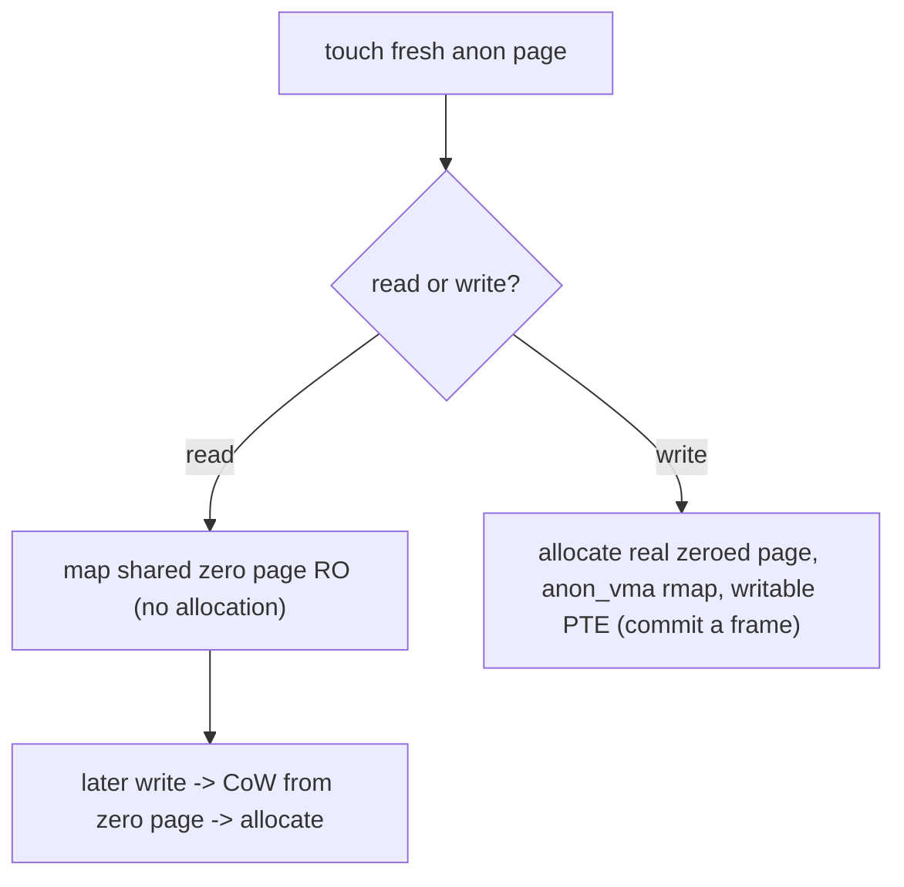
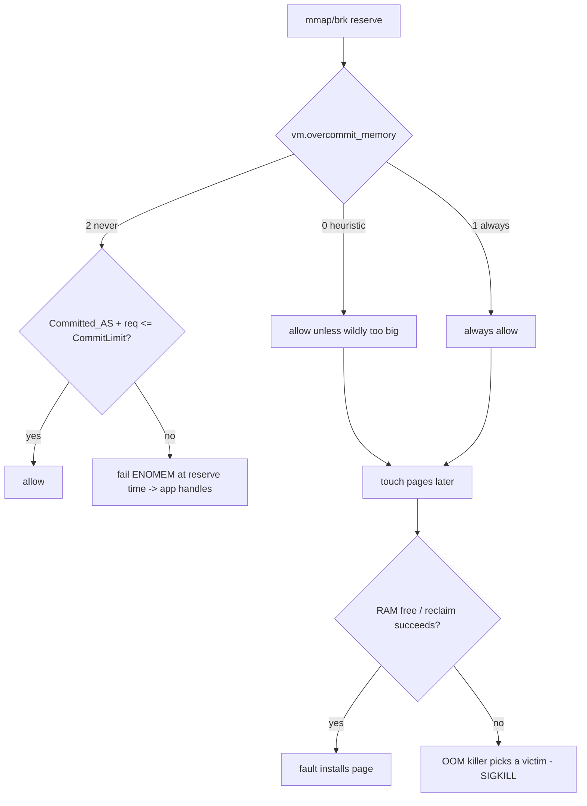

# Q5 — Demand Paging & Memory Overcommit

> **Subsystem:** Virtual Memory · **Files:** `mm/memory.c`, `mm/mmap.c`, `mm/util.c` (`__vm_enough_memory`), `mm/oom_kill.c`
> **Interviewer is really probing (Qualcomm favorite):** Do you understand **lazy allocation** (the
> zero page, demand-zero), the **three overcommit modes**, and how overcommit interacts with the **OOM killer**?

---

## TL;DR Cheat Sheet

- **Demand paging:** memory you `mmap`/`malloc` is **not** backed by physical pages until **first
  touch**. The VMA exists; pages are allocated **on the page fault** (Q3).
- **Demand-zero / the zero page:** the first **read** of anonymous memory maps a single shared
  **read-only zero page** (no allocation, no per-page cost). The first **write** triggers a CoW that
  allocates a real zeroed page. So a huge `calloc`'d-but-only-read array costs almost nothing.
- **Overcommit:** the kernel lets processes **reserve more virtual memory than there is RAM+swap**,
  betting that not all of it will be touched. Controlled by **`vm.overcommit_memory`**:
  - `0` = **heuristic** (default): allow "reasonable" overcommit; reject wild requests.
  - `1` = **always** overcommit: never refuse (`malloc` never fails) — used by VMs/HPC/redis-fork.
  - `2` = **never** (strict accounting): total commit ≤ `swap + RAM * overcommit_ratio` (+ `kbytes`).
- The danger of overcommit: if everyone **touches** their reservation simultaneously, RAM runs out at
  **fault time** → the **OOM killer** (Q-reclaim) frees memory by killing a process. Overcommit trades
  *guaranteed allocation failure* (`malloc` returns NULL) for *deferred risk* (possible OOM kill).
- **Commit accounting** (`Committed_AS` in `/proc/meminfo`) tracks how much has been **promised**;
  `CommitLimit` is the cap under mode 2.

---

## The Question

> Explain demand paging and the zero page. What is memory overcommit, what are the modes, and how does
> overcommit relate to the OOM killer?

---

## Why demand paging and overcommit exist

Two observations about real programs:

1. **Programs reserve far more memory than they use.** A process `mmap`s big arenas, links large
   libraries, allocates buffers "just in case," and `fork`s (doubling its address space). The
   **resident** working set is typically a small fraction of the **virtual** size. Eagerly backing
   every reservation with physical RAM would waste enormous memory.

2. **Allocation and use are separated in time.** `malloc` may return memory the program never touches,
   or touches much later. Allocating physical pages **at reservation time** is premature.

**Demand paging** addresses #1 and #2: hand out **virtual** address space freely (cheap — just VMAs +
page-table structure), and commit **physical** pages only when the program actually **faults** on an
address (Q3). The **zero page** sharpens this: read-only views of fresh anonymous memory cost a single
shared page system-wide.

**Overcommit** is the policy layer on top: since most reservations aren't fully used, the kernel can
**promise more memory than physically exists** and statistically be fine — dramatically improving
memory utilization and enabling workloads like `fork()`-heavy servers (redis, postgres),
**VMs** (guests reserve big but use little), and HPC. The trade-off it introduces — and the senior
discussion point — is **when the bet fails**: if too many promises are redeemed at once, the system
can't page-fault successfully and must invoke the **OOM killer**. Tuning overcommit is choosing
**where** allocation failure surfaces: at `malloc` (mode 2, predictable, app-handleable) or at fault
time via OOM (modes 0/1, better utilization, riskier).

---

## When does each mechanism kick in?

| Event | Behavior |
|-------|----------|
| `mmap`/`malloc` (reserve) | VMA created; **commit accounting** checked vs mode; **no pages** allocated |
| First **read** of anon page | map shared **zero page** read-only (no allocation) |
| First **write** of anon page | allocate a real zeroed page (CoW from zero page) — minor fault |
| File mmap read | page pulled from page cache (minor) or disk (major) |
| Mode 2, over `CommitLimit` | `mmap`/`brk` **fails** with `ENOMEM` at reservation time |
| Modes 0/1, RAM exhausted at fault | reclaim → if it can't free enough → **OOM killer** |

---

## Where in the kernel

```
mm/util.c        <- __vm_enough_memory(): the overcommit accounting decision
mm/mmap.c        <- mmap/brk reserve path, vm_acct_memory, security_vm_enough_memory_mm
mm/memory.c      <- do_anonymous_page(): zero page on read, alloc on write (demand-zero)
mm/oom_kill.c    <- out_of_memory(): victim selection when overcommit bet fails (Q-reclaim)
sysctls: vm.overcommit_memory, vm.overcommit_ratio, vm.overcommit_kbytes, vm.admin_reserve_kbytes
/proc/meminfo: Committed_AS, CommitLimit
```

---

## How it works — mechanics

### 1. Demand-zero and the zero page

When a process touches a fresh anonymous page, `do_anonymous_page` (Q3) distinguishes read vs write:

```c
static vm_fault_t do_anonymous_page(struct vm_fault *vmf) {
    if (!(vmf->flags & FAULT_FLAG_WRITE)) {
        /* READ: map the single global read-only zero page — no allocation */
        entry = pte_mkspecial(pfn_pte(my_zero_pfn(addr), vma->vm_page_prot));
        set_pte(vmf->pte, entry);      /* RO; many faults share ONE physical page */
        return 0;
    }
    /* WRITE: allocate a real zeroed page, set up anon_vma rmap, install writable PTE */
    folio = vma_alloc_zeroed_movable_folio(vma, addr);
    ...
}
```
So an enormous buffer that's allocated and only **read** (or sparsely written) consumes almost no
physical memory: all the read-only pages alias the **one** zero page. Writing a page is what actually
**commits** a physical frame. This is why `calloc(huge)` returns instantly and why RSS grows only as
you **write**.

### 2. Commit accounting at reservation time

When you `mmap` private anonymous memory (or grow the heap), the kernel performs **commit accounting**
via `__vm_enough_memory()` — *before* any page is touched — according to `vm.overcommit_memory`:

- **Mode 0 (heuristic, default):** allow the reservation unless it's **obviously** too large relative
  to free RAM + swap + reclaimable cache (a rough sanity check). Catches insane single requests, allows
  normal overcommit. `malloc` almost never fails, but a pathological request is refused.
- **Mode 1 (always):** **never** refuse. `__vm_enough_memory` returns success unconditionally. Chosen
  when the app *knows* it over-reserves and will touch little — VMs, scientific codes, and notably
  **redis** (which `fork`s to snapshot and would otherwise double commit). Risk: all failure is deferred
  to **OOM**.
- **Mode 2 (never / strict):** maintain a hard **`CommitLimit`** =
  `swap + RAM * overcommit_ratio/100` (or `overcommit_kbytes`), and refuse any reservation that would
  push **`Committed_AS`** over it. `malloc`/`mmap` fail with **`ENOMEM`** *predictably*, before memory
  is touched — no OOM surprises. Used where determinism matters (some servers, safety-critical).

`Committed_AS` (in `/proc/meminfo`) is the running total of memory **promised**; `CommitLimit` is the
ceiling under mode 2. `vm.admin_reserve_kbytes`/`user_reserve_kbytes` keep a little headroom so root can
recover.

### 3. When the overcommit bet fails → OOM

Under modes 0/1, reservations succeed without RAM backing. Problems appear **at fault time**: when a
process finally **writes** a reserved page and there's **no free memory and reclaim can't free enough**
(Q-reclaim), the allocation in the fault path fails → `pagefault_out_of_memory()` → the **OOM killer**
chooses a victim (by `oom_score`/`oom_score_adj`) and kills it to free memory. So overcommit converts
"`malloc` returns NULL" (handleable) into "some process gets SIGKILL'd later" (disruptive but enables
high utilization). This is the fundamental trade-off and the reason **mode choice is workload-specific**.

### 4. Shared/file mappings and accounting nuances

- **`MAP_SHARED` file** mappings are backed by the **page cache**, not anon commit — they don't count
  the same way (the file is the backing store).
- **`MAP_NORESERVE`** asks the kernel **not** to account commit for a mapping (used for big sparse
  mappings you know you won't fully touch).
- **`mlock`** forces immediate population + residency (defeats demand paging for that range — used for
  real-time/security to avoid faults/swap).

---

## Diagrams

### Demand-zero read vs write



### Overcommit modes & where failure surfaces



---

## Annotated C

```c
/* The overcommit accounting decision (mm/util.c, simplified). */
int __vm_enough_memory(struct mm_struct *mm, long pages, int cap_sys_admin)
{
    if (sysctl_overcommit_memory == OVERCOMMIT_ALWAYS)        /* mode 1 */
        return 0;                                             /* never refuse */

    if (sysctl_overcommit_memory == OVERCOMMIT_GUESS) {       /* mode 0 */
        long allowed = free_ram + free_swap + reclaimable_cache;
        if (pages <= allowed) return 0;                       /* reasonable -> ok */
        goto error;                                           /* obviously too big */
    }

    /* mode 2: strict CommitLimit = swap + RAM*ratio (- reserves) */
    allowed = (totalram * sysctl_overcommit_ratio / 100) + total_swap_pages;
    allowed -= admin_reserve / PAGE_SIZE;
    if (percpu_counter_read_positive(&vm_committed_as) + pages <= allowed)
        return 0;
error:
    return -ENOMEM;          /* reservation refused at mmap/brk time */
}
```

```bash
# Inspect / tune:
grep -E 'Committed_AS|CommitLimit' /proc/meminfo
sysctl vm.overcommit_memory       # 0 / 1 / 2
sysctl vm.overcommit_ratio        # used by mode 2 (percent of RAM)
sysctl -w vm.overcommit_memory=2  # strict: malloc fails predictably instead of OOM
```

> Senior nuance: overcommit doesn't change **how much RAM exists** — it changes **where allocation
> failure appears**. Mode 2 makes it **explicit and early** (`ENOMEM` at `malloc`, app can degrade
> gracefully); modes 0/1 make it **implicit and late** (OOM kill), maximizing utilization at the cost
> of predictability.

---

## Company Angle

- **Qualcomm (Android/low-RAM — the headline):** demand paging + zram/zswap + **lmkd**/PSI replace the
  in-kernel OOM for responsiveness; tight RAM makes the overcommit bet riskier; `MADV_*` and `mlock`
  to control residency; per-app memory budgets.
- **Google (containers/scale):** overcommit policy in multi-tenant nodes, `Committed_AS` monitoring,
  memcg limits (Q22) bounding the blast radius, systemd-oomd for graceful kills before global OOM.
- **NVIDIA (HPC/VMs):** mode 1 for large sparse allocations (GPU/HPC), `MAP_NORESERVE`, pinned/`mlock`
  buffers that defeat demand paging.
- **AMD (large memory):** commit accounting at TiB scale, THP demand faults, NUMA placement of
  on-demand pages.

---

## War Story

*"A redis instance started failing to fork for background saves (`BGSAVE`) with `Cannot allocate
memory`. Redis forks a child that shares all memory via **CoW** to snapshot — but the box had
**`vm.overcommit_memory=0`** (heuristic), and the heuristic saw that the fork could *in principle*
double `Committed_AS` beyond what looked safe, so it refused. In reality the child barely writes any
pages (it just reads to serialize), so the CoW copies are tiny — the reservation was never going to be
realized. The fix is the documented one: set **`vm.overcommit_memory=1`** (always overcommit) so fork
succeeds, and rely on the fact that CoW + demand paging keep actual usage low. To bound the downside, we
put redis in a **memcg** (Q22) with a `memory.max` so a runaway couldn't take down the host, and watched
PSI. The interviewer's follow-up — *'isn't always-overcommit dangerous?'* — let me explain the
trade-off: yes, it defers failure to OOM, but for **fork-to-snapshot** workloads the alternative
(refusing the fork) breaks the app, so you accept overcommit and **contain risk** with cgroups + OOM
tuning."*

---

## Interviewer Follow-ups

1. **What is demand paging?** Physical pages are allocated on **first fault**, not at reservation;
   VMAs/virtual space are cheap, RSS tracks the touched working set.

2. **What's the zero page?** A single shared read-only page that all fresh anonymous **reads** map to —
   so read-only/untouched memory costs (almost) nothing; the first **write** CoWs to a real page.

3. **The three overcommit modes?** 0 = heuristic (default, allow reasonable), 1 = always (never
   refuse), 2 = strict (`Committed_AS ≤ CommitLimit`, fail early with `ENOMEM`).

4. **What is `CommitLimit` / `Committed_AS`?** `Committed_AS` = total memory promised; `CommitLimit`
   (mode 2) = `swap + RAM*overcommit_ratio` — the cap on promises.

5. **How does overcommit relate to OOM?** Modes 0/1 let promises exceed RAM; if too many are redeemed
   and reclaim can't cope, the **OOM killer** frees memory by killing a process — failure is **deferred**
   to fault time.

6. **When mode 1 vs mode 2?** Mode 1 for fork-to-snapshot / VMs / sparse HPC (don't break the app);
   mode 2 where you need **predictable** allocation failure and no OOM surprises.

7. **What does `MAP_NORESERVE` do?** Skips commit accounting for a mapping you know you won't fully
   touch (large sparse arrays).

8. **How do you defeat demand paging when needed?** `mlock`/`MAP_LOCKED` (populate + pin resident),
   `MADV_WILLNEED`/`MAP_POPULATE` (prefault) — for RT/latency/security.

9. **Does file-backed shared memory count as commit?** No — it's backed by the **page cache**/file, not
   anonymous commit accounting.

---

## 30-Minute Talk Track

| Min | Cover |
|-----|-------|
| 0–3 | Programs reserve >> they use; allocation vs use separated in time → lazy backing |
| 3–8 | Demand paging: VMA cheap, pages on fault; RSS vs virtual size |
| 8–13 | Zero page: read maps shared RO zero page; write allocates (CoW); calloc(huge) cost |
| 13–18 | Overcommit rationale; commit accounting __vm_enough_memory; Committed_AS/CommitLimit |
| 18–23 | The three modes (heuristic/always/strict) and where failure surfaces |
| 23–26 | Bet failing → reclaim → OOM killer; deferred vs early failure trade-off |
| 26–28 | MAP_NORESERVE, mlock/MAP_POPULATE, file vs anon accounting |
| 28–30 | War story (redis fork + overcommit=1 + memcg containment) |
