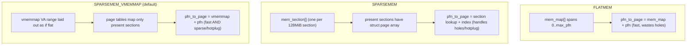
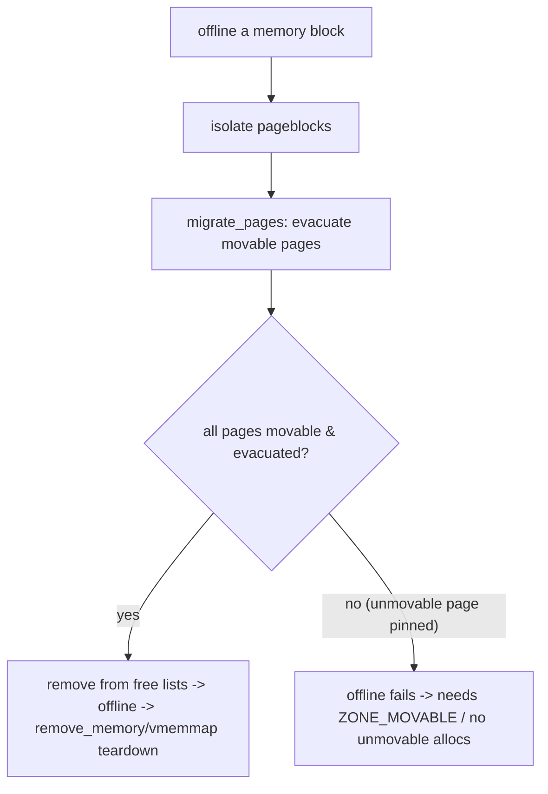

# Q6 — Memory Models: FLATMEM vs SPARSEMEM, vmemmap, and Hotplug

> **Subsystem:** Physical Allocators · **Files:** `mm/sparse.c`, `mm/sparse-vmemmap.c`, `include/asm-generic/memory_model.h`, `mm/memory_hotplug.c`
> **Interviewer is really probing (AMD/large-memory):** Do you understand how `pfn_to_page` works under
> different **memory models**, why **SPARSEMEM** exists, and how **memory hotplug** depends on it?

---

## TL;DR Cheat Sheet

- A **memory model** defines how the kernel maps a **PFN ↔ `struct page`** and how it represents
  **physical address space** that may have **holes** (gaps between DRAM banks, reserved regions, NUMA
  node boundaries, hotplug slots).
- **FLATMEM:** one big contiguous `mem_map[]` array, `pfn_to_page(pfn) = &mem_map[pfn - ARCH_PFN_OFFSET]`.
  Simple, but wastes memory if the address space is **sparse** (you'd allocate `struct page`s for holes).
- **SPARSEMEM:** physical memory is divided into fixed **sections** (e.g. 128 MiB each); each present
  section has its own `struct page` array referenced via a **`mem_section`** table. Handles holes and
  **hotplug** (add/remove a section at runtime). `pfn_to_page` does a section lookup.
- **SPARSEMEM_VMEMMAP** (the default on x86-64/arm64): creates a **virtually contiguous** `struct page`
  array (the **vmemmap**) in a dedicated kernel VA range, backed by page tables that map only the
  **present** sections. Gets FLATMEM's **O(1) arithmetic** `pfn_to_page` *and* SPARSEMEM's hole/hotplug
  support — best of both.
- **Memory hotplug** (add/remove DIMMs, CXL memory, VM balloon, NUMA node online/offline) requires
  SPARSEMEM: onlining a region populates its section + vmemmap; offlining must **migrate away** all
  movable pages first (which is why hot-removed memory is placed in **`ZONE_MOVABLE`**).
- **`ZONE_DEVICE`** reuses `struct page` for device/PMEM/CXL memory via `devm_memremap_pages` +
  `dev_pagemap`.

---

## The Question

> What is a memory model in Linux? Compare FLATMEM and SPARSEMEM (and vmemmap). How does `pfn_to_page`
> work, and how does memory hotplug depend on the model?

---

## Why memory models exist

The kernel needs, for **every** physical page, a `struct page` (Q2), and it needs **O(1)** translation
between a **PFN** (what a PTE stores) and that `struct page`. The naive solution — one giant array
indexed by PFN — works **only if physical memory is contiguous starting near 0**. Real systems violate
that:

- **Holes:** physical address space has gaps — memory-mapped I/O regions, firmware-reserved areas, gaps
  between DRAM controllers, and large unpopulated ranges between NUMA nodes.
- **Sparsity:** a machine might have RAM at 0–64 GiB and again at 1–1.5 TiB (different nodes), with a
  huge unused gap. A flat `mem_map[]` spanning the whole range would allocate **`struct page`s for the
  holes** — gigabytes of wasted metadata.
- **Hotplug:** servers, VMs (balloon/hot-add), and **CXL** memory can **add or remove** physical memory
  at runtime. A static flat array can't grow/shrink.

So the kernel abstracts "how PFN maps to metadata and how holes/hotplug are represented" into a
**memory model**. The evolution — FLATMEM → DISCONTIGMEM (obsolete) → SPARSEMEM → SPARSEMEM_VMEMMAP —
is about handling **sparsity and hotplug** while keeping `pfn_to_page` **cheap**. The modern default,
**vmemmap**, is the elegant endgame: a virtually-contiguous metadata array that *looks* flat (fast
arithmetic) but is *physically* populated only for present memory (sparse-friendly, hotpluggable).

---

## When each model is used

- **FLATMEM:** small/embedded systems with **contiguous** RAM and no hotplug — minimal overhead, no
  section machinery.
- **SPARSEMEM / SPARSEMEM_VMEMMAP:** servers, NUMA, anything with **hotplug**, large/sparse address
  spaces, **CXL/PMEM** — the default on x86-64 and arm64.
- **`ZONE_DEVICE`:** device-backed memory (persistent memory, GPU/CXL device RAM) that needs
  `struct page`s but isn't normal system RAM.

---

## Where in the kernel

```
include/asm-generic/memory_model.h  <- pfn_to_page/page_to_pfn per model (FLATMEM/SPARSEMEM/VMEMMAP)
mm/sparse.c                         <- mem_section table, section setup, present/online sections
mm/sparse-vmemmap.c                 <- vmemmap_populate(): page tables backing the struct page array
mm/memory_hotplug.c                 <- add_memory/online_pages/offline_pages, ZONE_MOVABLE
mm/memremap.c                       <- devm_memremap_pages, dev_pagemap (ZONE_DEVICE)
include/linux/mmzone.h              <- struct mem_section, SECTION_SIZE_BITS, pglist_data (node)
```

---

## How each model works

### 1. FLATMEM — one array

```c
/* pfn_to_page: pure arithmetic into a single global array */
#define __pfn_to_page(pfn)  (mem_map + ((pfn) - ARCH_PFN_OFFSET))
#define __page_to_pfn(page) ((unsigned long)((page) - mem_map) + ARCH_PFN_OFFSET)
```
`mem_map` is allocated once at boot to span `[0, max_pfn)`. Translation is a single subtract/add — fast.
The downside: if `[0, max_pfn)` contains big **holes**, you've still allocated `struct page`s for them.

### 2. SPARSEMEM — sections

Physical memory is carved into fixed-size **sections** (`SECTION_SIZE_BITS`, commonly 27 → **128 MiB**).
A global (possibly two-level) **`mem_section`** array has one entry per section; only **present**
sections get a `struct page` array allocated. `pfn_to_page` becomes:

```c
/* classic SPARSEMEM: find the section, then index its page array */
#define __pfn_to_page(pfn)  ({                              \
    unsigned long __pfn = (pfn);                            \
    struct mem_section *__s = __pfn_to_section(__pfn);      \
    __section_mem_map_addr(__s) + __pfn;                    \
})
```
That's a **table lookup + arithmetic** — slightly more expensive than FLATMEM, but it **skips holes**
(absent sections cost only a small `mem_section` entry) and supports **hotplug** (add/remove a section).

### 3. SPARSEMEM_VMEMMAP — the default

Allocate a **dedicated kernel virtual address range** for the *entire possible* `struct page` array (the
**vmemmap**), laid out as if it were flat: `page = VMEMMAP_START + pfn`. But back that VA range with
**page tables that map only the present sections'** `struct page` storage. So:

```c
/* vmemmap: looks flat, populated sparsely */
#define __pfn_to_page(pfn)  (vmemmap + (pfn))           /* arithmetic, like FLATMEM */
#define __page_to_pfn(page) ((page) - vmemmap)
```
You get **FLATMEM-cheap** O(1) translation **and** SPARSEMEM's hole/hotplug handling — when memory is
hot-added, `vmemmap_populate()` maps page-table entries for that region's `struct page`s; when removed,
they're torn down. This is why x86-64/arm64 use it by default. (Bonus: **`hugetlb_free_vmemmap`** can
free most of the `struct page` metadata for hugetlb pages, reclaiming RAM at TiB scale.)

### 4. Sections, nodes, zones

Each section knows its **NUMA node**; a node (`pglist_data`/`pgdat`) owns **zones** (Q7). SPARSEMEM lets
a node's memory be **discontiguous** (interleaved sections) without per-node arrays (the old
DISCONTIGMEM approach), simplifying NUMA.

### 5. Memory hotplug

```
add_memory(nid, start, size)         -> create sections, vmemmap_populate, mark present
online_pages(...)                    -> add pages to a zone's free lists (usable)
   typically onlined into ZONE_MOVABLE so they can later be offlined
offline_pages(...)                   -> migrate_pages() to evacuate all movable pages,
                                        isolate, remove from free lists
remove_memory(...)                   -> tear down vmemmap, free section
```
The crux: to **remove** memory you must be able to **vacate** every page in it. **Unmovable** kernel
allocations (page tables, slab) pin a section forever, so hot-removable memory is onlined into
**`ZONE_MOVABLE`** (only migratable user/cache pages allowed there). This is the same migratability
concern as compaction/CMA (Q9/Q10). CXL memory and VM balloon drivers ride this path.

---

## Diagrams

### Model comparison



### Hotplug offline



---

## Annotated C

```c
/* A section of physical memory (SPARSEMEM). */
struct mem_section {
    unsigned long section_mem_map;   /* encoded ptr to this section's struct page array + flags */
    /* usage bitmap (per-pageblock migratetype), present/online flags, NUMA node id */
};

/* Section size: 2^SECTION_SIZE_BITS bytes (commonly 128 MiB). */
#define PAGES_PER_SECTION  (1UL << (SECTION_SIZE_BITS - PAGE_SHIFT))

/* vmemmap default translation (include/asm-generic/memory_model.h). */
#define page_to_pfn(page)  ((unsigned long)((page) - vmemmap))
#define pfn_to_page(pfn)   (vmemmap + (pfn))

/* Hotplug entry points (mm/memory_hotplug.c). */
int add_memory(int nid, u64 start, u64 size, mhp_t mhp_flags);
int online_pages(unsigned long pfn, unsigned long nr, struct zone *zone, ...);
int offline_pages(unsigned long start_pfn, unsigned long nr_pages, ...);

/* Device memory reuses struct page (ZONE_DEVICE). */
void *devm_memremap_pages(struct device *dev, struct dev_pagemap *pgmap);
```

> Senior nuance: **vmemmap is why modern kernels don't trade speed for hotplug.** The `pfn_to_page`
> stays a single subtraction (great for the fault path, DMA, reclaim — all hot), while the *physical*
> backing of the metadata array is sparse and hot-pluggable. Know that **section size** sets hotplug
> granularity and influences how `struct page` memory is provisioned.

---

## Company Angle

- **AMD/Intel (large/NUMA/CXL — the headline):** TiB-scale NUMA machines with discontiguous node
  memory, **CXL** memory expansion/hotplug, vmemmap overhead, `hugetlb_free_vmemmap` to reclaim
  metadata, and `ZONE_DEVICE` for CXL/PMEM (ties to tiering, Q21).
- **Google (cloud/VMs):** VM memory hot-add/balloon, onlining into `ZONE_MOVABLE`, offline reliability
  (migration), and metadata cost at scale.
- **NVIDIA (device memory):** `ZONE_DEVICE`/`dev_pagemap` for GPU/coherent device memory with
  `struct page` backing (HMM, Q23).
- **Qualcomm (embedded):** FLATMEM on small contiguous systems; section/zone setup on SoCs; memory
  carve-outs and reserved regions as "holes."

---

## War Story

*"On a CXL-memory testbed, **offlining** a hot-added memory block kept **failing** — `offline_pages`
couldn't evacuate it. The block had been onlined as a **normal** zone, and some **unmovable** kernel
slab/page-table allocations had landed in it; those pages can't be migrated, so the section couldn't be
vacated and removed. The fix was to online the hot-pluggable region into **`ZONE_MOVABLE`** (via the
`online_movable` policy / `movable_node`), which only accepts **migratable** pages — so when we offline,
`migrate_pages` can evacuate everything and the section frees cleanly. We confirmed with
`/proc/zoneinfo` and `page_owner` (Q25) which allocations had pinned the block. The interviewer's
follow-up — *'why does vmemmap matter for this?'* — let me explain that **SPARSEMEM_VMEMMAP** is what
makes the section's `struct page` array independently **populatable/teardownable** at hot-add/remove,
while keeping `pfn_to_page` O(1); without a sparse model, runtime add/remove wouldn't be possible at
all."*

---

## Interviewer Follow-ups

1. **What problem do memory models solve?** Efficient PFN↔`struct page` translation over **sparse**
   physical address spaces with **holes** and **hotplug**, without wasting metadata on gaps.

2. **FLATMEM vs SPARSEMEM?** FLATMEM = one contiguous `mem_map[]` (fast, wastes holes, no hotplug);
   SPARSEMEM = per-section page arrays via `mem_section` (handles holes + hotplug, slightly slower).

3. **What does vmemmap add?** A virtually-contiguous `struct page` array backed by page tables for only
   present sections → FLATMEM-speed `pfn_to_page` **and** SPARSEMEM hole/hotplug support.

4. **How does `pfn_to_page` differ by model?** FLATMEM/vmemmap = arithmetic (`base + pfn`); classic
   SPARSEMEM = section lookup + index.

5. **What's a section?** A fixed-size unit of physical memory (commonly 128 MiB, `SECTION_SIZE_BITS`)
   that's the granularity of presence/hotplug and `struct page` array allocation.

6. **Why must hot-removable memory be `ZONE_MOVABLE`?** Offlining must **migrate away** all pages;
   unmovable kernel allocations would pin the section, so only migratable pages are allowed there.

7. **What is `ZONE_DEVICE`?** A zone for device/PMEM/CXL memory that needs `struct page`s via
   `devm_memremap_pages`/`dev_pagemap` (HMM, GPU, persistent memory).

8. **`hugetlb_free_vmemmap`?** Frees most of the redundant `struct page` metadata for hugetlb pages,
   reclaiming significant RAM on large-memory systems.

9. **How do nodes/zones relate to sections?** Each section belongs to a NUMA node; nodes own zones;
   SPARSEMEM lets a node's memory be discontiguous without per-node arrays.

---

## 30-Minute Talk Track

| Min | Cover |
|-----|-------|
| 0–3 | Why models: PFN↔struct page O(1) over sparse memory with holes + hotplug |
| 3–7 | FLATMEM: one mem_map[], arithmetic translation, wastes holes, no hotplug |
| 7–12 | SPARSEMEM: sections, mem_section table, per-section page arrays, lookup translation |
| 12–17 | SPARSEMEM_VMEMMAP: virtually-flat array, page-table backed, fast + sparse (default) |
| 17–20 | Sections ↔ nodes ↔ zones; section size & granularity; hugetlb_free_vmemmap |
| 20–25 | Memory hotplug: add_memory/online/offline, migration, ZONE_MOVABLE requirement |
| 25–28 | ZONE_DEVICE / dev_pagemap for CXL/PMEM/GPU |
| 28–30 | War story (CXL offline fail → ZONE_MOVABLE) + summary |
