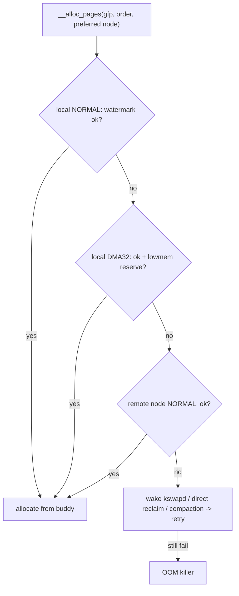

# Q7 — Zones, Watermarks, and Zonelist Fallback

> **Subsystem:** Physical Allocators · **Files:** `mm/page_alloc.c`, `include/linux/mmzone.h`, `mm/page_alloc.c` (zonelists)
> **Interviewer is really probing (AMD/NUMA):** Do you understand **why memory is split into zones**,
> how **watermarks** gate allocation/reclaim, and how the **zonelist** drives NUMA/zone **fallback**?

---

## TL;DR Cheat Sheet

- A **zone** is a region of physical memory within a NUMA node with **distinct addressing/usage
  constraints**:
  - **`ZONE_DMA`** (≤16 MiB on x86) / **`ZONE_DMA32`** (≤4 GiB) — for devices with limited DMA address
    bits.
  - **`ZONE_NORMAL`** — the bulk of usable RAM, directly mapped by the kernel.
  - **`ZONE_MOVABLE`** — only **migratable** pages (hotplug/CMA/anti-fragmentation).
  - **`ZONE_DEVICE`** — device/PMEM/CXL memory (Q6).
- Each zone has **three watermarks**: **min < low < high**. Free below **low** → wake **kswapd**
  (async reclaim); free below **min** → allocators do **direct reclaim** (sync). Below min, only
  `__GFP_HIGH`/atomic may dip into reserves.
- A **zonelist** is the **ordered fallback list** the allocator walks: for a NUMA node, "prefer local
  node's zones, then remote nodes' zones, in node-distance order." It also orders **zone types** within
  a node (NORMAL before DMA32 before DMA — don't waste scarce low memory).
- **Lowmem reserve** (`lowmem_reserve_ratio`) protects scarce low zones (DMA/DMA32) from being consumed
  by allocations that could have used higher zones — so DMA-capable allocations don't starve.
- **`GFP` flags** select the zone (`GFP_DMA`, `GFP_DMA32`, `GFP_KERNEL`→NORMAL, `GFP_HIGHUSER_MOVABLE`
  →MOVABLE) and the reclaim/atomic behavior.

---

## The Question

> Why is physical memory divided into zones? Explain the watermarks (min/low/high) and how the zonelist
> determines fallback across zones and NUMA nodes.

---

## Why zones exist

Not all physical memory is **equivalent** — hardware and kernel constraints make some ranges special,
and the allocator must respect that:

- **DMA addressing limits:** old/limited devices can only DMA to **low** physical addresses (24-bit →
  16 MiB, 32-bit → 4 GiB). The kernel must be able to hand such a device memory in its reachable range.
  → `ZONE_DMA` / `ZONE_DMA32`.
- **Kernel direct map:** the kernel permanently maps "normal" RAM into its address space for cheap
  access (`__va`/`__pa`). On 32-bit, RAM above the direct map was **highmem** (historic
  `ZONE_HIGHMEM`); on 64-bit, all RAM fits the direct map, so highmem is gone but the **zone framework**
  remains for the other constraints.
- **Migratability / hotplug / fragmentation:** some memory should hold **only movable** pages so it can
  be **defragmented (compaction), hot-removed, or used for CMA**. → `ZONE_MOVABLE`.
- **Per-zone reclaim & watermarks:** reclaim must be **balanced per zone** (you can't fix a DMA shortage
  by reclaiming NORMAL); each zone tracks its own free count and watermarks.

So a zone is the allocator's unit of "memory with a particular **constraint and free-state**." The
**watermarks** are the control loop that keeps each zone from running dry, and the **zonelist** encodes
the **policy** of which zone (and which NUMA node) to try first and how to **fall back** — which is
exactly where NUMA locality and low-memory protection are expressed.

---

## When zones/watermarks/zonelists come into play

- **Every page allocation** (`__alloc_pages`) picks a **preferred zone** from the GFP flags + NUMA
  policy, then walks the **zonelist** checking **watermarks** at each candidate zone.
- **kswapd** wakes when a zone falls below its **low** watermark and reclaims until **high**.
- **Direct reclaim** runs when an allocation can't meet **min** in any allowed zone.
- **Atomic/`__GFP_HIGH`** allocations may use **reserves below min** (for IRQ context / critical paths).
- **NUMA placement** (Q20/Q21) determines which node's zonelist is preferred.

---

## Where in the kernel

```
include/linux/mmzone.h   <- enum zone_type, struct zone (_watermark[], free_area[], lowmem_reserve[]),
                            struct zonelist, struct zoneref, pglist_data (node)
mm/page_alloc.c          <- __alloc_pages, get_page_from_freelist, zone_watermark_ok,
                            build_zonelists, wake_all_kswapds
sysctls: vm.min_free_kbytes, vm.watermark_scale_factor, vm.lowmem_reserve_ratio,
         vm.zone_reclaim_mode
/proc/zoneinfo, /proc/buddyinfo
```

---

## How it works — mechanics

### 1. Zone types and the node→zone hierarchy

```
pglist_data (NUMA node N)
  ├─ ZONE_DMA      (≤16MiB)        free_area[], watermarks, lowmem_reserve[]
  ├─ ZONE_DMA32    (≤4GiB)
  ├─ ZONE_NORMAL   (bulk RAM)
  └─ ZONE_MOVABLE  (migratable only)
```
Each zone owns the **buddy free lists** (`free_area[order]`, Q-buddy), its **watermarks**, and a
**`lowmem_reserve[]`** vector (see below). Multiple nodes each have this structure.

### 2. Watermarks — the reclaim control loop

```
free pages in a zone
  high ───────  kswapd stops reclaiming here (buffer restored)
  low  ───────  free < low  -> WAKE kswapd (async background reclaim)
  min  ───────  free < min  -> allocator does DIRECT reclaim (synchronous, blocks)
  reserves (below min): only __GFP_HIGH/ALLOC_HIGH/atomic may allocate here
```
- **`zone_watermark_ok(zone, order, mark, ...)`** checks whether the zone has enough free pages **above
  the mark** *and* enough **high-order** blocks for the requested order (not just raw page count — a
  zone can have many order-0 pages but fail an order-4 request; fragmentation, Q9).
- **`vm.min_free_kbytes`** sets the **min** watermark (scaled per zone); **`watermark_scale_factor`**
  widens the min→low→high gaps so kswapd starts **earlier** and keeps a bigger buffer — a key
  **latency** tuning (start async reclaim before allocators must block).

### 3. The zonelist — ordered fallback

Each node has a **zonelist**: an ordered array of `zoneref`s (zone + node) the allocator tries in turn.
`build_zonelists()` orders them by:
1. **NUMA distance** — the **local** node's zones first, then the **nearest** remote node, etc. (so
   allocations stay local when possible — Q21).
2. **Zone type within a node** — **NORMAL before DMA32 before DMA**. Why? Low zones are **scarce** and
   needed by DMA-limited devices, so general allocations should consume **NORMAL first** and only fall
   back to DMA32/DMA if necessary.

`get_page_from_freelist()` walks this list: for each zone, check watermark (and lowmem reserve), and if
OK, allocate from its buddy free lists; otherwise fall through to the next zone/node. If the whole list
fails at **min**, enter **direct reclaim**/compaction and retry; ultimately **OOM** if nothing works.

### 4. Lowmem reserve — protecting scarce zones

Without protection, a flood of normal `GFP_KERNEL` allocations could **drain `ZONE_DMA32`/`ZONE_DMA`**
(because they're valid fallbacks), leaving nothing for a device that **must** use low memory. The
**`lowmem_reserve[]`** vector makes the watermark check for a low zone **stricter** when the request
could have been satisfied by a higher zone — effectively reserving a cushion of low memory for
allocations that genuinely need it. Tuned via **`vm.lowmem_reserve_ratio`**.

### 5. GFP flags → zone selection

```
GFP_DMA            -> must come from ZONE_DMA (≤16MiB)
GFP_DMA32          -> ZONE_DMA32 (≤4GiB)
GFP_KERNEL         -> ZONE_NORMAL (kernel direct-mapped, may reclaim/sleep)
GFP_HIGHUSER_MOVABLE -> ZONE_MOVABLE/NORMAL (user pages, migratable)
GFP_ATOMIC         -> NORMAL but no reclaim; may use reserves below min
```
The **highest allowed zone** is encoded in the GFP flags; the allocator starts there and falls back
**down** the zonelist.

### 6. Per-node reclaim mode (NUMA)

**`vm.zone_reclaim_mode`** controls whether the allocator **reclaims locally** before spilling to a
remote node (good for memory-bound NUMA workloads that value locality) vs **allocating remotely** to
avoid reclaim latency (good for throughput). A classic NUMA tuning knob (Q21).

---

## Diagrams

### Zonelist fallback walk



### Watermarks

```
   high  ████████████  <- kswapd reclaims up to here, then sleeps
   low   ██████        <- below: wake kswapd (async)
   min   ███           <- below: direct reclaim (sync); reserves only for atomic/__GFP_HIGH
         (free pages)
```

---

## Annotated C

```c
enum zone_type { ZONE_DMA, ZONE_DMA32, ZONE_NORMAL, ZONE_MOVABLE, ZONE_DEVICE, __MAX_NR_ZONES };

struct zone {
    unsigned long _watermark[NR_WMARK];      /* WMARK_MIN, WMARK_LOW, WMARK_HIGH */
    unsigned long watermark_boost;
    long          lowmem_reserve[MAX_NR_ZONES]; /* protect this zone from higher-zone fallback */
    struct free_area free_area[MAX_ORDER];   /* buddy free lists per order (Q-buddy) */
    struct pglist_data *zone_pgdat;          /* owning NUMA node */
    atomic_long_t vm_stat[NR_VM_ZONE_STAT_ITEMS]; /* NR_FREE_PAGES, ... */
};

/* The fallback list the allocator walks. */
struct zonelist { struct zoneref _zonerefs[MAX_ZONES_PER_ZONELIST + 1]; };

/* Core watermark check: free above mark AND enough high-order blocks. */
bool zone_watermark_ok(struct zone *z, unsigned int order, unsigned long mark,
                       int highest_zoneidx, unsigned int alloc_flags);

/* Allocation walks the zonelist honoring watermarks + lowmem reserve. */
static struct page *get_page_from_freelist(gfp_t gfp, unsigned int order,
                                           int alloc_flags, const struct alloc_context *ac);
```

> Senior nuance: a watermark check is **not** just "enough free pages" — `zone_watermark_ok` also
> verifies **enough free blocks of the requested order**, so high-order allocations can fail while
> order-0 succeeds (fragmentation → compaction, Q9). And **`watermark_scale_factor`** is the lever to
> make kswapd start earlier, moving reclaim **off** the allocation latency path.

---

## Company Angle

- **AMD/Intel (NUMA — the headline):** zonelist ordering by **node distance**, `zone_reclaim_mode`
  (local reclaim vs remote alloc), per-zone/per-node watermark balancing, and `ZONE_MOVABLE` for
  hotplug/CXL (Q6/Q21). Multi-socket free-memory balancing.
- **Qualcomm (low-RAM/DMA):** `ZONE_DMA32`/`ZONE_DMA` for constrained device DMA, `min_free_kbytes`
  tuning to keep reserves for atomic allocations under pressure, CMA in MOVABLE (Q10).
- **Google (latency/scale):** `watermark_scale_factor` to avoid direct-reclaim latency spikes;
  zone/NUMA balancing for big services; `/proc/zoneinfo` monitoring at scale.
- **NVIDIA (DMA/large buffers):** DMA32 for 32-bit-addressing device paths, high-order allocation
  failures under fragmentation, MOVABLE/CMA interplay.

---

## War Story

*"A box with plenty of free RAM started failing **`GFP_KERNEL` order-0** allocations intermittently and
spiking latency. `/proc/zoneinfo` showed **`ZONE_NORMAL`** repeatedly dipping below **min** while
`ZONE_DMA32` sat full — and allocations were entering **direct reclaim** on the hot path. The root issue
was two-fold: **`min_free_kbytes`** was tiny, so the min→low→high band was razor-thin and **kswapd**
woke too late to keep ahead of bursts; and a driver was doing large **`GFP_DMA32`** allocations that,
combined with **lowmem_reserve** protection, effectively pinned headroom. Fixes: raised
**`vm.watermark_scale_factor`** so kswapd started reclaiming **earlier** (bigger buffer, fewer direct
reclaims), and reviewed the driver to use `GFP_KERNEL` where DMA32 wasn't actually required so it stopped
competing for the protected low zone. Direct-reclaim events dropped and latency stabilized. The
interviewer's follow-up — *'why does lowmem_reserve exist?'* — let me explain it stops ordinary
allocations from draining the **scarce** DMA/DMA32 zones that limited devices truly need."*

---

## Interviewer Follow-ups

1. **Why zones?** Different memory has different constraints — DMA addressing limits (DMA/DMA32),
   direct-map vs (historically) highmem, and migratability (MOVABLE); reclaim/watermarks are per-zone.

2. **What are the three watermarks?** min < low < high. Below **low** → wake kswapd (async); below
   **min** → direct reclaim (sync); below min only atomic/`__GFP_HIGH` may use reserves; kswapd
   reclaims up to **high**.

3. **What does the zonelist encode?** The ordered fallback: local node zones first (by NUMA distance),
   and NORMAL-before-DMA32-before-DMA within a node, so scarce low memory isn't wasted.

4. **What is lowmem_reserve?** A per-zone cushion that makes low-zone allocations stricter when a higher
   zone could serve the request — protecting DMA/DMA32 for devices that need them.

5. **How does GFP pick a zone?** Flags set the **highest allowed** zone (`GFP_DMA`/`DMA32`/`KERNEL`→
   NORMAL/`HIGHUSER_MOVABLE`); the allocator starts there and falls back down the zonelist.

6. **Why might a high-order alloc fail with free memory available?** `zone_watermark_ok` checks for
   free **blocks of that order**, not just total free pages — fragmentation (Q9).

7. **What does `watermark_scale_factor` do?** Widens the watermark band so kswapd starts earlier,
   reducing **direct-reclaim** latency on the allocation path.

8. **`zone_reclaim_mode`?** Controls local reclaim vs remote allocation on NUMA — locality vs latency
   trade-off.

9. **Why is `ZONE_MOVABLE` special?** It holds only migratable pages, enabling compaction, hotplug
   removal, and CMA (Q9/Q10/Q6).

---

## 30-Minute Talk Track

| Min | Cover |
|-----|-------|
| 0–4 | Why zones: DMA addressing limits, direct map/highmem history, migratability |
| 4–8 | Zone types (DMA/DMA32/NORMAL/MOVABLE/DEVICE); node→zone hierarchy |
| 8–13 | Watermarks min/low/high; kswapd vs direct reclaim; reserves; zone_watermark_ok (order!) |
| 13–18 | Zonelist: build_zonelists, NUMA-distance + zone-type ordering, fallback walk |
| 18–22 | Lowmem reserve: protecting scarce DMA/DMA32 zones; lowmem_reserve_ratio |
| 22–25 | GFP → zone selection; atomic/__GFP_HIGH reserves; zone_reclaim_mode (NUMA) |
| 25–28 | Tuning: min_free_kbytes, watermark_scale_factor; /proc/zoneinfo |
| 28–30 | War story (direct-reclaim latency + lowmem reserve) + summary |
