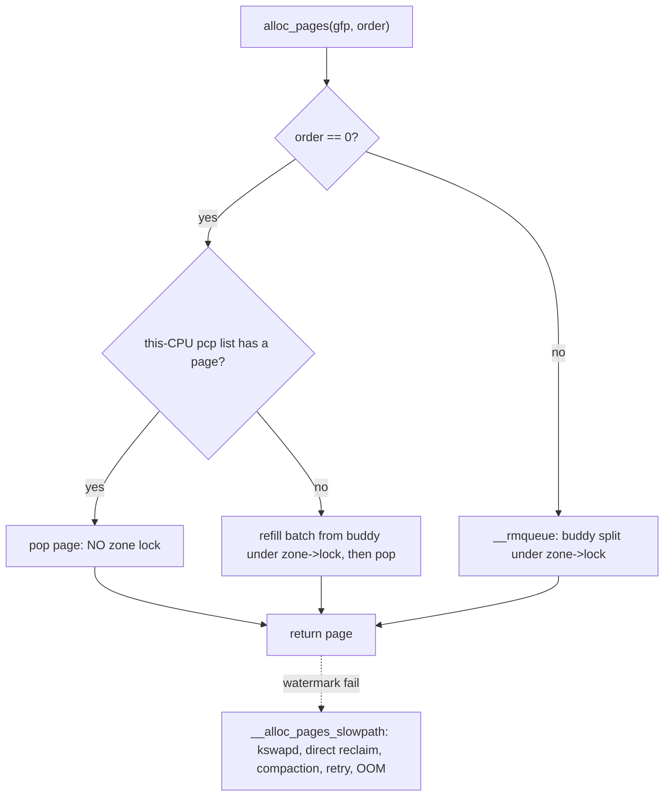

# Q8 — The Per-CPU Page Allocator (pcp lists) and the GFP Fast Path

> **Subsystem:** Physical Allocators · **Files:** `mm/page_alloc.c`, `include/linux/mmzone.h` (`per_cpu_pages`), `include/linux/gfp.h`
> **Interviewer is really probing:** Do you understand the **order-0 fast path** (per-CPU page lists)
> that avoids the zone lock, how **GFP flags** drive behavior, and the structure of `__alloc_pages`?

---

## TL;DR Cheat Sheet

- Most allocations are **single pages (order 0)**. Taking the **zone lock** for each would be a
  scalability disaster, so each CPU keeps a small cache of free order-0 pages: the **per-CPU page lists
  (pcp / `per_cpu_pages`)**.
- **Fast path:** `alloc_pages(order=0)` pops a page from **this CPU's** pcp list — no zone lock, just
  preemption/IRQ-local protection (the per-CPU pattern, like SLUB per-CPU slabs). **Free path** pushes
  it back onto the pcp list.
- **Refill/drain:** when the pcp list is **empty**, it's **refilled in a batch** from the buddy
  allocator (one zone-lock acquisition amortized over many pages). When it's **too full** (over
  `high`), a batch is **drained** back to buddy.
- pcp lists are **per-migratetype** (UNMOVABLE/MOVABLE/RECLAIMABLE) so anti-fragmentation is preserved
  even on the fast path.
- **GFP flags** control everything around it: which **zone** (`GFP_DMA/DMA32/KERNEL`), whether reclaim
  may run / **sleep** (`GFP_KERNEL` vs `GFP_ATOMIC` vs `GFP_NOWAIT`), zeroing (`__GFP_ZERO`),
  node/movability (`__GFP_THISNODE`, `GFP_HIGHUSER_MOVABLE`), and retry/OOM behavior
  (`__GFP_NORETRY`, `__GFP_RETRY_MAYFAIL`, `__GFP_NOFAIL`).
- `__alloc_pages()` is the core: build `alloc_context` (zone, nodemask, migratetype) →
  `get_page_from_freelist()` (fast) → on failure, `__alloc_pages_slowpath()` (wake kswapd, direct
  reclaim, compaction, retries, OOM).

---

## The Question

> How does the order-0 page allocation fast path work? Explain the per-CPU page lists and how GFP flags
> shape the allocation. Walk through `__alloc_pages`.

---

## Why the per-CPU page allocator exists

The buddy allocator (Q-buddy) protects each zone's free lists with a **per-zone spinlock**
(`zone->lock`). That's fine for occasional high-order allocations, but **order-0 single-page
allocations are by far the most common** (page-cache pages, anon faults, slab refills) and happen on
**every CPU constantly**. If every order-0 alloc/free grabbed `zone->lock`, that lock would become a
brutal contention point — the same "hot shared cache line" problem that motivates **per-CPU data**
generally.

The fix is the standard kernel scalability pattern: **give each CPU a private cache** of order-0 pages
(the **pcp lists**), so the overwhelmingly common case is a **lock-free, CPU-local** push/pop. You only
touch the expensive shared `zone->lock` **in batches** — when a CPU's cache runs dry (refill many at
once) or overflows (drain many at once) — amortizing the lock cost over dozens of pages. This is exactly
analogous to **SLUB's per-CPU active slab** (Q-buddy/SLUB) one level down. Net effect: order-0
alloc/free **scales linearly** with cores instead of serializing on a zone lock.

Around this fast path, **GFP flags** are the universal control knobs that tell the allocator *which*
memory (zone/node/migratetype) and *how hard to try* (reclaim, sleep, retry, OOM) — getting them right
is the senior-level discipline (wrong flags = deadlock in atomic context, or needless OOM).

---

## When the fast path vs slow path runs

| Situation | Path |
|-----------|------|
| order-0, pcp has pages | **fast path**: pop from pcp (no zone lock) |
| order-0, pcp empty | refill batch from buddy (one zone-lock), then pop |
| order > 0 (or pcp policy) | go straight to buddy free lists under `zone->lock` |
| watermark below min / no memory | **slow path**: kswapd, direct reclaim, compaction, retry |
| still failing | OOM (unless `__GFP_NORETRY`/`__GFP_RETRY_MAYFAIL`) |
| free order-0 | push to pcp; if over `high`, drain batch to buddy |

---

## Where in the kernel

```
mm/page_alloc.c          <- __alloc_pages, get_page_from_freelist, rmqueue, rmqueue_pcplist,
                            __rmqueue_pcplist, free_unref_page (pcp free), free_pcppages_bulk (drain),
                            __alloc_pages_slowpath
include/linux/mmzone.h    <- struct per_cpu_pages (the pcp lists), struct zone
include/linux/gfp_types.h <- GFP flags and their meanings
mm/page_alloc.c          <- pcp batch/high sizing (pageset_update), drain_all_pages
```

---

## How it works — mechanics

### 1. The pcp structure

```c
struct per_cpu_pages {
    int count;                 /* number of pages in the lists */
    int high;                  /* drain back to buddy above this */
    int batch;                 /* refill/drain this many at a time */
    struct list_head lists[NR_PCP_LISTS]; /* per migratetype (+ per order on newer kernels) */
};
```
Each **zone** has a **`per_cpu_pageset`** → one `per_cpu_pages` per CPU. `batch` and `high` are sized
from zone size (and tunable via `vm.percpu_pagelist_high_fraction`). Lists are split by **migratetype**
so MOVABLE/UNMOVABLE/RECLAIMABLE pages stay segregated (anti-fragmentation, Q9) even in the cache.

### 2. Order-0 fast path (alloc)

```
alloc_pages(GFP_KERNEL, 0):
  rmqueue() -> rmqueue_pcplist():
     local_lock_irqsave(&pcp->lock)        # CPU-local, NOT the zone lock
     if pcp->lists[migratetype] empty:
         __rmqueue_pcplist refill:
             spin_lock(&zone->lock)        # the ONLY zone-lock touch, amortized
             pull `batch` pages from buddy free_area[0]
             spin_unlock(&zone->lock)
     page = list_first / __rmqueue_pcplist pop
     local_unlock_irqrestore(&pcp->lock)
```
The common case never touches `zone->lock`: it's a CPU-local list pop guarded by a **`local_lock`**
(disables preemption/IRQs on that CPU). Refills happen in **batches** so the zone lock is taken once per
~`batch` allocations.

### 3. Order-0 fast path (free) and draining

```
free_unref_page(page):
  push page onto this CPU's pcp->lists[migratetype]
  if pcp->count > pcp->high:
      free_pcppages_bulk(): return `batch` pages to buddy under zone->lock   # drain
```
Freeing is also CPU-local; only when the cache grows beyond `high` does it spill a batch back to buddy.
`drain_all_pages()` flushes pcp lists (e.g. before hotplug/CMA isolation, or under heavy pressure) so
cached pages return to the global pool.

### 4. The buddy path for order > 0

Higher-order allocations skip pcp and go to **`__rmqueue`** under `zone->lock`, doing **split**
(and on free, **coalesce**) on the buddy `free_area[order]` lists, honoring migratetype and falling back
across migratetypes if needed (Q9).

### 5. `__alloc_pages` — the whole flow

```c
struct page *__alloc_pages(gfp_t gfp, unsigned int order, int preferred_nid, nodemask_t *nodemask)
{
    struct alloc_context ac;
    prepare_alloc_context(&ac, gfp, ...);          /* zone idx, nodemask, migratetype */
    /* FAST PATH */
    page = get_page_from_freelist(gfp, order, ALLOC_WMARK_LOW, &ac);
    if (page) return page;
    /* SLOW PATH */
    page = __alloc_pages_slowpath(gfp, order, &ac); /* kswapd, direct reclaim/compaction, retry, OOM */
    return page;
}
```
- **Fast path** (`get_page_from_freelist`): walk the **zonelist** (Q7), check **watermarks**, allocate
  from pcp/buddy. Most allocations end here.
- **Slow path** (`__alloc_pages_slowpath`): wake **kswapd**; if allowed (`__GFP_DIRECT_RECLAIM`), do
  **direct reclaim** and **compaction**; honor retry policy; if all fails and reclaim is allowed →
  **OOM**. `GFP_ATOMIC` skips reclaim entirely (can't sleep) and may use **reserves** below min.

### 6. GFP flags — the control surface

```
Zone:        GFP_DMA, GFP_DMA32, GFP_KERNEL(NORMAL), GFP_HIGHUSER_MOVABLE(MOVABLE)
Reclaim:     __GFP_DIRECT_RECLAIM (may sleep), __GFP_KSWAPD_RECLAIM (wake kswapd)
Context:     GFP_KERNEL (may sleep) vs GFP_ATOMIC (no sleep, reserves) vs GFP_NOWAIT (no sleep, no reserves)
I/O/FS:      GFP_NOIO / GFP_NOFS (avoid reentrancy in reclaim) -> prefer scoped memalloc_no{io,fs}_save
Behavior:    __GFP_ZERO (zero), __GFP_NOWARN, __GFP_NORETRY, __GFP_RETRY_MAYFAIL, __GFP_NOFAIL
Node:        __GFP_THISNODE (this node only), __GFP_HARDWALL (cpuset), node via mempolicy (Q20)
```
The two questions GFP answers: **"which memory?"** (zone/node/migratetype) and **"how hard / can I
sleep?"** (reclaim/atomic/retry). Using `GFP_KERNEL` in atomic context (IRQ/spinlock) is a classic bug —
it may sleep in reclaim.

---

## Diagrams

### Fast path vs slow path



### pcp cache amortizing the zone lock

```
per-CPU order-0 cache:   [p][p][p][p]  <- pop/push lock-free (local_lock)
   empty -> refill batch  <==== zone->lock (once per ~batch allocs) ==== buddy free_area[0]
   over high -> drain batch ===> zone->lock ===> buddy
```

---

## Annotated C

```c
/* Per-CPU page cache (one per CPU per zone). */
struct per_cpu_pages {
    spinlock_t lock;           /* local_lock; protects this CPU's lists */
    int count, high, batch;
    struct list_head lists[NR_PCP_LISTS];  /* per migratetype / order */
};

/* Order-0 fast allocate from the per-CPU cache. */
static struct page *rmqueue_pcplist(struct zone *zone, ... int migratetype, gfp_t gfp)
{
    struct per_cpu_pages *pcp = this_cpu_ptr(zone->per_cpu_pageset);
    pcp_spin_lock(pcp);                       /* CPU-local, not zone->lock */
    if (list_empty(&pcp->lists[migratetype]))
        rmqueue_bulk(zone, 0, pcp->batch, &pcp->lists[...]); /* refill: takes zone->lock once */
    page = list_first_entry(&pcp->lists[migratetype], struct page, pcp_list);
    list_del(&page->pcp_list); pcp->count--;
    pcp_spin_unlock(pcp);
    return page;
}

/* Free order-0 to the per-CPU cache; drain if too full. */
void free_unref_page(struct page *page, unsigned int order) {
    /* push onto this CPU's pcp list; if pcp->count > pcp->high -> free_pcppages_bulk() drain */
}
```

> Senior nuance: the pcp cache is the **order-0 analogue of SLUB's per-CPU slab** — both eliminate a
> hot global lock by caching per CPU and synchronizing only in **batches**. It's also why
> `drain_all_pages()` exists: CMA/hotplug/compaction must **flush** these caches so isolated pageblocks
> aren't held privately by some CPU.

---

## Company Angle

- **AMD/Google (many-core scaling):** pcp lists are *the* reason order-0 alloc scales to hundreds of
  cores; `vm.percpu_pagelist_high_fraction` tuning; draining cost on CMA/hotplug; NUMA-local pcp.
- **Qualcomm (low-RAM):** pcp `high`/`batch` sizing on small systems, draining under pressure, GFP
  discipline in drivers (atomic vs sleeping context).
- **NVIDIA (drivers/DMA):** correct GFP flags for DMA-able memory and atomic context, `__GFP_THISNODE`
  for locality, high-order allocations bypassing pcp (fragmentation, Q9).
- **All:** GFP-flag correctness (sleep-in-atomic bugs) and the fast/slow path split are universal
  fundamentals.

---

## War Story

*"Enabling **CMA** (Q10) for a camera buffer pool, we found that CMA allocations would intermittently
**fail to isolate** a pageblock even right after boot with tons of free memory. The cause: pages from
that region were sitting in **per-CPU pcp lists** — privately cached by various CPUs and therefore not
on the buddy free lists where the CMA isolation logic looks. The isolation couldn't proceed until those
caches were flushed. The fix path already exists in the kernel: CMA/`alloc_contig_range` calls
**`drain_all_pages()`** to flush every CPU's pcp lists back to the buddy allocator before/while
isolating, so the pages become visible and migratable. We confirmed by watching `/proc/zoneinfo` free
counts vs pcp counts. The interviewer's follow-up — *'why have pcp lists at all if they complicate
isolation?'* — let me explain the trade-off: they make the **common order-0 path lock-free and
scalable**, which is worth the occasional **drain** needed for isolation/hotplug; you don't give up
fast-path scalability to make a rare operation simpler."*

---

## Interviewer Follow-ups

1. **What are pcp lists?** Per-CPU caches of free **order-0** pages per zone, so single-page alloc/free
   avoids the zone lock — a CPU-local pop/push.

2. **How is the zone lock amortized?** pcp lists **refill/drain in batches** (`batch` pages per zone-lock
   acquisition); the common case never takes the zone lock.

3. **Why per-migratetype pcp lists?** To preserve anti-fragmentation (MOVABLE/UNMOVABLE/RECLAIMABLE stay
   segregated) even in the per-CPU cache (Q9).

4. **What does `drain_all_pages` do and when?** Flushes pcp caches back to buddy — needed for
   CMA/hotplug/compaction **isolation** and under heavy pressure, so cached pages become globally
   visible/migratable.

5. **Walk `__alloc_pages`.** Build alloc_context → `get_page_from_freelist` (fast: zonelist + watermarks
   + pcp/buddy) → on fail `__alloc_pages_slowpath` (kswapd, direct reclaim, compaction, retry, OOM).

6. **What two things do GFP flags control?** Which memory (zone/node/migratetype) and how hard / whether
   it may sleep (reclaim/atomic/retry/OOM).

7. **`GFP_KERNEL` vs `GFP_ATOMIC` vs `GFP_NOWAIT`?** KERNEL may sleep (direct reclaim); ATOMIC never
   sleeps and may use reserves below min; NOWAIT never sleeps and won't touch reserves.

8. **Do high-order allocations use pcp?** Generally no — they go to the buddy `free_area[order]` under
   `zone->lock` (split/coalesce), subject to fragmentation.

9. **What sizes `batch`/`high`?** Zone size and `vm.percpu_pagelist_high_fraction`; bigger caches reduce
   zone-lock traffic but hold more pages privately (worse for isolation/pressure).

---

## 30-Minute Talk Track

| Min | Cover |
|-----|-------|
| 0–4 | order-0 is the common case; zone lock would be a contention point → per-CPU caches |
| 4–9 | pcp structure: per-CPU, per-migratetype, count/high/batch; local_lock |
| 9–13 | Fast path alloc: pop from pcp; refill batch from buddy (one zone-lock) |
| 13–16 | Free path + draining over `high`; drain_all_pages for CMA/hotplug |
| 16–19 | order>0 → buddy split/coalesce under zone->lock (fragmentation link Q9) |
| 19–24 | __alloc_pages: alloc_context, get_page_from_freelist (fast), slowpath (reclaim/OOM) |
| 24–28 | GFP flags: zone/node/migratetype vs reclaim/atomic/retry; sleep-in-atomic bug |
| 28–30 | War story (pcp vs CMA isolation, drain_all_pages) + scalability trade-off |
