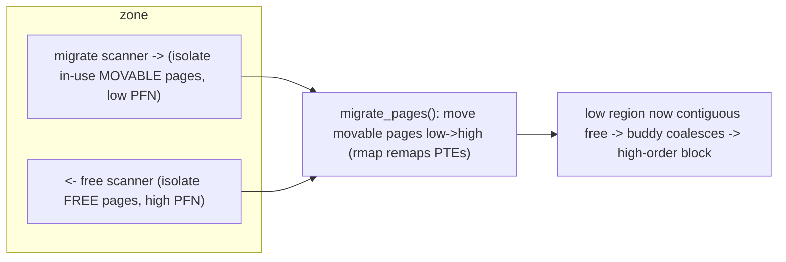

# Q9 — Memory Compaction & External Fragmentation

> **Subsystem:** Physical Allocators · **Files:** `mm/compaction.c`, `mm/migrate.c`, `mm/page_alloc.c` (migratetypes), `mm/page_isolation.c`
> **Interviewer is really probing (AMD favorite):** Do you understand **external fragmentation**, how
> **migratetypes** prevent it, and how **compaction** assembles high-order blocks by **migrating** pages?

---

## TL;DR Cheat Sheet

- **External fragmentation:** free memory exists but is **scattered** as small chunks, so a **high-order
  contiguous** allocation (THP 2 MiB, jumbo DMA buffer, order-N) **fails despite free pages available**.
  (`/proc/buddyinfo` shows lots of order-0, nothing at high orders.)
- **Anti-fragmentation by migratetype:** the buddy allocator groups pageblocks by **migratetype** —
  **MOVABLE** (user/page-cache pages — relocatable), **UNMOVABLE** (kernel objects, page tables — pinned),
  **RECLAIMABLE** (slab caches reclaimable on demand). Keeping movable separate from unmovable means a
  block of movable pages can later be **compacted** into a high-order free block.
- **Compaction** defragments by **migrating movable pages** together: a **migrate scanner** walks from
  the bottom collecting in-use **movable** pages, a **free scanner** walks from the top collecting free
  pages; pages are **moved** (via `migrate_pages`, using rmap to fix PTEs) from low to high, freeing
  contiguous low blocks for high-order allocations.
- **Triggers:** **direct compaction** (in the allocation slow path before failing/OOM for high-order),
  **kcompactd** (background per-node), and **proactive compaction** (`vm.compaction_proactiveness`).
- Only **movable** pages can be migrated; **unmovable/pinned** pages (kernel allocs, GUP pins, Q2/Q4)
  **block** compaction — which is why migratetype hygiene and `ZONE_MOVABLE`/CMA matter.

---

## The Question

> What is external fragmentation, and how does the kernel fight it? Explain migratetypes and how
> compaction works to satisfy high-order allocations.

---

## Why compaction exists

The buddy allocator (Q-buddy) hands out **power-of-two contiguous** blocks. Over time, as pages are
allocated and freed in mixed patterns, free memory becomes **fragmented**: plenty of free **order-0**
pages, but the kernel can't find contiguous runs to satisfy **high-order** requests:

- **THP** needs a contiguous **2 MiB** (order-9) block (Q18); without it, THP allocation **fails** and
  you fall back to 4 KiB pages (worse TLB reach).
- **Hugepages / jumbo DMA buffers / some drivers** need high-order contiguous physical memory.
- **`ZONE_MOVABLE`/hotplug/CMA** need to assemble or vacate large contiguous regions.

The naive "just reclaim more" doesn't help — the problem isn't *quantity* of free memory, it's its
**arrangement**. You need to **move** in-use pages out of the way to coalesce free space. But you can
only safely move a page if you can **find and update every mapping** of it (rmap, Q-rmap) and nothing
has it **pinned**. So the kernel:
1. **prevents** fragmentation up front by **segregating movable vs unmovable** allocations
   (migratetypes), and
2. **cures** it on demand by **compaction** — physically relocating movable pages to consolidate free
   blocks.

The senior insight: **free memory ≠ allocatable high-order memory.** Migratetypes + compaction are the
machinery that keeps high-order allocations possible on a long-running, churned system, and their
effectiveness is **bounded by how much memory is migratable** (unmovable allocations are the enemy).

---

## When compaction runs

| Trigger | Mechanism |
|---------|-----------|
| High-order alloc about to fail (slow path) | **direct compaction** (`__alloc_pages_direct_compact`) before OOM |
| Background, per-node | **kcompactd** wakes when fragmentation/`watermark_boost` warrants |
| Proactive | `vm.compaction_proactiveness` runs compaction before demand (reduce latency spikes) |
| Explicit | `echo 1 > /proc/sys/vm/compact_memory` (compact all zones) |
| CMA / `alloc_contig_range` / hotplug | uses the same **migration** machinery to vacate a region |
| THP allocation | direct/`khugepaged` compaction to get a 2 MiB block (Q18) |

---

## Where in the kernel

```
mm/compaction.c      <- compact_zone, isolate_migratepages (migrate scanner),
                        isolate_freepages (free scanner), kcompactd, proactive compaction
mm/migrate.c         <- migrate_pages(): move folios, remap PTEs via rmap, migration entries (Q-rmap)
mm/page_alloc.c      <- migratetypes, pageblock flags, fallback across migratetypes, watermark_boost
mm/page_isolation.c  <- isolate pageblocks (for CMA/hotplug/compaction)
sysctls: vm.compaction_proactiveness, vm.compact_memory, vm.extfrag_threshold
/proc/buddyinfo, /proc/pagetypeinfo, /proc/vmstat (compact_*)
```

---

## How it works — mechanics

### 1. Migratetypes — prevention

Every **pageblock** (typically the THP size, 2 MiB) has a **migratetype**:

```
MIGRATE_UNMOVABLE    kernel allocations, page tables, slab (cannot be moved)
MIGRATE_MOVABLE      user pages, page cache, anon (relocatable via migration)
MIGRATE_RECLAIMABLE  reclaimable slab caches (can be shrunk/freed)
MIGRATE_CMA          CMA-reserved (movable, but reservable for contiguous alloc — Q10)
MIGRATE_ISOLATE      temporarily isolated (during compaction/CMA/hotplug)
```
The buddy allocator services a request from the **matching** migratetype's free lists and only **falls
back** to another type when forced (recorded so it can be repaired). The point: cluster **movable**
pages together so a whole pageblock of them can later be **migrated away** to form a high-order free
block — whereas a single **unmovable** page sprinkled in a block **pins** that block forever.

### 2. The two scanners — cure

Compaction within a zone uses **two scanners moving toward each other**:

```
zone:  [low PFN .................................. high PFN]
        --> migrate scanner                  free scanner <--
        (collects IN-USE movable pages)      (collects FREE pages)
        move movable pages from low end  ==>  into free slots at high end
        => low end becomes contiguous free  => high-order block available
```
- **Migrate scanner** (`isolate_migratepages`) scans from the **bottom**, isolating **movable** in-use
  pages.
- **Free scanner** (`isolate_freepages`) scans from the **top**, isolating **free** pages as migration
  destinations.
- **`migrate_pages()`** moves each isolated page to a free slot: it uses **rmap** to find all PTEs,
  installs **migration entries** (faulting accessors wait), copies the page, then repoints PTEs to the
  new location (Q-rmap). When the scanners **meet**, the pass is done.

Net result: in-use movable pages are packed toward one end, leaving **large contiguous free regions** at
the other — which coalesce in the buddy allocator into **high-order** blocks.

### 3. Direct vs background vs proactive

- **Direct compaction:** in `__alloc_pages_slowpath`, before giving up (or OOM) on a **high-order**
  request, the allocating task runs compaction synchronously, then retries. This is the **latency**
  source for THP allocation under fragmentation.
- **kcompactd** (per node): background thread that compacts when fragmentation is high, keeping
  high-order blocks available **off** the allocation path.
- **Proactive compaction** (`vm.compaction_proactiveness`, 0–100): periodically compacts to a target
  fragmentation level **before** allocations demand it — trading some background work for fewer
  **direct-compaction latency spikes** (a Google/AMD-relevant knob).

### 4. What blocks compaction

- **Unmovable pages** (kernel slab, page tables) in a block → can't migrate → block stays fragmented.
- **Pinned pages** (`pin_user_pages`/GUP, Q2/Q4) → `migrate_pages` refuses to move them → compaction
  fails for that block.
- **Mlocked/temporarily-locked** pages, pages under writeback, etc. → skipped or deferred.

This is why the most defrag-friendly memory is **MOVABLE**, why hotplug/CMA insist on `ZONE_MOVABLE`
(Q6/Q10), and why a few stray unmovable allocations can wreck high-order success rate.

### 5. watermark_boost & extfrag

When a fallback steals from a different migratetype (a fragmentation event), the kernel **boosts**
watermarks (`watermark_boost`) to kick **kswapd/kcompactd** harder and restore high-order availability.
`vm.extfrag_threshold` controls how readily direct compaction is attempted vs falling back.

---

## Diagrams

### Fragmentation problem

```
/proc/buddyinfo:  order 0    1    2    3    4    5  ...
                  9999     50    3    0    0    0   <- tons of order-0, NOTHING at order-4+
=> a 64KiB (order-4) contiguous allocation FAILS though MBs are free  (external fragmentation)
```

### Compaction scanners



### Why unmovable blocks fragmentation

```
block A: [M M M M M M M M]  -> all movable -> can be migrated away -> becomes order-N free
block B: [M M U M M M M M]  -> ONE unmovable (U) pins it -> cannot form high-order free block
```

---

## Annotated C

```c
/* Compaction control for a zone (mm/compaction.c). */
struct compact_control {
    struct list_head migratepages;   /* isolated in-use movable pages */
    struct list_head freepages;      /* isolated free destination pages */
    unsigned long migrate_pfn;       /* migrate scanner position (rising) */
    unsigned long free_pfn;          /* free scanner position (falling) */
    int order;                       /* target allocation order */
    enum migrate_mode mode;          /* ASYNC / SYNC_LIGHT / SYNC */
};

/* The core loop: scanners converge, migrating movable pages. */
static enum compact_result compact_zone(struct compact_control *cc, ...) {
    while (cc->migrate_pfn < cc->free_pfn) {
        isolate_migratepages(cc);    /* collect movable in-use pages (low end) */
        migrate_pages(&cc->migratepages, compaction_alloc, ...); /* move to free slots */
        /* isolate_freepages() feeds destinations from the high end */
    }
    /* now check if a high-order block of cc->order is available */
}

/* CMA / hotplug reuse the same machinery to vacate a specific range. */
int alloc_contig_range(unsigned long start, unsigned long end, unsigned migratetype, gfp_t gfp);
```

```bash
cat /proc/buddyinfo       # free blocks per order per zone -> see fragmentation
cat /proc/pagetypeinfo    # free blocks per migratetype
grep compact /proc/vmstat # compact_stall, compact_fail, compact_success
echo 1 > /proc/sys/vm/compact_memory          # force compaction
sysctl vm.compaction_proactiveness            # 0..100 background defrag
```

> Senior nuance: compaction's success is **migratability-bound**. The kernel can reclaim all day, but if
> a pageblock holds **one** unmovable kernel allocation or one **GUP-pinned** page, that block won't
> coalesce. THP allocation latency and failure correlate directly with **how much unmovable junk** is
> sprinkled across memory — which is exactly what migratetypes try to prevent up front.

---

## Company Angle

- **AMD/Intel (the headline):** high-order/THP availability on long-running NUMA servers; proactive
  compaction to avoid **direct-compaction latency spikes**; per-node kcompactd; `pagetypeinfo`
  analysis; interaction with huge folios (Q18) and tiering (Q21).
- **Google (THP at scale):** THP allocation latency from direct compaction is a tail-latency source;
  `vm.compaction_proactiveness`, `defrag` THP settings; measuring `compact_fail`/`thp_*` vmstat.
- **NVIDIA/Qualcomm (DMA/CMA):** high-order/contiguous allocations for DMA, **CMA** using the same
  migration path (Q10), GUP pins blocking migration (Q4); camera/codec contiguous buffers.
- **All:** the "free memory ≠ allocatable high-order memory" insight and migratetype hygiene.

---

## War Story

*"A server that ran for weeks started showing **THP allocation failures** and latency spikes —
`grep thp /proc/vmstat` showed `thp_fault_fallback` climbing and `compact_fail` high; `/proc/buddyinfo`
confirmed **no order-9 blocks** despite gigabytes free (classic external fragmentation). Compaction was
running but **failing** because a driver made many long-lived **UNMOVABLE** allocations scattered across
pageblocks — each stray unmovable page **pinned** an otherwise-movable block, so the scanners couldn't
assemble a 2 MiB region. Fixes: (1) routed the driver's allocations through a dedicated **slab cache** so
they **clustered** into fewer UNMOVABLE blocks instead of peppering MOVABLE ones; (2) enabled
**`vm.compaction_proactiveness`** so kcompactd kept high-order blocks available **off** the fault path;
(3) for a guaranteed-contiguous buffer, moved to **CMA** (Q10). THP success recovered and latency
smoothed. The interviewer's follow-up — *'why didn't more reclaim help?'* — let me explain reclaim frees
*pages* but doesn't **rearrange** them; only **compaction/migration** fixes the **arrangement**, and it's
blocked by unmovable/pinned pages."*

---

## Interviewer Follow-ups

1. **What is external fragmentation?** Free memory scattered into small chunks so a high-order
   contiguous allocation fails even though total free memory is ample.

2. **How do migratetypes help?** They segregate MOVABLE (relocatable) from UNMOVABLE (pinned) pages so
   movable blocks can later be migrated/compacted into high-order free blocks.

3. **How does compaction work?** Two scanners converge — a migrate scanner isolates in-use movable pages
   (low end), a free scanner collects free pages (high end) — and `migrate_pages` relocates movable pages
   to pack free space, freeing contiguous high-order blocks.

4. **What enables a page to be migrated?** It must be **movable** (user/cache/anon), not pinned, not
   unmovable kernel memory; rmap is used to remap all its PTEs (migration entries).

5. **Direct vs proactive vs kcompactd?** Direct = synchronous in the alloc slow path (latency); kcompactd
   = background per node; proactive = preemptive defrag (`compaction_proactiveness`) to cut spikes.

6. **What blocks compaction?** Unmovable kernel allocations, **GUP-pinned** pages (Q4), mlocked/under-
   writeback pages — a single one can pin a whole block.

7. **Why doesn't reclaim solve fragmentation?** Reclaim frees pages but doesn't move them; only
   migration/compaction changes the **physical arrangement** needed for contiguity.

8. **How does this relate to THP?** THP needs an order-9 (2 MiB) block; under fragmentation, allocation
   falls back to 4 KiB unless compaction can assemble one (Q18).

9. **How do you observe it?** `/proc/buddyinfo` (free per order), `/proc/pagetypeinfo` (per migratetype),
   `/proc/vmstat` `compact_*`/`thp_*` counters.

---

## 30-Minute Talk Track

| Min | Cover |
|-----|-------|
| 0–4 | External fragmentation: free ≠ allocatable high-order; who needs high-order (THP/DMA/hotplug) |
| 4–9 | Migratetypes: MOVABLE/UNMOVABLE/RECLAIMABLE/CMA; prevention via segregation; fallback |
| 9–15 | Compaction: migrate scanner + free scanner converging; migrate_pages + rmap migration entries |
| 15–19 | Direct vs kcompactd vs proactive compaction; watermark_boost; triggers |
| 19–23 | What blocks compaction: unmovable/pinned/mlocked; why ZONE_MOVABLE/CMA exist |
| 23–26 | Observability: buddyinfo, pagetypeinfo, vmstat compact_*/thp_* |
| 26–30 | War story (THP failures from scattered unmovable allocs) + "reclaim vs rearrange" |
