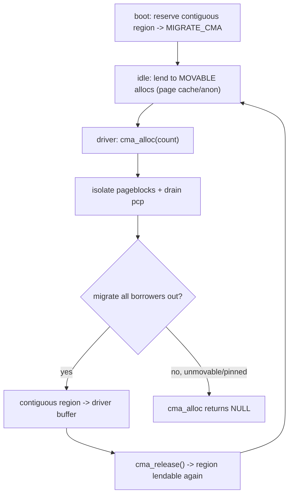

# Q10 — CMA: The Contiguous Memory Allocator

> **Subsystem:** Physical Allocators · **Files:** `mm/cma.c`, `kernel/dma/contiguous.c`, `mm/page_alloc.c` (`MIGRATE_CMA`, `alloc_contig_range`)
> **Interviewer is really probing (Qualcomm/NVIDIA):** Do you understand **why big physically-contiguous
> DMA buffers are hard**, how **CMA reserves** a migratable region, and why CMA allocations **fail**?

---

## TL;DR Cheat Sheet

- **CMA** provides large **physically contiguous** buffers (camera/codec/display/DMA) on systems
  **without an IOMMU** (or where the device needs true contiguity). Big contiguous allocations normally
  fail due to **fragmentation** (Q9).
- **Idea:** at boot, **reserve** a contiguous region and mark it **`MIGRATE_CMA`** (a *movable*
  migratetype). While idle, the kernel **lends** it to **movable** allocations (page cache, anon) so
  it's **not wasted**. When a driver needs a contiguous buffer, CMA **migrates those borrowers out**
  (via compaction/migration, Q9) and hands the now-contiguous region to the driver.
- **Best of both:** memory isn't permanently carved out (unlike a static reserved pool), yet a large
  contiguous buffer can be assembled on demand.
- **Allocation:** `cma_alloc()` / `dma_alloc_contiguous()` → `alloc_contig_range()` isolates the
  pageblocks, **migrates** any movable pages occupying them elsewhere, and returns the contiguous range.
- **Why CMA fails:** if borrowers in the region are **unmovable or pinned** (a kernel allocation slipped
  in, a **GUP pin** Q4, mlock, under-writeback), migration can't evacuate them → **`cma_alloc` fails**.
  This is the #1 CMA pain point.
- Tunables: `cma=` boot param (default area), per-device CMA via device tree (`reserved-memory`/
  `shared-dma-pool`), `/sys/kernel/debug/cma/`.

---

## The Question

> What is CMA and what problem does it solve? How does it reserve memory yet avoid wasting it, and why
> do CMA allocations sometimes fail?

---

## Why CMA exists

Many devices need a **single physically contiguous** buffer, sometimes tens of MiB:

- **Cameras / ISPs, video codecs, displays/framebuffers** on SoCs frequently lack a capable **IOMMU**
  for their data path (or need contiguity for performance), so they DMA into one big contiguous region.
- **Some DMA engines** can't do scatter-gather, or need contiguity for descriptor-free transfers.

The problem: after the system runs a while, **external fragmentation** (Q9) makes a large contiguous
allocation **impossible** — the buddy allocator can't find an order-13 (8 MiB) block even with plenty of
free memory. Historically drivers solved this by **reserving a static pool at boot** (carve out, say,
64 MiB just for the camera). But that memory is then **wasted whenever the camera is idle** — a huge cost
on memory-constrained SoCs.

**CMA's insight:** reserve the region **but make it usable** in the meantime. Mark it as a special
**movable** migratetype (`MIGRATE_CMA`) so the kernel **lends** it to ordinary **movable** allocations
(page cache, anonymous memory) when the device isn't using it. When the device needs the buffer, the
kernel **evicts the borrowers by migrating them elsewhere** (the exact compaction/migration machinery of
Q9) and reclaims the contiguous region. So you get **contiguous-on-demand without permanently sacrificing
the RAM** — the borrowers just relocate. The catch, and the senior talking point, is that eviction only
works if the borrowers are **migratable**; an **unmovable or pinned** page in the region defeats the
whole scheme.

---

## When CMA is used (vs alternatives)

| Situation | Choice |
|-----------|--------|
| Device needs large contiguous DMA, **no IOMMU** | **CMA** (`dma_alloc_contiguous` falls back to CMA) |
| Device has an **IOMMU/SMMU** | prefer IOMMU scatter-gather (no contiguity needed, Q-DMA); CMA not required |
| Small contiguous buffer | `dma_alloc_coherent` from normal allocator may suffice |
| Hard real-time, must never fail | a **static reserved** carve-out (wastes RAM but deterministic) |
| General high-order kernel allocation | buddy + compaction (Q9), not CMA |

---

## Where in the kernel

```
mm/cma.c                     <- cma_init_reserved_areas, cma_alloc, cma_release, bitmap of the area
kernel/dma/contiguous.c      <- DMA<->CMA glue: dma_alloc_contiguous, default CMA area, cma= param
mm/page_alloc.c              <- MIGRATE_CMA migratetype, __rmqueue fallback rules, alloc_contig_range
mm/page_isolation.c          <- isolate pageblocks (start_isolate_page_range)
drivers/of/of_reserved_mem.c <- device-tree reserved-memory / shared-dma-pool regions (Q-devicetree)
/sys/kernel/debug/cma/        <- per-area stats; CONFIG_CMA, CONFIG_DMA_CMA
```

---

## How CMA works — mechanics

### 1. Reservation at boot

A CMA area is reserved **early** (before the buddy allocator is fully up) so it's guaranteed contiguous:
- the **default** area via the **`cma=`** kernel command line (e.g. `cma=64M`), or
- **per-device** areas declared in the **device tree** under `reserved-memory` with
  `compatible = "shared-dma-pool"` and `reusable` (linux,cma) — bound to a device so its
  `dma_alloc_*` pulls from that pool (Q-devicetree).

The reserved pageblocks are marked **`MIGRATE_CMA`**. Crucially, `MIGRATE_CMA` is treated as a
**movable** type, so the page allocator may satisfy **movable** requests (page cache, anon) from it —
keeping the region **in use** rather than idle.

### 2. Lending to movable allocations

While the device isn't using its buffer, ordinary **movable** allocations can land in the CMA region.
The allocator's fallback rules let `MIGRATE_MOVABLE` requests use `MIGRATE_CMA` pageblocks (but **not**
the reverse — unmovable/reclaimable requests must **never** be placed in CMA, or they'd be unevictable
and defeat the purpose). So CMA memory does useful work as **page cache / anon** between device uses.

### 3. Allocating a contiguous buffer

```
cma_alloc(cma, count, align):
  1. find a free run of `count` pages in the CMA bitmap
  2. start_isolate_page_range()  -> mark those pageblocks MIGRATE_ISOLATE (no new allocs)
  3. drain_all_pages()           -> flush per-CPU caches (Q8) so pages are visible
  4. alloc_contig_range():
         migrate_pages()         -> EVACUATE any movable borrowers to other memory (Q9 rmap migration)
         reclaim/retry as needed
  5. on success: the range is now free & contiguous -> hand pages to the driver
  6. on failure: undo isolation; cma_alloc returns NULL
```
So a CMA allocation is essentially **"isolate + migrate everyone out + take the contiguous range."** It
reuses the **compaction/migration** engine (Q9): `migrate_pages` uses **rmap** to find and update all
PTEs of each borrower, installs migration entries, copies, and repoints — relocating borrowers so the
CMA region becomes empty and contiguous.

### 4. Release

`cma_release()` returns the buffer to the CMA area (clears the bitmap), making those pageblocks
**movable/lendable** again so the kernel can reuse them for page cache/anon until the next device request.

### 5. Why CMA allocations fail (the marquee point)

`alloc_contig_range` can only succeed if **every** page currently in the target region can be
**migrated away**. It fails when a borrower is **not migratable**:

- an **unmovable** allocation slipped into the region (a bug — unmovable requests should never use CMA,
  but kernel pages can end up there via edge cases);
- a **GUP/`pin_user_pages` long-term pin** (Q4) on a page in the region — the migrator **refuses** to
  move pinned pages (else DMA corruption);
- **mlocked** pages, pages **under writeback**, or pages whose migration repeatedly **fails** under
  pressure;
- **per-CPU cached** pages not drained (mitigated by `drain_all_pages`, Q8).

Result: `cma_alloc` returns **NULL** even though the region is "reserved" — surprising to driver authors.
Mitigations: keep the area **truly movable** (audit for unmovable/pinned occupants), size it adequately,
retry, and on critical paths fall back to a smaller request or a static reserve.

---

## Diagrams

### CMA lifecycle



### Why a pin defeats CMA

```
CMA region: [ pc pc anon PINNED pc anon ]
   migrate pc/anon out -> OK
   PINNED page (pin_user_pages) -> migrate_pages REFUSES (would corrupt DMA, Q4)
   => region can't be fully evacuated -> contiguous alloc FAILS
```

---

## Annotated C

```c
/* A CMA area: a reserved contiguous range tracked by a bitmap. */
struct cma {
    unsigned long   base_pfn;
    unsigned long   count;          /* pages in the area */
    unsigned long  *bitmap;         /* which pages are allocated */
    struct mutex    lock;
    const char     *name;
};

/* Allocate `count` contiguous pages from a CMA area. */
struct page *cma_alloc(struct cma *cma, unsigned long count,
                       unsigned int align, bool no_warn);
bool cma_release(struct cma *cma, const struct page *pages, unsigned long count);

/* The workhorse: isolate + migrate-out + grab the range (shared with hotplug). */
int alloc_contig_range(unsigned long start, unsigned long end,
                       unsigned int migratetype, gfp_t gfp_mask);

/* DMA layer transparently uses CMA when needed. */
void *dma_alloc_coherent(struct device *dev, size_t size, dma_addr_t *dma, gfp_t gfp);
/* -> dma_alloc_contiguous() -> cma_alloc() for large contiguous regions */
```

```
# Device-tree per-device CMA pool (Q-devicetree):
reserved-memory {
    cam_pool: cma-region@0 {
        compatible = "shared-dma-pool";
        reusable;                 /* linux,cma -> lendable to movable allocs */
        size = <0x4000000>;       /* 64 MiB */
        linux,cma-default;
    };
};
```

> Senior nuance: CMA is **compaction/migration applied to a reserved region** — it succeeds exactly when
> the region is **fully migratable**, and fails for the same reasons compaction fails (Q9): unmovable or
> **pinned** occupants. The design elegance (lend-while-idle) is also its fragility (a single pin breaks
> it), which is why IOMMU-based scatter-gather (Q-DMA) is preferred when available.

---

## Company Angle

- **Qualcomm (the headline):** camera/ISP, video codec, display contiguous buffers on SoCs without a
  capable IOMMU; per-device CMA pools via **device tree** (`shared-dma-pool`), CMA sizing, and debugging
  `cma_alloc` failures under memory pressure (the classic bring-up issue).
- **NVIDIA (GPU/DMA):** large contiguous DMA buffers, CMA vs IOMMU trade-off, GUP pins (Q4) blocking CMA
  migration, `dma_alloc_coherent` falling back to CMA.
- **AMD/Intel:** less CMA (IOMMU usually present) but the **`alloc_contig_range`/migration** machinery is
  shared with **hotplug** (Q6) and high-order allocation (Q9).
- **Google (Android):** CMA reliability on Android devices, ION/dma-buf heaps backed by CMA, lmkd/PSI
  pressure interacting with CMA migration.

---

## War Story

*"On an Android-class SoC, the camera failed to start **only after the device had been up a while** —
`cma_alloc` for the ISP's contiguous buffer returned **NULL** despite the 64 MiB CMA pool being
'reserved.' The region had been **lent** to page cache and anon (as intended), but the allocation failed
during **migration**: a userspace component had **`pin_user_pages`-pinned** some pages that happened to
land in the CMA region (for its own zero-copy DMA), and the migrator **refused to move pinned pages**
(Q4) — so the region couldn't be fully evacuated. We saw the failures in `/sys/kernel/debug/cma/` and
`alloc_contig_range` migration-failure traces. Fixes: (1) ensured the pinning component used a
**separate, non-CMA** buffer (or unpinned promptly); (2) bumped the CMA size so a transient pin didn't
block the whole pool; (3) where possible routed the camera through the **SMMU** so it didn't need CMA at
all. The interviewer's follow-up — *'why not just statically reserve the 64 MiB?'* — let me explain that
wastes RAM whenever the camera is idle, which is exactly what CMA avoids by lending the region to movable
allocations; the price is that **pins/unmovable occupants can make allocation fail**."*

---

## Interviewer Follow-ups

1. **What problem does CMA solve?** Large **physically contiguous** DMA buffers on systems without an
   IOMMU, where fragmentation would otherwise make big contiguous allocations fail.

2. **How does CMA avoid wasting reserved memory?** It marks the region **`MIGRATE_CMA`** (movable) and
   **lends** it to page-cache/anon allocations while idle; it migrates borrowers out when the device
   needs the buffer.

3. **What's the allocation mechanism?** `cma_alloc` → isolate pageblocks → `drain_all_pages` →
   `alloc_contig_range` → `migrate_pages` evacuates movable borrowers → return the contiguous range.

4. **Why do CMA allocations fail?** A page in the region is **unmovable or pinned** (GUP/mlock/under
   writeback), so migration can't evacuate it — `cma_alloc` returns NULL.

5. **Why can't unmovable allocations use CMA pageblocks?** They couldn't be migrated out later, defeating
   the on-demand contiguity; only **movable** requests may borrow CMA memory.

6. **CMA vs IOMMU?** With an IOMMU, a device can use **scatter-gather** (no physical contiguity needed),
   so CMA isn't required; CMA is for **no-IOMMU** / true-contiguity needs.

7. **How are per-device CMA pools set up?** Via **device tree** `reserved-memory` with
   `compatible = "shared-dma-pool"` + `reusable`, bound to the device so its `dma_alloc_*` uses the pool.

8. **What machinery does CMA share?** The **migration/compaction** engine (`alloc_contig_range`,
   `migrate_pages`, rmap) — the same used by compaction (Q9) and memory hotplug (Q6).

9. **How do you debug CMA failures?** `/sys/kernel/debug/cma/`, migration-failure traces, check for
   pinned/unmovable occupants (`page_owner`, Q25), CMA size vs demand.

---

## 30-Minute Talk Track

| Min | Cover |
|-----|-------|
| 0–4 | Why contiguous buffers are hard (fragmentation); no-IOMMU devices; static-reserve waste |
| 4–9 | CMA idea: reserve + MIGRATE_CMA (movable) + lend to page-cache/anon while idle |
| 9–14 | Allocation: cma_alloc → isolate → drain → alloc_contig_range → migrate borrowers out |
| 14–18 | Migration reuses compaction/rmap (Q9); release returns region to lendable state |
| 18–23 | Why CMA fails: unmovable/pinned/mlock/writeback occupants; the GUP-pin case (Q4) |
| 23–26 | CMA vs IOMMU; per-device pools via device tree (shared-dma-pool); dma_alloc fallback |
| 26–30 | War story (camera CMA failure from a GUP pin) + size/IOMMU trade-offs |
