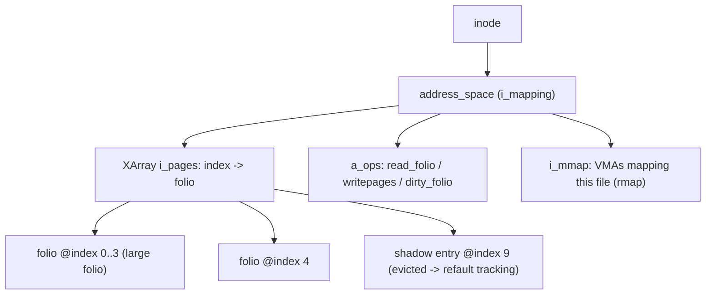
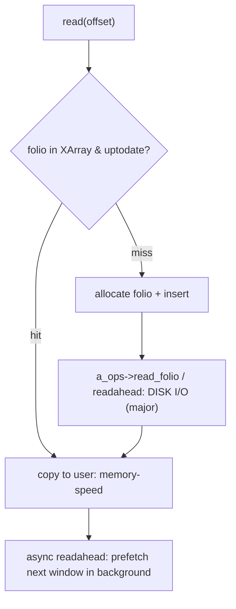

# Q11 — The Page Cache: address_space, XArray, and Readahead

> **Subsystem:** Page Cache · **Files:** `mm/filemap.c`, `include/linux/fs.h` (`address_space`), `lib/xarray.c`, `mm/readahead.c`
> **Interviewer is really probing:** Do you understand how file data is **cached in memory**, the
> **`address_space` + XArray** index, **folios** in the cache, and how **readahead** hides I/O latency?

---

## TL;DR Cheat Sheet

- The **page cache** caches **file contents in RAM** so repeated reads/writes hit memory instead of
  disk. Almost all file I/O (buffered `read`/`write`, `mmap`) goes through it.
- Each cached file (inode) has an **`address_space`** (`inode->i_mapping`). Its pages/folios are indexed
  by **file offset (in pages)** using an **XArray** (`mapping->i_pages`) — a modern radix-tree-based,
  RCU-friendly, lockless-lookup structure that replaced the old radix tree.
- Cache entries are **folios** (Q2) — possibly **large folios** (multi-page) for throughput. A lookup is
  `filemap_get_folio(mapping, index)`.
- **Read path:** `read()` → `filemap_read` → look up folio; **hit** = copy out (fast); **miss** =
  allocate folio, issue I/O (`readpage`/`read_folio` or `readahead`), wait, copy out. `mmap` read faults
  go through `filemap_fault` (Q3).
- **Readahead** detects sequential access and **prefetches** ahead asynchronously, converting future
  **major faults** into **cache hits** — the key latency-hiding mechanism (`mm/readahead.c`,
  `MADV_WILLNEED`, `posix_fadvise`).
- Special XArray entries encode **shadow** (workingset refault, reclaim) and **swap/DAX** state.
  Writeback (dirty → disk) is Q12; `MAP_SHARED`/`MAP_PRIVATE` interaction is Q13.

---

## The Question

> Explain the Linux page cache. How are cached file pages indexed and looked up, what role do folios and
> the XArray play, and how does readahead work?

---

## Why the page cache exists

Disks (even NVMe) are **orders of magnitude slower** than RAM, and files are accessed **repeatedly** and
often **sequentially**. Three goals drive the page cache:

1. **Avoid redundant I/O:** once a file block is read from disk, keep it in RAM so subsequent reads (by
   the same or other processes) are **memory-speed**. The cache is **shared** across all openers of a
   file — one physical copy backs every reader (and `MAP_SHARED` mappers).
2. **Decouple application I/O from device I/O:** writes go to cache pages immediately (marked dirty) and
   are flushed to disk **later, in batches**, by writeback (Q12) — so applications aren't blocked on slow
   storage on every `write`, and writes can be **coalesced/reordered** for the device.
3. **Hide latency with prediction:** most file access is **sequential**, so the kernel can **prefetch**
   upcoming blocks (**readahead**) while the app processes earlier ones, turning would-be **major faults**
   into **cache hits**.

The design needs a fast **offset → page** index per file (since file I/O is "give me bytes at offset N"),
which must support **concurrent lookups** (many readers), **range operations** (readahead, truncate,
writeback over a range), and **special markers** (shadow entries for reclaim, swap/DAX). That index is the
**XArray** hanging off each inode's **`address_space`**, and the cached units are **folios** so large
contiguous cache regions are handled efficiently. This is the backbone of essentially all file I/O and a
favorite interview area because it ties together VFS, MM, reclaim, and I/O.

---

## When the page cache is involved

| Operation | Page cache role |
|-----------|-----------------|
| buffered `read()` | look up folio; hit = copy out; miss = allocate + read I/O + readahead |
| buffered `write()` | write into cache folio, mark **dirty** → writeback later (Q12) |
| `mmap` + fault | `filemap_fault` installs a cache folio's page into the PTE (Q3) |
| `fsync`/`msync` | force dirty folios to disk (writeback) |
| reclaim | drop **clean** cache folios (cheap) or write back dirty ones (Q-reclaim) |
| `O_DIRECT` | **bypasses** the page cache (DMA straight to user buffer) |
| truncate/invalidate | remove folios from the `address_space` over a range |

---

## Where in the kernel

```
include/linux/fs.h        <- struct address_space (i_pages XArray, a_ops, host inode, flags)
mm/filemap.c              <- filemap_read, filemap_get_folio, filemap_fault, add_to_page_cache
lib/xarray.c              <- the XArray (replaces radix_tree); xa_load/xa_store, marks
mm/readahead.c            <- page_cache_sync/async_ra, readahead window, do_page_cache_ra
include/linux/pagemap.h   <- folio cache helpers, FGP_* flags, mapping_gfp_mask
fs/*/ (a_ops)             <- read_folio, writepages, dirty_folio (filesystem hooks)
```

---

## How it works — mechanics

### 1. `address_space` — the per-file cache

```c
struct address_space {
    struct inode      *host;       /* owning inode (or block device) */
    struct xarray      i_pages;    /* offset(in pages) -> folio  (the index) */
    const struct address_space_operations *a_ops; /* read_folio, writepages, dirty_folio... */
    unsigned long      nrpages;    /* number of cached pages */
    gfp_t              gfp_mask;   /* how to allocate cache pages */
    /* i_mmap: interval tree of VMAs mapping this file (rmap, Q-rmap) */
};
```
Every regular file's inode has one (`inode->i_mapping`); block devices and swap have them too. The
**`a_ops`** are the filesystem's hooks the cache calls to **read** a missing folio (`read_folio`) or
**write back** dirty folios (`writepages`).

### 2. The XArray index

The cache maps **file page offset → folio**. This index is an **XArray** (`mapping->i_pages`):

- A **radix-tree-derived** structure with an integer key (the page index) and a cleaner API
  (`xa_load`/`xa_store`), **RCU-safe lookups** (readers don't take the lock), and built-in **marks**
  (tags) for "dirty", "writeback", "towrite" used by writeback to find dirty folios over a range quickly.
- Large folios occupy a **range** of indices but appear once; sibling slots reference the head.
- **Special entries:** a slot can hold a **shadow entry** (recording an evicted folio's "age" for
  **workingset refault** detection, Q-reclaim/MGLRU), a **swap entry** (for shmem/tmpfs), or a **DAX**
  entry — distinguished by low tag bits.

Lookup is `filemap_get_folio(mapping, index, fgp_flags, gfp)`: returns the cached folio or (with
`FGP_CREAT`) allocates and inserts one.

### 3. The buffered read path

```
read(fd, buf, n):
  filemap_read():
    for each page index in range:
       folio = filemap_get_folio(mapping, index)
       if HIT and uptodate:    copy_folio_to_iter(folio -> user buf)   # fast, no I/O
       if MISS:
           folio = allocate + add_to_page_cache (insert into XArray)
           a_ops->read_folio(folio)  OR  trigger readahead             # disk I/O = MAJOR
           wait for PG_uptodate, then copy out
       kick ASYNC readahead for the *next* window
```
Hits are pure `memcpy`; misses allocate a folio, insert it into the XArray, and ask the filesystem to
fill it from disk. `PG_uptodate` marks "contents valid"; `PG_locked` serializes concurrent fillers.

### 4. Readahead — hiding latency

Sequential access is detected and exploited:

- **Synchronous readahead** (`page_cache_sync_readahead`): on a miss that looks sequential, read a
  **window** of pages ahead, not just the requested one.
- **Asynchronous readahead** (`page_cache_async_readahead`): when the app reaches a **marked** page
  (`PG_readahead`) inside the window, kick the **next** window **in the background** so the app never
  waits — a sliding, self-tuning prefetch.
- The **window grows** while access stays sequential (ramp-up) and **shrinks/stops** on random access.
- App hints: **`posix_fadvise(POSIX_FADV_SEQUENTIAL/WILLNEED/RANDOM)`** and **`madvise(MADV_WILLNEED/
  RANDOM)`** tune or trigger readahead; `MADV_RANDOM` disables it.

The payoff: with effective readahead, sequential file processing sees **cache hits** (minor/no faults)
instead of blocking **major faults** (Q3) — the difference between memory-speed and disk-speed throughput.

### 5. Write, dirty, and reclaim (links)

Buffered `write()` copies into a cache folio and marks it **dirty** (`folio_mark_dirty`, XArray dirty
tag); **writeback** (Q12) flushes dirty folios to disk later. Under memory pressure, reclaim
(Q-reclaim/MGLRU) **drops clean** cache folios for free (re-readable) and **writes back dirty** ones
first; **shadow entries** track evictions to size the cache (refault detection). `O_DIRECT` skips the
cache entirely (DMA to/from the user buffer) for apps that manage their own caching (databases).

---

## Diagrams

### address_space → XArray → folios



### Read hit vs miss + readahead



---

## Annotated C

```c
/* Look up (or create) a cached folio by file page index. */
struct folio *filemap_get_folio(struct address_space *mapping, pgoff_t index,
                                fgf_t fgp_flags, gfp_t gfp);
/* FGP_ACCESSED (mark referenced), FGP_CREAT (allocate if missing), FGP_LOCK, ... */

/* Insert a freshly allocated folio into the cache (XArray store). */
int filemap_add_folio(struct address_space *mapping, struct folio *folio,
                      pgoff_t index, gfp_t gfp);

/* The filesystem's hooks the cache calls. */
struct address_space_operations {
    int  (*read_folio)(struct file *, struct folio *);       /* fill a missing folio from disk */
    int  (*writepages)(struct address_space *, struct writeback_control *); /* flush dirty (Q12) */
    bool (*dirty_folio)(struct address_space *, struct folio *);
    void (*readahead)(struct readahead_control *);            /* batch prefetch */
};

/* Readahead entry points (mm/readahead.c). */
void page_cache_sync_readahead(struct address_space *, struct file_ra_state *, struct file *,
                               pgoff_t index, unsigned long req_count);
void page_cache_async_readahead(struct address_space *, struct file_ra_state *, struct file *,
                                struct folio *, pgoff_t index, unsigned long req_count);
```

> Senior nuance: the **XArray marks** are what make writeback efficient — instead of scanning every
> folio, writeback walks only the **dirty-tagged** slots over a range. And **shadow entries** in the same
> XArray let reclaim distinguish "never cached" from "evicted recently" (refault), feeding **workingset**
> sizing and **MGLRU** (Q15).

---

## Company Angle

- **Google (scale/throughput):** large folios in the page cache for higher throughput and lower per-page
  overhead; readahead tuning for sequential analytics; `O_DIRECT` vs page cache for databases; refault/
  workingset accounting at fleet scale.
- **AMD/Intel (bandwidth):** page-cache throughput, large folios for TLB/throughput, NUMA placement of
  cache pages, memory-bandwidth-bound file workloads.
- **Qualcomm (mobile/flash):** readahead on flash/UFS, memory pressure dropping clean cache first,
  zram/zswap interplay (Q14), `posix_fadvise` from app frameworks.
- **NVIDIA (data pipelines):** `O_DIRECT`/GPUDirect bypassing the cache for big sequential loads;
  readahead vs explicit prefetch for training data.

---

## War Story

*"A data-loading job read large files sequentially but was **disk-bound** and far slower than the device's
rated throughput. `vmstat`/`iostat` showed low queue depth and the app blocking on **major faults** —
effectively reading **one block at a time** and waiting each time. The file was opened in a way that
defeated the kernel's sequential detection (lots of small `pread`s at growing offsets that looked
borderline-random), so **readahead** stayed tiny. Fixes: (1) called
**`posix_fadvise(fd, 0, 0, POSIX_FADV_SEQUENTIAL)`** to widen the readahead window and **`WILLNEED`** to
prefetch upcoming ranges, turning misses into **cache hits**; (2) for the largest files we switched the
analytics engine to **`O_DIRECT`** with its own large async I/O, bypassing the page cache to avoid double
buffering and reclaim churn. Throughput jumped to near device limits. The interviewer's follow-up —
*'when is `O_DIRECT` better than the page cache?'* — let me explain: when the app does its **own** caching
and large sequential I/O (databases, big scans), the page cache just adds a copy and reclaim pressure; for
shared/repeated access, the page cache's caching + readahead wins."*

---

## Interviewer Follow-ups

1. **What does the page cache cache and why?** File contents in RAM, shared across openers, so repeated/
   sequential I/O hits memory; it also decouples app writes from slow device writeback.

2. **How are cached pages indexed?** Per-file **`address_space`** with an **XArray** keyed by **page
   offset**; lookup via `filemap_get_folio`.

3. **XArray vs radix tree?** The XArray is the modern radix-tree-based API: cleaner, RCU-safe lookups,
   built-in **marks** (dirty/writeback) and **special entries** (shadow/swap/DAX).

4. **What are folios doing here?** Cache entries are folios (Q2), possibly **large** (multi-page), so big
   contiguous cache regions are handled with one object and better TLB/throughput.

5. **How does a buffered read work?** Look up folio; hit = copy out; miss = allocate + insert + filesystem
   `read_folio`/readahead (disk I/O) + wait + copy; kick async readahead for the next window.

6. **How does readahead work?** Detect sequential access, prefetch a growing **window** ahead; async
   readahead triggers the next window when the app hits a marked page — converting major faults to hits.

7. **What are shadow entries?** Markers left in the XArray when a folio is evicted, recording its age for
   **refault/workingset** detection (sizes the inactive list; feeds MGLRU, Q15).

8. **What does `O_DIRECT` do?** Bypasses the page cache — DMA directly between device and user buffer; for
   apps doing their own caching/large sequential I/O.

9. **How does reclaim treat cache pages?** Drops **clean** pages for free (re-readable); **writes back
   dirty** ones first (Q12/Q-reclaim).

---

## 30-Minute Talk Track

| Min | Cover |
|-----|-------|
| 0–4 | Why: disks slow, files reused/sequential; avoid I/O, decouple writes, predict |
| 4–8 | address_space per inode: i_pages XArray, a_ops, i_mmap; shared cache |
| 8–13 | XArray index: offset→folio, RCU lookups, marks (dirty/writeback), shadow/swap/DAX entries |
| 13–16 | Folios in the cache; large folios; filemap_get_folio |
| 16–21 | Buffered read path: hit vs miss, read_folio, add_to_page_cache, uptodate/locked |
| 21–25 | Readahead: sync/async windows, ramp-up, PG_readahead, fadvise/madvise |
| 25–28 | Write/dirty → writeback (Q12); reclaim clean-drop vs writeback; O_DIRECT |
| 28–30 | War story (readahead/fadvise + O_DIRECT) + cache-vs-direct trade-off |
