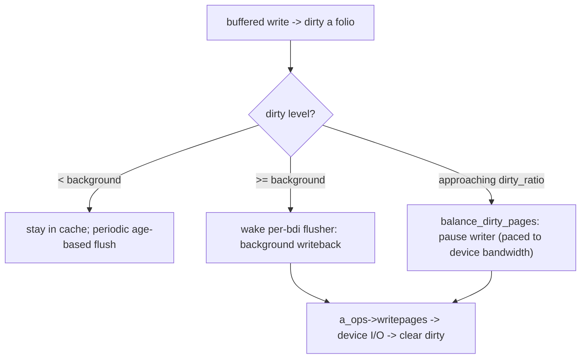

# Q12 — Dirty Pages & Writeback

> **Subsystem:** Page Cache · **Files:** `mm/page-writeback.c`, `fs/fs-writeback.c`, `mm/backing-dev.c`, `include/linux/writeback.h`
> **Interviewer is really probing:** Do you understand how **dirty data** is flushed to disk —
> the **dirty ratios**, **flusher threads (bdi)**, **`balance_dirty_pages`** throttling, and `fsync`?

---

## TL;DR Cheat Sheet

- A **dirty page** is a page-cache page modified in RAM but **not yet written to disk**. Writeback is the
  machinery that flushes dirty pages to their backing store, **asynchronously and in batches**, so writes
  are fast and the device sees coalesced I/O.
- **Two thresholds** (per the system & per **bdi**, backing device):
  - **`dirty_background_ratio`** (default ~10%): when dirty memory crosses this, **flusher threads** start
    writing back **in the background** (app not blocked).
  - **`dirty_ratio`** (default ~20%): the hard cap — when dirty memory crosses this, **writers are
    throttled** (`balance_dirty_pages` makes them wait/write) so dirty memory can't grow unbounded.
- **Flusher threads** are **per-bdi** (`writeback` workqueue / `bdi_writeback`): each backing device has
  its own writeback context so a slow disk doesn't stall a fast one.
- **`balance_dirty_pages`** is the **throttling controller**: on each buffered write it checks dirty
  levels and, past the threshold, **paces** the writer (sleeps proportional to how far over the limit) —
  a feedback loop that matches dirtying rate to device writeback rate.
- **Durability points:** `fsync`/`fdatasync` (one file), `sync`/`syncfs` (all), `msync` (mmap),
  `O_SYNC`/`O_DSYNC` (sync each write). The page cache alone is **not durable** — a crash loses unflushed
  dirty pages.
- Tunables: `vm.dirty_ratio`, `vm.dirty_background_ratio` (or `*_bytes`), `vm.dirty_expire_centisecs`,
  `vm.dirty_writeback_centisecs`.

---

## The Question

> How does Linux write dirty page-cache data back to disk? Explain the dirty ratios, flusher threads, and
> `balance_dirty_pages` throttling. How does `fsync` fit in?

---

## Why writeback exists (and why it's throttled)

Buffered writes go to **RAM first** (the page cache, Q11) and return immediately — the application
doesn't wait for the slow disk. That's great for latency, but it creates a problem the kernel must
manage: **dirty data accumulates in memory** and eventually must reach stable storage. Three pressures
shape the design:

1. **Don't lose too much on a crash / don't hoard memory:** dirty pages are **unreclaimable until
   written** (reclaim must flush them first, Q-reclaim) and represent **unsynced data**. If dirty memory
   grows without bound, a crash loses a lot of data and reclaim chokes. So writeback must flush
   **proactively** and **cap** how dirty memory can get.
2. **Match producer to consumer:** applications can dirty pages (memcpy speed) **far faster** than a disk
   can absorb them (especially slow USB/SD/HDD). Without backpressure, an app would fill RAM with dirty
   pages, then everything stalls at once. The kernel needs a **feedback loop** that **paces writers** to
   the device's actual writeback throughput — that's **`balance_dirty_pages`**.
3. **Per-device fairness & efficiency:** a fast NVMe and a slow USB stick have wildly different writeback
   rates; one shouldn't be throttled because of the other. So writeback is **per-backing-device (bdi)**,
   and dirty limits are partitioned per bdi by observed bandwidth.

So writeback is a **controlled, batched, per-device drain** of dirty memory, with **two thresholds**
(start-early vs hard-cap) and a **throttling controller** that turns "writes are free" into "writes are
free *until* you're dirtying faster than the disk can keep up, then you're paced." Understanding that
feedback loop — and the latency/durability trade-offs of the knobs — is the senior signal.

---

## When writeback happens

| Trigger | Mechanism |
|---------|-----------|
| dirty memory > `dirty_background_ratio` | **flusher threads** write back in background (async) |
| dirty memory > `dirty_ratio` | **`balance_dirty_pages`** throttles the writing task (sync pacing) |
| periodic (`dirty_writeback_centisecs`, ~5 s) | flusher wakes to write **old** dirty pages |
| a page dirty longer than `dirty_expire_centisecs` (~30 s) | flushed for **age** |
| `fsync`/`fdatasync`/`msync`/`sync` | **explicit** flush for durability (blocks until done) |
| memory reclaim hits dirty pages | kick writeback so the page can be reclaimed (Q-reclaim) |
| `O_SYNC`/`O_DSYNC` | each `write` flushed before returning |

---

## Where in the kernel

```
mm/page-writeback.c     <- dirty thresholds, balance_dirty_pages, dirty ratelimiting, dirty_throttle
fs/fs-writeback.c       <- wb_workfn / writeback workqueue: per-bdi flusher work, writeback_inodes_wb
mm/backing-dev.c        <- struct backing_dev_info (bdi), bdi_writeback, per-bdi bandwidth estimation
include/linux/writeback.h <- struct writeback_control (wbc), sync modes
sysctls: vm.dirty_ratio, vm.dirty_background_ratio (+ *_bytes), vm.dirty_expire_centisecs,
         vm.dirty_writeback_centisecs
/proc/meminfo: Dirty, Writeback
```

---

## How writeback works — mechanics

### 1. Marking dirty

A buffered `write()` (or a write fault to a shared mapping, Q13) copies data into a cache **folio** and
marks it **dirty**: sets `PG_dirty`, sets the **dirty mark** in the file's XArray (Q11), and bumps the
**`NR_FILE_DIRTY`** / bdi dirty counters and memcg stats. Dirty folios are now **unreclaimable until
written** and are tracked for flushing.

### 2. The two thresholds

```
dirty memory (fraction of reclaimable RAM)
   dirty_ratio (~20%) ─────────  HARD CAP: balance_dirty_pages THROTTLES writers (they wait/write)
   dirty_background_ratio (~10%) ─  flusher threads start writing in the BACKGROUND (app not blocked)
   (clean / low dirty) ──────────  writes just go to cache, flushed periodically by age
```
Between background and hard cap, the **flushers** work in the background while the app keeps writing.
Past the hard cap, the **writer itself** is throttled. (`*_bytes` variants set absolute limits, often
preferred on big-RAM machines where 20% is huge.)

### 3. Flusher threads (per-bdi)

Each **backing device** (`bdi`) has a **`bdi_writeback`** context driven by a **workqueue** (the
`writeback` wq, historically `flush-MAJOR:MINOR` / `pdflush` ancestor). `wb_workfn` does the work:
walk dirty inodes for that device, build `writeback_control` (range, sync mode, nr_to_write), and call
the filesystem's **`a_ops->writepages`** to issue I/O for dirty folios, clearing `PG_dirty` and setting
`PG_writeback` until the device completes. Per-bdi separation means a **slow device's** backlog doesn't
throttle writeback on a **fast device**, and the kernel **estimates each bdi's bandwidth** to partition
the global dirty limit fairly.

### 4. `balance_dirty_pages` — the throttling controller

On the buffered-write path, after dirtying, the kernel calls **`balance_dirty_pages_ratelimited`**.
Periodically (rate-limited) it runs **`balance_dirty_pages`**, which:

1. computes current **dirty** vs the **(background, limit)** thresholds (system-wide and for this bdi);
2. if over the background threshold, **wakes the flusher**;
3. if approaching/over the hard limit, **pauses the writing task** for a computed interval — a
   **proportional-integral controller** that targets a **setpoint** between background and hard limit,
   pacing the dirtying rate to the **measured device writeback bandwidth**. The closer to the limit, the
   **longer the pause**, so a fast producer is smoothly slowed to the disk's drain rate instead of
   slamming into a wall.

This is the elegant core: instead of "block when full," it **continuously paces** writers so dirty memory
hovers around a healthy setpoint — bounding memory use and crash-loss while keeping the device busy.

### 5. Durability — fsync and friends

The page cache is **volatile**: a crash loses dirty pages not yet written. Durability requires explicit
sync:
- **`fsync(fd)`** — flush all dirty pages **and** metadata of one file, wait for completion (+ a device
  **cache-flush/FUA** so it's truly on stable media).
- **`fdatasync(fd)`** — like fsync but skips non-essential metadata (faster).
- **`msync`** — flush a dirty `mmap` range. **`sync`/`syncfs`** — everything / one filesystem.
- **`O_SYNC`/`O_DSYNC`** — make every `write` synchronous (durable on return) — slow but simple.
Databases/journals rely on `fsync` ordering + barriers for crash consistency; getting this wrong
(assuming the page cache is durable) is a classic data-loss bug.

### 6. Reclaim interaction

Under memory pressure, reclaim (Q-reclaim/MGLRU) can **drop clean** cache pages for free but must **write
back dirty** ones first. If too much memory is dirty, reclaim stalls waiting on writeback — which is why
keeping dirty memory bounded (the ratios) also protects **reclaim latency**. Writing back from the
reclaim path is discouraged (it causes random I/O); the flushers are meant to keep dirty levels low
enough that reclaim rarely has to.

---

## Diagrams

### Thresholds and throttling



### The feedback loop

```
producer (app dirtying)  --->  [ dirty memory pool ]  --->  consumer (flusher -> device)
        balance_dirty_pages measures pool level & device bandwidth,
        and PACES the producer to match the consumer (setpoint between bg and hard limit).
```

---

## Annotated C

```c
/* Per-write throttling hook (mm/page-writeback.c). */
void balance_dirty_pages_ratelimited(struct address_space *mapping);
/* -> balance_dirty_pages(): compute dirty vs thresholds, wake flusher, pause writer if needed */

/* Writeback control passed down to the filesystem. */
struct writeback_control {
    long  nr_to_write;          /* how many pages to try to write */
    enum writeback_sync_modes sync_mode; /* WB_SYNC_NONE (bg) / WB_SYNC_ALL (fsync) */
    unsigned for_background:1;  /* background vs integrity writeback */
    unsigned range_cyclic:1;
    loff_t range_start, range_end;
};

/* Per-backing-device writeback context. */
struct bdi_writeback {
    struct backing_dev_info *bdi;
    unsigned long dirty_ratelimit;   /* estimated sustainable dirtying rate */
    unsigned long write_bandwidth;   /* measured device writeback bandwidth */
    struct delayed_work dwork;       /* the flusher work */
    struct list_head b_dirty;        /* dirty inodes for this device */
};

/* Filesystem hook that actually issues writeback I/O. */
int (*writepages)(struct address_space *, struct writeback_control *);
```

```bash
grep -E 'Dirty|Writeback' /proc/meminfo
sysctl vm.dirty_ratio vm.dirty_background_ratio        # % thresholds
sysctl vm.dirty_background_bytes vm.dirty_bytes        # absolute (prefer on big RAM)
sysctl vm.dirty_expire_centisecs vm.dirty_writeback_centisecs
```

> Senior nuance: **`balance_dirty_pages` is a control loop, not a wall.** It paces writers
> *proportionally* toward a setpoint, using **per-bdi measured bandwidth**, so a slow device throttles
> only its own writers. The ratios bound **memory use, crash-loss, and reclaim latency** simultaneously —
> which is why they're a key tuning surface, and why **`*_bytes`** is preferred on large-RAM systems
> (20% of 512 GiB dirty is catastrophic).

---

## Company Angle

- **Qualcomm (mobile/slow flash):** small/slow storage makes `dirty_ratio` tuning critical — too high and
  a burst of writes stalls the UI; `*_bytes` limits, writeback on UFS/eMMC, fsync cost on journaling FS,
  and PSI-IO pressure (Q16).
- **Google (databases/scale):** `fsync` durability and ordering for databases, dirty-ratio tuning to
  avoid write stalls and reclaim latency, per-bdi fairness across many disks, io throttling via cgroup
  io controller.
- **AMD/Intel (big RAM):** why percentage ratios are dangerous on huge memory (use `*_bytes`), writeback
  bandwidth vs NVMe, reclaim-vs-dirty interplay at scale.
- **NVIDIA (data pipelines):** large sequential writes, `O_DIRECT` to bypass dirtying entirely, writeback
  vs explicit flush for checkpointing.

---

## War Story

*"A device with slow eMMC would **freeze for seconds** during bulk file copies — the UI became
unresponsive. `cat /proc/meminfo` during the stall showed **`Dirty`** climbing to ~20% of RAM (the
default `dirty_ratio`) before everything jammed: the copy dirtied pages at memory speed, the slow flash
couldn't drain them, and once dirty hit the **hard cap**, **`balance_dirty_pages`** throttled not just the
copy but every task that tried to write — plus reclaim stalled waiting on dirty writeback. The default
**percentage** ratios were the trap: 20% of several GiB is a *huge* amount of dirty data for slow flash.
Fix: switched to **absolute** limits — `vm.dirty_background_bytes` and `vm.dirty_bytes` sized to a couple
hundred MiB — so the flusher started **early** and the hard cap kicked in **before** a giant backlog
built, keeping throttling **gentle and continuous** instead of a cliff. The freezes disappeared. The
interviewer's follow-up — *'why not just raise the ratios to never throttle?'* — let me explain that
unbounded dirty memory means **more data lost on crash** and **reclaim stalls**; the point is to **pace**
writers to the device, not to remove the limit."*

---

## Interviewer Follow-ups

1. **What is a dirty page?** A cached page modified in RAM but not yet written to its backing store;
   unreclaimable until written.

2. **`dirty_background_ratio` vs `dirty_ratio`?** Background = flushers start writing in the background
   (app not blocked); the hard cap = `balance_dirty_pages` **throttles** writers so dirty memory can't
   grow past it.

3. **What does `balance_dirty_pages` do?** A feedback controller on the write path: measures dirty level
   and device bandwidth and **paces** (sleeps) the writer proportionally as it approaches the limit.

4. **Why per-bdi flushers?** So a slow device's backlog doesn't throttle writeback on a fast device; dirty
   limits are partitioned by each bdi's measured bandwidth.

5. **Is the page cache durable? How do you get durability?** No — a crash loses unflushed dirty pages.
   Use `fsync`/`fdatasync`/`msync`/`sync`, or `O_SYNC`/`O_DSYNC`; `fsync` also issues a device cache flush.

6. **Why prefer `*_bytes` over ratios on big RAM?** A percentage of huge RAM is an enormous dirty backlog
   (crash-loss + stall); absolute byte limits keep it sane.

7. **How does writeback interact with reclaim?** Reclaim drops clean cache for free but must write back
   dirty pages first; excessive dirty memory stalls reclaim — bounding dirty protects reclaim latency.

8. **What triggers periodic writeback?** `dirty_writeback_centisecs` (flusher wakeups) and
   `dirty_expire_centisecs` (max dirty age) flush old pages even below the thresholds.

9. **`fsync` vs `fdatasync`?** `fsync` flushes data + all metadata; `fdatasync` skips non-essential
   metadata (e.g. mtime) for speed while keeping data durable.

---

## 30-Minute Talk Track

| Min | Cover |
|-----|-------|
| 0–4 | Why writeback: buffered writes go to RAM; dirty must reach disk; bound memory/crash-loss |
| 4–8 | Marking dirty: PG_dirty, XArray dirty mark, counters; unreclaimable until written |
| 8–13 | Two thresholds: background (flushers start) vs dirty_ratio (hard cap/throttle); *_bytes |
| 13–17 | Per-bdi flusher threads: wb_workfn, writepages, bandwidth estimation, fairness |
| 17–23 | balance_dirty_pages: the feedback controller pacing writers to device bandwidth |
| 23–26 | Durability: fsync/fdatasync/msync/sync, O_SYNC, device cache flush; crash consistency |
| 26–28 | Reclaim interaction; periodic/age-based writeback |
| 28–30 | War story (eMMC dirty-ratio stalls → *_bytes) + "pace, don't remove the limit" |
