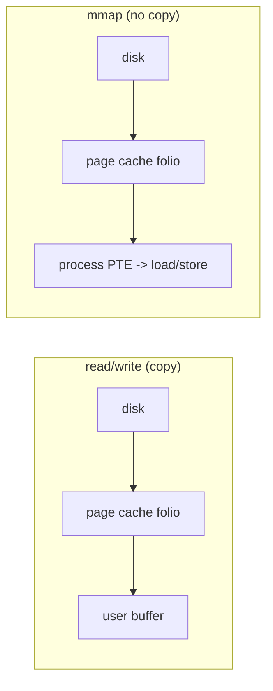
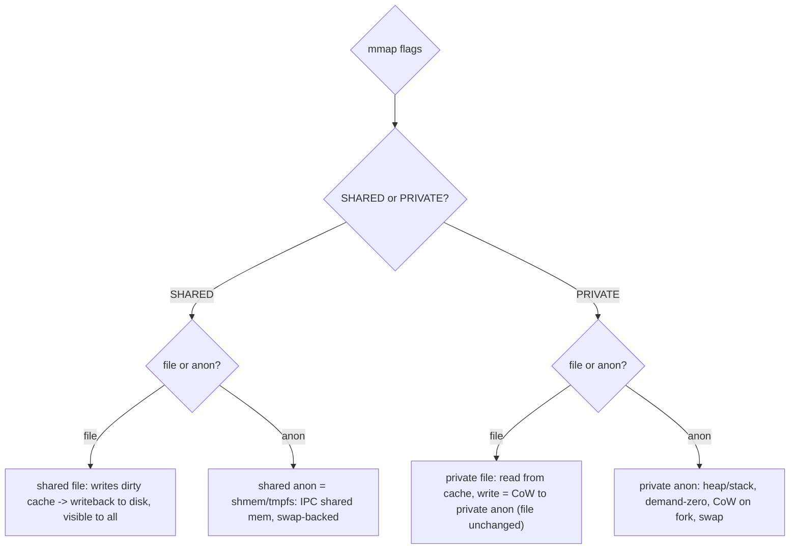

# Q13 — mmap vs read/write; MAP_SHARED vs MAP_PRIVATE; File vs Anonymous

> **Subsystem:** Page Cache / VM · **Files:** `mm/mmap.c`, `mm/filemap.c` (`filemap_fault`), `mm/memory.c`, `mm/shmem.c`
> **Interviewer is really probing:** Do you understand the **trade-offs** between `mmap` and `read`/
> `write`, the four mapping combinations (**shared/private × file/anon**), and how each touches the page cache?

---

## TL;DR Cheat Sheet

- **`read`/`write`** = explicit syscalls that **copy** between the page cache and a user buffer. **`mmap`**
  = map a file (or anon memory) into the address space so it's accessed by **load/store**, faulting pages
  in on demand (Q3) — **no copy**, the page cache pages are mapped **directly** into the process.
- **`mmap` pros:** zero-copy, shareable across processes, lazy/demand-paged, random access without
  syscalls per access, can map huge files. **Cons:** page-fault overhead, TLB pressure, `SIGBUS` on
  truncation/I/O error, alignment/granularity, harder error handling than `read`/`write`.
- **Four mapping types:**
  | | **File-backed** | **Anonymous** |
  |--|--|--|
  | **MAP_SHARED** | shared view of a file's **page cache**; writes go back to the file (writeback Q12); visible to all mappers | shared anon (e.g. `MAP_SHARED|MAP_ANON`, or shmem/tmpfs) — IPC shared memory, **not** file-backed |
  | **MAP_PRIVATE** | **CoW** view of a file: reads from page cache, **writes copy** to private anon pages (not written to the file) | private anon memory: heap/`malloc`, stacks — **CoW** on fork (Q4), demand-zero (Q5) |
- **Shared file write:** dirties the **page cache** folio → eventually **written back** to disk (Q12),
  visible to every other mapper and to `read`.
- **Private file write:** triggers **CoW** → a **private copy** (anon) is created; the file and other
  mappers are unaffected (this is how executables load: code is `MAP_PRIVATE` file-backed).
- **Anonymous** memory has **no file**; it's backed by RAM and, under pressure, by **swap** (Q14).

---

## The Question

> Compare `mmap` to `read`/`write`. Explain `MAP_SHARED` vs `MAP_PRIVATE` and file-backed vs anonymous
> mappings, and how each interacts with the page cache.

---

## Why both interfaces exist

`read`/`write` and `mmap` are **two ways to access file data**, optimized for different patterns:

- **`read`/`write`** are simple, explicit, and **copy** data between the kernel's page cache and a user
  buffer. They're great for **streaming/sequential** I/O, give precise **error handling** (the syscall
  returns an error), work on pipes/sockets/any fd, and don't perturb the address space. The cost is a
  **copy** (cache → user buffer) and a **syscall** per operation.
- **`mmap`** maps the file's **page-cache pages directly** into the process address space, so access is by
  **CPU load/store** with **no copy** and **no syscall per access**. It shines for **random access**,
  **sharing** the same physical pages across processes, **large** files, and building data structures
  directly over file contents. The cost is **page-fault** overhead on first touch, **TLB** pressure,
  trickier errors (a bad page or truncation becomes **`SIGBUS`**, not a return code), and page-granular
  semantics.

The deeper reason interviewers probe this: it forces you to connect **VMAs (Q1)**, the **fault path
(Q3)**, the **page cache (Q11)**, **CoW (Q4)**, **writeback (Q12)**, and **swap (Q14)** — because *which*
mapping you choose determines *which* of those subsystems handle your memory. The **shared/private ×
file/anon** matrix is the unifying mental model: it tells you **where the data lives, who sees writes, and
where it goes under pressure**.

---

## When to use which

| Need | Choice |
|------|--------|
| Sequential streaming, simple errors, pipes/sockets | **`read`/`write`** (+ readahead, Q11) |
| Random access into a large file, zero-copy | **`mmap` MAP_PRIVATE/SHARED** (file) |
| Modify a file via memory, persist changes | **`mmap MAP_SHARED`** (file) + `msync`/writeback |
| Read-only/code or "don't change the file" view | **`mmap MAP_PRIVATE`** (file) — CoW on write |
| Process-local memory (malloc/heap/stack) | **anonymous MAP_PRIVATE** (Q5) |
| Shared memory IPC between processes | **`MAP_SHARED|MAP_ANON`** or **shmem/tmpfs** / `memfd` |
| Huge zero-copy buffers, avoid double caching | `O_DIRECT` (Q11) or `mmap` depending on pattern |

---

## Where in the kernel

```
mm/mmap.c          <- do_mmap / mmap_region: create the VMA, set vm_flags (SHARED/PRIVATE), vm_ops
mm/filemap.c       <- filemap_fault / filemap_map_pages: file-backed fault from page cache (Q3/Q11)
mm/memory.c        <- do_fault (file), do_anonymous_page (anon), do_wp_page (private CoW, Q4)
mm/shmem.c         <- tmpfs / shared anonymous (MAP_SHARED|MAP_ANON), memfd, swap-backed
include/uapi/asm-generic/mman*.h  <- MAP_SHARED / MAP_PRIVATE / MAP_ANONYMOUS / MAP_POPULATE ...
```

---

## How each works — mechanics

### 1. `read`/`write` vs `mmap` data flow

```
read():   disk --(once)--> page cache folio --(copy)--> user buffer        (one copy out)
write():  user buffer --(copy)--> page cache folio (dirty) --(writeback)--> disk  (Q12)
mmap():   page cache folio  ===mapped directly===>  process PTE  (NO copy; access = load/store)
          first touch -> page fault -> filemap_fault installs the cache page into the PTE (Q3)
```
With `mmap`, the **same physical page-cache folio** is mapped into the PTE — so reading mapped memory is a
direct load from the cache page (zero copy). The page cache is **shared**, so multiple processes mapping
the same file (and `read`ers) all use **one** physical copy.

### 2. The mapping matrix — what `vm_flags` encode

`do_mmap` creates a **VMA** (Q1) with flags capturing two independent choices:

**Sharing (SHARED vs PRIVATE):**
- **`MAP_SHARED`**: writes are **visible to all** mappers and (if file-backed) **propagate to the file**.
  The VMA maps the page cache folios **writably**; a write dirties the cache folio → **writeback** to disk
  (Q12). Used for shared memory and memory-modifying-a-file.
- **`MAP_PRIVATE`**: a **copy-on-write** view. Reads come from the shared backing (page cache or zero
  page); the **first write** triggers **`do_wp_page`** (Q4) to create a **private anonymous copy**, so the
  writer's changes are **invisible** to others and **not** written to the file.

**Backing (file vs anonymous):**
- **File-backed** (`vm_file != NULL`): pages come from the file's **page cache** via `filemap_fault`
  (Q11). A miss reads from disk (**major fault**). Under reclaim, **clean** file pages are dropped for
  free (re-readable).
- **Anonymous** (`MAP_ANONYMOUS`, `vm_file == NULL`): no file; pages are **demand-zero** allocated (Q5)
  and tracked by **anon rmap**. Under pressure they go to **swap** (Q14), not a file.

### 3. The four combinations in practice

```
PRIVATE + FILE   : executables/libraries (code r-x), config files read into memory.
                   Reads from page cache; writes CoW to private anon (don't change the file).
SHARED  + FILE   : memory-mapped databases/logs; writes dirty the page cache -> written back to disk;
                   all mappers + read()ers see the changes.
PRIVATE + ANON   : malloc/heap/stack/BSS. Demand-zero (Q5); CoW on fork (Q4); swap under pressure.
SHARED  + ANON   : IPC shared memory. Implemented via shmem/tmpfs (a swap-backed pseudo-file);
                   survives across processes that map it; backed by swap, not a real file.
```
A subtle but important point: **`MAP_SHARED|MAP_ANONYMOUS`** is implemented on top of **shmem/tmpfs**, so
"shared anonymous" memory actually has a hidden tmpfs inode + page cache and is **swap-backed** — which is
why it persists across `fork` and is shareable, unlike private anon. `memfd_create` exposes this directly.

### 4. Faulting, dirtying, and reclaim per type

- **File read fault** → `filemap_fault` (cache hit = minor, miss = major; Q3/Q11).
- **Shared file write fault** → mark the cache folio **dirty** and writable; **writeback** later (Q12);
  reclaim must write it back before freeing.
- **Private write fault** → **`do_wp_page`** CoW to a private anon page (Q4); now reclaim treats it as
  anon (swap, Q14).
- **Anon fault** → `do_anonymous_page` (zero page on read, allocate on write; Q5).

### 5. mmap gotchas (the senior caveats)

- **`SIGBUS`** if you access beyond the file's current size (e.g. after **truncate**) or on an
  **I/O error** — unlike `read`, which returns an error code. Robust mmap users handle `SIGBUS` or avoid
  truncation races.
- **Writeback timing:** `MAP_SHARED` file writes aren't durable until **writeback** or **`msync`/fsync`** —
  same volatility as buffered writes (Q12).
- **TLB/fault cost:** many small random accesses can cause many faults; `MAP_POPULATE`/`madvise(WILLNEED)`
  prefault, `mlock` pins resident, `MADV_DONTNEED` drops pages.
- **Coherency:** `read`/`write` and `mmap MAP_SHARED` on the same file are coherent (same page cache);
  mixing `O_DIRECT` (bypasses cache) with mmap can be **incoherent**.

---

## Diagrams

### Data flow: copy vs map



### The mapping matrix



---

## Annotated C

```c
/* read/write: explicit copy through the page cache. */
n = read(fd, buf, len);            /* page cache folio -> user buffer (copy) */
n = write(fd, buf, len);           /* user buffer -> page cache folio (dirty) -> writeback (Q12) */

/* mmap: map directly; access by load/store. */
char *p = mmap(NULL, len, PROT_READ|PROT_WRITE, MAP_SHARED,  fd, 0); /* shared file: writes persist */
char *q = mmap(NULL, len, PROT_READ|PROT_WRITE, MAP_PRIVATE, fd, 0); /* private file: writes are CoW */
char *a = mmap(NULL, len, PROT_READ|PROT_WRITE, MAP_PRIVATE|MAP_ANONYMOUS, -1, 0); /* heap-like */
char *s = mmap(NULL, len, PROT_READ|PROT_WRITE, MAP_SHARED |MAP_ANONYMOUS, -1, 0); /* shmem IPC */

/* Durability + hints for shared file mappings. */
msync(p, len, MS_SYNC);            /* flush dirty mapped pages to disk (Q12) */
madvise(p, len, MADV_WILLNEED);    /* prefault/readahead (Q11) */
madvise(p, len, MADV_DONTNEED);    /* drop pages (anon: zero on next touch; file: re-read) */

/* memfd: an anonymous, shareable, swap-backed file (modern shared-anon). */
int mfd = memfd_create("ipc", MFD_CLOEXEC);
```

> Senior nuance: **`MAP_SHARED|MAP_ANONYMOUS` is shmem under the hood** — it has a tmpfs inode and is
> **swap-backed**, which is why it's shareable and survives fork, unlike `MAP_PRIVATE` anon. And the key
> write distinction: **shared file write → page cache → disk (visible to all)**; **private file write →
> CoW to private anon (file untouched)**. That single fact answers most follow-ups.

---

## Company Angle

- **Google (databases/scale):** mmap vs `read`/`O_DIRECT` for database engines, double-caching concerns,
  `SIGBUS`/truncation safety, shared memory via memfd, page-cache coherency; when zero-copy mmap beats
  syscall-copy and when it doesn't.
- **NVIDIA (zero-copy/GPU):** mmap of device/file memory, shared mappings for zero-copy pipelines, mmap +
  GUP pinning interactions (Q4), `MAP_POPULATE`/`mlock` to avoid fault latency.
- **Qualcomm (Android/IPC):** ashmem/`memfd`/dma-buf shared memory between processes, mmap of device
  buffers, private file-backed code mappings, low-RAM swap of anon.
- **AMD/Intel (bandwidth):** mmap vs read throughput, TLB pressure (huge pages, Q18), NUMA placement of
  mapped pages.

---

## War Story

*"A service `mmap`'d a large data file `MAP_SHARED` and a maintenance job sometimes **truncated** that
file. Occasionally the service **crashed with `SIGBUS`** — accessing a mapped page beyond the file's new
(smaller) size is undefined and delivers `SIGBUS`, unlike `read` which would just return short. Worse, a
second bug: another component wrote the file with **`O_DIRECT`** (bypassing the page cache) while the
service read it via `mmap` (page cache) — the two views were **incoherent**, so the service saw stale
data. Fixes: (1) coordinate truncation (the writer uses `ftruncate` only when no one maps the tail, or the
reader handles `SIGBUS` and remaps), and (2) make all access go through the **page cache** (`MAP_SHARED` +
buffered writes, or `msync`) so mmap and `read`/`write` stay coherent — and use **`fallocate`** instead of
truncate where possible. The interviewer's follow-up — *'when would you choose `read` over `mmap` here?'* —
let me explain that for **streaming** access with **clean error handling** and **truncation races**,
`read` is safer (errno, no SIGBUS), whereas `mmap` wins for **random** zero-copy access — and you should
never mix `O_DIRECT` with cached mmap on the same data."*

---

## Interviewer Follow-ups

1. **mmap vs read/write — core difference?** `read`/`write` **copy** between page cache and a user buffer;
   `mmap` maps cache pages **directly** into the address space (zero-copy, load/store, demand-faulted).

2. **MAP_SHARED vs MAP_PRIVATE?** SHARED: writes visible to all mappers and (file) written back to disk;
   PRIVATE: **CoW** — writes create a private anon copy, invisible to others and not persisted.

3. **What happens on a private file write?** `do_wp_page` CoW (Q4): a private anonymous copy is made; the
   file and other mappers are unchanged (how executables map code).

4. **What happens on a shared file write?** The page-cache folio is dirtied + made writable → **writeback**
   to disk (Q12); visible to every mapper and to `read`.

5. **How is MAP_SHARED|MAP_ANON implemented?** Via **shmem/tmpfs** — a hidden swap-backed pseudo-file; it's
   shareable and survives fork (unlike private anon). `memfd_create` exposes it.

6. **Where do anonymous vs file pages go under memory pressure?** Anon → **swap** (Q14); clean file pages →
   **dropped** (re-readable); dirty file pages → **written back** then dropped.

7. **Why can mmap cause SIGBUS?** Accessing beyond the file's size (after truncate) or on an I/O error
   delivers `SIGBUS`, unlike `read` which returns an error — an mmap robustness caveat.

8. **When is `read`/`write` better than mmap?** Sequential streaming, simple error handling, non-file fds,
   avoiding TLB/fault overhead and truncation `SIGBUS`.

9. **How do you make mmap’d writes durable?** `msync(MS_SYNC)` / `fsync` — the page cache is volatile;
   shared file writes aren't on disk until writeback (Q12).

---

## 30-Minute Talk Track

| Min | Cover |
|-----|-------|
| 0–4 | Two ways to access files: copy (read/write) vs map (mmap, zero-copy); why both exist |
| 4–8 | Data flow diagrams: page cache copy vs direct PTE mapping; shared single copy |
| 8–14 | The matrix: SHARED vs PRIVATE × file vs anon; what vm_flags encode |
| 14–18 | Four cases in practice: code (priv file), DB (shared file), heap (priv anon), IPC (shared anon=shmem) |
| 18–22 | Faulting/dirtying/reclaim per type: filemap_fault, do_wp_page CoW, do_anonymous_page, swap |
| 22–26 | mmap gotchas: SIGBUS/truncation, writeback/msync durability, TLB/fault cost, O_DIRECT coherency |
| 26–28 | madvise/MAP_POPULATE/mlock/memfd hints |
| 28–30 | War story (SIGBUS truncation + O_DIRECT incoherence) + read-vs-mmap trade-off |
