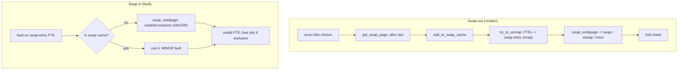

# Q14 — The Swap Subsystem: Swap Cache, Swap-out/in, zswap & zram

> **Subsystem:** Reclaim & Swap · **Files:** `mm/swapfile.c`, `mm/swap_state.c`, `mm/page_io.c`, `mm/zswap.c`, `drivers/block/zram/`
> **Interviewer is really probing (Qualcomm favorite):** Do you understand how **anonymous pages** are
> evicted to swap, the **swap cache** and **swap entries**, and modern **compressed swap** (zswap/zram)?

---

## TL;DR Cheat Sheet

- **Swap** is backing store for **anonymous** pages (heap/stack/private — no file behind them, Q13). When
  reclaim must evict an anon page and there's swap, it **writes the page to swap** and replaces the PTE
  with a **swap entry**; a later fault **swaps it back in** (`do_swap_page`, Q3).
- A **swap entry** is a special non-present PTE encoding **(swap type, offset)** — which swap device and
  which slot. `swap_info_struct` describes each swap area; a **slot bitmap/cluster** tracks free slots.
- The **swap cache** (`swapper_space`, an `address_space`/XArray) bridges page cache and swap: while a
  page is being swapped out/in, it lives here so concurrent faults and shared pages don't duplicate I/O
  or corrupt state. It also lets a swapped-out-but-still-cached page fault back as a **minor** fault.
- **Swap-out:** reclaim picks an anon folio → allocate a swap slot → add to swap cache → write to swap
  (`swap_writepage`) → on completion, PTEs become swap entries, folio freed.
- **Swap-in:** fault on a swap entry → `do_swap_page` → check swap cache (hit = minor) → else read from
  swap (`swap_readpage`, major) → install page → optionally free the slot.
- **Compressed swap:** **zram** (a compressed RAM block device used as swap) and **zswap** (a compressed
  **cache in front of** a real swap device) trade CPU for I/O — huge on **Android/low-RAM** and cloud.
- `vm.swappiness` biases anon-vs-file reclaim (Q-reclaim).

---

## The Question

> How does swap work? Explain swap entries, the swap cache, the swap-out and swap-in paths, and what
> zswap/zram add.

---

## Why swap exists

**Anonymous** memory (Q13) — heap, stack, private mappings — has **no file** to fall back to. File-backed
clean pages can always be **dropped and re-read** from their file during reclaim (Q11), but an anonymous
page's only copy is in **RAM**. So to reclaim anonymous memory under pressure, the kernel needs a place to
**stash its contents**: that's **swap** (a swap partition, swap file, or compressed RAM device).

Why bother (isn't swapping slow)? Several reasons that still matter on modern systems:

- **Reclaim cold anonymous memory:** programs allocate memory they rarely touch (initialization buffers,
  leaked-but-unused pages, idle caches). Swapping those **cold** pages out frees RAM for hot data/page
  cache **without killing the process** — better than OOM (Q5).
- **Avoid premature OOM:** with no swap, the only way to reclaim anon memory is to **kill** something. Swap
  gives headroom so the OOM killer is a last resort.
- **Compressed swap changes the economics:** **zram/zswap** compress pages instead of writing to slow
  storage, so "swapping" cold/compressible anon pages costs **CPU + a fraction of RAM**, not disk I/O —
  which is why **Android** swaps aggressively to zram and clouds use zswap. Swapping is no longer
  synonymous with thrashing.

The senior framing: swap is **eviction backing for anonymous memory**, and the **swap cache + swap
entries** are the bookkeeping that make eviction/restore correct under concurrency and sharing. Modern
compressed swap reframes it from "emergency disk paging" to "a memory **tier**" (links to tiering, Q21).

---

## When swap is used

| Situation | Behavior |
|-----------|----------|
| Reclaim under pressure, anon pages on inactive list | swap **cold anon** out (biased by `swappiness`) |
| Fault on a swapped page | **swap-in** via `do_swap_page` (minor if in swap cache, else major) |
| `madvise(MADV_PAGEOUT)` | proactively swap out a range (Q17) |
| Shared anon (shmem/tmpfs, Q13) | swap-backed by design |
| No swap configured | anon is **unreclaimable** → pressure → **OOM** sooner |
| Low-RAM device | **zram** swap (compress to RAM) instead of slow flash |
| Cloud/server | **zswap** compresses in front of a disk swap device |

---

## Where in the kernel

```
mm/swapfile.c     <- swap_info_struct, swap areas, slot allocation (clusters), swapon/swapoff
mm/swap_state.c   <- the swap cache (swapper_spaces), add_to/lookup swap cache, readahead
mm/page_io.c      <- swap_writepage / swap_readpage (the actual I/O)
mm/memory.c       <- do_swap_page (swap-in fault), try_to_unmap -> swap entries (reclaim side)
mm/zswap.c        <- zswap: compressed cache in front of swap (zpool/zsmalloc)
drivers/block/zram/ <- zram: compressed RAM block device (used as swap)
include/linux/swap.h, swapops.h <- swp_entry_t, pte<->swap entry conversion, swap flags
```

---

## How swap works — mechanics

### 1. Swap entries (non-present PTEs)

When an anon page is swapped out, its PTE is replaced by a **swap entry** — a non-present PTE encoding:

```
swp_entry_t = (type, offset)
   type   = which swap device/area (index into swap_info[])
   offset = which slot within that area
```
A fault on such a PTE is **not** "no mapping"; the fault handler decodes the swap entry and routes to
**`do_swap_page`** for swap-in (Q3). Each swap area (`swap_info_struct`) tracks free slots via a
**cluster/bitmap** allocator (so swap-out can find slots quickly and cluster related pages).

### 2. The swap cache — the crucial bridge

The **swap cache** is a special `address_space` (`swapper_space`, indexed by swap entry in an XArray)
holding pages that are **in transit** between RAM and swap, or **shared** by multiple PTEs. It solves
several concurrency/sharing problems:

- **Avoid duplicate I/O:** if two processes share an anon page (CoW) that's being swapped in, both faults
  find it in the swap cache and **wait on the one** I/O instead of issuing two.
- **Consistency during swap-out:** while writing a page to swap, it sits in the swap cache so a concurrent
  fault doesn't re-allocate or corrupt it.
- **Minor faults after swap-out:** a page can be **written to swap but kept in RAM in the swap cache**
  briefly; a fault then finds it there → **minor** fault (no read I/O), and the swap slot can be reused.

So the swap cache is the **synchronization point** that makes swap correct under SMP and sharing — a key
detail interviewers look for beyond "write to disk, read back."

### 3. Swap-out path (reclaim side)

```
reclaim selects an anon folio (inactive LRU / MGLRU oldest gen, Q15):
  1. get_swap_page(): allocate a swap slot (swp_entry_t) from a swap area's cluster allocator
  2. add_to_swap_cache(folio, entry): put it in the swap cache
  3. try_to_unmap(folio): rmap walks all PTEs -> replace each with the swap entry (Q-rmap)
  4. swap_writepage(): write the folio to swap (or hand to zswap/zram)
  5. on write completion: folio is clean -> freed back to the allocator; slot now holds the data
```
Note rmap (Q-rmap) is what lets reclaim find **every** PTE mapping the page and convert them to the same
swap entry — essential for shared anon pages.

### 4. Swap-in path (fault side)

```
fault on a swap-entry PTE -> do_swap_page():
  1. lookup_swap_cache(entry): HIT -> use it (MINOR fault, no I/O)
  2. MISS -> allocate a folio, add_to_swap_cache, swap_readpage() (read from swap = MAJOR fault)
     (swap readahead may pull in neighboring slots)
  3. install the page in the PTE (writable per CoW/exclusivity rules, Q4)
  4. if the page is now exclusively owned, free the swap slot (swap_free); else keep it (still shared)
```
A swapped page that's faulted back while still in the swap cache is a **minor** fault — fast. Reading from
a real swap device is a **major** fault (slow); from **zram/zswap** it's a **decompress** (fast).

### 5. Compressed swap — zram and zswap (the modern story)

Disk swap is slow; **compressing cold anon pages** is often far cheaper and they tend to be compressible:

- **zram:** a **compressed RAM block device** used directly as a swap device. "Swapping" to zram means
  **compressing** the page and storing it in a RAM pool (`zsmalloc`) — no disk I/O. You trade **CPU +
  some RAM** for **more effective memory**. Ubiquitous on **Android** and increasingly on desktops/cloud
  (e.g. as the only swap). Swap-in = **decompress** (microseconds, not milliseconds).
- **zswap:** a **compressed write-back cache in front of a real swap device**. Pages are compressed into a
  RAM pool first; only when that pool fills are the **oldest** entries decompressed and written to the
  **actual** swap disk. So most swap traffic stays in compressed RAM (fast), and the disk is a spillover.
  Great for **cloud/servers** with a real swap backing.

Both reframe swap as a **fast memory tier** rather than a slow disk fallback — directly relevant to
low-RAM devices (Qualcomm) and memory tiering (Q21).

### 6. swappiness and reclaim balance

`vm.swappiness` (0–200) biases reclaim between **anon (swap)** and **file (drop/writeback)** pages. High =
swap anon readily (good when swap is fast, e.g. zram); low = prefer evicting file cache, avoid swapping
anon. With zram, higher swappiness is often **beneficial** (anon compresses well and "swap" is RAM-fast) —
a notable modern tuning shift (Q-reclaim/Q15).

---

## Diagrams

### Swap-out / swap-in with the swap cache



### Compressed swap tiers

```
zram:   anon page --compress--> [ RAM pool (zsmalloc) ]            (no disk; swap-in = decompress)
zswap:  anon page --compress--> [ RAM pool ] --(full)--> [ real swap disk ]   (spillover)
```

---

## Annotated C

```c
/* A swap area. */
struct swap_info_struct {
    unsigned int  flags;          /* SWP_USED, SWP_WRITEOK, SWP_SOLIDSTATE ... */
    signed short  prio;           /* swap priority (multiple swap devices) */
    struct file  *swap_file;      /* partition or swap file */
    unsigned int  pages;          /* total slots */
    struct swap_cluster_info *cluster_info; /* free-slot cluster allocator */
    unsigned long *swap_map;      /* per-slot use count */
};

/* PTE <-> swap entry (include/linux/swapops.h). */
swp_entry_t  pte_to_swp_entry(pte_t pte);     /* decode a non-present swap PTE */
pte_t        swp_entry_to_pte(swp_entry_t e); /* encode */
unsigned     swp_type(swp_entry_t e);          /* which swap area */
pgoff_t      swp_offset(swp_entry_t e);        /* which slot */

/* Swap-in fault handler (mm/memory.c). */
vm_fault_t do_swap_page(struct vm_fault *vmf);

/* The swap cache lookup (mm/swap_state.c). */
struct folio *swap_cache_get_folio(swp_entry_t entry, ...);
```

> Senior nuance: the **swap cache is the synchronization fabric** of swap — it dedups in-flight I/O for
> shared pages, keeps swap-out/swap-in consistent under SMP, and turns "swapped but still resident" into
> minor faults. And **zram/zswap** are why "add swap" is good advice again: on compressible workloads they
> turn slow paging into fast compression, effectively **expanding RAM**.

---

## Company Angle

- **Qualcomm/Android (the headline):** **zram** as primary swap on low-RAM devices; aggressive
  `swappiness`; swap-in latency = decompress not disk; interaction with **lmkd/PSI** (Q16) before OOM;
  per-app memory pressure. This is core Android memory management.
- **Google (cloud/scale):** **zswap** in front of disk swap for fleet memory efficiency; swap for cold
  anon to raise utilization; memcg swap accounting (`memory.swap.max`, Q22); avoiding thrash via PSI (Q16).
- **AMD/Intel (tiering):** swap/zswap as a **memory tier**; CXL + swap interplay (Q21); large-memory swap
  behavior.
- **NVIDIA (HPC):** usually swap-averse (latency), but understands anon eviction, pinned memory (no swap),
  and zram for build/CI hosts.

---

## War Story

*"An Android-class device with 4 GiB RAM was OOM-killing background apps too aggressively, hurting app
**warm-start** rates. It had **no swap** configured, so the only way to reclaim **anonymous** app memory
(most of an app's footprint) was to **kill** the app — file cache reclaim alone couldn't free enough.
We enabled **zram** (a compressed RAM swap device) sized to ~half of RAM and raised **`vm.swappiness`** so
reclaim would **compress cold anon pages** instead of killing apps. Cold app memory (which compresses
well) now went to zram at **RAM speed**, freeing real RAM for foreground work; swap-in on app resume was a
fast **decompress**, not disk I/O. Background-app retention and warm-starts improved markedly, and lmkd
(driven by **PSI**, Q16) killed far less often. The interviewer's follow-up — *'doesn't swapping cause
thrashing?'* — let me explain that with **zram** the cost is CPU+RAM, not seeks, so for **cold,
compressible** anon pages it's a clear win; you still bound it with PSI so you don't compress **hot**
memory into a thrash loop."*

---

## Interviewer Follow-ups

1. **What does swap back?** **Anonymous** pages (heap/stack/private, shmem) — they have no file to re-read
   from, so reclaiming them requires stashing their contents in swap.

2. **What is a swap entry?** A non-present PTE encoding **(swap type, offset)** — which swap area and slot
   hold the page; a fault on it triggers `do_swap_page`.

3. **What is the swap cache and why is it needed?** A special `address_space` for pages in transit/shared
   during swap; it dedups in-flight I/O, keeps swap-out/in consistent under SMP, and enables minor-fault
   swap-in for still-resident pages.

4. **Swap-out steps?** Allocate slot → add to swap cache → `try_to_unmap` (rmap → PTEs become swap
   entries) → `swap_writepage` → free the folio.

5. **Swap-in steps?** Fault on swap entry → `do_swap_page` → swap cache hit (minor) or `swap_readpage`
   (major) → install PTE → free slot if exclusively owned.

6. **zram vs zswap?** zram = a compressed **RAM block device** used as swap (no disk); zswap = a compressed
   **cache in front of** a real swap device (spills oldest to disk). Both trade CPU for I/O.

7. **How does rmap relate to swap-out?** `try_to_unmap` uses rmap to find **all** PTEs mapping a shared
   anon page and replace each with the **same** swap entry.

8. **What does `swappiness` control?** The reclaim bias between swapping **anon** vs evicting **file**
   cache; higher favors anon→swap (often good with fast zram).

9. **What if there's no swap?** Anonymous memory is **unreclaimable**, so pressure leads to **OOM** sooner;
   only file cache can be reclaimed.

---

## 30-Minute Talk Track

| Min | Cover |
|-----|-------|
| 0–4 | Why swap: anon has no file backing; reclaim cold anon vs OOM; compressed swap economics |
| 4–8 | Swap entries: non-present PTE (type, offset); swap_info_struct; slot/cluster allocation |
| 8–14 | The swap cache: in-transit/shared pages, dedup I/O, SMP consistency, minor-fault swap-in |
| 14–18 | Swap-out path: get_swap_page → swap cache → try_to_unmap (rmap) → swap_writepage |
| 18–22 | Swap-in path: do_swap_page, cache hit (minor) vs read (major), free slot if exclusive |
| 22–26 | zram (compressed RAM swap) vs zswap (compressed cache + disk spill); swap as a tier (Q21) |
| 26–28 | swappiness and anon-vs-file balance; PSI/lmkd interplay (Q16) |
| 28–30 | War story (zram on low-RAM Android) + "swap ≠ thrash with compression" |
