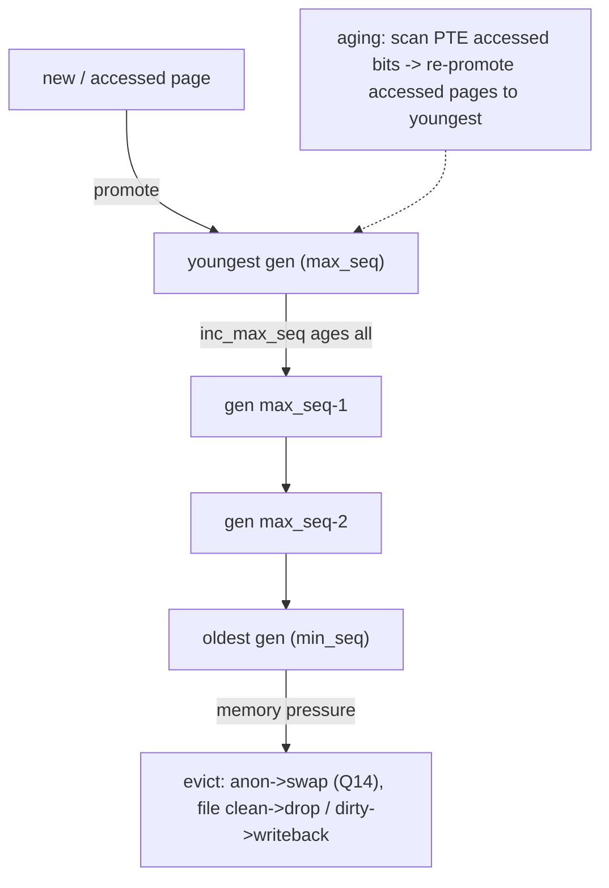

# Q15 — MGLRU: The Multi-Generational LRU

> **Subsystem:** Reclaim · **Files:** `mm/vmscan.c` (MGLRU), `include/linux/mm_inline.h`, `mm/workingset.c`, `Documentation/mm/multigen_lru.rst`
> **Interviewer is really probing (Google favorite):** Do you understand **why the classic active/
> inactive LRU is imperfect**, how **MGLRU's generations + aging/eviction** improve it, and its trade-offs?

---

## TL;DR Cheat Sheet

- **Classic reclaim** (Q-reclaim) uses two lists per type — **active/inactive** × anon/file — a
  second-chance approximation of LRU. It works but has weaknesses: **coarse** (only 2 levels), **costly
  scanning**, weak at distinguishing recently-used pages, and **rmap-heavy** aging.
- **MGLRU (Multi-Gen LRU)** replaces this with **multiple generations** (typically up to 4) per type. Each
  page sits in a **generation** representing its **age**; new/accessed pages are in the **youngest**
  generation, cold pages **age** down to the **oldest**, which is **evicted** first.
- Two engines:
  - **Aging:** periodically **increments generations** by scanning page-table **accessed bits** (a
    cheap, page-table-walk-based scan) and promoting accessed pages to the youngest gen — far cheaper than
    rmap-based reference checks.
  - **Eviction:** reclaims from the **oldest generation** (coldest pages), using **PID controllers** and
    **refault feedback** to decide anon-vs-file and how hard to reclaim.
- **Benefits:** better **working-set** identification, **lower CPU** for reclaim (accessed-bit scanning
  vs rmap), fewer **cold-page mistakes**, and **better performance under pressure** — especially for large
  memory and many processes. Big wins reported on Android, ChromeOS, and servers.
- Opt-in/tunable: `/sys/kernel/mm/lru_gen/enabled`, `min_ttl_ms`; works with **memcg** (per-cgroup
  generations) and **PSI** (Q16).

---

## The Question

> What is MGLRU and why was it introduced? How do generations, aging, and eviction work, and how does it
> improve on the classic active/inactive LRU?

---

## Why MGLRU exists

The classic active/inactive LRU (Q-reclaim) is a **two-level, second-chance** approximation of true LRU.
It has served for decades but has structural problems that hurt at modern scale:

- **Too coarse:** only **two** age levels (active/inactive). A page is either "recently used" or "not" —
  there's no gradient, so the kernel often **evicts pages that were used moderately recently** (cold-page
  mistakes → refaults → thrash) or **keeps pages that are actually cold**.
- **Expensive aging:** deciding whether a page was referenced relies on **rmap** reverse-mapping walks
  (`folio_referenced` walking every PTE that maps a page) — **CPU-heavy** under pressure, and it scales
  poorly with sharing and large memory.
- **Scanning inefficiency:** balancing the inactive/active lists and scanning them has overhead that grows
  with memory size and process count.
- **Weak feedback:** the original scheme didn't exploit **refault** information as systematically as it
  could to tune anon-vs-file and reclaim aggressiveness.

The result on big-memory, many-process systems (cloud servers, Android, ChromeOS) was **higher reclaim CPU
and worse working-set protection** — pages that should stay resident get evicted, causing refault storms
and latency.

**MGLRU rethinks the data structure and the scan.** Instead of two lists, use **N generations** (a finer
age gradient). Instead of rmap-walking to find references, **scan page-table accessed bits** in bulk
(cheap, sequential, cache-friendly) to **age** pages by bumping their generation. Reclaim always takes from
the **oldest** generation (provably coldest), and **refault feedback + PID controllers** tune the
anon/file split and pace. Net: **cheaper aging, finer age resolution, better working-set fidelity,** and
measurably better tail latency and throughput under memory pressure — which is exactly why **Google**
(ChromeOS/Android/datacenter) drove and deployed it.

---

## When MGLRU is engaged

- **Whenever reclaim runs** (kswapd, direct reclaim, proactive reclaim, memcg reclaim) with MGLRU enabled
  — it **replaces** the active/inactive scanning logic.
- **Aging** runs incrementally as pages are accessed and during reclaim, advancing generations.
- **Eviction** runs under memory pressure (same triggers as classic reclaim, Q-reclaim: watermarks,
  memcg limits, `memory.reclaim`, PSI-driven).
- Per-**memcg**: each cgroup has its own generations, so reclaim is **per-cgroup** aware (Q22).

---

## Where in the kernel

```
mm/vmscan.c               <- MGLRU: lru_gen_* (aging: inc_max_seq, scanning accessed bits;
                             eviction: evict_folios from oldest gen, PID controllers)
include/linux/mmzone.h     <- struct lru_gen_folio (per-lruvec generations, counters)
include/linux/mm_inline.h  <- generation accessors, folio_inc_gen, lru_gen_add_folio
mm/workingset.c            <- refault detection feeding MGLRU's feedback
Documentation/mm/multigen_lru.rst  <- the design doc
sysfs: /sys/kernel/mm/lru_gen/enabled, /sys/kernel/mm/lru_gen/min_ttl_ms
debugfs: /sys/kernel/debug/lru_gen (per-memcg generation state, manual aging/eviction)
```

---

## How MGLRU works — mechanics

### 1. Generations instead of two lists

Per `lruvec` (per node, per memcg) and per type (anon/file), pages are organized into a small ring of
**generations** indexed by a monotonically increasing **sequence number** (`max_seq` = youngest,
`min_seq` = oldest):

```
gen (youngest) max_seq:  [ just-allocated / recently-accessed pages ]
               max_seq-1:[ ... ]
               max_seq-2:[ ... ]
gen (oldest)   min_seq:  [ coldest pages ]  <- eviction takes from here
```
A page's **generation = its age**. Up to ~4 generations give a much finer gradient than active/inactive's
two levels, so the kernel can tell "used 1 aging-period ago" from "used 4 periods ago."

### 2. Aging — bump generations via accessed bits (the cheap scan)

Instead of rmap-walking to check references, MGLRU **walks page tables** looking at the **PTE accessed
bit** (set by hardware on access). When it finds an accessed page, it **promotes** the page to the
**youngest** generation and clears the bit. Periodically the kernel **increments `max_seq`** (creates a
new youngest generation), which effectively **ages everything** — pages not re-accessed drift toward
`min_seq`.

Why this is better: scanning **accessed bits** by walking page tables is **sequential and cache-friendly**
and touches the **mm side** directly, avoiding the **rmap reverse walks** the classic scheme needed (which
are random-access and scale badly with sharing). Aging cost drops substantially. (For pages where
page-table scanning isn't applicable, MGLRU falls back to rmap selectively.)

### 3. Eviction — reclaim the oldest generation, with feedback

Under pressure, MGLRU **evicts from `min_seq`** (the oldest generation = coldest pages) — anon pages go to
**swap** (Q14), clean file pages are dropped, dirty file pages written back (Q12). Two feedback mechanisms
tune it:

- **Refault feedback** (`mm/workingset.c`): if evicted pages **refault** quickly (they were actually
  hot), MGLRU **adjusts** — protecting that type/generation more — so it learns the real working set.
- **PID controllers:** MGLRU uses control-theory-style controllers to balance **anon vs file** reclaim and
  set the **target** so it reclaims enough without over-evicting hot memory. This replaces a lot of the
  classic scheme's heuristics with a principled feedback loop.

### 4. Per-memcg and proactive use

Generations are **per-memcg** (Q22), so reclaim respects cgroup boundaries and can be driven per-cgroup
(`memory.reclaim`, Q16). MGLRU also supports **proactive reclaim** well: userspace agents (systemd-oomd,
Android, datacenter balancers) can trigger reclaim and MGLRU's accurate aging makes proactive eviction
**target genuinely cold pages**, reducing the risk of evicting hot data (Q16).

### 5. Trade-offs and tuning

- **Pros:** lower reclaim CPU (accessed-bit scan vs rmap), finer aging, better working-set protection,
  fewer refaults, better tail latency under pressure; scales to big memory/many processes.
- **Cons/caveats:** different behavior than the classic scheme (some workloads tuned for the old LRU may
  need re-tuning); page-table scanning has its own costs on sparse/huge address spaces; still maturing in
  some corner cases.
- **Knobs:** `/sys/kernel/mm/lru_gen/enabled` (bitmask to enable features), `min_ttl_ms` (protect pages
  for a minimum time to avoid evicting too-young pages and to trigger OOM instead of thrash), debugfs for
  manual aging/eviction (great for experiments/benchmarks).

---

## Diagrams

### Generations: aging and eviction



### Classic vs MGLRU

```
classic:  [ ACTIVE ] <-> [ INACTIVE ]      (2 levels; rmap-based reference checks; coarse)
MGLRU:    [g max_seq][g-1][g-2][g min_seq]  (N levels; accessed-bit scan aging; evict oldest; refault feedback)
```

---

## Annotated C

```c
/* Per-lruvec generation bookkeeping (simplified, include/linux/mmzone.h). */
struct lru_gen_folio {
    unsigned long max_seq;     /* youngest generation sequence number */
    unsigned long min_seq[ANON_AND_FILE]; /* oldest gen per type */
    struct list_head folios[MAX_NR_GENS][ANON_AND_FILE][MAX_NR_ZONES]; /* per-gen lists */
    /* counters, refault feedback state, PID controller state ... */
};

/* Aging: create a new youngest generation (ages everything by one step). */
static bool inc_max_seq(struct lruvec *lruvec, ...);   /* mm/vmscan.c */

/* A page's generation is stored in its flags; promotion on access. */
static inline int folio_lru_gen(struct folio *folio);  /* which generation */
void folio_inc_gen(struct lruvec *lruvec, struct folio *folio, bool reclaiming); /* promote */

/* Eviction takes from the oldest generation. */
static int evict_folios(struct lruvec *lruvec, struct scan_control *sc, ...);
```

```bash
cat /sys/kernel/mm/lru_gen/enabled     # bitmask: which MGLRU features are on
echo 7 > /sys/kernel/mm/lru_gen/enabled # enable all (e.g. on older configs)
cat /sys/kernel/mm/lru_gen/min_ttl_ms
# debugfs: trigger aging/eviction per memcg for experiments
ls /sys/kernel/debug/lru_gen
```

> Senior nuance: MGLRU's two key ideas are **(1) generations = a fine age gradient** (vs two lists) and
> **(2) aging by scanning page-table accessed bits** (cheap) instead of **rmap reference walks**
> (expensive). Combined with **refault feedback + PID control**, it identifies the working set more
> accurately and reclaims the genuinely coldest pages — which is why it improves tail latency and reduces
> reclaim CPU at scale.

---

## Company Angle

- **Google (the headline):** Google authored/deployed MGLRU across **ChromeOS, Android, and datacenter**;
  expect deep questions on generations, accessed-bit aging vs rmap, refault feedback, per-memcg behavior,
  and proactive reclaim (Q16). Tail-latency and reclaim-CPU wins at fleet scale.
- **Qualcomm/Android:** MGLRU + zram (Q14) + **lmkd/PSI** (Q16) for low-RAM responsiveness; protecting the
  working set so foreground apps stay resident; `min_ttl_ms` tuning.
- **AMD/Intel (big memory):** reclaim scalability on large NUMA memory, MGLRU's lower scanning cost,
  interaction with tiering (Q21).
- **NVIDIA:** less central, but understanding modern reclaim helps with memory pressure on GPU hosts/CI.

---

## War Story

*"A memory-pressured server (many containers, large page cache + anon) suffered **refault storms** and
high **reclaim CPU** — `kswapd` ate cores and p99 latency spiked because the classic active/inactive LRU
kept **evicting pages that were quickly re-accessed** (poor working-set identification), and the
**rmap-based aging** was expensive with so much shared memory. We enabled **MGLRU**
(`/sys/kernel/mm/lru_gen/enabled`). Two things improved immediately: aging switched to **accessed-bit
page-table scanning** (far less CPU than rmap walks), and the **finer generations + refault feedback**
stopped evicting the recently-used set — refaults dropped sharply and kswapd CPU fell. We also set a small
**`min_ttl_ms`** so genuinely-young pages were protected (and, when truly out of memory, it preferred OOM
over thrashing). p99 stabilized. The interviewer's follow-up — *'why is accessed-bit scanning cheaper than
rmap?'* — let me explain rmap aging does **random-access reverse walks per page** (every PTE that maps
it), which explodes with sharing, whereas MGLRU walks page tables **sequentially** reading accessed bits —
cache-friendly and proportional to mapped memory, not to sharing degree."*

---

## Interviewer Follow-ups

1. **What's wrong with classic active/inactive LRU?** Only two age levels (coarse → cold-page mistakes/
   refaults), expensive **rmap-based** reference checking, and scanning that scales poorly with memory/
   sharing.

2. **What is a generation in MGLRU?** An age bucket; pages live in a generation by recency, from youngest
   (`max_seq`) to oldest (`min_seq`); reclaim evicts the oldest.

3. **How does aging work?** Periodically increment `max_seq` (ages everything) and **scan page-table
   accessed bits** to promote recently-used pages to the youngest generation — cheap vs rmap walks.

4. **How does eviction decide what to reclaim?** Takes pages from the **oldest** generation (coldest),
   using **refault feedback** and **PID controllers** to balance anon-vs-file and reclaim aggressiveness.

5. **Why is MGLRU cheaper?** Accessed-bit **page-table scanning** is sequential/cache-friendly and
   proportional to mapped memory, avoiding the random-access **rmap reverse walks** the classic scheme
   needs.

6. **How does MGLRU interact with memcg?** Generations are **per-cgroup**, so reclaim is memcg-aware and
   can be driven per-cgroup (`memory.reclaim`, Q16/Q22).

7. **What does `min_ttl_ms` do?** Protects pages for a minimum time so very-young pages aren't evicted; if
   memory truly can't be reclaimed, it favors **OOM over thrashing**.

8. **What feedback does it use?** **Refault** detection (workingset shadow entries) — if evicted pages
   refault fast, MGLRU protects that set more — learning the true working set.

9. **Is it always on?** It's tunable via `/sys/kernel/mm/lru_gen/enabled`; deployed by default on some
   distros/Android/ChromeOS, opt-in on others.

---

## 30-Minute Talk Track

| Min | Cover |
|-----|-------|
| 0–4 | Classic active/inactive LRU recap and its weaknesses (coarse, rmap-costly, refaults) |
| 4–9 | MGLRU idea: N generations = fine age gradient; max_seq/min_seq; per-lruvec/per-memcg |
| 9–15 | Aging: inc_max_seq + accessed-bit page-table scanning vs rmap; promotion on access |
| 15–20 | Eviction: reclaim oldest generation; anon→swap/file drop; refault feedback + PID controllers |
| 20–23 | Why cheaper & more accurate: sequential scan, finer aging, working-set fidelity |
| 23–26 | memcg integration, proactive reclaim (Q16), min_ttl_ms, enable knobs |
| 26–28 | Trade-offs/caveats; observability (debugfs lru_gen) |
| 28–30 | War story (refault storms → MGLRU) + accessed-bit-vs-rmap explanation |
