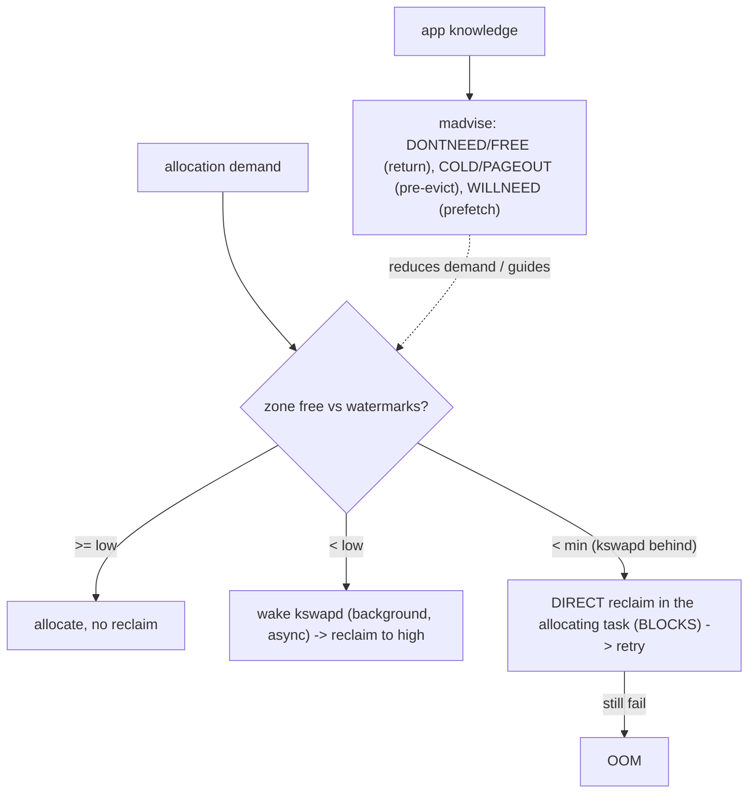

# Q17 — kswapd vs Direct Reclaim vs madvise

> **Subsystem:** Reclaim · **Files:** `mm/vmscan.c`, `mm/page_alloc.c`, `mm/madvise.c`
> **Interviewer is really probing:** Do you understand the **three ways memory gets reclaimed** —
> background (kswapd), synchronous (direct reclaim), and **application-directed (`madvise`)** — and their
> latency implications?

---

## TL;DR Cheat Sheet

- **Three reclaim modes:**
  - **kswapd (background, async):** per-NUMA-node kernel thread woken when a zone drops below its **low**
    watermark; reclaims to **high** watermark **off** the allocation path. **No app latency** (ideally).
  - **Direct reclaim (synchronous):** when an allocation can't be satisfied at **min** watermark, the
    **allocating task reclaims itself**, **blocking** in the allocation path. This is the **latency
    villain** (`allocstall` in `/proc/vmstat`).
  - **madvise (application-directed):** the app **tells the kernel** about its access pattern / intentions
    so the kernel can reclaim or prefetch **precisely** — e.g. `MADV_DONTNEED`, `MADV_FREE`, `MADV_COLD`,
    `MADV_PAGEOUT`, `MADV_WILLNEED`.
- **Goal:** keep reclaim in **kswapd** (background) and **out of direct reclaim** (synchronous) — tune
  watermarks (`watermark_scale_factor`, `min_free_kbytes`, Q7) so kswapd stays ahead of demand.
- **madvise verbs:**
  - `MADV_DONTNEED` — drop pages now (anon: zero on next touch; file: re-read). Frees immediately.
  - `MADV_FREE` — lazy free: pages **may** be reclaimed when needed; if touched again before reclaim, kept
    (cheaper than DONTNEED for malloc).
  - `MADV_COLD` — move pages to the **inactive/oldest** list (reclaim sooner) **without** freeing.
  - `MADV_PAGEOUT` — **proactively reclaim** (swap out / drop) a range now.
  - `MADV_WILLNEED` — **readahead/prefetch** a range (turn future major faults into hits, Q11).
- These build on the LRU/MGLRU (Q15), watermarks (Q7), swap (Q14), and writeback (Q12).

---

## The Question

> Compare kswapd, direct reclaim, and `madvise`-driven reclaim. When does each happen, and how do you
> keep reclaim off the latency path?

---

## Why three mechanisms exist

Reclaim has competing requirements that no single mechanism satisfies:

1. **Don't block applications:** reclaim should ideally happen **in the background** so allocations never
   wait. → **kswapd** (async, per node).
2. **Never fail an allocation if memory can be freed:** if background reclaim falls behind and an
   allocation would otherwise fail, the kernel **must** reclaim **right now**, even at the cost of
   blocking the caller. → **direct reclaim** (synchronous safety net).
3. **The kernel can't read the app's mind:** the kernel uses **access-bit heuristics** (LRU/MGLRU) to
   guess what's cold, but the **application often knows better** — "I'm done with this buffer,"
   "I won't need this until later," "free this lazily." Giving the app **explicit verbs** lets it guide
   reclaim **precisely**, avoiding both wasted residency and wrong evictions. → **`madvise`**.

So the three modes form a hierarchy: **kswapd** is the smooth common case, **direct reclaim** is the
synchronous backstop you want to **avoid** (it's where latency spikes live), and **`madvise`** is the
**application-directed** layer that can both **reduce** the need for kernel reclaim (free/cold hints) and
**improve** it (prefetch, targeted pageout). The senior skill is knowing that **direct reclaim = tail
latency**, tuning watermarks to keep reclaim in kswapd, and using `madvise` so applications cooperate with
(rather than fight) the reclaim heuristics.

---

## When each runs

| Mode | Trigger | Context | Latency |
|------|---------|---------|---------|
| **kswapd** | zone free < **low** watermark | background kthread (`kswapd<N>`) | none on app (ideal) |
| **direct reclaim** | allocation can't meet **min** | **in the allocating task** | **blocks the caller** |
| **kcompactd** | fragmentation (high-order) | background kthread | none on app (Q9) |
| **MADV_DONTNEED/FREE** | app frees memory | app context | immediate / lazy |
| **MADV_COLD/PAGEOUT** | app marks/evicts cold data | app context | proactive |
| **MADV_WILLNEED** | app prefetch | app context | hides future faults (Q11) |

---

## Where in the kernel

```
mm/vmscan.c        <- kswapd (kswapd_run, balance_pgdat), direct reclaim (try_to_free_pages),
                      shrink_node / shrink_lruvec / MGLRU eviction (Q15)
mm/page_alloc.c    <- wake_all_kswapds, __alloc_pages_direct_reclaim (slow path), allocstall stat
mm/madvise.c       <- madvise(): DONTNEED/FREE/COLD/PAGEOUT/WILLNEED handlers
mm/swap.c, swap_state.c <- pageout path for MADV_PAGEOUT / reclaim (Q14)
sysctls: vm.min_free_kbytes, vm.watermark_scale_factor, vm.swappiness (Q7/Q14)
/proc/vmstat: allocstall*, pgscan_kswapd, pgscan_direct, pgsteal_*
```

---

## How each works — mechanics

### 1. kswapd — background reclaim

Each NUMA node has a **`kswapd`** thread. When an allocation drops a zone below its **low** watermark
(Q7), `wake_all_kswapds()` wakes it. kswapd runs **`balance_pgdat()`**: it reclaims (via MGLRU/LRU
shrinking, Q15) until the zone is back above its **high** watermark, then sleeps. Because it runs in its
**own thread**, applications keep allocating from the buffer kswapd maintains — **no allocation blocks**,
ideally. kswapd also wakes **kcompactd** for high-order/fragmentation needs (Q9).

The whole point of the **low→high** gap is to give kswapd **runway**: it starts at **low** and works up to
**high**, maintaining a cushion so demand spikes are absorbed without the allocator ever hitting **min**.

### 2. Direct reclaim — the synchronous backstop

If demand outruns kswapd and an allocation can't be satisfied even at the **min** watermark, the allocator
enters the **slow path** (`__alloc_pages_slowpath`, Q8) and the **allocating task itself** calls
**`try_to_free_pages()`** — it **reclaims synchronously, in its own context**, then retries the
allocation. This **blocks** the task (it may do writeback, swap, scanning) — directly adding to **request
latency**. It's counted as **`allocstall`** / `pgscan_direct` in `/proc/vmstat`.

Direct reclaim is **correct** (it prevents premature failure/OOM) but is the **#1 source of memory-related
tail latency**. The senior goal is to **minimize** it: keep kswapd ahead by widening watermarks
(`vm.watermark_scale_factor`) and raising `min_free_kbytes` (Q7) so reclaim happens in the background
**before** allocations hit min. You can't eliminate it (it's the safety net), but a healthy system should
rarely enter it.

### 3. madvise — application-directed reclaim & prefetch

`madvise(addr, len, advice)` lets the app inform the kernel, enabling **precise** action the heuristics
can't infer:

- **`MADV_DONTNEED`** — "I don't need these pages." The kernel **drops** them immediately: anonymous pages
  are freed (next touch faults a **zero page**, Q5); file pages are dropped (re-read from cache/disk). Used
  by allocators to return memory, and to discard buffers. **Destructive** for anon (data gone).
- **`MADV_FREE`** — "I'm done, but lazily." Pages are marked **freeable**; the kernel reclaims them **only
  if it needs memory**. If the app **touches them again before reclaim**, they're **kept** (and the free is
  canceled) — cheaper than `DONTNEED` for `malloc`/allocators (no immediate fault on reuse). On reclaim,
  anon `MADV_FREE` pages are dropped **without swapping** (their contents are declared dead).
- **`MADV_COLD`** — "these are cold." Moves pages to the **inactive/oldest generation** so they're
  reclaimed **sooner**, **without** freeing them now — a hint to the LRU/MGLRU (Q15).
- **`MADV_PAGEOUT`** — "reclaim these now." **Proactively** swaps out (anon, Q14) / writes back + drops
  (file) the range immediately — useful to evict known-cold data ahead of pressure (pairs with proactive
  reclaim, Q16).
- **`MADV_WILLNEED`** — "I'll need these soon." Triggers **readahead/prefetch** (Q11) so future accesses
  are **minor** faults (hits) instead of **major** faults — the opposite of reclaim, hiding latency.
- (Others: `MADV_SEQUENTIAL`/`MADV_RANDOM` tune readahead; `MADV_HUGEPAGE`/`MADV_NOHUGEPAGE` control THP,
  Q18; `MADV_DONTDUMP`, `MADV_WIPEONFORK`, Q4.)

These verbs let well-written applications (allocators like glibc/jemalloc/tcmalloc, databases, language
runtimes) **cooperate** with reclaim — returning memory promptly (`FREE`/`DONTNEED`), pre-evicting cold
data (`COLD`/`PAGEOUT`), and prefetching hot data (`WILLNEED`) — reducing both the **need** for kernel
reclaim and the **latency** of access.

---

## Diagrams

### The reclaim spectrum



### madvise verbs

```
MADV_DONTNEED : drop NOW (anon->zero on next touch; file->re-read)         [destructive for anon]
MADV_FREE     : lazy free; reclaimed only if needed; kept if touched again [cheap for malloc]
MADV_COLD     : mark cold -> inactive/oldest gen, reclaim sooner (no free)  [hint]
MADV_PAGEOUT  : proactively swap-out/writeback the range now                [pre-evict]
MADV_WILLNEED : prefetch/readahead -> future hits, not major faults         [anti-reclaim]
```

---

## Annotated C

```c
/* Background reclaim thread per node (mm/vmscan.c). */
static int kswapd(void *p) {
    for (;;) {
        kswapd_try_to_sleep(...);          /* sleep until woken at low watermark */
        balance_pgdat(pgdat, order, ...);  /* reclaim to high watermark (MGLRU/LRU) */
    }
}

/* Direct reclaim from the allocation slow path (mm/page_alloc.c -> vmscan.c). */
unsigned long try_to_free_pages(struct zonelist *zl, int order, gfp_t gfp, ...);
/* called by the ALLOCATING task -> blocks it -> counted as allocstall */

/* Application-directed reclaim/prefetch (mm/madvise.c). */
madvise(buf, len, MADV_FREE);     /* lazy free: reclaim if needed, keep if reused */
madvise(buf, len, MADV_DONTNEED); /* drop now: anon -> zero on next touch */
madvise(buf, len, MADV_COLD);     /* age to oldest gen -> reclaim sooner (no free) */
madvise(buf, len, MADV_PAGEOUT);  /* proactively swap out / write back now */
madvise(buf, len, MADV_WILLNEED); /* prefetch -> future minor faults (Q11) */
```

```bash
grep -E 'allocstall|pgscan_kswapd|pgscan_direct|pgsteal' /proc/vmstat  # kswapd vs direct reclaim
sysctl vm.watermark_scale_factor vm.min_free_kbytes                    # keep reclaim in kswapd (Q7)
```

> Senior nuance: **`pgscan_direct`/`allocstall` climbing = you're in direct reclaim = tail latency.** The
> fix is usually watermark tuning (Q7) so kswapd stays ahead, plus **`madvise`** so apps return cold memory
> (`MADV_FREE`) and pre-evict (`MADV_PAGEOUT`) instead of letting it pile up until the allocator must
> reclaim synchronously. `MADV_FREE` vs `MADV_DONTNEED` is a classic allocator trade-off: lazy-and-cheap vs
> immediate-and-destructive.

---

## Company Angle

- **Google (the headline):** keeping reclaim in kswapd, `MADV_FREE`/`MADV_COLD`/`MADV_PAGEOUT` from
  allocators (tcmalloc) and runtimes, **proactive reclaim** (Q16) using `MADV_PAGEOUT`/`memory.reclaim`,
  measuring `allocstall` at fleet scale; MGLRU (Q15) aging accuracy.
- **Qualcomm/Android:** `MADV_FREE` from the Android allocator (Scudo/jemalloc), `MADV_COLD`/`PAGEOUT` for
  background apps, zram swap (Q14), lmkd/PSI (Q16); avoiding direct-reclaim jank on the UI thread.
- **AMD/Intel (scale):** per-node kswapd balancing, watermark tuning on large NUMA memory, direct-reclaim
  latency at scale.
- **NVIDIA (HPC/latency):** avoiding direct reclaim on latency-critical paths, `mlock`/`MADV_WILLNEED` to
  control residency, prefetching training data.

---

## War Story

*"A service had p99 latency spikes that correlated with memory churn. `/proc/vmstat` showed
**`pgscan_direct`** and **`allocstall`** climbing during the spikes — requests were hitting **direct
reclaim**, blocking in the allocator while it scanned and swapped. Two-pronged fix: (1) **watermark
tuning** — raised `vm.watermark_scale_factor` so **kswapd** woke earlier and kept a bigger free buffer,
moving reclaim **off** the request path (direct-reclaim events dropped sharply); (2) **app cooperation** —
the service cached large transient buffers, so we added **`MADV_FREE`** when buffers were returned to the
pool (lazy free — reclaimed only under pressure, kept if reused, no fault-on-reuse cost) and
**`MADV_COLD`** on known-cold caches so the LRU/MGLRU aged them out first. Together these cut the **need**
for synchronous reclaim and made any remaining reclaim target genuinely cold pages. p99 stabilized. The
interviewer's follow-up — *'why `MADV_FREE` over `MADV_DONTNEED` here?'* — let me explain `DONTNEED` frees
immediately and forces a **zero-fill fault** if the buffer is reused, whereas `MADV_FREE` is **lazy**: if
the pool reuses the buffer before reclaim, the pages are kept and there's **no fault** — ideal for an
allocator free-list."*

---

## Interviewer Follow-ups

1. **kswapd vs direct reclaim?** kswapd is **background/async** (per node, triggered at **low**, reclaims
   to **high**) and doesn't block apps; direct reclaim is **synchronous in the allocating task** at **min**
   — the latency villain (`allocstall`).

2. **How do you keep reclaim off the latency path?** Tune watermarks (`watermark_scale_factor`,
   `min_free_kbytes`, Q7) so kswapd stays ahead; use `madvise` so apps return/pre-evict cold memory.

3. **`MADV_DONTNEED` vs `MADV_FREE`?** `DONTNEED` drops pages **immediately** (anon → zero on next touch,
   destructive; forces a fault on reuse); `MADV_FREE` is **lazy** — reclaimed only if needed, kept (no
   fault) if reused — cheaper for allocators.

4. **What does `MADV_COLD` do?** Marks pages cold (moves to inactive/oldest generation) so they're
   reclaimed **sooner**, **without** freeing them now — a hint to LRU/MGLRU (Q15).

5. **What does `MADV_PAGEOUT` do?** **Proactively** reclaims a range now (swap out anon / write back +
   drop file) — useful to pre-evict cold data (pairs with proactive reclaim, Q16).

6. **What does `MADV_WILLNEED` do?** Triggers **readahead/prefetch** so future accesses are **minor**
   faults (hits) instead of **major** faults — the opposite of reclaim (Q11).

7. **How do you observe direct reclaim?** `/proc/vmstat` `allocstall*`, `pgscan_direct` vs
   `pgscan_kswapd`; PSI memory pressure (Q16) also reflects reclaim stalls.

8. **Why does direct reclaim hurt latency?** The allocating task **blocks** doing reclaim work (scanning,
   swap, writeback) inline before its allocation succeeds.

9. **How do allocators use these?** tcmalloc/jemalloc/Scudo use `MADV_FREE`/`MADV_DONTNEED` to return
   memory and `MADV_COLD`/`PAGEOUT` to release cold spans, cooperating with reclaim.

---

## 30-Minute Talk Track

| Min | Cover |
|-----|-------|
| 0–4 | Three reclaim modes and why each exists (background / synchronous backstop / app-directed) |
| 4–9 | kswapd: per-node, low→high watermark runway, balance_pgdat, no app blocking |
| 9–14 | Direct reclaim: min watermark, allocating task reclaims inline, blocks → tail latency, allocstall |
| 14–17 | Keeping reclaim in kswapd: watermark_scale_factor / min_free_kbytes tuning (Q7) |
| 17–24 | madvise verbs: DONTNEED vs FREE (lazy), COLD, PAGEOUT (pre-evict), WILLNEED (prefetch) |
| 24–27 | Allocator/runtime usage; proactive reclaim tie-in (Q16); observability (vmstat/PSI) |
| 27–30 | War story (direct-reclaim spikes → watermark + MADV_FREE/COLD) + FREE-vs-DONTNEED |
