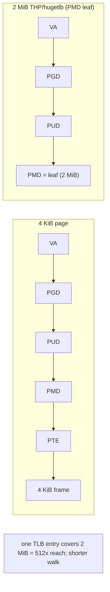
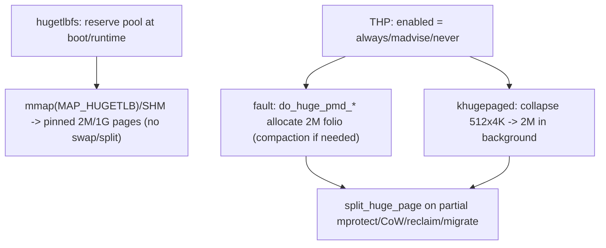

# Q18 — Hugetlbfs vs Transparent Huge Pages (THP)

> **Subsystem:** Hugepages · **Files:** `mm/hugetlb.c`, `mm/huge_memory.c`, `mm/khugepaged.c`, `fs/hugetlbfs/`
> **Interviewer is really probing (NVIDIA/AMD/Google):** Do you understand **why huge pages help (TLB
> reach)**, the **fundamental differences** between explicit hugetlb and automatic THP, and the **trade-offs**?

---

## TL;DR Cheat Sheet

- **Huge pages** map memory at **2 MiB (PMD)** or **1 GiB (PUD)** instead of 4 KiB, so **one TLB entry
  covers much more memory** → fewer TLB misses, fewer page-table levels walked (Q-page-tables) → big wins
  for large working sets (databases, GPUs, HPC, VMs).
- **Two mechanisms:**
  - **hugetlbfs (explicit):** pages **reserved at boot** (or from a persistent pool), allocated via a
    special filesystem / `MAP_HUGETLB` / SysV SHM. **Pre-reserved, pinned, never swapped, never split**.
    Deterministic but requires **admin setup** and **wastes** reserved memory if unused.
  - **THP (transparent):** the kernel **automatically** uses 2 MiB pages for anonymous memory (and now
    file/shmem) **without app changes** — allocating huge at fault time and/or **collapsing** 4 KiB pages
    into huge ones in the background via **`khugepaged`**. Convenient but **non-deterministic** (allocation
    latency from compaction, Q9; split/collapse overhead).
- **THP modes** (`/sys/kernel/mm/transparent_hugepage/enabled`): `always`, `madvise` (only on
  `MADV_HUGEPAGE` regions), `never`. **`defrag`** controls how hard THP tries to compact for a huge page.
- **Splitting:** a THP is **split** back to 4 KiB on partial `mprotect`/`munmap`, CoW of a sub-page, or
  reclaim — split overhead and **internal fragmentation** are THP's costs.
- **TLB reach** is the core "why": a TLB with N entries reaches `N × page_size` of memory; 2 MiB pages
  give **512×** the reach of 4 KiB, slashing dTLB misses for big random-access working sets.

---

## The Question

> Compare hugetlbfs and Transparent Huge Pages. Why do huge pages help, when would you use each, and what
> are the trade-offs (khugepaged, splitting, allocation latency)?

---

## Why huge pages exist

The **TLB** (translation lookaside buffer) caches virtual→physical translations so the CPU avoids a
page-table walk on every access (Q-page-tables). But the TLB is **small** (hundreds to a few thousand
entries). With 4 KiB pages, a TLB of, say, 1536 entries reaches only `1536 × 4 KiB ≈ 6 MiB` — far smaller
than the working set of a database, GPU buffer, or HPC array (gigabytes). So large-working-set,
random-access workloads **thrash the TLB**: nearly every access misses, triggering a multi-level page
walk (4–5 dependent memory loads, Q-page-tables), and can spend **10–30% of cycles** just translating
addresses.

**Huge pages attack this directly:** map memory in **2 MiB** (or **1 GiB**) chunks so **one TLB entry
covers 512× (or 262144×) more memory**. The same TLB now reaches gigabytes, TLB misses plummet, and the
page walk is also **shorter** (the walk stops at the PMD or PUD level). Secondary benefits: **less
page-table memory** (one PMD entry vs 512 PTEs) and fewer page faults (one fault maps 2 MiB).

The cost — and the reason there are **two** mechanisms with different trade-offs — is **getting contiguous
2 MiB/1 GiB physical blocks** and **managing them**:

- You need **physically contiguous, aligned** memory, which **fragmentation** (Q9) makes hard on a
  long-running system → either **pre-reserve** it (hugetlb, deterministic but wasteful) or **assemble it
  on demand via compaction** (THP, convenient but adds **latency** and **split/collapse** complexity).
- Huge pages are **coarse**: a CoW or `mprotect` on a 4 KiB sub-region forces a **split**, and partly-used
  huge pages cause **internal fragmentation**.

So **hugetlb = explicit, reserved, deterministic, pinned**; **THP = automatic, best-effort, convenient,
non-deterministic**. Choosing between them — and knowing THP's latency/splitting pitfalls — is the senior
discussion.

---

## When to use each

| Need | Choice |
|------|--------|
| Deterministic, guaranteed huge pages (DB SGA, VM backing, GPU pinned buffers) | **hugetlbfs** (reserve a pool) |
| 1 GiB pages, never-swap, never-split, pinned | **hugetlbfs** (gigantic pages) |
| Transparent speedup with **no app changes** | **THP** (`always` or `madvise`) |
| App knows which regions benefit | **THP** `madvise` + `MADV_HUGEPAGE` on those regions |
| Latency-sensitive, can't tolerate compaction stalls | **hugetlb** (pre-reserved) or **THP** `madvise`/`defrag=defer` |
| Avoid huge pages (memory-tight / latency-sensitive small allocations) | THP `never` / `MADV_NOHUGEPAGE` |

---

## Where in the kernel

```
mm/hugetlb.c          <- hugetlbfs pool, reservation, hugepage_subpool, never-swap/never-split semantics
fs/hugetlbfs/inode.c  <- the hugetlbfs filesystem, MAP_HUGETLB
mm/huge_memory.c      <- THP: do_huge_pmd_anonymous_page, split_huge_page, CoW of THP
mm/khugepaged.c       <- background collapse of 4KiB pages into 2MiB THPs
mm/memory.c           <- fault paths choosing huge vs base pages
sysfs: /sys/kernel/mm/transparent_hugepage/{enabled,defrag,shmem_enabled}
       /sys/kernel/mm/hugepages/hugepages-2048kB/nr_hugepages (and 1048576kB for 1GiB)
/proc/meminfo: HugePages_Total/Free/Rsvd, AnonHugePages, ShmemHugePages
```

---

## How each works — mechanics

### 1. TLB reach (the shared "why")

```
TLB reach = (number of TLB entries) × (page size)
  4 KiB pages:  1536 entries × 4 KiB   ≈ 6 MiB reach
  2 MiB pages:  1536 entries × 2 MiB   ≈ 3 GiB reach   (512× more!)
  1 GiB pages:  fewer entries × 1 GiB  ≈ TiB reach
=> for a multi-GiB random-access working set, huge pages turn ~every-access TLB misses into hits.
```

### 2. hugetlbfs — explicit, reserved

- **Reservation:** an admin sets a **pool** of huge pages — at boot (`hugepages=` / `default_hugepagesz=`)
  or at runtime (`echo N > .../nr_hugepages`). These pages are **carved out** of the buddy allocator into
  a **persistent hugetlb pool**. Reserving early avoids fragmentation (Q9) preventing the allocation.
- **Use:** map them via the **hugetlbfs** filesystem, **`mmap(MAP_HUGETLB)`**, or **SysV SHM
  (`SHM_HUGETLB`)**. Databases (Oracle SGA, PostgreSQL `huge_pages`), VMs (QEMU `-mem-path`), and DPDK use
  this.
- **Semantics:** hugetlb pages are **pinned** — **never swapped**, **never split**, **never compacted/
  migrated** (except deliberately). Allocation is **deterministic** (from the reserved pool) but the
  reserved memory is **unavailable to anything else**, even when unused → **waste** if oversized.
- **1 GiB ("gigantic") pages:** reserved at boot (can't reliably allocate order-18 contiguous at runtime);
  used for VMs/HPC needing maximum TLB reach.

### 3. THP — transparent, automatic

THP gives huge-page benefits **without app changes** via two paths:

- **Fault-time allocation:** on an anonymous fault in a suitably-aligned 2 MiB region,
  **`do_huge_pmd_anonymous_page`** tries to allocate a **2 MiB folio** and map it at the **PMD** level in
  one fault (Q3). If a contiguous 2 MiB block isn't available, it may trigger **compaction** (Q9) or fall
  back to a 4 KiB page (`thp_fault_fallback`).
- **Background collapse (`khugepaged`):** a kernel thread scans address spaces for runs of **512 contiguous,
  present, suitable 4 KiB pages** and **collapses** them into a single 2 MiB THP (allocating a huge page,
  copying, remapping at the PMD, freeing the 4 KiB pages). This **retrofits** huge pages onto memory that
  was faulted in as base pages.

**Modes** (`transparent_hugepage/enabled`): `always` (THP everywhere eligible), `madvise` (only regions
marked `MADV_HUGEPAGE`), `never`. **`defrag`** (`always`/`defer`/`madvise`/`never`) controls how hard the
fault path **compacts** to get a huge page — the key **latency** knob (synchronous compaction at fault =
stalls). THP now also covers **file/shmem** (tmpfs) and there's work on **multi-size/large folios**.

### 4. Splitting — THP's cost

A 2 MiB THP must be **split** back into 512 × 4 KiB pages when something needs **sub-page granularity**:

- partial **`munmap`/`mprotect`** of a sub-range,
- **CoW** of a single sub-page after fork (Q4) (`do_huge_pmd_wp_page` may split),
- **reclaim/swap** (a THP can't be partially swapped — it's split first),
- **migration**/NUMA balancing of sub-pages (Q20).

`split_huge_page` is **non-trivial** overhead, and partly-used THPs cause **internal fragmentation** (2 MiB
allocated for 4 KiB of real data). These are why `always` THP can **hurt** some workloads (write-sparse,
fork-heavy) and why `madvise` mode exists.

### 5. The trade-off summary

```
hugetlb:  + deterministic, never swap/split, max TLB reach, 1GiB pages
          - admin setup, reserved memory wasted if unused, not demand-driven, pinned
THP:      + automatic, no app changes, demand-driven, retrofits via khugepaged
          - allocation latency (compaction at fault), split/collapse overhead,
            internal fragmentation, non-deterministic (can hurt latency-sensitive workloads)
```

---

## Diagrams

### Why huge pages: page walk + TLB



### hugetlb vs THP



---

## Annotated C / interfaces

```c
/* THP anonymous fault (mm/huge_memory.c): map a 2 MiB folio at the PMD level. */
vm_fault_t do_huge_pmd_anonymous_page(struct vm_fault *vmf);

/* Split a huge page back to base pages (the cost). */
int split_huge_page_to_list(struct page *page, struct list_head *list);

/* khugepaged collapse (mm/khugepaged.c): 512 x 4K -> one 2M THP. */
static void collapse_huge_page(struct mm_struct *mm, unsigned long address, ...);
```

```bash
# THP control:
cat  /sys/kernel/mm/transparent_hugepage/enabled     # [always] madvise never
echo madvise > /sys/kernel/mm/transparent_hugepage/enabled
cat  /sys/kernel/mm/transparent_hugepage/defrag      # always defer defer+madvise madvise never
grep -E 'AnonHugePages|ShmemHugePages|thp' /proc/meminfo
grep thp /proc/vmstat        # thp_fault_alloc, thp_fault_fallback, thp_collapse_alloc, thp_split_*

# hugetlb (explicit) pool:
echo 1024 > /sys/kernel/mm/hugepages/hugepages-2048kB/nr_hugepages   # 1024 x 2 MiB
grep Huge /proc/meminfo                                              # HugePages_Total/Free/Rsvd
# app: mmap(..., MAP_HUGETLB, ...) or mount -t hugetlbfs

# Per-region THP hint:
madvise(addr, len, MADV_HUGEPAGE);    /* opt this region in (madvise mode) */
madvise(addr, len, MADV_NOHUGEPAGE);  /* opt out */
```

> Senior nuance: huge pages are a **TLB-reach** optimization, and the central tension is **getting
> contiguous 2 MiB/1 GiB blocks** (Q9) vs **managing coarse granularity** (split/fragmentation). hugetlb
> solves contiguity by **pre-reserving** (deterministic, wasteful, pinned); THP solves it by **compaction
> + khugepaged** (convenient, but latency from synchronous compaction and overhead from split/collapse).
> `defrag` and `madvise` mode are how you tame THP's latency.

---

## Company Angle

- **NVIDIA (GPU/HPC — headline):** pinned hugetlb buffers for GPU/DMA (max TLB reach, never swapped/
  migrated), 1 GiB pages for HPC; IOMMU/IOTLB also benefits from huge mappings (Q-DMA); THP for app heaps.
- **AMD/Intel (large memory):** THP at scale, NUMA placement of huge pages (Q20), compaction latency (Q9),
  1 GiB pages for VMs, dTLB-miss reduction (`perf stat` dTLB-load-misses).
- **Google (the latency trade-off):** THP `always` causing **tail-latency spikes** (synchronous compaction
  + split/collapse), hence `madvise`/`defer` policies at fleet scale; measuring `thp_fault_fallback`/
  `thp_split_*`; file/shmem THP.
- **Qualcomm (mobile):** THP usually **off/madvise** on memory-tight devices (internal fragmentation
  hurts); hugepages for specific buffers; TLB reach on ARM.

---

## War Story

*"A database's p99 latency **got worse** after we expected THP to help. `grep thp /proc/vmstat` told the
story: high **`thp_fault_fallback`** and frequent **`thp_split_page`** — the DB's access pattern wrote
**sparsely** within 2 MiB regions and did lots of **CoW after fork** (Q4), so THPs were constantly being
**allocated, then split** back to 4 KiB, plus the **fault-time compaction** (`defrag=always`) added
synchronous stalls when contiguous 2 MiB blocks were scarce (Q9). For this workload THP `always` was
**net negative** — split/collapse churn + compaction latency outweighed TLB savings. Fixes: (1) set THP to
**`madvise`** and had the DB call **`MADV_HUGEPAGE`** only on its large, densely-accessed buffer pool (the
SGA-like region) where huge pages genuinely help, leaving sparse/forked regions as 4 KiB; (2) for the most
latency-critical, always-huge region, switched to **explicit hugetlbfs** (pre-reserved, **never split,
never compacted**) for **determinism**. p99 recovered and TLB misses dropped on the hot region. The
interviewer's follow-up — *'why is hugetlb more deterministic than THP?'* — let me explain hugetlb pages
are **pre-reserved and pinned** (no fault-time compaction, no split, no swap), so there's **no
runtime allocation latency or churn** — you pay once at reservation."*

---

## Interviewer Follow-ups

1. **Why do huge pages help?** They increase **TLB reach** (one entry covers 2 MiB/1 GiB → 512×/262144×
   more), cutting TLB misses and shortening page walks for large working sets.

2. **hugetlbfs vs THP — core difference?** hugetlb = **explicit, pre-reserved, pinned** (never swap/split,
   deterministic, admin-managed); THP = **automatic/transparent** (demand-allocated + khugepaged collapse,
   convenient but non-deterministic).

3. **What are the THP modes?** `enabled` = always / madvise / never; `defrag` controls how hard the fault
   path compacts for a huge page (the latency knob).

4. **What is khugepaged?** A background thread that **collapses** 512 contiguous 4 KiB pages into a 2 MiB
   THP, retrofitting huge pages onto base-page memory.

5. **When/why is a THP split?** On partial `mprotect`/`munmap`, sub-page CoW (Q4), reclaim/swap, or
   migration — `split_huge_page` is overhead and partly-used THPs waste memory (internal fragmentation).

6. **Why can THP `always` hurt latency?** Fault-time **compaction** stalls (Q9) and **split/collapse**
   churn for sparse/forked workloads can outweigh TLB savings — hence `madvise`/`defer`.

7. **Why pre-reserve hugetlb (esp. 1 GiB)?** Fragmentation makes large contiguous allocation unreliable at
   runtime (Q9); reserving early (at boot for 1 GiB) guarantees availability — at the cost of wasted RAM
   if unused.

8. **Are hugetlb pages swappable?** No — they're **pinned**, never swapped, never split, never migrated
   (deterministic, but they occupy RAM regardless).

9. **How do you measure the benefit?** `perf stat` **dTLB-load-misses** / `dtlb_load_misses.walk_active`
   before/after; `/proc/vmstat` `thp_*`; `/proc/meminfo` `AnonHugePages`/`HugePages_*`.

---

## 30-Minute Talk Track

| Min | Cover |
|-----|-------|
| 0–4 | TLB reach problem; 4 KiB thrashes TLB for GiB working sets; huge pages = 512× reach + shorter walk |
| 4–8 | The contiguity/granularity tension → two mechanisms with different trade-offs |
| 8–13 | hugetlbfs: reserve pool (boot/runtime), MAP_HUGETLB/SHM, pinned, never swap/split, 1 GiB pages |
| 13–19 | THP: fault-time 2 MiB folios (do_huge_pmd_*), khugepaged collapse, enabled/defrag modes |
| 19–23 | Splitting: when/why (mprotect/CoW/reclaim/migrate), internal fragmentation, overhead |
| 23–26 | Trade-off table; when each; madvise(MADV_HUGEPAGE/NOHUGEPAGE) |
| 26–28 | Observability: perf dTLB misses, /proc/vmstat thp_*, meminfo |
| 28–30 | War story (THP split/compaction hurt DB → madvise + hugetlb) + determinism point |
