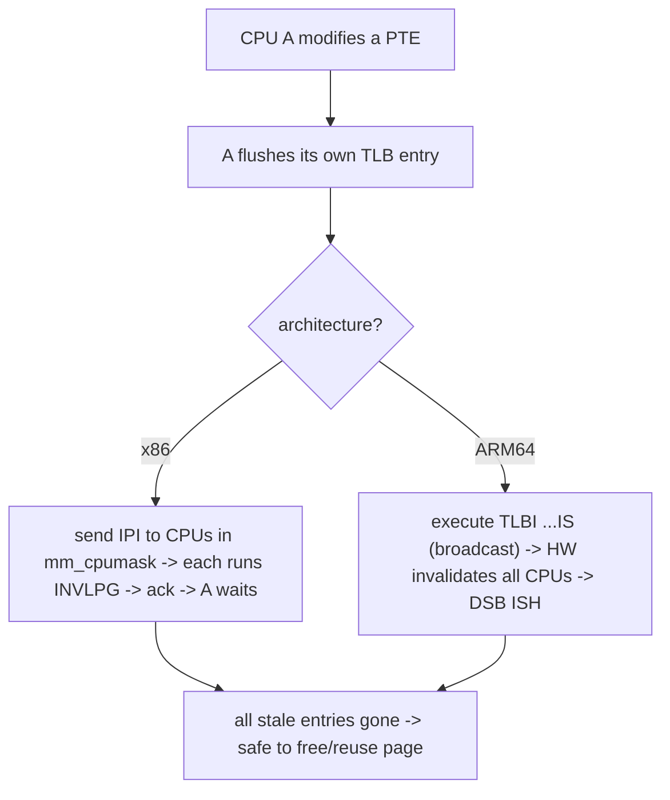

# Q19 — TLB Shootdown and mmu_gather

> **Subsystem:** TLB / Page Tables · **Files:** `mm/mmu_gather.c`, `arch/*/mm/tlb*.c`, `include/asm-generic/tlb.h`, `mm/rmap.c`
> **Interviewer is really probing (NVIDIA/AMD/Qualcomm):** Do you understand why **stale TLB entries** are
> dangerous, how **TLB shootdown** works across CPUs (IPIs vs ARM broadcast), and how **mmu_gather** batches it?

---

## TL;DR Cheat Sheet

- The **TLB caches VA→PA translations per CPU**. When the kernel **changes or removes a PTE** (unmap,
  `mprotect`, migration, swap-out, CoW), other CPUs may still hold **stale** TLB entries pointing at the
  **old** translation → they'd access **wrong/freed** memory. So the kernel must **invalidate** those
  entries — a **TLB flush**.
- On SMP, a PTE change on CPU A must invalidate the **same VA on every other CPU** that might have it
  cached — a **TLB shootdown**:
  - **x86:** the initiator sends an **IPI** (inter-processor interrupt) to the other CPUs, which execute
    `INVLPG`/flush locally. IPIs are **expensive** (interrupt + cross-CPU sync).
  - **ARM64:** has **broadcast TLB invalidate** instructions (**`TLBI ... IS`**, inner-shareable) that
    invalidate matching entries on **all** CPUs **in hardware** — no IPI needed (much cheaper).
- **`mmu_gather`** batches TLB flushes and page frees during teardown (munmap/exit/zap): instead of
  flushing + freeing **per PTE**, it **accumulates** changed ranges and freed pages, then does **one**
  flush and frees in bulk → far fewer shootdowns. Also enables **deferred/batched** unmap.
- **ASID/PCID** (Q-page-tables) tag TLB entries by address space so context switches don't flush
  everything; shootdown still needed for **shared** mappings and same-address-space changes on other CPUs.
- TLB shootdown is a **scalability bottleneck** at high core counts (IPI storms) — a major perf topic.

---

## The Question

> What is a TLB shootdown and why is it needed? How does it differ on x86 vs ARM64, and how does
> `mmu_gather` reduce its cost?

---

## Why TLB shootdown exists

The **TLB** is a per-CPU cache of page-table translations (Q-page-tables) — without it, every memory access
would require a multi-level page walk. But a cache introduces a **coherence problem**: the TLB is **not
automatically kept consistent** with the page tables by hardware (unlike CPU data caches, which snoop).
When software **modifies a PTE**, the hardware TLBs that already cached the **old** value don't know.

This is dangerous because a stale TLB entry means a CPU translates a VA to a **physical page that's no
longer valid** for that mapping:

- **Unmap/free (munmap, exit, reclaim):** the physical page is **freed and reused** for something else; a
  CPU with a stale TLB entry would **read/write another allocation's memory** → corruption / info leak.
- **`mprotect` (e.g. make read-only):** a stale **writable** entry would let a CPU **write** to a page that
  should now trap → CoW/protection broken.
- **Migration/compaction (Q9), swap-out (Q14), CoW (Q4):** the page moves or its permissions change; stale
  entries point at the **old** location/permissions.

So **whenever the kernel changes a PTE, it must invalidate the corresponding TLB entries on every CPU that
could have cached them** — that cross-CPU invalidation is the **TLB shootdown**. The senior angle is that
shootdown is **expensive** (especially x86 IPIs) and a **scalability wall** at high core counts, so the
kernel works hard to **batch** (mmu_gather), **avoid** (ASID/PCID, lazy TLB), and **offload to hardware**
(ARM broadcast `TLBI`) — and getting flushing **wrong** is either a **correctness bug** (stale → corruption)
or a **performance bug** (over-flushing).

---

## When a TLB flush / shootdown happens

| Operation | Why flush needed |
|-----------|------------------|
| `munmap` / process `exit` / `zap_pte_range` | pages freed → invalidate before reuse |
| `mprotect` (perm change) | stale permissions would bypass protection |
| page **migration** / compaction (Q9) | PTE repointed to new frame |
| **swap-out** (Q14) | PTE becomes a swap entry; old translation invalid |
| **CoW** (Q4) | writer's PTE now points to a private copy |
| **THP split/collapse** (Q18) | PMD ↔ PTE mappings change |
| kernel mapping changes (vmalloc, etc.) | shared across all CPUs → broadcast |

---

## Where in the kernel

```
mm/mmu_gather.c            <- struct mmu_gather, tlb_gather_mmu, tlb_remove_page, tlb_finish_mmu (batching)
include/asm-generic/tlb.h  <- the generic mmu_gather API, batching policy
arch/x86/mm/tlb.c          <- flush_tlb_mm_range, native_flush_tlb_*, IPI-based shootdown, PCID
arch/arm64/mm/...          <- TLBI instructions (broadcast, inner-shareable), ASID
mm/rmap.c                  <- try_to_unmap/migrate -> per-PTE flush coordination (Q-rmap)
kernel/sched/ (lazy TLB)   <- lazy TLB mode for kernel threads (avoid needless flushes)
```

---

## How it works — mechanics

### 1. The basic shootdown

When CPU A changes a PTE in an address space mapped by CPUs A, B, C:

```
CPU A: modify PTE (e.g. clear it for unmap)
CPU A: flush its own TLB entry (INVLPG / local TLBI)
CPU A: must invalidate the SAME entry on B and C:
   x86  -> send IPI to B,C -> their handler runs INVLPG -> ack -> A waits for acks
   ARM64-> execute "TLBI VAE1IS, <addr>" -> hardware invalidates on ALL inner-shareable CPUs (no IPI)
```
A only needs to shoot down CPUs that **actually have the mm active** (tracked via `mm_cpumask`), not all
CPUs — an important optimization. The initiator typically **waits** for completion (acks on x86; a `DSB`
barrier on ARM) before reusing/freeing the page, so no CPU can touch it via a stale entry.

### 2. x86 — IPI-based shootdown

x86 has **no broadcast TLB invalidate**, so the kernel sends **IPIs** (`flush_tlb_mm_range` →
`smp_call_function_many`) to the relevant CPUs, each running `INVLPG` (single page) or a full flush. IPIs
are **costly**: an interrupt on each target CPU, plus the initiator **spinning** until all **ack**. At high
core counts with frequent unmaps, this becomes an **IPI storm** — a well-known scalability bottleneck.
**PCID** (Q-page-tables) helps by tagging entries so context switches don't flush, but **shootdowns for
actual PTE changes** still need IPIs. x86 also uses **`INVPCID`** and tracks generations to flush minimally.

### 3. ARM64 — hardware broadcast

ARM64 provides **`TLBI`** instructions with an **inner-shareable (IS)** scope that invalidate matching
entries on **all CPUs in the inner-shareable domain in hardware** — no IPI, no software cross-call. e.g.
`TLBI VAE1IS, Xt` invalidates a VA (by ASID) across all CPUs; a `DSB ISH` then ensures completion. This
makes ARM TLB maintenance **much cheaper and more scalable** than x86 IPIs — a frequently-cited ARM
advantage (and a Qualcomm/ARM interview point). ARM also has **range** TLBI (`TLBI RVA*`) to invalidate a
range in one instruction.

### 4. mmu_gather — batching the cost

Tearing down a large mapping (munmap of GBs, process exit) touches **thousands of PTEs**. Flushing the TLB
and freeing the page **per PTE** would mean thousands of shootdowns and frees. **`mmu_gather`** batches
this:

```c
struct mmu_gather tlb;
tlb_gather_mmu(&tlb, mm);                 /* start a batch */
/* walk PTEs in the range: */
   for each PTE: clear it; tlb_remove_page(&tlb, page);  /* accumulate freed pages + dirty range */
tlb_finish_mmu(&tlb);                     /* ONE TLB flush for the whole range, then bulk-free pages */
```
- It **accumulates** the **range** of changed addresses and a **list of pages to free**, then issues **one**
  TLB flush (`tlb_flush`) covering the whole range and frees the pages **in bulk** (often via RCU/batched
  free, since page-table pages must outlive any in-progress walk).
- It chooses **full-mm flush vs range flush** based on how much changed (a huge unmap may just flush the
  whole ASID rather than thousands of single-page invalidations — sometimes a **full flush is cheaper**
  than many precise ones).
- Page-table **page freeing** is deferred and coordinated (so a concurrent software/hardware walker doesn't
  use a freed table — ties to RCU page-table freeing, Q23).

Result: a munmap of N pages does **O(1)** shootdowns instead of **O(N)** — dramatically less cross-CPU
traffic.

### 5. Avoiding flushes: ASID/PCID and lazy TLB

- **ASID/PCID** tag TLB entries by address space so a **context switch** doesn't flush the TLB (Q-page-
  tables) — only **actual PTE changes** require shootdown.
- **Lazy TLB mode:** when running a **kernel thread** (no user address space), the CPU can keep the
  previous mm's tables loaded and **skip** TLB flushes it doesn't need, only catching up if it switches to
  a real user mm. Reduces needless flushes on idle/kernel CPUs.
- **`mm_cpumask`:** only CPUs that have the mm active are shot down, not the whole machine.

### 6. The deferred-flush correctness rule

The golden rule: **never let a page be reused while a stale TLB entry could reach it.** So the sequence is
always **change PTE → flush TLB (shootdown) → only then free/reuse the page**. mmu_gather enforces this by
flushing **before** releasing the gathered pages. Getting the order wrong (free before flush) is a
**use-after-free via stale TLB** — a subtle, severe bug.

---

## Diagrams

### Shootdown: x86 vs ARM64



### mmu_gather batching

```
per-PTE (naive):   clear PTE -> flush TLB -> free page   (x N PTEs => N shootdowns)   SLOW
mmu_gather:        clear PTEs..accumulate range+pages..  -> ONE flush -> bulk free    FAST
                   (full-mm flush if the range is huge)
```

---

## Annotated C

```c
/* Batching teardown: gather changes, flush once, free in bulk (include/asm-generic/tlb.h). */
struct mmu_gather tlb;
tlb_gather_mmu(&tlb, mm);
/* mm/memory.c zap_pte_range walks PTEs: */
    pte_t old = ptep_get_and_clear(mm, addr, pte);  /* remove the mapping */
    tlb_remove_tlb_entry(&tlb, pte, addr);          /* record VA range to flush */
    tlb_remove_page(&tlb, page);                    /* queue page for bulk free */
tlb_finish_mmu(&tlb);   /* -> tlb_flush(): ONE shootdown for the range; then free queued pages */

/* x86 shootdown (IPI-based). */
void flush_tlb_mm_range(struct mm_struct *mm, unsigned long start, unsigned long end, ...);
/* -> smp_call_function_many(mm_cpumask(mm), flush_tlb_func, ...) -> INVLPG on each, wait acks */

/* ARM64: broadcast invalidate (no IPI), then barrier. */
/*   __tlbi(vae1is, addr_asid);  dsb(ish);  isb();  */
```

> Senior nuance: the two things to nail are **(1) correctness** — change PTE, **shoot down**, *then* reuse
> the page (mmu_gather flushes **before** freeing); and **(2) cost** — x86 pays **IPIs** (scaling pain),
> ARM64 uses **broadcast `TLBI`** (cheap), and **mmu_gather** turns O(N) shootdowns into O(1) for bulk
> teardown. ASID/PCID + lazy TLB + `mm_cpumask` minimize **which** CPUs and **how often** you flush.

---

## Company Angle

- **NVIDIA/AMD (many-core/perf — headline):** TLB-shootdown **IPI storms** as a scalability bottleneck on
  high-core x86; `perf`/ftrace showing time in `flush_tlb_func`/`smp_call_function`; mmu_gather batching;
  huge pages (Q18) reducing the number of mappings to flush; IOMMU/IOTLB shootdown for device translations.
- **Qualcomm/ARM (the broadcast advantage):** ARM64 **`TLBI ...IS`** broadcast vs x86 IPIs, ASID
  management, range TLBI, why ARM TLB maintenance scales better; SoC-level inner-shareable domains.
- **Google (scale):** munmap/exit-heavy workloads (containers, fork/exec) generating shootdown load;
  batching, lazy TLB, and huge pages to cut it; measuring shootdown cost at fleet scale.
- **All:** the **correctness rule** (flush before reuse) and ASID/PCID/lazy-TLB as flush-avoidance.

---

## War Story

*"A high-core-count x86 service degraded sharply as we scaled threads — `perf record` showed a huge chunk
of time in **`smp_call_function_many`** and **`flush_tlb_func`**: **TLB-shootdown IPI storms**. The
workload did frequent **`munmap`** of medium buffers across many threads sharing one address space, so each
unmap **IPI'd every CPU** in the mm's `mm_cpumask` to invalidate — and with dozens of cores, the
cross-CPU interrupt + ack traffic dominated. Fixes: (1) reduced unmap frequency by **pooling/reusing**
buffers (and using **`MADV_FREE`** instead of `munmap` where possible, Q17 — `MADV_FREE` avoids immediate
unmap/shootdown), and (2) backed the large buffers with **2 MiB huge pages** (Q18) so one mapping covered
512× the memory → far fewer PTEs to change and **far fewer shootdowns**. Shootdown CPU dropped
dramatically. The interviewer's follow-up — *'would this be as bad on ARM64?'* — let me explain ARM64 uses
**broadcast `TLBI ...IS`** (hardware invalidates all CPUs, **no IPIs**), so the same pattern is much cheaper
there; the IPI storm is largely an **x86** problem, which is why TLB shootdown comes up so often in x86
many-core scaling."*

---

## Interviewer Follow-ups

1. **What is a TLB shootdown and why needed?** Cross-CPU invalidation of stale TLB entries after a PTE
   change; without it, other CPUs would translate a VA to a freed/old physical page → corruption/protection
   bypass.

2. **Why isn't the TLB kept coherent in hardware?** Unlike data caches, TLBs don't snoop page-table writes;
   software must explicitly invalidate after modifying PTEs.

3. **x86 vs ARM64 shootdown?** x86 sends **IPIs** (each target runs `INVLPG`, initiator waits for acks) —
   expensive; ARM64 uses **broadcast `TLBI ...IS`** in hardware (no IPI) — cheap and scalable.

4. **What does mmu_gather do?** Batches teardown — accumulate the changed range + freed pages, do **one**
   TLB flush, then bulk-free — turning O(N) shootdowns into O(1) for large unmaps.

5. **What's the correctness ordering rule?** Change PTE → **flush TLB (shootdown)** → only then free/reuse
   the page; mmu_gather flushes before releasing gathered pages.

6. **How do ASID/PCID help?** They tag TLB entries by address space so **context switches** don't flush;
   shootdowns are still needed for **actual PTE changes** and shared mappings.

7. **What is lazy TLB mode?** When running a kernel thread (no user mm), a CPU can skip TLB flushes it
   doesn't need, avoiding needless work.

8. **How do huge pages reduce shootdown cost?** Fewer, larger mappings → fewer PTEs to change/invalidate
   per unmap (Q18).

9. **When might a full-mm flush beat per-page?** When a huge range changes, flushing the whole ASID once is
   cheaper than thousands of single-page invalidations — mmu_gather makes this choice.

---

## 30-Minute Talk Track

| Min | Cover |
|-----|-------|
| 0–4 | TLB caches translations per CPU; not HW-coherent with page tables; stale = corruption |
| 4–8 | When flush needed: unmap/exit, mprotect, migrate, swap, CoW, THP split |
| 8–12 | The shootdown: change PTE, flush local, invalidate other CPUs; mm_cpumask scope; wait-for-completion |
| 12–16 | x86: IPI-based (smp_call_function + INVLPG), cost, IPI storms; PCID/INVPCID |
| 16–20 | ARM64: broadcast TLBI ...IS (no IPI), DSB ISH, range TLBI, ASID — scalability advantage |
| 20–25 | mmu_gather: batch range + pages, one flush, bulk free; full vs range flush; correctness ordering |
| 25–28 | Flush avoidance: ASID/PCID, lazy TLB, huge pages reducing mappings |
| 28–30 | War story (x86 munmap IPI storm → pooling + huge pages) + ARM contrast |
