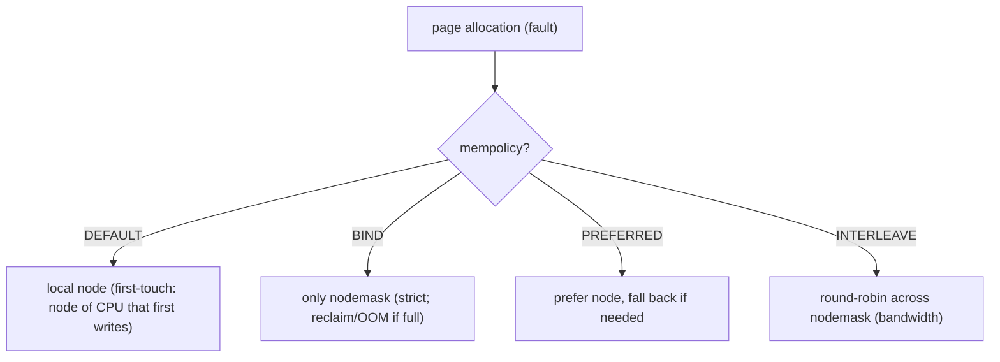
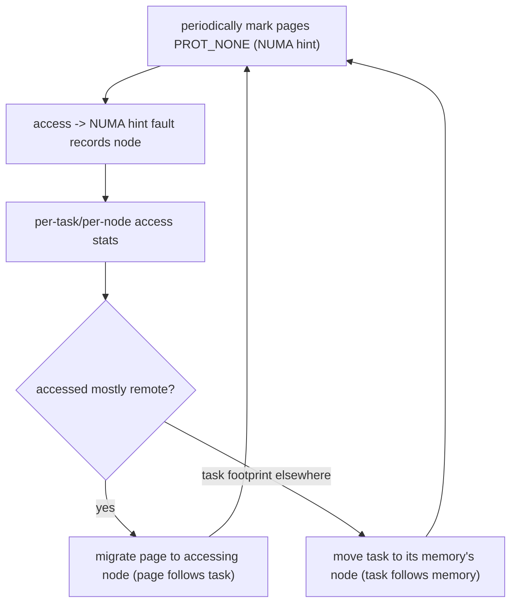

# Q20 — NUMA Memory Policy & AutoNUMA Balancing

> **Subsystem:** NUMA · **Files:** `mm/mempolicy.c`, `mm/migrate.c`, `kernel/sched/fair.c` (task_numa_*), `mm/huge_memory.c`
> **Interviewer is really probing (AMD favorite):** Do you understand **NUMA distance/locality**, the
> **memory policies** (`mbind`/`set_mempolicy`), and how **AutoNUMA** migrates pages/tasks for locality?

---

## TL;DR Cheat Sheet

- **NUMA (Non-Uniform Memory Access):** memory is attached to **nodes** (sockets/dies); a CPU accesses its
  **local** node's RAM faster (lower latency, higher bandwidth) than a **remote** node's. **Locality**
  (keep a task's memory on the node it runs on) is the central goal.
- **NUMA memory policy** lets you control **where pages are allocated**:
  - **`MPOL_DEFAULT`** — allocate on the **local** node (node of the faulting CPU). Default.
  - **`MPOL_BIND`** — allocate **only** from a specified nodemask (strict; fail/OOM if exhausted).
  - **`MPOL_PREFERRED`** — prefer a node, **fall back** to others if needed.
  - **`MPOL_INTERLEAVE`** — round-robin pages across nodes (bandwidth/avoiding hotspots).
  - **`MPOL_PREFERRED_MANY`** (newer) — prefer a **set** of nodes.
  Set per-process (`set_mempolicy`), per-VMA/range (`mbind`), or per-thread; `numactl` is the userspace
  front-end.
- **Allocation** consults policy + the **zonelist** (Q7): local node first, then remote by **node distance**
  (SLIT/`/sys/devices/system/node/nodeX/distance`).
- **AutoNUMA (NUMA balancing):** the kernel **samples** memory access by periodically marking pages
  `PROT_NONE` (NUMA hint faults), learns **which node accesses each page**, and **migrates pages to the
  accessing node** and/or **moves the task to its memory's node** — automatically improving locality with
  **no app changes**. Tunable via `kernel.numa_balancing`.
- **First-touch policy:** with default policy, a page is placed on the node of the CPU that **first writes
  it** — so *where you initialize data matters* (a classic HPC pitfall).

---

## The Question

> Explain NUMA memory policies (`mbind`/`set_mempolicy`) and AutoNUMA balancing. How does the kernel decide
> where to place pages, and how does it improve locality automatically?

---

## Why NUMA policy and balancing exist

On a **multi-socket / multi-die** machine (AMD EPYC chiplets, multi-socket Xeon, large ARM servers), RAM is
physically partitioned across **NUMA nodes**. Accessing **local** memory might take ~80 ns; **remote**
memory (across the interconnect — Infinity Fabric, UPI) can be **1.5–2.5×** slower and lower bandwidth. For
**memory-bound** workloads, whether data is local or remote can **dominate** performance.

The kernel must therefore answer two questions well:

1. **Where to allocate a page?** By default, **local to the faulting CPU** (first-touch) is best — but
   sometimes you want **interleaving** (spread for bandwidth/avoid one node's memory controller saturating)
   or **binding** (pin a latency-critical dataset to specific nodes). That's what **NUMA memory policy**
   (`mbind`/`set_mempolicy`/`numactl`) provides — explicit control.
2. **What if placement turns out wrong?** A task may **migrate** to another CPU (scheduler load balancing),
   or it allocated memory on the "wrong" node, leaving lots of **remote** accesses. The kernel can't know
   the access pattern up front. **AutoNUMA** observes **actual accesses** and **fixes locality
   dynamically** — migrating pages to the task and/or the task to its pages — **without** the app doing
   anything.

So there are **two layers**: **explicit policy** (the app/admin knows best — bind, interleave) and
**automatic balancing** (the kernel learns and corrects). The senior insight, echoing scheduling (load
balancing): **for memory-bound NUMA workloads, locality often beats raw utilization** — an idle remote core
or remote page is worse than a busy local one. Knowing the policies, first-touch, and how AutoNUMA's hint
faults work (and when to **disable** it because explicit binding is better) is the AMD/Intel-favorite深 dive.

---

## When NUMA placement matters / policies apply

| Situation | Mechanism |
|-----------|-----------|
| Page allocation (fault) | policy decides node; default = **local (first-touch)** |
| Memory-bound app pinned to nodes | `numactl --membind`/`--cpunodebind`, `mbind(MPOL_BIND)` |
| Bandwidth-bound, spread across nodes | `MPOL_INTERLEAVE` (`numactl --interleave`) |
| App migrates / placement drifts | **AutoNUMA** migrates pages/task toward locality |
| Latency-critical dataset | `MPOL_BIND`/`PREFERRED` + CPU affinity; maybe **disable** AutoNUMA |
| THP on NUMA | huge pages migrated as units; sub-page NUMA faults may split (Q18) |

---

## Where in the kernel

```
mm/mempolicy.c        <- struct mempolicy, set_mempolicy/mbind/get_mempolicy, MPOL_* modes,
                         alloc_pages_vma (policy-aware allocation)
mm/migrate.c          <- migrate_pages / migrate_misplaced_folio (AutoNUMA page migration)
kernel/sched/fair.c   <- task_numa_fault, task_numa_placement, NUMA grouping, sched NUMA balancing
mm/huge_memory.c      <- do_huge_pmd_numa_page (THP NUMA hint faults)
include/uapi/linux/mempolicy.h <- MPOL_DEFAULT/BIND/PREFERRED/INTERLEAVE/PREFERRED_MANY
sysctl: kernel.numa_balancing; /sys/devices/system/node/nodeX/distance; numactl, numastat
```

---

## How it works — mechanics

### 1. Nodes, distance, and the zonelist

```
/sys/devices/system/node/node0/distance  ->  "10 21"   (local=10, remote node1=21)
```
Each node advertises **distances** (the ACPI **SLIT** table) — relative access cost (10 = local by
convention). The allocator's **zonelist** (Q7) for a node orders zones **local-first, then remote by
increasing distance**, so default allocation stays local and only spills to the nearest remote node when
local memory is exhausted. `numactl --hardware` / `numastat` show node memory and hit/miss stats.

### 2. NUMA memory policies (explicit control)

`alloc_pages_vma()` (the policy-aware allocator) consults the effective **mempolicy** for the VMA/task:

- **`MPOL_DEFAULT` (local / first-touch):** allocate on the node of the **CPU that faults the page in**.
  Consequence — **first-touch placement**: a page lands on whichever node first **writes** it, *not* where
  it was `malloc`'d. Classic HPC bug: a single thread initializes a big array → all pages land on **one
  node** → every other thread accesses it **remotely**. Fix: **initialize in parallel** (each thread touches
  its own portion) so first-touch distributes the array.
- **`MPOL_BIND`:** allocate **strictly** from the given nodemask; if those nodes are full, **reclaim or
  fail/OOM** rather than spilling elsewhere — for latency-critical data that **must** be local.
- **`MPOL_PREFERRED`:** prefer a node but **fall back** to others under pressure — softer than BIND.
- **`MPOL_INTERLEAVE`:** round-robin successive pages across the nodemask — maximizes aggregate
  **bandwidth** and avoids overloading one node's memory controller (good for big shared read-mostly data,
  e.g. a large hash table accessed by all nodes).
- **`MPOL_PREFERRED_MANY`:** prefer a **set** of nodes (newer, more flexible).

Scope: **`set_mempolicy`** (whole task), **`mbind`** (a VMA/address range), thread-level policies, and
cgroup **cpusets** constrain the allowed nodes. **`numactl`** is the CLI (`--membind`, `--interleave`,
`--cpunodebind`, `--preferred`).

### 3. AutoNUMA — automatic balancing

When explicit policy isn't set (or to refine it), **NUMA balancing** improves locality by **observation**:

```
1. Periodically, the kernel marks some of a task's pages PROT_NONE (a "NUMA hint" — not a real perm change).
2. When the task accesses such a page, it takes a minor "NUMA hint fault" (do_numa_page / do_huge_pmd_numa_page).
3. The fault records WHICH node/CPU accessed the page -> per-task, per-node access statistics.
4. task_numa_placement: if a page is consistently accessed from a remote node,
   migrate_misplaced_folio() MOVES the page to that node (page follows the task);
   and the scheduler may MOVE the task to the node holding most of its memory (task follows memory).
5. NUMA grouping: tasks that share memory are grouped so they're co-located on the same node.
```
So AutoNUMA continuously **samples real accesses** and converges tasks and their pages onto the **same
node**, cutting remote accesses — **with no app changes**. It's a feedback loop, like the scheduler's load
balancing (which it coordinates with). Tunables: **`kernel.numa_balancing`** (on/off), plus scan-rate
controls (`numa_balancing_scan_*`). It costs some **hint-fault overhead** and **migration**, so it can be
**counterproductive** for workloads with explicit binding or rapidly-changing access — hence the option to
**disable** it when you've done manual placement.

### 4. Interaction with the scheduler and THP

- **Scheduler (Q-load-balancing):** task placement and NUMA balancing are tightly coupled — the scheduler
  avoids migrating a task away from its memory, and AutoNUMA may pull a task toward its pages. "Task follows
  memory" vs "memory follows task" is decided by where the bulk of accesses/footprint is.
- **THP (Q18):** a 2 MiB THP is migrated as a unit; if different sub-pages are accessed from different
  nodes, the THP may be **split** so sub-pages can be placed independently (a THP-vs-NUMA tension).

### 5. The locality-vs-utilization trade-off

For **memory-bound** work, **locality wins**: it's better to keep a task on its local node (even if a
remote core is idle) than to run it remotely and pay remote-memory latency on every access. For
**compute-bound** work that barely touches memory, utilization/spreading matters more. AutoNUMA tries to
get locality automatically; explicit `numactl` binding is used when you **know** the right placement and
want determinism (and often you then **disable** AutoNUMA for that workload).

---

## Diagrams

### Policies



### AutoNUMA feedback loop



---

## Annotated C

```c
/* A NUMA memory policy. */
struct mempolicy {
    unsigned short mode;        /* MPOL_DEFAULT/BIND/PREFERRED/INTERLEAVE/PREFERRED_MANY */
    nodemask_t     nodes;       /* the target node set */
    /* flags: MPOL_F_STATIC_NODES, MPOL_F_RELATIVE_NODES ... */
};

/* Set policy for a range (mbind) or the whole task (set_mempolicy). */
long mbind(void *addr, unsigned long len, int mode,
           const unsigned long *nodemask, unsigned long maxnode, unsigned flags);
long set_mempolicy(int mode, const unsigned long *nodemask, unsigned long maxnode);

/* Policy-aware allocation (mm/mempolicy.c). */
struct folio *vma_alloc_folio(gfp_t gfp, int order, struct vm_area_struct *vma,
                              unsigned long addr, bool hugepage);

/* AutoNUMA: hint fault handler + misplaced-page migration. */
vm_fault_t do_numa_page(struct vm_fault *vmf);            /* records access node */
int migrate_misplaced_folio(struct folio *folio, struct vm_area_struct *vma, int node);
```

```bash
numactl --hardware                       # nodes, sizes, distances
numactl --cpunodebind=0 --membind=0 ./app    # pin CPUs+memory to node 0
numactl --interleave=all ./app               # spread pages across all nodes
numastat -p <pid>                        # per-node hit/miss for a process
sysctl kernel.numa_balancing             # AutoNUMA on/off
cat /sys/devices/system/node/node0/distance
```

> Senior nuance: **first-touch** is the most commonly-missed NUMA fact — default policy places a page on the
> node that **first writes** it, so **parallel initialization** is essential or all data piles onto one
> node. AutoNUMA fixes drift automatically, but for **deterministic** memory-bound performance you often
> **bind** explicitly (`numactl`) and may **disable** AutoNUMA to avoid its migration overhead.

---

## Company Angle

- **AMD (the headline):** EPYC **chiplet/CCX/multi-die** NUMA topology — each die/socket is a node;
  Infinity-Fabric remote latency; `numactl` binding, interleave for bandwidth, AutoNUMA, NPS (Nodes Per
  Socket) BIOS settings; locality-vs-utilization for HPC/DB. Co-tuned with the scheduler (Q-load-balancing).
- **Intel (servers):** UPI remote latency, SNC (sub-NUMA clustering), `MPOL_*`, AutoNUMA, NUMA-aware DB/HPC.
- **Google (scale):** NUMA-aware placement for big services, cpusets/cgroups constraining nodes, AutoNUMA
  at fleet scale, avoiding migration-induced jitter.
- **NVIDIA (GPU/HPC):** placing CPU buffers on the node near the GPU/NIC (NUMA affinity of devices),
  `numactl` for data-feeding threads, GPU-Direct locality.

---

## War Story

*"An HPC kernel scaled poorly across an AMD dual-socket box — `numastat` showed massive **remote** memory
accesses despite a NUMA-aware thread layout. The bug was **first-touch**: a single **initialization** loop
(run by one thread on node 0) zeroed/filled the entire big array, so **every page landed on node 0**; then
the parallel compute threads on node 1 hammered that array **remotely**. The data was physically in the
wrong place regardless of where threads ran. Fix: **parallelize the initialization** so each thread
first-touches the portion it will later compute on — first-touch then distributed the array across both
nodes, making each thread's accesses **local**. We also pinned with **`numactl --cpunodebind --membind`**
per rank for determinism and **disabled AutoNUMA** for the job (its migration churn just added overhead
once placement was correct). Remote accesses collapsed and it scaled. The interviewer's follow-up — *'when
would you keep AutoNUMA on?'* — let me explain: for workloads where you **can't** predict placement or
threads migrate (general services), AutoNUMA's automatic page/task migration is a win; for **statically
partitioned** HPC where you've already placed data correctly, explicit binding + AutoNUMA-off is better."*

---

## Interviewer Follow-ups

1. **What is NUMA and why does locality matter?** Memory is attached to nodes; local access is faster than
   remote (across the interconnect). Memory-bound performance depends heavily on keeping a task's data
   local.

2. **The main NUMA policies?** DEFAULT (local/first-touch), BIND (strict nodemask), PREFERRED (prefer +
   fallback), INTERLEAVE (round-robin for bandwidth), PREFERRED_MANY (prefer a set).

3. **What is first-touch?** Default policy places a page on the node of the CPU that **first writes** it —
   so initialization location determines placement; parallel init is needed to distribute data.

4. **How does AutoNUMA work?** It marks pages PROT_NONE to sample accesses (NUMA hint faults), records the
   accessing node, then **migrates pages to the task** and/or **the task to its memory** to improve
   locality.

5. **`MPOL_BIND` vs `MPOL_PREFERRED`?** BIND is strict (only those nodes, may OOM); PREFERRED prefers a node
   but falls back under pressure.

6. **When use INTERLEAVE?** Bandwidth-bound or large shared read-mostly data accessed from all nodes —
   spreading avoids saturating one node's memory controller.

7. **How does allocation pick a node?** Policy + the **zonelist** ordered by node distance (SLIT): local
   first, then nearest remote.

8. **When disable AutoNUMA?** When you've done explicit/static placement (`numactl` binding) — AutoNUMA's
   migration overhead then just adds cost; or for latency-sensitive jobs that can't tolerate migration.

9. **How does this interact with the scheduler?** Tightly — the scheduler avoids moving tasks from their
   memory; AutoNUMA may pull a task toward its pages ("task follows memory" vs "memory follows task").

---

## 30-Minute Talk Track

| Min | Cover |
|-----|-------|
| 0–4 | NUMA nodes, local vs remote latency/bandwidth; locality dominates memory-bound perf |
| 4–8 | Node distance (SLIT), zonelist local-first ordering (Q7); numactl --hardware/numastat |
| 8–14 | Memory policies: DEFAULT/first-touch, BIND, PREFERRED, INTERLEAVE, PREFERRED_MANY; mbind vs set_mempolicy |
| 14–17 | First-touch pitfall + parallel-init fix (HPC classic) |
| 17–23 | AutoNUMA: PROT_NONE hint faults, access sampling, page migration, task migration, grouping |
| 23–26 | Scheduler interaction; THP-vs-NUMA (split); locality-vs-utilization trade-off |
| 26–28 | When to bind explicitly + disable AutoNUMA; tunables |
| 28–30 | War story (first-touch on AMD dual-socket) + AutoNUMA on/off guidance |
