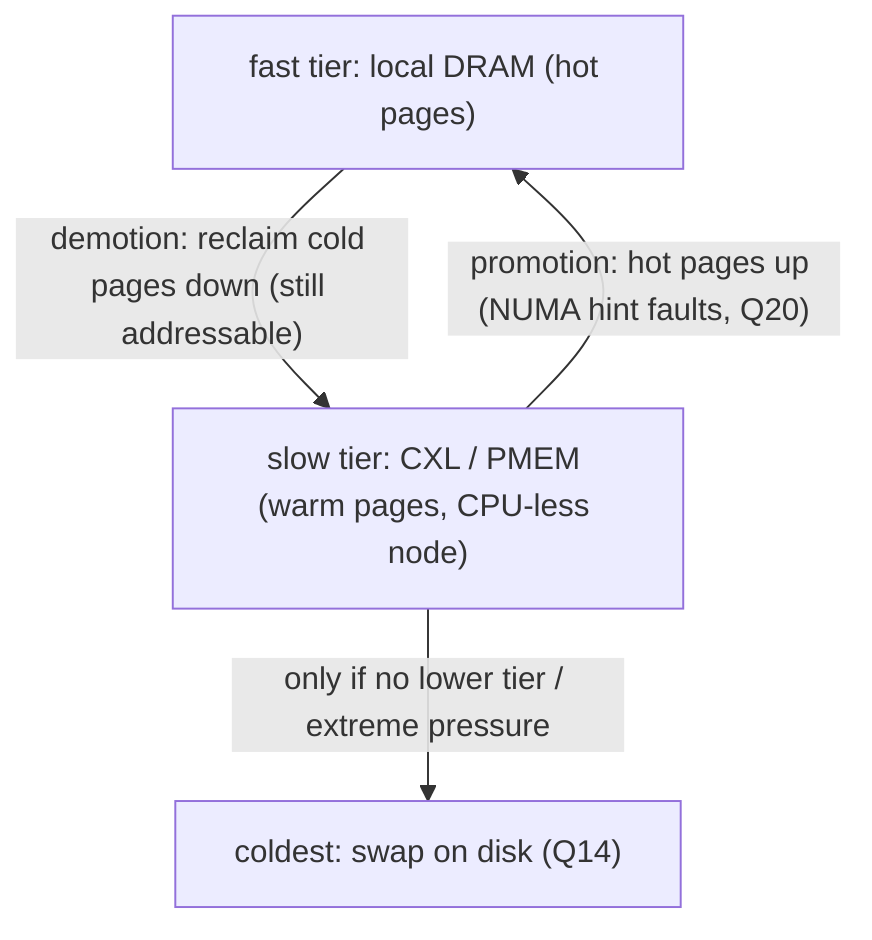
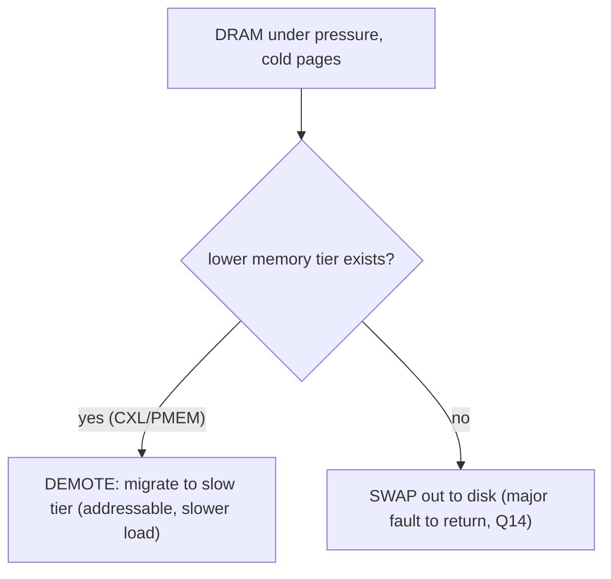

# Q21 — NUMA-Aware Allocation & Tiered Memory (CXL)

> **Subsystem:** NUMA / Tiering · **Files:** `mm/memory-tiers.c`, `mm/migrate.c` (demotion/promotion), `mm/vmscan.c`, `drivers/cxl/`
> **Interviewer is really probing (AMD/Intel/cloud):** Do you understand **NUMA-aware allocation knobs**
> and the modern **memory-tiering** model — **CXL** memory as a slow tier, with **demotion/promotion**?

---

## TL;DR Cheat Sheet

- **NUMA-aware allocation** = put pages on the **right node**: `alloc_pages_node()`/`__GFP_THISNODE`,
  per-CPU/per-node caches (Q8), node-ordered zonelists (Q7), and policy (Q20). Slab/pcp/page cache are all
  node-aware so kernel structures stay local.
- **Memory tiering** generalizes NUMA: not all memory is equal — **fast tier** (local DRAM), **slower
  tiers** (remote DRAM, **CXL-attached memory**, persistent memory). The kernel models these as
  **tiers** (`memory_tier`) ordered by performance (read latency/bandwidth via HMAT).
- **CXL (Compute Express Link)** lets you attach **byte-addressable** memory over PCIe-class links —
  large, cheaper, but **higher latency** than local DRAM. It appears as a **CPU-less NUMA node** in a
  **lower tier**.
- **Demotion:** under memory pressure, instead of swapping cold pages to disk (Q14), reclaim **migrates
  them to a slower tier** (e.g. DRAM → CXL) — they stay **directly addressable** (no fault to bring back),
  just slower. **Promotion:** hot pages on a slow tier are **migrated up** to fast DRAM (via NUMA hint
  faults, Q20).
- This turns the memory hierarchy into **DRAM (hot) ↔ CXL/PMEM (warm) ↔ swap (cold)**, managed by
  reclaim + AutoNUMA-style hotness detection. Tunables: `/sys/devices/system/node/.../memory_tier*`,
  `numa_balancing` modes (promotion), demotion enable.

---

## The Question

> How does NUMA-aware allocation work, and how does the modern memory-tiering subsystem (with CXL) extend
> it? Explain demotion and promotion.

---

## Why NUMA-aware allocation and tiering exist

**Part 1 — NUMA-aware allocation:** Building on Q20 (policy) and Q7 (zonelists), the kernel must, for *every*
allocation, choose a **node**. The principle is **locality**: kernel data structures, per-CPU caches, slab,
and page-cache pages should live on the node of the CPU using them, so accesses are local (Q8's per-CPU page
lists and per-node slab caches exist for exactly this). The allocator exposes **node-targeted** APIs
(`alloc_pages_node`, `kmalloc_node`, `__GFP_THISNODE`) so subsystems and drivers can request **local**
memory, and the **zonelist** falls back to the **nearest** remote node when local is exhausted.

**Part 2 — Tiering (the modern evolution):** Historically, "memory" meant uniform DRAM and the only slower
"tier" was **swap** (disk, Q14) — orders of magnitude slower and **not directly addressable** (you fault to
bring a page back). But hardware changed:

- **CXL** memory: large pools of **byte-addressable** memory attached over a CXL link — **cheaper and
  denser** than local DRAM but **higher latency**. The CPU can `load`/`store` it directly; it shows up as a
  **CPU-less NUMA node**.
- **Persistent memory** (e.g. older NVDIMM): similar — addressable but slower.
- **Heterogeneous bandwidth memory** (HBM on some CPUs/accelerators): *faster* than regular DRAM.

This creates a **performance hierarchy of directly-addressable memory**: fast local DRAM, slower remote
DRAM, even-slower CXL/PMEM. Treating them all as equivalent NUMA nodes is wrong — you want **hot data in
fast memory and cold data in slow memory**, *migrating between them by temperature*, while keeping
everything **addressable** (no swap-in fault). That's the **memory-tiering** subsystem: it **ranks** nodes
into **tiers** (by measured latency/bandwidth from the **HMAT** firmware table) and adds **demotion**
(reclaim cold pages **down** a tier instead of to swap) and **promotion** (move hot pages **up** to DRAM).

The senior framing: **tiering reframes "reclaim" from "evict to disk" to "demote to a slower but still-RAM
tier,"** and reframes NUMA from "local vs remote" to "**a hot/cold placement problem across a performance
hierarchy**." It's the hottest current MM area (CXL), heavily relevant to **AMD/Intel/cloud**.

---

## When tiering / node-aware allocation applies

| Situation | Mechanism |
|-----------|-----------|
| Kernel/driver wants local memory | `alloc_pages_node`, `kmalloc_node`, `__GFP_THISNODE` |
| App placement | NUMA policy (Q20), cpusets |
| Memory pressure on fast tier | **demote** cold pages DRAM → CXL/PMEM (instead of swap) |
| Hot page on slow tier | **promote** CXL/PMEM → DRAM (NUMA hint faults, Q20) |
| CXL memory present | appears as CPU-less NUMA node in a lower **memory_tier** |
| Both tiers full | fall through to **swap** (Q14) as the coldest tier |

---

## Where in the kernel

```
mm/memory-tiers.c     <- memory_tier abstraction, tier ranking (adistance from HMAT), demotion targets
mm/migrate.c          <- migrate_pages for demotion (demote_folio_list) and promotion
mm/vmscan.c           <- reclaim demotes instead of swapping when a lower tier exists
kernel/sched/fair.c   <- NUMA hint faults drive promotion (numa_balancing promotion mode)
drivers/cxl/          <- CXL memory device discovery, creating CPU-less NUMA nodes
ACPI HMAT/SRAT        <- firmware tables: node performance (latency/bandwidth) -> tier assignment
sysfs: /sys/devices/system/node/nodeX/, /sys/devices/virtual/memory_tiering/
sysctl: kernel.numa_balancing (promotion modes), demotion enable
```

---

## How it works — mechanics

### 1. NUMA-aware allocation primitives

```c
struct page *alloc_pages_node(int nid, gfp_t gfp, unsigned int order); /* this node */
void *kmalloc_node(size_t size, gfp_t gfp, int node);                  /* slab on a node */
/* __GFP_THISNODE: only this node, don't fall back (strict locality) */
```
Per-CPU page lists (Q8) and per-node slab caches keep allocations local by default; the **zonelist** (Q7)
defines fallback order by **node distance**. Drivers feeding a device place buffers on the device's
**local** node (`dev_to_node()`), e.g. NIC/GPU buffers near the socket the device is attached to.

### 2. Tiers — ranking nodes by performance

The **memory-tiering** subsystem groups NUMA nodes into **tiers** by an **abstract distance** (`adistance`)
derived from firmware **HMAT** (Heterogeneous Memory Attribute Table — latency/bandwidth per node):

```
Tier 0 (fastest): HBM (if present)
Tier 1:           local DRAM
Tier 2:           remote DRAM
Tier 3 (slowest): CXL memory / persistent memory   (CPU-less nodes)
   ... below all tiers: SWAP (disk, Q14) = coldest
```
Each tier knows its **demotion target** (the next-slower tier). A **CXL** device is enumerated
(`drivers/cxl/`) as a **CPU-less NUMA node** and placed in a **lower tier** automatically based on its HMAT
attributes.

### 3. Demotion — reclaim to a slower tier instead of swap

Classic reclaim (Q-reclaim) evicts cold pages to **swap** (slow disk, must fault back). With tiering, when
the **fast tier** (DRAM) is under pressure, reclaim instead **demotes** cold pages **down** to a slower tier:

```
reclaim on a DRAM node, cold pages found:
  if a lower memory tier exists (e.g. CXL):
       migrate_pages(cold folios, target = CXL node)   # DEMOTE: still RAM, still addressable
  else:
       swap them out (Q14)                              # only if no lower tier
```
The demoted pages remain **directly addressable** (a later access is just a **slower load**, not a
**major fault** + swap-in) — far better than swapping for warm-ish data. This effectively **expands usable
fast memory** by offloading cold pages to cheap CXL while keeping them usable. Demotion uses the same
**migration** machinery as compaction/AutoNUMA (Q9/Q20).

### 4. Promotion — move hot pages up to DRAM

The flip side: a page on a **slow tier** (CXL) that turns out **hot** should move **up** to DRAM.
**NUMA-balancing promotion** (Q20's hint-fault mechanism, extended) detects frequent accesses to slow-tier
pages and **promotes** them (`migrate_misplaced_folio` to a DRAM node), with **rate limiting** so promotion
doesn't thrash or overwhelm the fast tier. So the system continuously sorts pages by **temperature**: hot →
DRAM, cold → CXL, coldest → swap. Tunables control promotion aggressiveness
(`kernel.numa_balancing` modes including promotion, hot-threshold).

### 5. The unified hierarchy

```
hot   ┌─ DRAM (fast tier) ─┐  promotion ↑ (hint faults, Q20)
      │                    │
warm  ├─ CXL / PMEM (slow tier) ┤  demotion ↓ (reclaim instead of swap)
      │                    │
cold  └─ SWAP (disk, Q14) ─┘  only when no lower addressable tier
```
Reclaim + AutoNUMA jointly manage this: **reclaim demotes cold pages down**, **AutoNUMA promotes hot pages
up**, and only genuinely cold/over-pressure pages fall to **swap**. This is the convergence of NUMA, reclaim,
swap, and migration into one **tiered-memory** model.

### 6. Caveats

- **Promotion/demotion overhead:** migration costs CPU + TLB shootdown (Q19); rate-limiting and good hotness
  detection (MGLRU-style, Q15) are essential or you thrash between tiers.
- **Bandwidth vs latency:** CXL adds **capacity and bandwidth** but **latency** is higher; placement must
  weigh both (interleaving across DRAM+CXL for bandwidth-bound; binding hot data to DRAM for latency-bound).
- **Maturing:** tiering, CXL hotness detection, and promotion policies are **active development** — answers
  should note it's evolving.

---

## Diagrams

### Tiers and migration



### Demotion vs swap



---

## Annotated C

```c
/* Node-targeted allocation (NUMA-aware). */
struct page *alloc_pages_node(int nid, gfp_t gfp, unsigned int order);
void *kmalloc_node(size_t size, gfp_t gfp, int node);
int dev_to_node(struct device *dev);     /* place device buffers on the device's local node */

/* Memory tiers (mm/memory-tiers.c). */
struct memory_tier {
    int adistance_start;                 /* abstract distance (from HMAT) -> ranks the tier */
    struct list_head memory_types;       /* nodes in this tier */
    nodemask_t lower_tier_mask;          /* demotion targets */
};

/* Demotion during reclaim (mm/vmscan.c -> mm/migrate.c). */
unsigned int demote_folio_list(struct list_head *demote_folios, struct pglist_data *pgdat);
/* moves cold folios to the next lower tier instead of swapping */

/* Promotion path: NUMA hint fault on a slow-tier page -> migrate up. */
int migrate_misplaced_folio(struct folio *folio, struct vm_area_struct *vma, int node);
```

```bash
numactl --hardware                       # CXL shows as a CPU-less node
cat /sys/devices/system/node/node*/distance
ls  /sys/devices/system/node/node2/      # a CXL node (no CPUs)
sysctl kernel.numa_balancing             # promotion modes
# demotion: enabled when a lower tier exists; numastat shows tier movement
```

> Senior nuance: tiering's key reframe is **"demote, don't swap"** — cold pages move to a **slower but
> still byte-addressable** tier (CXL) so accessing them is a slow **load**, not a **major fault**. Combined
> with **promotion** of hot slow-tier pages to DRAM, the kernel sorts pages by **temperature** across a
> hierarchy, using migration (Q9), reclaim (Q-reclaim), and AutoNUMA hint faults (Q20) together. It's
> "NUMA balancing for heterogeneous memory."

---

## Company Angle

- **AMD/Intel (the headline):** **CXL** memory expansion — tiering, demotion/promotion, HMAT-driven tier
  ranking, NPS/topology, bandwidth-vs-latency placement; the future of large-memory servers. Deep current
  topic.
- **Google/Meta (cloud/scale):** CXL for **memory pooling/disaggregation** and cost (cheap warm memory),
  tiering to raise effective capacity, proactive demotion (Q16) of cold pages to CXL; TMO/tiering research.
- **NVIDIA (heterogeneous):** HBM/device memory tiers, GPU-local vs host memory placement, HMM (Q23)
  alongside tiering; coherent device memory as a tier.
- **Qualcomm (mobile):** less CXL, but the **tiering concept** maps to zram (Q14) as a "compressed tier";
  node-aware allocation on multi-cluster SoCs.

---

## War Story

*"A memory-heavy in-memory database on a **CXL-equipped** server was being **OOM-killed** / swapping to disk
under load even though there was a large **CXL memory** pool installed — the CXL node was present but the
workload allocated everything in **local DRAM** (first-touch, Q20) and, when DRAM filled, reclaim **swapped
to disk** (slow, faulting) instead of using CXL. The system wasn't configured for **tiering**: the CXL node
wasn't being used as a **demotion target**. We enabled the **memory-tiering** path (CXL ranked as a lower
tier via HMAT) and turned on **demotion** so reclaim moved **cold** pages DRAM→**CXL** (still addressable,
just slower) instead of to disk, plus **promotion** (`numa_balancing`) so genuinely **hot** pages migrated
back to DRAM. Effective fast-memory capacity went up, swap/disk faults dropped, and tail latency improved
because warm data stayed **addressable** in CXL rather than faulting from swap. The interviewer's follow-up
— *'why is demotion better than swap for warm data?'* — let me explain a swapped page requires a **major
fault + I/O** to return (Q14), while a demoted CXL page is **still directly addressable** — accessing it is
just a **higher-latency load**, no fault — so for warm data demotion is dramatically cheaper, and promotion
pulls it back to DRAM if it heats up."*

---

## Interviewer Follow-ups

1. **What is NUMA-aware allocation?** Placing pages on the right node via `alloc_pages_node`/`kmalloc_node`/
   `__GFP_THISNODE`, per-node caches (Q8), and distance-ordered zonelists (Q7) — for locality.

2. **What is memory tiering?** Ranking NUMA nodes into performance tiers (fast DRAM, slow CXL/PMEM) via HMAT,
   and migrating pages between tiers by temperature — generalizing NUMA beyond local/remote.

3. **What is CXL memory in this model?** Byte-addressable memory over a CXL link, larger/cheaper but slower
   than DRAM; appears as a **CPU-less NUMA node** in a **lower tier**.

4. **What is demotion?** Reclaim **migrating cold pages to a slower tier** (DRAM→CXL) instead of swapping —
   the pages stay **directly addressable** (no major fault to return).

5. **What is promotion?** Migrating **hot** pages on a slow tier **up** to DRAM, driven by NUMA hint faults
   (Q20), with rate limiting.

6. **Why is demotion better than swap for warm data?** A demoted page is still addressable (slower load); a
   swapped page needs a **major fault + I/O** to come back (Q14).

7. **How are tiers determined?** From firmware **HMAT** (latency/bandwidth per node) → an abstract distance
   that ranks nodes into tiers with demotion targets.

8. **What machinery does tiering reuse?** Page **migration** (Q9/Q20), **reclaim** (demotion path), and
   **AutoNUMA hint faults** (promotion).

9. **Risks of tiering?** Migration overhead + TLB shootdown (Q19), thrashing between tiers without good
   hotness detection/rate-limiting, and latency vs bandwidth placement decisions.

---

## 30-Minute Talk Track

| Min | Cover |
|-----|-------|
| 0–4 | NUMA-aware allocation recap: node APIs, per-node caches (Q8), zonelist fallback (Q7) |
| 4–8 | Why tiering: memory is no longer uniform; CXL/PMEM addressable-but-slow; swap was the only old "tier" |
| 8–13 | Tiers: HMAT-ranked, fast DRAM → slow CXL/PMEM → swap; CXL as CPU-less node |
| 13–18 | Demotion: reclaim cold pages down a tier instead of swapping; still addressable |
| 18–22 | Promotion: hot slow-tier pages up to DRAM via NUMA hint faults (Q20), rate-limited |
| 22–25 | Unified hot/warm/cold hierarchy; reuse of migration/reclaim/AutoNUMA |
| 25–28 | Bandwidth vs latency; overhead/thrash caveats; CXL pooling/disaggregation |
| 28–30 | War story (CXL demotion vs swap) + "demote, don't swap" |
