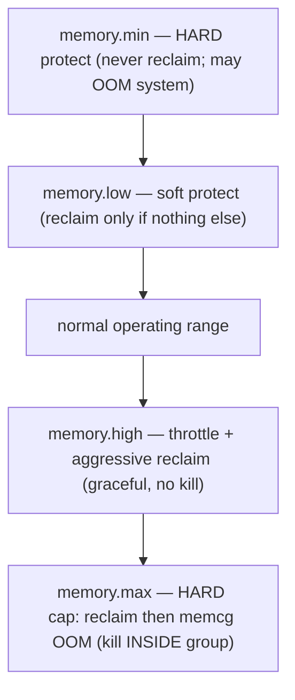
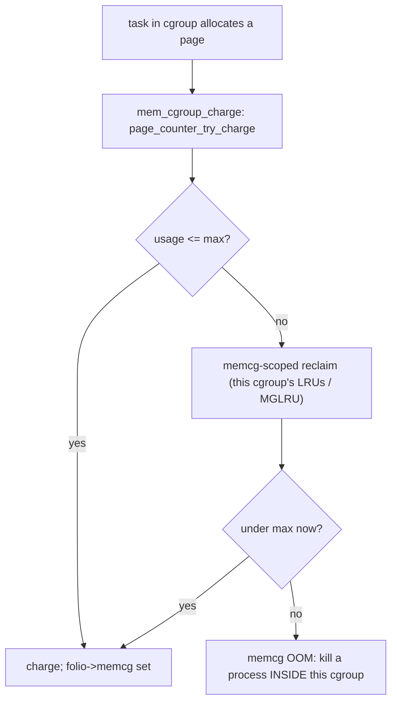

# Q22 — Memory Cgroup v2 (memcg): Charging, Limits, and OOM

> **Subsystem:** Cgroups / Accounting · **Files:** `mm/memcontrol.c`, `mm/vmscan.c` (memcg reclaim), `mm/oom_kill.c`
> **Interviewer is really probing (Google favorite):** Do you understand how the kernel **accounts and
> limits** memory per cgroup — **charging**, the `max/high/low/min` knobs, **memcg reclaim**, and **memcg OOM**?

---

## TL;DR Cheat Sheet

- A **memory cgroup (memcg)** tracks and limits the memory used by a **group of processes** (a container,
  service, or slice). Cgroup **v2** is the unified, modern hierarchy (one tree for all controllers).
- **Charging:** when a process in a cgroup allocates a page (anon fault, page cache, kernel/slab via
  `kmem`), that page is **charged** to its memcg; freeing **uncharges**. Each page's `struct folio` knows
  its **`mem_cgroup`** (`folio_memcg`).
- **The four key knobs (`memory.*`):**
  - **`memory.max`** — **hard limit**; exceeding it triggers **memcg reclaim**, then **memcg OOM** if
    reclaim can't free enough.
  - **`memory.high`** — **soft throttle**; above it the cgroup is **aggressively reclaimed** and its tasks
    are **throttled** (slowed), but **not** OOM-killed. The preferred way to bound memory gracefully.
  - **`memory.low`** — **best-effort protection**; memory down to `low` is **protected** from reclaim
    (reclaimed only if nothing else can be).
  - **`memory.min`** — **hard protection**; never reclaimed (can drive the **system** to OOM to honor it).
- **memcg reclaim:** when a cgroup hits `high`/`max`, reclaim runs **scoped to that cgroup's LRUs**
  (per-memcg MGLRU generations, Q15) — only its pages are scanned/evicted.
- **memcg OOM:** if a cgroup at `memory.max` can't reclaim enough, the **OOM killer is scoped to that
  cgroup** — it kills a process **inside** the offending group, not a random host process.
- Other knobs: `memory.swap.max` (limit swap, Q14), `memory.current`/`memory.stat` (accounting),
  `memory.pressure` (PSI, Q16), `memory.reclaim` (proactive reclaim, Q16).

---

## The Question

> Explain memory cgroups (v2). How is memory charged to a cgroup, what do `max`/`high`/`low`/`min` do, and
> how do memcg reclaim and OOM work?

---

## Why memcg exists

A single Linux host runs **many** workloads — containers, services, batch jobs — sharing **one** physical
memory pool. Without per-group accounting and limits, they **interfere catastrophically**:

- A **memory leak or spike** in one container could consume all RAM, triggering the **global OOM killer**,
  which might kill an **unrelated, critical** service (the global OOM picks by `oom_score`, not by who
  caused the problem).
- There's **no isolation**: a noisy batch job's page cache could evict a latency-sensitive service's hot
  pages; you can't **guarantee** a service a memory floor or **cap** a job's footprint.
- You can't **bill/attribute** memory usage per tenant, or **overcommit** safely (pack many workloads,
  bounding each).

**memcg solves this** by making memory a **per-cgroup accounted, limited, and protected** resource:

- **Accounting (charging):** every page is attributed to the cgroup that allocated it, so you know exactly
  who uses what (`memory.current`, `memory.stat`).
- **Limits (`max`/`high`):** **bound** a group's footprint — `high` throttles gracefully, `max` is a hard
  ceiling enforced by **scoped reclaim then scoped OOM**, so a runaway group is contained **without**
  harming others.
- **Protection (`low`/`min`):** **guarantee** a group a memory floor so important workloads aren't reclaimed
  to death by noisy neighbors.
- **Scoped reclaim & OOM:** pressure is handled **within** the offending cgroup — reclaim its LRUs, and if
  needed OOM-kill **inside** it — achieving **isolation** and **fault containment**.

This is the foundation of **containers** (Docker/Kubernetes/systemd) and **cloud multi-tenancy**, which is
why **Google/Meta** (who drove cgroup v2, PSI, and memcg) probe it deeply. The senior framing: memcg turns
"one shared, globally-OOM'd memory pool" into **per-workload memory SLOs with graceful throttling and
contained failure**.

---

## When memcg mechanisms engage

| Event | memcg behavior |
|-------|----------------|
| page allocated by a task | **charged** to its cgroup (`try_charge`); fail → reclaim/OOM |
| cgroup usage > `memory.high` | **throttle** tasks + aggressive **memcg reclaim** (no kill) |
| cgroup usage hits `memory.max` | **memcg reclaim**; if insufficient → **memcg OOM** (kill inside group) |
| reclaim considers a cgroup's pages | protected down to `memory.low` (soft) / `memory.min` (hard) |
| proactive reclaim | write `memory.reclaim` (Q16) to free cold pages from the group |
| pressure monitoring | `memory.pressure` (PSI, Q16) per cgroup |

---

## Where in the kernel

```
mm/memcontrol.c     <- struct mem_cgroup, charging (try_charge/uncharge), max/high/low/min handling,
                       memcg OOM, kmem accounting, memory.* interface files
mm/vmscan.c         <- memcg-scoped reclaim (shrink_node_memcgs, per-memcg LRU/MGLRU, Q15)
mm/oom_kill.c       <- memcg-scoped OOM (mem_cgroup_out_of_memory)
include/linux/memcontrol.h <- folio_memcg, mem_cgroup_charge, page_counter
cgroup v2: memory.current, memory.max, memory.high, memory.low, memory.min, memory.swap.max,
           memory.stat, memory.events, memory.pressure, memory.reclaim
```

---

## How memcg works — mechanics

### 1. Charging

Every chargeable page (anonymous, page cache, and — with `kmem` accounting — **kernel/slab** memory) is
**charged** to a cgroup at allocation:

```
fault/alloc -> mem_cgroup_charge(folio, mm, gfp):
   memcg = mm's cgroup
   page_counter_try_charge(&memcg->memory, nr_pages):
       if usage + nr <= max:  charge succeeds; folio->memcg = memcg
       else:                  try memcg reclaim; if still over -> memcg OOM (or fail)
free -> mem_cgroup_uncharge(folio):  page_counter_uncharge(...)
```
A **`page_counter`** per cgroup tracks **current usage** vs **max**; charges **propagate up** the hierarchy
(a child's usage counts against its ancestors). `folio_memcg(folio)` recovers a page's owning cgroup —
needed so **reclaim** can scan a specific cgroup's pages and **uncharge** correctly.

### 2. The four knobs

```
memory.min   ──  HARD protection: never reclaimed (may OOM the SYSTEM to honor it)
memory.low   ──  soft protection: reclaimed only if no unprotected memory elsewhere
   [ normal operating range ]
memory.high  ──  THROTTLE + aggressive reclaim above here (graceful; no kill)
memory.max   ──  HARD limit: reclaim, then memcg OOM if it can't get under
```
- **`memory.max`** is the **hard cap**. Crossing it forces **synchronous memcg reclaim** on the allocating
  task; if reclaim can't get the group under `max`, the **memcg OOM killer** fires **within the group**.
- **`memory.high`** is the **graceful** control: above it, tasks are **throttled** (paused proportionally,
  like `balance_dirty_pages`, Q12) and the group is **reclaimed hard**, but **no OOM kill**. Most container
  systems prefer setting `high` (smooth backpressure) below `max` (safety ceiling).
- **`memory.low`** **protects** a group's memory from reclaim down to that threshold — used to give an
  important service a **soft floor** so noisy neighbors can't evict its working set.
- **`memory.min`** is **hard** protection — pages are **never** reclaimed even under global pressure (the
  kernel will OOM **other** things, or the system, to honor it). Used for critical workloads that must keep
  their memory resident.

### 3. memcg-scoped reclaim

When a cgroup hits `high`/`max`, reclaim is **scoped to that cgroup** rather than global: `shrink_node` walks
the cgroup's **per-memcg LRU lists** (or **MGLRU generations**, Q15 — generations are per-memcg) and evicts
**only that cgroup's pages** (anon → swap subject to `memory.swap.max`, file → drop/writeback). This is the
isolation property: a hungry container reclaims **its own** pages, not its neighbors'. Reclaim honors the
`low`/`min` **protection** of other cgroups when choosing victims.

### 4. memcg OOM

If a cgroup at **`memory.max`** can't be brought under by reclaim, the OOM killer is invoked **scoped to that
cgroup** (`mem_cgroup_out_of_memory`): it selects and kills a process **inside** the offending group (by
`oom_score` within the group), **containing** the failure. Compare to **global OOM** (no memcg), which could
kill any host process. `memory.events` records `oom`/`oom_kill`/`max`/`high` counts; cgroup v2 can also
deliver OOM as a **group event** so a userspace manager (or `systemd-oomd`, Q16) can react. `memory.oom.group`
can make the **whole cgroup** die together (kill all tasks) for clean restart semantics.

### 5. kmem, swap, and stats

- **`kmem` accounting:** kernel memory (slab objects like dentries/inodes, kernel stacks, page tables) used
  on behalf of a cgroup is charged to it — so a container can't evade limits by exhausting **kernel** memory.
- **`memory.swap.max`:** caps how much a cgroup can swap (Q14), preventing a group from consuming all swap.
- **`memory.stat`:** detailed breakdown (anon, file, slab, shmem, etc.); **`memory.current`** = usage;
  **`memory.pressure`** = PSI (Q16); **`memory.reclaim`** = proactive reclaim (Q16).

### 6. cgroup v1 vs v2

v2 is the **unified hierarchy** (one tree, all controllers together), with cleaner semantics:
**`high`/`low`/`min`** (v2 additions — graceful throttling and protection that v1 lacked), **PSI** per
cgroup, and **`memory.reclaim`**. v1 had `limit_in_bytes`/`soft_limit` with weaker semantics. Modern
systems (systemd, Kubernetes) use **v2**.

---

## Diagrams

### The thresholds



### Charging + enforcement



---

## Annotated C

```c
/* A memory cgroup. */
struct mem_cgroup {
    struct page_counter memory;     /* current usage vs max (hierarchical) */
    struct page_counter swap;       /* memory.swap.max */
    unsigned long high;             /* memory.high (throttle) */
    unsigned long low, min;         /* protection thresholds */
    struct mem_cgroup_per_node *nodeinfo[]; /* per-node LRU / MGLRU generations (Q15) */
    /* memory.events counters, PSI (Q16), kmem state ... */
};

/* Charge a folio to the task's cgroup (mm/memcontrol.c). */
int  mem_cgroup_charge(struct folio *folio, struct mm_struct *mm, gfp_t gfp);
void mem_cgroup_uncharge(struct folio *folio);
struct mem_cgroup *folio_memcg(struct folio *folio);   /* who owns this page */

/* Memcg-scoped reclaim + OOM. */
unsigned long try_to_free_mem_cgroup_pages(struct mem_cgroup *memcg, unsigned long nr,
                                           gfp_t gfp, ...);   /* also memory.reclaim (Q16) */
bool mem_cgroup_out_of_memory(struct mem_cgroup *memcg, gfp_t gfp, int order);
```

```bash
# cgroup v2 interface (under /sys/fs/cgroup/<group>/):
cat memory.current memory.max memory.high          # usage and limits
echo 2G > memory.max ; echo 1800M > memory.high     # hard cap + graceful throttle
echo 512M > memory.low                              # soft protection floor
cat memory.stat                                     # anon/file/slab/shmem breakdown
cat memory.events                                   # low/high/max/oom/oom_kill counts
cat memory.pressure                                 # PSI (Q16)
echo 256M > memory.reclaim                           # proactive reclaim (Q16)
```

> Senior nuance: the design intent is **`high` for graceful backpressure** (throttle + reclaim, no kill) and
> **`max` as the safety ceiling** (reclaim → contained OOM). Protection (`low`/`min`) guarantees floors for
> important workloads. The whole point is **isolation**: pressure and failure are handled **inside** the
> offending cgroup (scoped reclaim, scoped OOM) so one workload can't take down the host or its neighbors.

---

## Company Angle

- **Google/Meta (the headline):** drove cgroup v2 + PSI + memcg; expect depth on `high` vs `max` semantics,
  per-memcg reclaim + **MGLRU** (Q15), **proactive reclaim** (`memory.reclaim`) + **PSI** (Q16),
  **systemd-oomd**, kmem accounting, and container memory SLOs at fleet scale.
- **Qualcomm/Android:** per-app/per-uid cgroups, memory limits for background apps, memcg + zram (Q14) +
  lmkd/PSI (Q16); bounding app footprints.
- **AMD/Intel (cloud):** multi-tenant isolation, NUMA + memcg, overcommit with contained OOM, memcg reclaim
  scalability on large memory.
- **NVIDIA (shared GPU hosts):** bounding container memory on shared training/inference nodes; kmem
  accounting for driver allocations.

---

## War Story

*"A Kubernetes node periodically **OOM-killed a latency-critical pod** even though a **different, batch** pod
was the memory hog. The batch pod only had **`memory.max`** set (a hard cap) with no **`memory.high`**, so it
grew right up to its cap and then triggered **memcg reclaim + OOM** *abruptly* — and because the node was
also globally tight, the pressure spilled over and the **global** OOM heuristics sometimes picked the wrong
victim. Fixes: (1) set **`memory.high`** below `memory.max` on the batch pod so it got **throttled and
reclaimed gracefully** *before* hitting the hard cap — smooth backpressure instead of a cliff; (2) set
**`memory.low`** (soft protection) on the latency pod to guarantee its working set a floor so neighbors
couldn't reclaim it; (3) deployed **systemd-oomd** watching **PSI** (Q16) to kill the **batch** cgroup by
policy before global OOM. The latency pod stopped getting killed. The interviewer's follow-up — *'why is
`high` better than just `max`?'* — let me explain `max` is a hard wall that yields abrupt reclaim/OOM, while
`high` provides **continuous throttling + reclaim** so a workload is slowed and trimmed **gracefully**,
keeping the cgroup healthy and avoiding the OOM cliff — with `max` retained purely as a safety ceiling."*

---

## Interviewer Follow-ups

1. **What does memcg do?** Accounts and limits memory per **cgroup** (group of processes), enabling
   isolation, limits, protection, and contained OOM — the basis of container memory management.

2. **How is memory charged?** On allocation, each page (anon/file/kmem) is charged to the task's cgroup via
   a `page_counter`; `folio_memcg` records the owner; freeing uncharges; charges propagate up the hierarchy.

3. **`memory.max` vs `memory.high`?** `max` = hard cap → reclaim then **memcg OOM**; `high` = soft throttle
   → tasks slowed + aggressive reclaim, **no kill**. Prefer `high` for graceful backpressure, `max` as a
   ceiling.

4. **`memory.low` vs `memory.min`?** `low` = **soft** protection (reclaimed only if nothing else);
   `min` = **hard** protection (never reclaimed, may OOM the system to honor it). Floors for important
   workloads.

5. **What is memcg reclaim?** Reclaim **scoped to one cgroup's** LRU/MGLRU generations (Q15) — only that
   group's pages are scanned/evicted, providing isolation.

6. **What is memcg OOM?** When a cgroup at `max` can't reclaim enough, OOM is **scoped to that group** —
   kills a process **inside** it (vs global OOM killing any host process). `memory.oom.group` can kill the
   whole group.

7. **What is kmem accounting?** Charging **kernel** memory (slab, stacks, page tables) used for a cgroup to
   it, so groups can't evade limits via kernel memory.

8. **How does this relate to PSI and proactive reclaim?** Per-cgroup `memory.pressure` (PSI, Q16) signals
   pressure; `memory.reclaim` triggers proactive reclaim of cold pages from the group (Q16).

9. **v1 vs v2?** v2 = unified hierarchy with `high`/`low`/`min`, PSI, `memory.reclaim` — graceful
   throttling/protection v1 lacked; modern systems use v2.

---

## 30-Minute Talk Track

| Min | Cover |
|-----|-------|
| 0–4 | Why memcg: shared host, isolation, contain runaway workloads, attribute usage, SLOs |
| 4–9 | Charging: per-page page_counter, folio_memcg, hierarchy propagation, kmem accounting |
| 9–15 | The four knobs: max (hard+OOM), high (throttle/reclaim), low (soft protect), min (hard protect) |
| 15–19 | memcg-scoped reclaim: per-memcg LRU/MGLRU (Q15), honoring low/min protection |
| 19–23 | memcg OOM: scoped victim selection, oom.group, memory.events vs global OOM |
| 23–26 | swap.max, memory.stat/current, PSI (Q16), memory.reclaim (proactive, Q16) |
| 26–28 | v1 vs v2; container/systemd/k8s usage |
| 28–30 | War story (high vs max, low protection, oomd) + graceful-vs-cliff |
