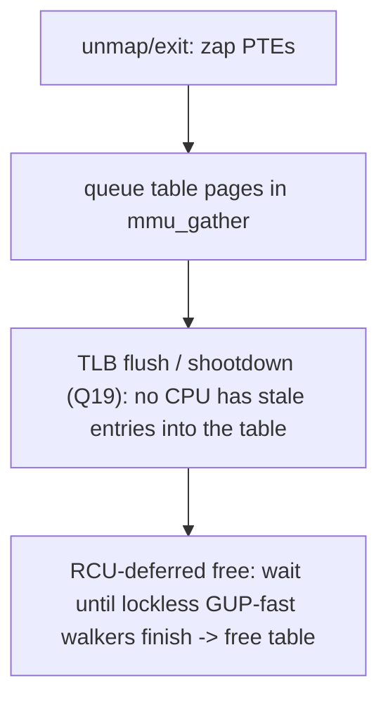
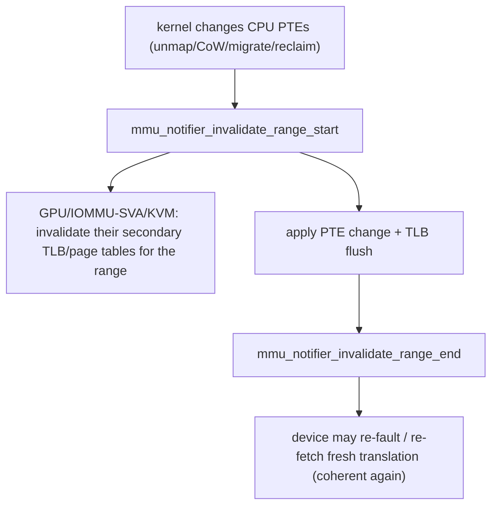

# Q23 — Page-Table Lifecycle & mmu_notifier (HMM / SVA)

> **Subsystem:** Advanced Page Tables · **Files:** `mm/pgtable-generic.c`, `mm/memory.c`, `mm/mmu_notifier.c`, `mm/hmm.c`
> **Interviewer is really probing (NVIDIA favorite):** Do you understand how **page-table pages** are
> allocated/freed (and freed safely vs walkers), and how **`mmu_notifier`** keeps **secondary MMUs**
> (GPU/IOMMU/KVM) coherent with the CPU page tables?

---

## TL;DR Cheat Sheet

- **Page-table pages** (PGD/P4D/PUD/PMD/PTE tables) are themselves **allocated pages** (`ptdesc`/`struct
  page`), built **lazily** during faults (`__pud_alloc`/`pmd_alloc`/`pte_alloc`, Q3) and **torn down** on
  unmap/exit (via `mmu_gather`, Q19). Each level is protected by a **page-table lock** (`pmd_lock`,
  `pte_offset_map_lock` → `ptl`), often a **split** per-table lock for scalability.
- **Freeing page-table pages is dangerous:** a **hardware or software walker** (CPU MMU, another CPU's
  software walk, a GUP fast path) might be **mid-walk** through a table you're freeing → use-after-free. So
  page-table pages are freed **after a TLB flush** and often via **RCU** (`pte_free_tlb`, RCU-deferred), so
  lockless walkers (e.g. **GUP-fast**) can finish safely.
- A **secondary MMU** is any device that **also translates the same virtual addresses**: a **GPU** (CUDA
  unified memory / SVA), an **IOMMU** doing **Shared Virtual Addressing (SVA)**, or a hypervisor's **EPT/
  stage-2** (KVM). They cache translations derived from the CPU page tables.
- **`mmu_notifier`** is the callback mechanism that tells these secondary MMUs **when the CPU page tables
  change** (unmap, CoW, migration, protection change, reclaim) so they **invalidate their own translation
  caches** — keeping the device/guest **coherent** with the CPU. Key ops:
  `invalidate_range_start/end`, `arch_invalidate_secondary_tlbs`, `clear_flush_young`.
- **HMM (Heterogeneous Memory Management)** builds on mmu_notifier to **mirror** CPU page tables into a
  device and migrate pages to/from **device memory** (`ZONE_DEVICE`), enabling GPUs to fault on and share
  the **same address space** as the CPU.

---

## The Question

> How are page-table pages allocated and (safely) freed? What is `mmu_notifier` and why do GPUs/IOMMUs/KVM
> need it? What does HMM add?

---

## Why this machinery exists

**Part 1 — page-table lifecycle.** Page tables describe the mapping, but the **tables themselves are
memory** that must be allocated when a region is first faulted and freed when it's unmapped. Two hard
problems:

- **Concurrency:** many threads fault/allocate into the same address space simultaneously; installing a new
  PMD/PTE table must be **atomic** and protected (the **page-table locks**), ideally **split per table** so
  faults on different regions scale (Q3's per-VMA locks complement this).
- **Safe freeing vs walkers:** when you free a page-table page (on unmap/exit), something might be **walking
  it right now** — the **CPU's hardware page walker**, another CPU's **software** walk, or a **lockless
  GUP-fast** walk that deliberately doesn't take `mmap_lock`. Freeing the table out from under a walker is a
  **use-after-free**. The kernel solves this by ordering: **clear PTE → TLB flush/shootdown (Q19) →
  RCU-deferred free**, so lockless walkers (which disable interrupts / hold RCU) are guaranteed to finish
  before the table is actually freed.

**Part 2 — secondary MMUs and mmu_notifier.** Increasingly, **devices share the CPU's virtual address
space**:

- A **GPU** with unified/shared virtual memory (CUDA UVM, OpenCL SVM) translates the **same VAs** the CPU
  uses, so a pointer means the same thing on CPU and GPU.
- An **IOMMU** doing **SVA (Shared Virtual Addressing)** lets a device DMA using a **process's** virtual
  addresses (via PASID) — the device walks (a copy/shadow of) the CPU page tables.
- A **hypervisor** (KVM) maintains **stage-2/EPT** translations for guest memory derived from host page
  tables.

All of these **cache translations** derived from the CPU page tables in their **own** TLBs/page tables (a
"secondary MMU"). When the CPU kernel **changes a mapping** (unmaps a page, does CoW, migrates a page during
compaction/NUMA/tiering, write-protects for dirty tracking, reclaims), those secondary caches become
**stale** — and a stale device translation is **exactly** the corruption class of Q19's TLB shootdown, but
now **across a device**. There's no hardware broadcast to a GPU's MMU, so the kernel needs a **software
callback** to tell each secondary MMU "invalidate this range." That's **`mmu_notifier`**: a registration +
callback framework so MM code can notify all registered secondary MMUs **around** every page-table change.
**HMM** layers on top to let devices **mirror** CPU tables and migrate pages to **device memory** while
staying coherent.

The senior framing: **mmu_notifier extends the page-table coherence problem (Q19) from CPU TLBs to arbitrary
secondary MMUs** — it's how Linux makes **GPU unified memory, IOMMU SVA, and KVM** correct. NVIDIA cares
intensely because it underpins CUDA unified memory.

---

## When these mechanisms run

| Event | Page-table / notifier action |
|-------|------------------------------|
| fault into new region | allocate page-table pages (`pmd_alloc`/`pte_alloc`), under ptl |
| unmap/exit | `mmu_gather` frees tables after TLB flush, RCU-deferred (Q19) |
| any PTE change (unmap/CoW/migrate/protect/reclaim) | `mmu_notifier_invalidate_range_start/end` brackets it |
| GPU/SVA device faults on a VA | HMM mirrors the CPU page table / migrates page to device |
| page migrated to device memory | `ZONE_DEVICE` page; CPU access faults it back (HMM) |
| KVM guest memory change | mmu_notifier invalidates EPT/stage-2 |

---

## Where in the kernel

```
mm/pgtable-generic.c   <- generic pte/pmd helpers, pXX_alloc, RCU page-table freeing hooks
mm/memory.c            <- __pte_alloc, pmd/pud_alloc, pte_offset_map_lock (ptl), fault table build
mm/mmu_gather.c        <- pte_free_tlb / pmd_free_tlb: batched, RCU-safe table freeing (Q19)
mm/mmu_notifier.c      <- mmu_notifier registration + invalidate_range_start/end, interval notifiers
mm/hmm.c               <- HMM: hmm_range_fault (mirror CPU tables), device-private ZONE_DEVICE pages
drivers/iommu/ (SVA)   <- IOMMU SVA via mmu_notifier; KVM uses mmu_notifier for EPT
include/linux/mmu_notifier.h, hmm.h
```

---

## How it works — mechanics

### 1. Building page-table pages (lazily, under locks)

During a fault (Q3), `__handle_mm_fault` walks levels and **allocates** any missing table:

```c
pgd = pgd_offset(mm, addr);
p4d = p4d_alloc(mm, pgd, addr);   /* allocate a P4D table page if absent */
pud = pud_alloc(mm, p4d, addr);   /* ... PUD ... */
pmd = pmd_alloc(mm, pud, addr);   /* ... PMD ... */
pte = pte_alloc_map_lock(mm, pmd, addr, &ptl);  /* allocate PTE table; take split ptl */
/* install the leaf PTE under ptl, then pte_unmap_unlock(pte, ptl) */
```
Each table page is a normal allocation (tracked by a **`ptdesc`**, the page-table flavor of `struct page` in
the memdesc model, Q2). The **`ptl`** (split page-table lock, often one per PMD/PTE table) serializes
installers so two faults don't race installing the same table — and being **split** lets faults on
**different** tables proceed in parallel (scalability).

### 2. Safe freeing — the RCU/TLB ordering

On unmap/exit, `mmu_gather` (Q19) tears down mappings. Freeing a **table** page must respect walkers:

```
zap PTEs -> tlb_remove_table()/pte_free_tlb(): queue the table page
tlb_finish_mmu(): 1) TLB flush (shootdown, Q19) so no CPU has stale entries pointing into the table
                  2) free the table pages -- often via RCU (call_rcu) so a lockless GUP-fast walker
                     (which runs with IRQs/preemption off or under RCU) is guaranteed to have finished
```
**Why RCU?** **GUP-fast** (`get_user_pages_fast`) walks page tables **without `mmap_lock`**, relying on
disabling interrupts (or RCU) to prevent the tables from disappearing mid-walk. By deferring the actual
**free** until after a grace period / IPI, the kernel guarantees no lockless walker is still inside the table
when it's freed. Get this ordering wrong → **use-after-free of a page-table page** — a subtle, severe bug.

### 3. mmu_notifier — notifying secondary MMUs

A device/hypervisor **registers** an `mmu_notifier` (or modern **interval notifier**) on an `mm`. MM code
that changes mappings **brackets** the change with notifier calls:

```c
struct mmu_notifier_range range;
mmu_notifier_range_init(&range, MMU_NOTIFY_UNMAP, 0, mm, start, end);
mmu_notifier_invalidate_range_start(&range);   /* tell secondary MMUs: stop using [start,end) */
   ... change/clear the CPU PTEs, TLB flush ...
mmu_notifier_invalidate_range_end(&range);     /* secondary MMUs may re-fetch fresh translations */
```
- **`invalidate_range_start`** is called **before** the PTE change (and on the failure path the device must
  stop/serialize its access to that range); **`invalidate_range_end`** after. Between them, the device must
  **not** use cached translations for the range.
- Registered callbacks (GPU driver, IOMMU SVA, KVM) **invalidate their own TLBs/page tables** for the range,
  keeping the **secondary MMU coherent** with the CPU. There's also `clear_flush_young` (for accessed-bit
  tracking across the secondary MMU) and arch hooks for **secondary TLB** invalidation.
- Used by **every** mapping change: unmap, **CoW** (Q4), **migration** (compaction/NUMA/tiering Q9/Q20/Q21),
  **write-protect** for dirty tracking, **reclaim/swap** (Q14). So a GPU sharing memory sees a consistent
  view even as the kernel reclaims/migrates pages underneath it.

### 4. HMM — mirroring and device memory

**HMM** builds on mmu_notifier to let a device **share the CPU's address space**:

- **Mirroring:** `hmm_range_fault()` lets a device driver **populate its page tables** from the CPU's for a
  VA range (faulting in pages as needed), so the GPU can translate the **same pointers** as the CPU. When the
  CPU tables change, the **mmu_notifier** tells the driver to invalidate — keeping the mirror coherent.
- **Device-private memory (`ZONE_DEVICE`):** HMM can **migrate** pages to **GPU memory** represented by
  special `ZONE_DEVICE` `struct page`s (Q6). A CPU access to such a page takes a **fault** that **migrates it
  back** to system RAM — so a single pointer transparently lives in CPU or GPU memory ("unified memory").
  This is the foundation of CUDA unified memory / managed memory.

So the stack is: **page-table locks** (build), **RCU/TLB ordering** (safe free), **mmu_notifier** (secondary
MMU coherence), **HMM** (device mirroring + device memory migration).

---

## Diagrams

### Page-table page safe free



### mmu_notifier keeps a GPU coherent



---

## Annotated C

```c
/* Lazy page-table build under split locks (mm/memory.c). */
pte_t *pte_alloc_map_lock(struct mm_struct *mm, pmd_t *pmd, unsigned long addr, spinlock_t **ptl);
/* install leaf PTE under *ptl; pte_unmap_unlock(pte, ptl); */

/* RCU/TLB-safe table freeing (mm/mmu_gather.c). */
void pte_free_tlb(struct mmu_gather *tlb, pgtable_t pte, unsigned long addr); /* deferred, RCU-safe */

/* Secondary-MMU coherence (mm/mmu_notifier.c). */
struct mmu_notifier_ops {
    int  (*invalidate_range_start)(struct mmu_notifier *, const struct mmu_notifier_range *);
    void (*invalidate_range_end)(struct mmu_notifier *, const struct mmu_notifier_range *);
    int  (*clear_flush_young)(struct mmu_notifier *, struct mm_struct *, unsigned long, unsigned long);
    void (*arch_invalidate_secondary_tlbs)(struct mmu_notifier *, struct mm_struct *, ulong, ulong);
};
int mmu_notifier_register(struct mmu_notifier *mn, struct mm_struct *mm);

/* HMM: mirror CPU page tables into a device for a range. */
int hmm_range_fault(struct hmm_range *range);   /* populate device view; coherent via mmu_notifier */
```

> Senior nuance: two coherence problems, same shape. **Q19** keeps **CPU TLBs** coherent with page-table
> changes (shootdown). **mmu_notifier** keeps **secondary MMUs** (GPU/IOMMU/KVM) coherent with the *same*
> changes via software callbacks. And **freeing page-table pages** must be **RCU/TLB-ordered** so lockless
> **GUP-fast** walkers don't use a freed table. These three — split ptl, RCU table free, mmu_notifier — are
> the backbone of safe, device-shared address spaces.

---

## Company Angle

- **NVIDIA (the headline):** **CUDA unified/managed memory** = HMM + `mmu_notifier` + `ZONE_DEVICE` device
  memory; GPU page faults, mirroring CPU tables, migrating pages CPU↔GPU coherently. Expect deep questions on
  invalidate_range_start/end, device-private pages, and GUP/pinning vs migration (Q2/Q4).
- **Intel/AMD (IOMMU SVA):** **Shared Virtual Addressing** (PASID) lets devices use process VAs via the
  IOMMU, kept coherent with `mmu_notifier`; KVM **EPT/stage-2** invalidation via mmu_notifier.
- **Google (KVM/virt):** KVM relies on mmu_notifier to keep guest stage-2 coherent during host
  reclaim/migration; correctness of page-table freeing under GUP-fast at scale.
- **Qualcomm (SoC IOMMU/GPU):** SMMU SVA, GPU shared memory on SoCs, mmu_notifier for device coherence.

---

## War Story

*"A GPU compute job using **unified memory** intermittently read **stale or wrong data** after the system got
busy. The GPU shared the process address space (HMM mirroring), but under memory pressure the kernel
**migrated** some of those pages (compaction/NUMA, Q9/Q20) to new physical frames — and the GPU's **secondary
MMU** kept translating to the **old** frames. The driver had a bug in its **`mmu_notifier`** handling: it
wasn't properly invalidating its device page tables in **`invalidate_range_start`**, so it missed the
migration and used stale device translations — the GPU analogue of a missed **TLB shootdown** (Q19). Fix:
correctly implement the notifier callbacks to **stop GPU access and invalidate the device TLB for the range
in `invalidate_range_start`**, and only resume/re-fault after `invalidate_range_end`. We also confirmed the
page-table-page **freeing** path was RCU-safe so the concurrent **GUP-fast** the driver used couldn't hit a
freed table. The corruption vanished. The interviewer's follow-up — *'why can't the GPU just rely on the CPU
TLB shootdown?'* — let me explain the CPU shootdown (IPI/`TLBI`, Q19) only invalidates **CPU** TLBs; a
**secondary MMU** has its own caches with **no hardware broadcast to it**, so `mmu_notifier` is the **only**
mechanism that keeps it coherent."*

---

## Interviewer Follow-ups

1. **How are page-table pages created?** Lazily during faults (`p4d/pud/pmd/pte_alloc`) under **split
   page-table locks** (`ptl`); each table is itself an allocated page (`ptdesc`).

2. **Why is freeing a page-table page dangerous?** A hardware/software/**GUP-fast** walker may be mid-walk;
   freeing it is a use-after-free. Solved by **TLB flush + RCU-deferred free** ordering.

3. **Why RCU for table freeing?** GUP-fast walks without `mmap_lock` (IRQs off/RCU); deferring the free until
   after a grace period guarantees no lockless walker is still inside the table.

4. **What is a secondary MMU?** Any device/hypervisor that translates the **same VAs** — GPU (unified
   memory), IOMMU SVA (PASID), KVM EPT/stage-2 — caching translations from the CPU page tables.

5. **What does `mmu_notifier` do?** Calls registered secondary MMUs **around** every CPU page-table change
   (`invalidate_range_start/end`) so they invalidate their own caches and stay **coherent**.

6. **Why not rely on TLB shootdown for devices?** Shootdown (Q19) only invalidates **CPU** TLBs; secondary
   MMUs have separate caches with no hardware broadcast — `mmu_notifier` is the software equivalent.

7. **When is the notifier called?** On unmap, CoW (Q4), migration (Q9/Q20/Q21), write-protect/dirty tracking,
   reclaim/swap (Q14) — any mapping change.

8. **What does HMM add?** Device **mirroring** of CPU page tables (`hmm_range_fault`) and migration of pages
   to **device-private `ZONE_DEVICE`** memory, with coherence via `mmu_notifier` — enabling unified memory.

9. **What's a `ptdesc`?** The page-table-specific memory descriptor (memdesc model, Q2) for page-table pages,
   separating their metadata from generic `struct page`.

---

## 30-Minute Talk Track

| Min | Cover |
|-----|-------|
| 0–4 | Page tables are memory: lazy build during faults; split page-table locks (ptl); ptdesc |
| 4–9 | Safe freeing: walkers (HW/SW/GUP-fast) vs free; TLB flush + RCU-deferred ordering; UAF risk |
| 9–13 | Secondary MMUs: GPU unified memory, IOMMU SVA (PASID), KVM EPT/stage-2 — same VAs, own caches |
| 13–18 | mmu_notifier: register + invalidate_range_start/end bracketing every PTE change; coherence |
| 18–22 | Which changes notify: unmap/CoW/migrate/protect/reclaim; clear_flush_young; secondary TLB |
| 22–26 | HMM: hmm_range_fault mirroring, ZONE_DEVICE device-private memory, CPU↔GPU migration (unified mem) |
| 26–28 | Tie to Q19 (CPU TLB) vs secondary MMU coherence; GUP/pinning vs migration (Q4) |
| 28–30 | War story (GPU stale translations from missed notifier) + "no HW broadcast to secondary MMU" |
