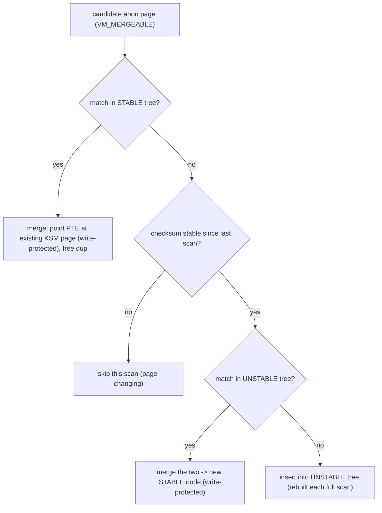
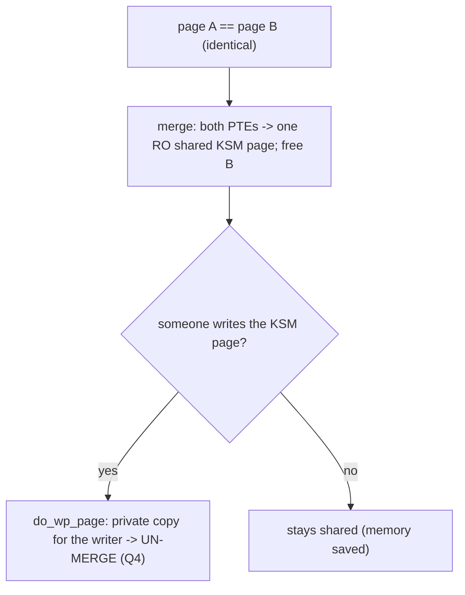

# Q24 — KSM: Kernel Same-page Merging

> **Subsystem:** Advanced Page Tables · **Files:** `mm/ksm.c`, `include/linux/ksm.h`, `mm/madvise.c`
> **Interviewer is really probing:** Do you understand **memory deduplication** — how KSM finds identical
> pages (stable/unstable rb-trees), merges them **CoW**, and the **security/perf** trade-offs?

---

## TL;DR Cheat Sheet

- **KSM (Kernel Same-page Merging)** is **content-based memory deduplication**: it scans anonymous pages,
  finds ones with **identical content**, and **merges** them into a **single shared, write-protected**
  physical page — reclaiming the duplicates. A write to a merged page triggers **CoW** (Q4) to un-merge.
- **Opt-in:** applications mark mergeable regions with **`madvise(MADV_MERGEABLE)`** (or a whole process via
  `prctl(PR_SET_MEMORY_MERGE)` on newer kernels). KSM only scans **opted-in anonymous** memory (not page
  cache / file pages).
- **Two red-black trees:**
  - **Stable tree:** **already-merged**, write-protected shared pages (KSM pages), indexed by content. New
    candidates are compared here first.
  - **Unstable tree:** candidate pages **not yet merged**, indexed by content but **may still change**
    (hence "unstable"); a checksum detects modification before trusting a match.
- **`ksmd`** is the background scanner thread (`pages_to_scan`, `sleep_millisecs` tunables under
  `/sys/kernel/mm/ksm/`). It trades **CPU** (scanning + hashing/comparing) for **memory savings**.
- **Huge win for virtualization / containers:** many VMs/containers run the **same OS/libraries**, so
  identical pages abound (zero pages, shared library code copies, common data) — KSM can reclaim **gigabytes**.
- **Security caveat:** KSM enables **side-channel/timing attacks** (a write to a merged page is slower due to
  CoW — observable), so it's **opt-in** and used carefully in multi-tenant settings.

---

## The Question

> What is KSM? How does it find and merge identical pages (stable/unstable trees), what happens on a write,
> and what are the trade-offs?

---

## Why KSM exists

In **virtualization and containers**, the same content is duplicated across **many** address spaces:

- Dozens of VMs running the **same guest OS** have identical kernel/library/code pages.
- Many containers from the **same image** share identical (but separately-allocated, anonymous after CoW)
  pages.
- Lots of memory is **zero** or contains **common** data structures.

These duplicates waste RAM — each VM/container has its **own physical copy** of bytes that are **bit-for-bit
identical**. **KSM deduplicates** them: detect that page A and page B have identical content, point both
PTEs at **one** shared physical page (write-protected), and **free** the other — reclaiming memory
proportional to the duplication. On a host packing many similar VMs/containers, this can free **gigabytes**,
increasing density.

The challenge is doing this **safely and efficiently** on **mutable** memory:

- The page cache already dedups **file** pages (one copy backs all readers, Q11), but **anonymous** memory
  (heap, post-CoW pages) has no such sharing — that's KSM's target.
- Anonymous pages can be **written at any time**, so a merged page must become **write-protected** and
  **un-merge via CoW** (Q4) the instant someone writes — otherwise one process's write would corrupt
  another's memory.
- Finding identical pages among gigabytes requires **content-indexed** structures that handle the fact that
  candidate pages **keep changing** — hence the **stable** (frozen, merged) vs **unstable** (still-mutable
  candidates) tree split.

The senior framing: KSM is **CoW-based content dedup of anonymous memory** — it trades **CPU (scanning/
comparison)** for **memory**, is **opt-in** (per region/process) because of the cost and the **side-channel**
risk, and is a big lever for **VM/container density**. Knowing the two-tree design and the write→CoW→unmerge
behavior is the core.

---

## When KSM is used

| Situation | KSM use |
|-----------|---------|
| Many similar VMs/containers | merge identical guest/lib/zero pages → reclaim RAM (density) |
| App with lots of duplicate anon data | `madvise(MADV_MERGEABLE)` on those regions |
| Whole-process opt-in (newer) | `prctl(PR_SET_MEMORY_MERGE, 1)` |
| Multi-tenant with untrusted neighbors | **avoid** cross-tenant KSM (side-channel risk) |
| Memory-tight but CPU-spare | trade CPU for memory savings |

---

## Where in the kernel

```
mm/ksm.c            <- ksmd scanner, stable_tree / unstable_tree, rmap_item, stable_node, merge logic
mm/madvise.c        <- MADV_MERGEABLE / MADV_UNMERGEABLE handlers
include/linux/ksm.h <- ksm hooks (page_add_anon_rmap interplay, ksm_might_need_to_copy)
kernel/sys.c        <- prctl(PR_SET_MEMORY_MERGE) (process-wide opt-in)
sysfs: /sys/kernel/mm/ksm/  (run, pages_to_scan, sleep_millisecs, pages_shared, pages_sharing,
                             full_scans, max_page_sharing, use_zero_pages, ...)
```

---

## How KSM works — mechanics

### 1. Opt-in and the scanner

KSM only considers anonymous pages in VMAs marked **`VM_MERGEABLE`** (via `MADV_MERGEABLE`) — applications/
hypervisors (QEMU/KVM) opt their guest RAM in. The **`ksmd`** kernel thread periodically scans these regions:
each scan cycle examines `pages_to_scan` pages then sleeps `sleep_millisecs` (tunables that bound its CPU
cost). For each candidate page it computes a hash/checksum and tries to find a **content match**.

### 2. The two trees

KSM maintains two **red-black trees indexed by page content**:

- **Stable tree** — nodes are **already-merged KSM pages**: shared, **write-protected**, **immutable** (their
  content can't change because they're write-protected). New candidates are searched here **first**:
  - **match found** → point the candidate's PTE at the existing stable KSM page (write-protected), free the
    candidate's page, increment sharing. The candidate is now **merged**.
- **Unstable tree** — nodes are **candidate pages not yet merged**. Their content **can still change** (they're
  not write-protected), so the tree is "unstable." To avoid merging against a page that's mutating, KSM uses
  a **checksum**: a page is only considered for the unstable tree if its checksum is **stable across scans**
  (it didn't change since last seen). If two unstable candidates **match**:
  - KSM **merges** them into a **new stable** KSM page (write-protected) and **moves** the node to the
    **stable tree**.
  The unstable tree is **rebuilt every full scan** (since its members may have changed), while the stable
  tree persists.

```
candidate page P:
  1. search STABLE tree by content -> match? merge P into existing KSM page (CoW), done.
  2. else, checksum stable since last scan? search UNSTABLE tree:
        match? -> merge the two -> create STABLE node (write-protected)
        no match -> insert P into UNSTABLE tree (this scan)
```

### 3. Merging and CoW un-merge

When two pages merge, KSM:
- replaces both PTEs to point at **one** physical page, marked **read-only** (write-protected),
- sets up KSM's own **rmap** tracking (`rmap_item`/`stable_node`) so it knows **all** mappers of a KSM page
  (a KSM page can be shared by many processes — `max_page_sharing` caps the fan-out for rmap efficiency),
- **frees** the now-redundant duplicate page.

A KSM page is treated like a **CoW** page (Q4): if **any** mapper **writes** it, a **write-protection fault**
(`do_wp_page`) makes a **private copy** for that writer and **un-merges** it — so the write doesn't affect the
other sharers. Thus KSM is safe on mutable memory: shared while identical & untouched, **split on first
write**. (KSM pages are also **un-merged** on `MADV_UNMERGEABLE`, unmap, or migration.)

### 4. Tunables and observability

```
/sys/kernel/mm/ksm/run             : 0 stop / 1 run / 2 unmerge-all
/sys/kernel/mm/ksm/pages_to_scan   : scan rate (CPU vs savings)
/sys/kernel/mm/ksm/sleep_millisecs : pause between scan batches
/sys/kernel/mm/ksm/pages_shared    : number of KSM (deduped) pages
/sys/kernel/mm/ksm/pages_sharing   : how many mappings share them (savings ≈ sharing - shared)
/sys/kernel/mm/ksm/use_zero_pages  : merge zero pages to the kernel zero page
/sys/kernel/mm/ksm/max_page_sharing: cap mappers per KSM page (rmap scalability)
```
**Savings** ≈ `pages_sharing − pages_shared` (duplicates eliminated). `ksmd` CPU is the cost; tune
`pages_to_scan`/`sleep_millisecs` to balance.

### 5. Trade-offs (the senior discussion)

- **Pro:** big **memory savings** / density for similar VMs/containers; reclaims anonymous duplicates the
  page cache can't.
- **Con — CPU:** continuous scanning + hashing/comparison costs CPU; tuned via scan rate.
- **Con — latency:** a write to a merged page incurs a **CoW** (un-merge) — a latency bump on that write.
- **Con — security (important):** KSM creates a **timing side channel** — an attacker can detect whether a
  page exists elsewhere by measuring the **CoW slowdown** on write (merged → slow), leaking information
  across tenants (e.g. detecting libraries/keys). Hence KSM is **opt-in** and should **not** dedup across
  **untrusted** tenant boundaries; it's safe within a **trust domain** (same tenant's VMs). Rowhammer-style
  concerns also argue against cross-tenant merging.

---

## Diagrams

### Stable vs unstable tree flow



### Merge + CoW un-merge



---

## Annotated C

```c
/* Opt a region in/out (mm/madvise.c). */
madvise(addr, len, MADV_MERGEABLE);     /* KSM may scan & merge this anon region */
madvise(addr, len, MADV_UNMERGEABLE);   /* un-merge and stop merging */
/* Whole-process (newer): */
prctl(PR_SET_MEMORY_MERGE, 1, 0, 0, 0);

/* KSM tracking structures (mm/ksm.c, simplified). */
struct stable_node {        /* a merged KSM page in the stable tree */
    struct rb_node node;    /* indexed by content */
    struct hlist_head hlist;/* all rmap_items (mappers) of this KSM page */
    unsigned long kpfn;     /* the shared physical page */
};
struct rmap_item {          /* one mapping of a candidate/merged page */
    struct mm_struct *mm;
    unsigned long address;
    unsigned int oldchecksum; /* detect content change (unstable tree) */
    /* links into stable/unstable tree */
};

/* On a write to a KSM page, the normal CoW path un-merges it (Q4). */
/* do_wp_page() -> copy because the KSM page is shared & write-protected. */
```

```bash
echo 1 > /sys/kernel/mm/ksm/run               # enable ksmd
cat /sys/kernel/mm/ksm/pages_sharing          # mappings deduped
cat /sys/kernel/mm/ksm/pages_shared           # distinct KSM pages
# savings ≈ pages_sharing - pages_shared
echo 100 > /sys/kernel/mm/ksm/pages_to_scan   # scan rate (CPU vs savings)
```

> Senior nuance: KSM = **content-dedup of opted-in anonymous memory via CoW sharing**, with a **stable tree**
> of frozen merged pages and an **unstable tree** of still-mutable candidates (guarded by checksums). The
> safety mechanism is **write-protect + CoW un-merge** (Q4). The two big caveats: **CPU cost** (scanning) and
> a **timing side channel** (CoW slowdown leaks page existence) — which is why it's **opt-in** and unsafe
> across untrusted tenants.

---

## Company Angle

- **Google/Cloud (VM/container density):** KSM to pack more similar VMs/containers per host (dedup guest OS/
  library/zero pages); balancing `ksmd` CPU vs savings; **avoiding cross-tenant KSM** for security; pairs
  with memcg (Q22) and tiering (Q21) for density.
- **Qualcomm/Android:** memory savings on devices running many similar app processes (zygote-forked, so much
  is already CoW-shared, Q4); KSM for additional dedup where CPU allows.
- **NVIDIA/virtualization:** KSM interplay with KVM guest memory and **mmu_notifier** (Q23) — merged pages are
  write-protected and migrations/un-merges must notify secondary MMUs.
- **AMD (security):** side-channel/Rowhammer awareness — KSM as an attack surface in multi-tenant clouds;
  when to disable.

---

## War Story

*"A virtualization host ran ~40 VMs from the **same base image** but RAM was the bottleneck, limiting density.
Much of each guest's memory was **identical** — same kernel, same libraries, lots of zero pages — but each VM
had its **own physical copies** (anonymous to the host). We enabled **KSM** and marked the guest RAM
**`MADV_MERGEABLE`** (QEMU's `mem-merge`). `ksmd` deduped the identical pages — `pages_sharing` climbed into
the millions — reclaiming several **GiB** and letting us pack more VMs. We tuned **`pages_to_scan`/
`sleep_millisecs`** so `ksmd` CPU stayed modest. Crucially, because this was a **single-tenant** host, the
**timing side channel** wasn't a concern; on a **multi-tenant** host we would **not** merge across customer
boundaries (an attacker can detect a merged page via the **CoW write slowdown**, leaking which libraries/keys
a neighbor has). The interviewer's follow-up — *'what happens when a guest writes a merged page?'* — let me
explain it's exactly **CoW** (Q4): the KSM page is write-protected, the write faults, `do_wp_page` makes a
**private copy** and **un-merges** it, so the write is isolated — KSM is safe on mutable memory precisely
because of this copy-on-write un-merge."*

---

## Interviewer Follow-ups

1. **What is KSM?** Content-based **deduplication** of opted-in **anonymous** pages: identical pages are
   merged into one shared, write-protected page; duplicates freed; writes un-merge via CoW.

2. **How do apps opt in?** `madvise(MADV_MERGEABLE)` per region (or `prctl(PR_SET_MEMORY_MERGE)` per process);
   KSM ignores non-opted and file-backed pages.

3. **Stable vs unstable tree?** Stable = already-merged, write-protected (immutable) KSM pages indexed by
   content; unstable = mutable candidates (checksum-guarded), rebuilt each full scan. Search stable first,
   then unstable.

4. **Why the checksum in the unstable tree?** Candidate pages can change; KSM only trusts a page for merging
   if its checksum was **stable** across scans, avoiding merging a mutating page.

5. **What happens on a write to a merged page?** A write-protection fault → `do_wp_page` makes a private copy
   and **un-merges** (CoW, Q4) — the write is isolated from other sharers.

6. **What's the memory saving metric?** ≈ `pages_sharing − pages_shared` (duplicate mappings collapsed onto
   fewer physical pages).

7. **Main costs/risks?** **CPU** for scanning/comparison; **write latency** from CoW un-merge; and a **timing
   side channel** (merged-page write is slower → leaks page existence) → unsafe across untrusted tenants.

8. **Why not just use the page cache dedup?** The page cache dedups **file** pages; KSM targets **anonymous**
   memory (heap, post-CoW), which has no shared backing.

9. **How does KSM track all mappers of a merged page?** Its own rmap (`stable_node` + `rmap_item` hlist), with
   `max_page_sharing` capping fan-out for rmap scalability.

---

## 30-Minute Talk Track

| Min | Cover |
|-----|-------|
| 0–4 | Why dedup: many similar VMs/containers duplicate anon pages; page cache only dedups files |
| 4–8 | Opt-in (MADV_MERGEABLE/prctl); ksmd scanner; pages_to_scan/sleep tunables |
| 8–14 | Two trees: stable (merged, write-protected) vs unstable (mutable candidates + checksum) |
| 14–18 | The scan/merge algorithm: search stable → checksum → unstable → create stable node |
| 18–22 | Merge mechanics: shared RO page, KSM rmap, free duplicate; write → CoW un-merge (Q4) |
| 22–25 | Observability/savings (pages_sharing - pages_shared); tuning CPU vs memory |
| 25–28 | Trade-offs: CPU, write latency, the timing side channel (multi-tenant security) |
| 28–30 | War story (VM density via KSM; single- vs multi-tenant) + CoW un-merge explanation |
