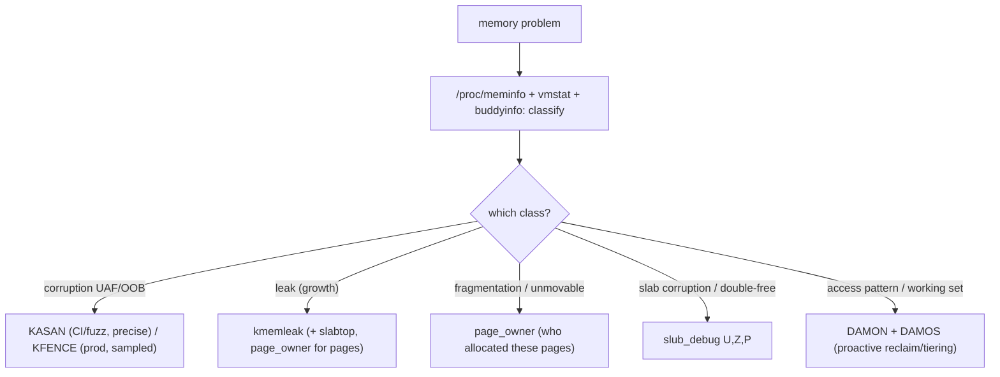

# Q25 — Memory-Management Debugging: KASAN, KFENCE, page_owner, kmemleak, DAMON

> **Subsystem:** MM Debugging · **Files:** `mm/kasan/`, `mm/kfence/`, `mm/page_owner.c`, `mm/kmemleak.c`, `mm/damon/`
> **Interviewer is really probing:** Do you know the **MM debugging toolbox** — which tool catches which
> bug (corruption vs leak vs fragmentation vs access pattern), and their **overhead/coverage** trade-offs?

---

## TL;DR Cheat Sheet

- **Match the tool to the bug class:**
  | Bug / question | Tool |
  |----------------|------|
  | **Use-after-free / out-of-bounds** (heap/stack/global) | **KASAN** (precise, heavy) or **KFENCE** (sampled, cheap, production) |
  | **Memory leak** (unfreed, unreferenced) | **kmemleak** (Q-leak) |
  | **Who allocated this page?** (fragmentation, leaks, unmovable) | **page_owner** |
  | **Slab corruption / double-free / who owns objects** | **slub_debug** (red-zone/poison/owner) |
  | **What's the access pattern? hot/cold/working set** | **DAMON** (Data Access MONitor) |
  | **General accounting** | `/proc/meminfo`, `/proc/vmstat`, `/proc/buddyinfo`, `/proc/pagetypeinfo`, `slabtop` |
- **KASAN** = compiler-instrumented **shadow memory** detector — catches UAF/OOB **at the moment of the bad
  access** with alloc/free stacks. **Precise but ~2–3× slowdown + ~1/8 RAM** (generic). **HW-tags KASAN**
  (arm64 MTE) is cheap enough for some production/fuzzing.
- **KFENCE** = **sampled**, **near-zero-overhead** UAF/OOB detector using guard pages — designed to run **in
  production** and catch rare bugs over time (low probability per allocation, but fleet-wide coverage).
- **DAMON** = lightweight **access monitoring** (region-based, sampled) → drives **proactive reclaim**
  (DAMOS, e.g. `MADV_PAGEOUT` cold regions) and working-set analysis with minimal overhead.
- **`/proc/meminfo` deep read** ties everything together: `Slab`/`SReclaimable`, `AnonPages`,
  `Cached`/`Buffers`, `Dirty`/`Writeback`, `KernelStack`, `PageTables`, `Committed_AS`, `HugePages_*`.

---

## The Question

> What tools do you use to debug kernel memory problems? Explain KASAN, KFENCE, page_owner, kmemleak, and
> DAMON, and when to use each.

---

## Why a whole toolbox exists

Memory bugs in the kernel are **diverse**, **severe**, and often **non-deterministic**, and **no single tool
catches them all**. They fall into distinct classes, each needing a different detection strategy:

- **Memory corruption** (use-after-free, out-of-bounds, double-free): the bug is a **bad access**; you need to
  catch the access **at the moment it happens** with context (who allocated/freed). → **KASAN/KFENCE/
  slub_debug**.
- **Leaks** (unfreed, unreferenced memory): nothing is "wrong" at any instant — memory just **grows**; you
  need to find allocations with **no references** and their allocation stack. → **kmemleak** (Q-leak).
- **Fragmentation / unmovable / "who owns this page"**: a high-order allocation fails (Q9) or a page can't be
  migrated (Q10) — you need **per-page allocation provenance**. → **page_owner**.
- **Performance / access pattern** (is THP helping? what's the working set? which regions are cold?): you need
  to **monitor accesses** cheaply. → **DAMON**.

The other axis is **overhead vs coverage**:
- **Precise, heavy** tools (KASAN, full slub_debug) give exact, immediate detection but are too costly for
  production — used in **CI/fuzzing/dev**.
- **Sampled, cheap** tools (KFENCE, DAMON, HW-tags KASAN) accept **probabilistic** detection for **near-zero
  overhead**, so they run in **production** and catch rare bugs **across the fleet** over time.

The senior skill is **picking the right tool for the symptom** and knowing the **trade-off**: reach for
KASAN in CI to catch corruption deterministically, KFENCE in production for the long tail, kmemleak for
growth, page_owner for fragmentation/unmovable mysteries, DAMON for access-pattern/working-set questions —
and read `/proc/meminfo`/`vmstat` first to **classify** the problem before choosing a tool. Naming the right
tool **and its cost** is what separates a senior answer.

---

## When to use which (decision guide)

| Symptom | First step | Tool |
|---------|-----------|------|
| Crash/oops with weird corruption | classify | **KASAN** (CI repro) / **KFENCE** (prod) |
| Slow memory growth → OOM | `slabtop`/`meminfo` (Q-leak) | **kmemleak**, **page_owner** (pages) |
| High-order/THP alloc fails (Q9) | `/proc/buddyinfo`,`pagetypeinfo` | **page_owner** (who's unmovable) |
| CMA alloc fails (Q10) | check occupants | **page_owner**, pin tracking |
| Slab double-free/overflow | per-cache | **slub_debug** (`U,Z,P`) |
| "What's hot/cold? working set?" | — | **DAMON** + DAMOS |
| General health | always | `/proc/meminfo`,`vmstat`,`buddyinfo`,`pagetypeinfo` |

---

## Where in the kernel

```
mm/kasan/        <- KASAN: shadow memory, generic / SW-tags / HW-tags (MTE), report (alloc/free stacks)
mm/kfence/       <- KFENCE: guard-page sampled allocator, low-overhead UAF/OOB
mm/page_owner.c  <- page_owner: per-page allocation stack (page_owner=on)
mm/kmemleak.c    <- kmemleak: conservative-GC leak detector (Q-leak)
mm/slub.c        <- slub_debug: red-zone/poison/owner tracking, double-free detection
mm/damon/        <- DAMON: region-based access monitoring; DAMOS schemes (proactive reclaim)
/proc/meminfo, /proc/vmstat, /proc/buddyinfo, /proc/pagetypeinfo, /proc/slabinfo
```

---

## How each tool works

### 1. KASAN — precise corruption detector (CI/fuzzing)

**KASAN (Kernel Address SANitizer)** is **compiler-instrumented**: every memory access is checked against
**shadow memory** (a compact map, 1 shadow byte per 8 bytes of RAM, encoding "is this byte
addressable/poisoned?"). Freed objects and red-zones around allocations are **poisoned**; an access to
poisoned memory → an **immediate, precise report** with the **bad access** + **allocation** + **free** stacks
— pinpointing UAF/OOB exactly.

- **Generic KASAN:** ~**2–3× slowdown**, ~**1/8 of RAM** for shadow — for **dev/CI/syzkaller fuzzing**, not
  production.
- **SW-tags / HW-tags KASAN (arm64 MTE):** use **memory tagging** (a tag in pointer + memory) instead of
  shadow → **much lower overhead**, viable for **production/fuzzing** on MTE hardware. This is a big deal for
  arm64 (Qualcomm/Android).

KASAN is the **gold standard** for catching the **root cause** of corruption (vs a downstream oops, Q-panic).

### 2. KFENCE — production sampled detector

**KFENCE (Kernel Electric-Fence)** trades coverage for cost: it places a **small pool** of allocations between
**guard pages**, and **samples** only a tiny fraction of allocations (low rate). An OOB or UAF on a
KFENCE-guarded allocation faults the guard page → a precise report. Because it only guards a **few**
allocations at a time, its overhead is **near zero** — designed to run **always-on in production**. Any single
machine rarely catches a given bug, but **across a fleet over time** the sampling catches rare corruption that
never reproduces in CI. KFENCE complements KASAN: **KASAN = deterministic in CI**, **KFENCE = probabilistic in
prod**.

### 3. page_owner — per-page allocation provenance

**`page_owner=on`** (boot param) records the **allocation stack trace and order** for **every page** the buddy
allocator hands out. When you have a **fragmentation** (Q9), **unmovable-page** (Q10/Q6 hotplug), or
**page-level leak** mystery, page_owner tells you **who allocated** the offending pages:

```bash
cat /sys/kernel/debug/page_owner > dump
./tools/mm/page_owner_sort dump sorted   # group by allocation stack
```
e.g. "these pages pinning my CMA region / blocking compaction were allocated by **driver X's** unmovable
`kmalloc`" — turning a vague "high-order alloc fails" into a specific culprit.

### 4. kmemleak — leak detector (Q-leak)

**kmemleak** acts like a **conservative garbage collector**: it tracks kernel allocations and periodically
**scans memory for pointers** to them; allocations with **no pointer anywhere** are reported as **leaks** with
their **allocation backtrace**:
```bash
echo scan > /sys/kernel/debug/kmemleak
cat /sys/kernel/debug/kmemleak   # unreferenced objects + alloc stacks
```
Best for **slow growth → OOM** mysteries; complements page_owner (pages) and slabinfo (which cache).

### 5. slub_debug — slab forensics

Per-cache SLUB debugging via boot param **`slub_debug=U,Z,P,<cache>`**: **owner tracking** (`U`: alloc/free
stacks per object), **red-zones** (`Z`: detect overflow), **poisoning** (`P`: detect UAF/uninitialized), and
**double-free** detection. Great when you've localized a problem to a **specific slab cache** (from
`slabtop`/`slabinfo`).

### 6. DAMON — access monitoring & proactive action

**DAMON (Data Access MONitor)** answers "**what's the access pattern?**" with **very low overhead** by
monitoring **regions** (not every page) and **sampling** accesses, adaptively splitting/merging regions by
activity. It produces a **heatmap** of hot/cold memory — useful for **working-set analysis**, sizing memory,
and validating THP/NUMA decisions. **DAMOS** (DAMON-based Operation Schemes) goes further: **act** on the
monitoring — e.g. automatically **`MADV_PAGEOUT`/demote cold regions** (proactive reclaim, Q16/Q21) or
**`MADV_HUGEPAGE`** hot regions — all driven by observed access, at minimal cost. A modern, increasingly
important tool (Amazon/Meta/Google use it for proactive reclaim and tiering).

### 7. `/proc/meminfo` — the deep read (always start here)

Classify the problem before reaching for heavy tools:
```
MemTotal/MemFree/MemAvailable   : MemAvailable ≈ usable without swapping (better than MemFree)
Buffers/Cached                  : page cache (Q11) - usually reclaimable, not a leak
AnonPages / Mapped / Shmem      : anonymous (swap-backed), file-mapped, shmem/tmpfs
Slab / SReclaimable / SUnreclaim: kernel slab; SUnreclaim climbing unboundedly = leak-like (Q-leak)
Dirty / Writeback               : pending writeback (Q12) - high = write pressure
KernelStack / PageTables        : kernel overhead (PageTables huge = many mappings, fragmentation)
Committed_AS / CommitLimit      : overcommit accounting (Q5)
HugePages_* / AnonHugePages     : hugepage usage (Q18)
```
This + `/proc/vmstat` (`pgscan_direct`, `compact_fail`, `thp_*`, `allocstall`), `/proc/buddyinfo` (Q9),
`/proc/pagetypeinfo` (migratetypes), `slabtop` is the **triage** layer that tells you **which** specialized
tool to use.

---

## Diagrams

### Tool selection by bug class



### Overhead vs coverage

```
precise/heavy (CI/dev):   KASAN-generic, slub_debug(all)         deterministic, ~2-3x, lots of RAM
sampled/cheap (prod):     KFENCE, HW-tags KASAN(MTE), DAMON       probabilistic, ~0 overhead, fleet coverage
always-on triage:         /proc/meminfo, vmstat, buddyinfo, slabtop
```

---

## Annotated commands

```bash
# CLASSIFY first:
grep -E 'MemAvailable|SUnreclaim|SReclaimable|AnonPages|Dirty|PageTables|Committed_AS' /proc/meminfo
grep -E 'pgscan_direct|compact_fail|thp_|allocstall' /proc/vmstat
cat /proc/buddyinfo ; cat /proc/pagetypeinfo ; slabtop -o

# CORRUPTION:
#   build with CONFIG_KASAN=y (CI/fuzz) -> precise UAF/OOB reports with alloc/free stacks
#   CONFIG_KFENCE=y (prod) + kfence.sample_interval=100  -> sampled, near-zero overhead
#   arm64 MTE: CONFIG_KASAN_HW_TAGS=y  kasan=on           -> cheap production KASAN

# LEAK:
echo scan > /sys/kernel/debug/kmemleak ; cat /sys/kernel/debug/kmemleak

# PAGE PROVENANCE (fragmentation/unmovable/CMA):
#   boot: page_owner=on
cat /sys/kernel/debug/page_owner > d ; ./tools/mm/page_owner_sort d sorted

# SLAB FORENSICS:
#   boot: slub_debug=U,Z,P,kmalloc-256
cat /sys/kernel/slab/kmalloc-256/alloc_calls

# ACCESS PATTERN / PROACTIVE RECLAIM:
#   CONFIG_DAMON=y; via sysfs /sys/kernel/mm/damon/ or damo tool -> heatmap + DAMOS schemes
```

> Senior nuance: **classify with `/proc/meminfo`+`vmstat` first**, then pick the tool by **bug class** and
> **environment**: **KASAN** for deterministic corruption-hunting in **CI/fuzzing**; **KFENCE** (and **HW-tags
> KASAN/MTE**) for **production** sampled detection; **kmemleak** for growth; **page_owner** for
> page-provenance (fragmentation/CMA/unmovable); **slub_debug** for slab forensics; **DAMON** for access
> patterns and proactive reclaim. Always state the **overhead** — that's the senior signal.

---

## Company Angle

- **Google (the headline):** **syzkaller + KASAN** for continuous fuzzing; **KFENCE** deployed **fleet-wide**
  for production corruption detection; **DAMON/DAMOS** for proactive reclaim and tiering at scale; reading
  `meminfo`/`vmstat`/PSI (Q16) for triage.
- **Qualcomm/Android (arm64 MTE):** **HW-tags KASAN (MTE)** for cheap production memory-safety,
  **KFENCE** on devices, kmemleak/page_owner on debug builds, `ramoops` to capture (Q-panic); low-RAM triage.
- **NVIDIA (drivers/DMA):** KASAN in driver CI, **page_owner** for DMA/CMA unmovable-page and pin (Q4)
  mysteries, slub_debug for descriptor corruption.
- **AMD/Intel (large memory):** **DAMON** for working-set/tiering (Q21), page_owner for fragmentation (Q9) at
  scale, NUMA-aware leak/growth analysis.

---

## War Story

*"A driver caused rare, **non-reproducible** crashes in production with corrupted-looking oopses (Q-panic) —
classic **use-after-free** symptoms, but it **never reproduced** in CI. Two-track approach: (1) in **CI**, we
ran the driver's paths under **syzkaller + generic KASAN**, which finally tripped on a specific ioctl
sequence and produced a **precise UAF report** — the **bad access** plus the **allocation and free** stacks —
pinpointing a path that freed an object still referenced by a work item; (2) in **production**, where KASAN's
2–3× overhead was a non-starter, we enabled **KFENCE** (sampled, near-zero overhead) so that even before the
CI repro, the fleet had a chance to **catch the rare corruption** on a guard page. KASAN gave us the
**deterministic root cause**; KFENCE gave us **production coverage** for the long tail. We also confirmed it
wasn't a leak (kmemleak clean) and wasn't fragmentation (page_owner fine) — ruling out other classes first
via `/proc/meminfo`. The interviewer's follow-up — *'why KFENCE if you have KASAN?'* — let me explain
**KASAN is too heavy for production** and only catches what **executes under it** (CI repro), whereas
**KFENCE** runs **always-on** at negligible cost and catches rare bugs **across the fleet over time** — they're
complementary, deterministic-vs-probabilistic."*

---

## Interviewer Follow-ups

1. **KASAN vs KFENCE?** KASAN = compiler-instrumented, **precise**, catches **every** UAF/OOB but ~2–3×
   slowdown + shadow RAM (CI/fuzzing); KFENCE = **sampled** guard-page detector, **near-zero overhead**,
   **production** fleet-wide, probabilistic.

2. **How does KASAN detect UAF/OOB?** Shadow memory marks freed/red-zone bytes **poisoned**; an access to
   poisoned memory triggers a report with alloc/free stacks at the **moment of access**.

3. **What is HW-tags KASAN?** arm64 **MTE**-based KASAN using memory tags instead of shadow — low enough
   overhead for **production**/fuzzing (big for Android/Qualcomm).

4. **When page_owner?** To find **who allocated** pages causing **fragmentation** (Q9), **unmovable**/CMA
   failures (Q10), or page-level leaks — per-page allocation stacks.

5. **When kmemleak vs page_owner?** kmemleak finds **unreferenced** (leaked) **objects** with alloc stacks;
   page_owner gives **per-page provenance** (not leak-specific). Use kmemleak for growth, page_owner for
   fragmentation/provenance.

6. **What does slub_debug add?** Per-cache **owner tracking**, **red-zones**, **poisoning**, **double-free**
   detection — slab-level forensics.

7. **What is DAMON?** Low-overhead **access-pattern monitoring** (region-based, sampled) → working-set
   analysis and **DAMOS** proactive actions (pageout cold / hugepage hot) for reclaim/tiering (Q16/Q21).

8. **Where do you start triage?** `/proc/meminfo` (esp. `MemAvailable`, `SUnreclaim`, `Dirty`, `PageTables`,
   `Committed_AS`), `/proc/vmstat`, `/proc/buddyinfo`/`pagetypeinfo`, `slabtop` — classify before picking a
   tool.

9. **Why not run KASAN in production?** Too much CPU/RAM overhead; use **KFENCE** (sampled) or **HW-tags
   KASAN/MTE** there, KASAN in CI/fuzzing.

---

## 30-Minute Talk Track

| Min | Cover |
|-----|-------|
| 0–4 | Why a toolbox: distinct bug classes (corruption/leak/fragmentation/access) + overhead-vs-coverage |
| 4–7 | Triage first: /proc/meminfo deep read, vmstat, buddyinfo, pagetypeinfo, slabtop |
| 7–13 | KASAN: shadow memory, precise UAF/OOB, alloc/free stacks; generic vs SW/HW-tags (MTE); CI/fuzzing |
| 13–17 | KFENCE: sampled guard pages, near-zero overhead, production fleet-wide; complements KASAN |
| 17–20 | page_owner: per-page allocation stacks for fragmentation/unmovable/CMA (Q9/Q10) |
| 20–23 | kmemleak (Q-leak) + slub_debug (owner/redzone/poison/double-free) |
| 23–27 | DAMON/DAMOS: low-overhead access monitoring → proactive reclaim/tiering (Q16/Q21) |
| 27–30 | War story (KASAN in CI + KFENCE in prod) + deterministic-vs-probabilistic, state the overhead |
