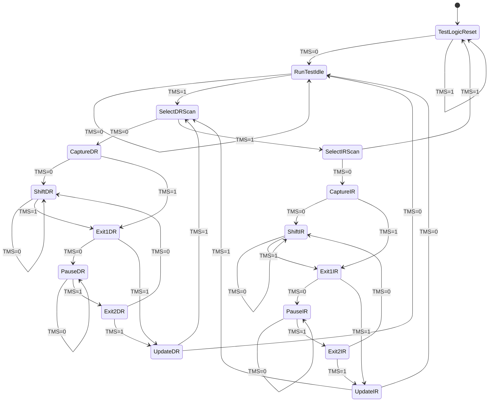

# JTAG & TRACE32 — In-Depth Fundamentals, Working, and Interview Q&A

**Companion to:** [Lauterbach_TRACE32_ARM64_Linux_Kernel_Design.md](Lauterbach_TRACE32_ARM64_Linux_Kernel_Design.md)
**Audience:** Engineers preparing for **Qualcomm** / **AMD** *System Debug* interviews
**Scope:** ARM64 (AArch64) + Linux Kernel, with vendor context
**Goal:** Explain *what JTAG is*, *how it actually works at the protocol level*, *when to use it*, and provide a deep **interview Q&A bank**.

---

## Table of Contents

1. [How to Use This Document](#1-how-to-use-this-document)
2. [What Is JTAG? (The Big Picture)](#2-what-is-jtag-the-big-picture)
3. [JTAG Standards Family](#3-jtag-standards-family)
4. [JTAG Hardware: Pins, Signals & Electrical](#4-jtag-hardware-pins-signals--electrical)
5. [The TAP Controller — 16-State FSM (Heart of JTAG)](#5-the-tap-controller--16-state-fsm-heart-of-jtag)
6. [Instruction Register (IR) & Data Registers (DR)](#6-instruction-register-ir--data-registers-dr)
7. [JTAG Instructions (BYPASS, IDCODE, EXTEST...)](#7-jtag-instructions-bypass-idcode-extest)
8. [Boundary Scan & BSDL (The Original Purpose)](#8-boundary-scan--bsdl-the-original-purpose)
9. [Daisy-Chaining Multiple Devices](#9-daisy-chaining-multiple-devices)
10. [A Worked Scan Example (Bit-by-Bit)](#10-a-worked-scan-example-bit-by-bit)
11. [JTAG vs SWD](#11-jtag-vs-swd)
12. [From JTAG to ARM Debug: DAP, CoreSight & ADIv5/v6](#12-from-jtag-to-arm-debug-dap-coresight--adiv5v6)
13. [How TRACE32 Uses JTAG](#13-how-trace32-uses-jtag)
14. [When to Use JTAG (Decision Guide)](#14-when-to-use-jtag-decision-guide)
15. [JTAG Use Cases in System Debug](#15-jtag-use-cases-in-system-debug)
16. [Vendor Context: Qualcomm & AMD](#16-vendor-context-qualcomm--amd)
17. [Interview Q&A Bank (60+)](#17-interview-qa-bank-60)
18. [Rapid-Fire One-Liners](#18-rapid-fire-one-liners)
19. [Quick-Reference Cheat Sheet](#19-quick-reference-cheat-sheet)
20. [Glossary](#20-glossary)

---

## 1. How to Use This Document

This file is the **theory + interview** companion. It explains the *why* and *how* of JTAG and where TRACE32 sits on top of it. For the **practical TRACE32 command/CMM-script workflow** on ARM64 Linux, use the sibling design document:

> [Lauterbach_TRACE32_ARM64_Linux_Kernel_Design.md](Lauterbach_TRACE32_ARM64_Linux_Kernel_Design.md)

Read order for interview prep:
1. Sections 2–10 → JTAG protocol fundamentals (the part most candidates get wrong).
2. Sections 11–13 → How JTAG becomes "a debugger" on ARM (CoreSight/DAP) and how TRACE32 drives it.
3. Sections 14–16 → Judgment: *when* to reach for JTAG, and vendor-specific realities.
4. Section 17+ → Drill the Q&A.

---

## 2. What Is JTAG? (The Big Picture)

**JTAG** = **Joint Test Action Group**, the committee that authored **IEEE 1149.1**, the *Standard Test Access Port and Boundary-Scan Architecture* (ratified 1990).

Two ways to think about JTAG:

| View | What it means |
|------|---------------|
| **Original intent** | A *manufacturing test* standard. Instead of physically probing every pin/trace on a PCB ("bed of nails"), shift test patterns serially into chips to verify solder joints and interconnects. This is **boundary scan**. |
| **How we use it today** | A general-purpose, low-pin-count **serial access port** into a chip's internals. Silicon vendors hang debug logic, memory-access ports, and on-chip instruments off the same TAP — so JTAG became the universal **debug + programming + bring-up** backbone. |

The crucial mental model:

> **JTAG itself is just a serial transport + a state machine.** It does not "know" what a CPU, breakpoint, or register is. It provides a way to *select a register inside the chip* (via the Instruction Register) and then *shift bits in/out of that register* (via a Data Register). Everything else — debug, flashing, boundary scan — is built on top of that primitive.

```
            ┌──────────────────────────────────────────────┐
            │                  Chip (SoC)                    │
   TCK ───► │   ┌──────────────┐      ┌──────────────────┐  │
   TMS ───► │   │ TAP Controller│────►│ Instruction Reg  │  │
   TDI ───► │   │  (16-state FSM)│     └────────┬─────────┘  │
            │   └──────────────┘              selects        │
            │                          ┌────────▼─────────┐  │
   TDO ◄─── │   ◄──────────────────────│  Data Registers  │  │
            │                          │ BYPASS / IDCODE /│  │
            │                          │ BoundaryScan /DAP│  │
            │                          └──────────────────┘  │
            └──────────────────────────────────────────────┘
```

---

## 3. JTAG Standards Family

| Standard | Name | Why it matters |
|----------|------|----------------|
| **IEEE 1149.1** | Standard Test Access Port & Boundary-Scan | The core JTAG: TAP, TMS/TCK/TDI/TDO, IR/DR, BYPASS/IDCODE/SAMPLE/EXTEST. |
| **IEEE 1149.6** | AC-coupled / differential interconnect test | Boundary scan for high-speed AC-coupled nets (SerDes) that 1149.1 can't test statically. |
| **IEEE 1149.7 (cJTAG)** | Compact JTAG | 2-pin (TCKC/TMSC) advanced protocol; reduces pin count, supports star topologies. Backward-compatible with 1149.1. |
| **IEEE 1149.8.1** | Passive interconnect test | Testing nets without active boundary-scan cells. |
| **IEEE 1500** | Embedded Core Test | Wrapper standard for testing IP cores inside SoCs (related, not identical to 1149.1). |
| **IEEE 1687 (IJTAG)** | Internal JTAG | Standard for accessing *embedded instruments* (BIST, sensors, debug) via a reconfigurable scan network (SIB/network). Modern SoCs use it heavily. |

For ARM debug specifically: the SoC exposes a 1149.1 (or cJTAG) TAP that fronts the **ARM Debug Access Port (DAP)**. ARM also defines **SWD** (Serial Wire Debug) as a 2-pin alternative front-end to the same DAP (see §11).

---

## 4. JTAG Hardware: Pins, Signals & Electrical

### 4.1 The Signals

| Pin | Name | Direction (probe→target) | Purpose |
|-----|------|--------------------------|---------|
| **TCK** | Test Clock | → | Clocks the TAP FSM and all shift registers. All state changes are synchronous to TCK. |
| **TMS** | Test Mode Select | → | Sampled on **rising** TCK edge; drives TAP FSM navigation. |
| **TDI** | Test Data In | → | Serial data shifted *into* the selected IR or DR; sampled on **rising** TCK. |
| **TDO** | Test Data Out | ← | Serial data shifted *out*; updated on **falling** TCK edge. |
| **TRST** *(optional)* | Test Reset | → | Asynchronous, active-low reset of the TAP FSM. Optional because TMS-held-high for 5 TCKs also resets. |

Mandatory: **TCK, TMS, TDI, TDO**. Optional: **TRST**. Often grouped with **nSRST/nRESET** (system reset, *not* a JTAG signal but on the same connector) and reference voltage **VTREF** (lets the probe sense target I/O voltage and level-shift).

### 4.2 Edge Behavior (a classic interview point)

```
TCK   ──┐  ┌──┐  ┌──┐  ┌──
        └──┘  └──┘  └──┘
          ▲ rising: TAP samples TMS and TDI
              ▼ falling: TDO changes (new bit presented)
```

- **TMS & TDI sampled on the rising edge of TCK.**
- **TDO changes on the falling edge of TCK** (so it is stable and valid when the next device/probe samples it on the following rising edge). This half-cycle skew is what makes daisy-chains and high TCK speeds work reliably.

### 4.3 Electrical & Practical

- TCK speeds: typically a few MHz up to ~50 MHz over JTAG; trace ports (separate, parallel) go much faster.
- **VTREF** sets the I/O voltage reference (e.g., 1.8 V, 3.3 V); a good probe auto-adapts.
- Signal integrity: keep TCK short/terminated; ground bounce and reflections corrupt shifts at high speed → reduce TCK if you see garbage IDCODE.
- Pull resistors: TMS and TDI usually pulled high, TRST pulled per board design.

### 4.4 Common Connectors

| Connector | Pins | Notes |
|-----------|------|-------|
| ARM 20-pin (0.1") | 20 | Legacy standard JTAG + some trace. |
| ARM Cortex 10-pin (0.05") | 10 | SWD/JTAG, compact. |
| MIPI-10 / MIPI-20 / MIPI-34 | 10/20/34 | Modern; MIPI-34 carries high-speed parallel trace (TPIU). |
| cJTAG 2-wire | 2 | IEEE 1149.7 compact. |

---

## 5. The TAP Controller — 16-State FSM (Heart of JTAG)

The **TAP (Test Access Port) controller** is a **16-state finite state machine** driven purely by **TMS** on each rising TCK edge. There are no address lines — *you navigate the FSM by clocking a sequence of TMS values.* Two symmetric columns: one for the **DR** (Data Register), one for the **IR** (Instruction Register).



### 5.1 The 16 States, Grouped

| Group | States | Meaning |
|-------|--------|---------|
| Reset/Idle | `Test-Logic-Reset`, `Run-Test/Idle` | Reset clears IR to IDCODE/BYPASS; Idle is the rest state (also where BIST/RUNBIST executes). |
| DR column | `Select-DR-Scan`, `Capture-DR`, `Shift-DR`, `Exit1-DR`, `Pause-DR`, `Exit2-DR`, `Update-DR` | Load/shift/commit the **data** register currently selected by the IR. |
| IR column | `Select-IR-Scan`, `Capture-IR`, `Shift-IR`, `Exit1-IR`, `Pause-IR`, `Exit2-IR`, `Update-IR` | Load/shift/commit the **instruction** register (chooses which DR). |

### 5.2 Key states to remember

- **Test-Logic-Reset (TLR):** Reach from *any* state by holding **TMS=1 for ≥5 TCKs**. Resets TAP; IR loads IDCODE (if implemented) else BYPASS. This is your "I'm lost, get me home" move.
- **Capture-xR:** Parallel-loads a value into the shift register (e.g., Capture-DR for IDCODE loads the 32-bit device ID; Capture-IR loads a fixed pattern ending in `01` for chain integrity checking).
- **Shift-xR:** Each TCK shifts one bit: TDI → register → TDO. **This is where actual data moves.** Stay here N-1 clocks to move N bits.
- **Update-xR:** On the falling edge, the shift register's contents are latched into the *parallel hold register* — i.e., the new IR/DR value takes effect *now*.
- **Pause-xR:** Lets the controller halt mid-shift (e.g., host needs to refill a buffer) without losing data.

### 5.3 A canonical traversal: "shift a new instruction"

```
From Run-Test/Idle:
TMS sequence: 1 1 0 0  → enters Shift-IR
   (Idle→SelectDR→SelectIR→CaptureIR→ShiftIR)
... shift IR bits (TMS=0), last bit with TMS=1 → Exit1-IR ...
TMS: 1 → Update-IR  (instruction now active)
TMS: 0 → Run-Test/Idle
```

---

## 6. Instruction Register (IR) & Data Registers (DR)

### 6.1 Instruction Register (IR)

- A shift register (width is implementation-defined, commonly 4–8 bits; ARM DAP TAPs are typically 4-bit IR).
- The **value in the IR selects which Data Register sits between TDI and TDO.**
- On `Capture-IR`, the two LSBs load as `01` by spec — a quick integrity check that the chain is alive.
- On `Update-IR`, the shifted instruction becomes active.

### 6.2 Data Registers (DR)

The IR points at exactly one DR at a time. Common DRs:

| DR | Width | Selected by | Purpose |
|----|-------|-------------|---------|
| **BYPASS** | 1 bit | `BYPASS` instr | Single flip-flop; passes TDI→TDO to skip this device in a chain. |
| **IDCODE** | 32 bits | `IDCODE` instr | Returns device identity (version, part#, manufacturer JEDEC ID, LSB=1). |
| **Boundary Scan Register (BSR)** | = #boundary cells | `EXTEST`/`SAMPLE`/`INTEST` | One cell per I/O pin for board test. |
| **DPACC / APACC** (ARM) | 35 bits | ARM DAP instrs | Access ARM Debug Port / Access Port registers (this is how debug happens). |

### 6.3 IDCODE format (32-bit)

```
 31            28 27                      12 11           1   0
┌─────────────────┬─────────────────────────┬──────────────┬───┐
│  Version (4b)   │     Part Number (16b)   │ Manuf ID(11b)│ 1 │
└─────────────────┴─────────────────────────┴──────────────┴───┘
                                              (JEDEC)    LSB always 1
```
Bit 0 being `1` lets tools distinguish IDCODE-capable devices from BYPASS-only ones during auto-detection.

---

## 7. JTAG Instructions (BYPASS, IDCODE, EXTEST...)

### 7.1 Mandatory (per IEEE 1149.1)

| Instruction | Selected DR | What it does |
|-------------|-------------|--------------|
| **BYPASS** | BYPASS (1 bit) | Shortest path through the device; used to address other devices in a chain. IR = all 1s. |
| **SAMPLE / PRELOAD** | BSR | **SAMPLE**: snapshot pin states *while system runs* (non-intrusive). **PRELOAD**: load values into BSR cells to be driven later by EXTEST. |
| **EXTEST** | BSR | Drive BSR cell values *onto output pins* and capture input pins → tests board interconnect (solder joints, shorts/opens). |

### 7.2 Optional / common

| Instruction | Purpose |
|-------------|---------|
| **IDCODE** | Select 32-bit ID register (default after reset if implemented). |
| **INTEST** | Drive test patterns *into* the chip's internal logic via BSR (test the device itself). |
| **RUNBIST** | Trigger built-in self-test; results captured in a DR. |
| **CLAMP** | Hold outputs at PRELOADed values (BYPASS selected for data) — used to set safe states on neighbors during test. |
| **HIGHZ** | Tri-state all outputs (board safety during test). |
| **USERCODE** | Read a user-programmable ID (often FPGA bitstream/config ID). |
| Vendor/ARM private | Select DPACC/APACC etc. for debug (ARM uses dedicated IR encodings). |

---

## 8. Boundary Scan & BSDL (The Original Purpose)

### 8.1 Boundary scan cells

Around the chip's core logic, at each I/O pin, sits a **boundary-scan cell** (a couple of flip-flops + muxes). Chained together they form the **Boundary Scan Register (BSR)**. Using `EXTEST`/`SAMPLE`/`PRELOAD`, you can:

- **Observe** every pin without touching the silicon mechanically (SAMPLE).
- **Control** every output pin (PRELOAD + EXTEST) to drive known values across PCB nets.

```
        Core Logic
   ┌───────────────────┐
   │                   │
 ──┤BSC│  BSC  BSC  │BSC├──   ← each pin wrapped by a Boundary Scan Cell
   │  ▲   chained →   │
   └──┼────────────────┘
TDI ──┘ ... ──► TDO   (the BSR shift path)
```

This finds **opens** (broken solder joint → can't read back the driven value) and **shorts** (two nets driven differently but read the same) — without a bed-of-nails fixture. It is still the backbone of PCB manufacturing test (often via boundary-scan tools / ATE).

### 8.2 BSDL (Boundary Scan Description Language)

- A **VHDL-subset text file** the chip vendor provides describing the device's JTAG capabilities: IR length, supported instructions + opcodes, the **boundary register order** (which cell maps to which pin and its type: input/output/control), IDCODE value, pin maps, etc.
- Boundary-scan test tools consume BSDL to *generate* the EXTEST vectors automatically.
- Interview-worthy: **BSDL describes the device; it is not loaded into the device.** It's metadata for the test/debug software.

---

## 9. Daisy-Chaining Multiple Devices

Multiple TAPs share **TCK** and **TMS** (broadcast to all) but are connected **TDI → device → TDO → next device's TDI**, forming one long serial chain.

```
Probe TDI ─► [Dev A] ─► [Dev B] ─► [Dev C] ─► Probe TDO
   TCK ───────┴──────────┴──────────┘  (common)
   TMS ───────┴──────────┴──────────┘  (common)
```

Consequences:
- Because TMS is shared, **all TAPs move through the FSM together** (all in Shift-DR, all in Shift-IR, etc.).
- To talk to one device, put **all others in BYPASS** (1-bit DR each). To reach Dev B's DR, you must shift through Dev A's and Dev C's BYPASS bits too. Tools need to know the **IR lengths and chain order** (the "scan chain configuration").
- **IDCODE scan / BYPASS scan** at reset lets tools auto-discover how many devices and their IDs.

In TRACE32 this is configured via `SYStem.CONFIG` IRPRE/IRPOST/DRPRE/DRPOST (bits before/after the target in the chain) when auto-detection isn't enough.

---

## 10. A Worked Scan Example (Bit-by-Bit)

**Goal:** read the 32-bit IDCODE of a single device.

1. **Reset TAP:** TMS=1 ×5 → `Test-Logic-Reset`. IR auto-loads **IDCODE** (default). Selected DR = IDCODE register.
2. **Go to Shift-DR:** TMS sequence `0,1,0,0`:
   - `0` → Run-Test/Idle
   - `1` → Select-DR-Scan
   - `0` → Capture-DR  *(IDCODE value parallel-loaded into the shift register here)*
   - `0` → Shift-DR
3. **Shift 32 bits:** keep TMS=0 for 31 TCKs; on each TCK, one IDCODE bit appears on **TDO** (LSB first). On the 32nd bit, set **TMS=1** to leave → Exit1-DR.
4. **Return home:** TMS `1` → Update-DR, `0` → Run-Test/Idle.

Result: the 32 bits clocked out of TDO are the IDCODE (LSB = 1 confirms a valid IDCODE device).

> Key takeaway for interviews: **N bits require N-1 clocks in Shift-xR plus the exit clock.** You feed TDI and read TDO *simultaneously* — JTAG is full-duplex shifting.

---

## 11. JTAG vs SWD

ARM offers **SWD (Serial Wire Debug)** as a 2-pin alternative front-end to the *same* Debug Access Port.

| Aspect | JTAG (1149.1) | SWD |
|--------|---------------|-----|
| Pins | 4–5 (TCK,TMS,TDI,TDO,[TRST]) | 2 (SWCLK, SWDIO bidirectional) |
| Topology | Daisy-chain many TAPs | Point-to-point (multidrop SWD adds addressing) |
| Boundary scan | Yes (native purpose) | No (debug only) |
| Trace pins | Separate (TDO not for trace) | SWO single-wire trace possible |
| Behind it | TAP → DAP | SWD-DP → DAP |
| Use when | Bring-up, board test, multi-TAP SoCs, max compatibility | Pin-constrained boards, Cortex-M, debug-only |

Both ultimately drive the ARM **DAP**; the difference is only the *wire protocol* in front of it. **SWJ-DP** is a DAP variant that auto-switches between SWD and JTAG.

---

## 12. From JTAG to ARM Debug: DAP, CoreSight & ADIv5/v6

This is the bridge from "serial test port" to "I can halt a CPU and read kernel memory." (Practical TRACE32 commands for all of this live in the [design doc](Lauterbach_TRACE32_ARM64_Linux_Kernel_Design.md#4-jtag--coresight-integration).)

```
JTAG TAP / SWD-DP
      │  (DPACC / APACC scans)
      ▼
 ┌─────────────┐
 │   ARM DAP   │  Debug Access Port (ADIv5 / ADIv6)
 │  ┌────────┐ │
 │  │  DP    │ │  Debug Port: CTRL/STAT, SELECT, RDBUFF
 │  └───┬────┘ │
 │   selects   │
 │  ┌───▼────┐ │
 │  │  APs   │ │  Access Ports:
 │  │MEM-AP  │ │   • MEM-AP (AHB/AXI/APB) → read/write system & debug memory
 │  │APB-AP  │ │   • JTAG-AP (legacy)
 │  └───┬────┘ │
 └──────┼──────┘
        ▼  memory-mapped
 ┌──────────────────────────────────────────┐
 │            CoreSight Components            │
 │  ROM Table → discovers component base addrs│
 │  ├─ Core Debug (halt/step via EDSCR etc.) │
 │  ├─ CTI / CTM  (cross-trigger sync halt)  │
 │  ├─ ETM/ETMv4  (instruction trace)        │
 │  ├─ Funnel / ETF / TMC / TPIU (trace path)│
 │  └─ ...                                    │
 └──────────────────────────────────────────┘
```

Key ideas:
- **DP (Debug Port):** the part directly behind JTAG/SWD. Has CTRL/STAT (power-up debug domains via `CDBGPWRUPREQ/ACK`), SELECT (chooses AP + register bank), RDBUFF.
- **AP (Access Port):** a bridge from the DAP onto an on-chip bus. **MEM-AP** turns DAP register writes into memory transactions on AHB/AXI/APB → this is how the debugger reads RAM, peripherals, and the cores' debug registers.
- **CoreSight ROM Table:** a discoverable directory at a known base address listing every debug/trace component's address. Tools walk it to find each core's debug block, ETM, CTI, funnel, etc.
- **Core debug registers** (e.g., `EDSCR`, `DBGBVR/DBGBCR`, `DBGWVR/DBGWCR`, `EDITR`) implement halt, single-step, breakpoints, and instruction injection. The **OS Lock (`OSLAR_EL1`)** must be cleared for external debug — see the design doc.
- **CTI/CTM** provide the **cross-trigger** fabric so halting one core halts all (SMP synchronized debug).
- **ADIv6** generalizes ADIv5 to a memory-mapped hierarchy (APs reached via address rather than a fixed index) — relevant on newer SoCs.

So: **JTAG carries DPACC/APACC scans → DAP → MEM-AP → memory-mapped CoreSight → CPU debug logic.** TRACE32 hides all of this behind `SYStem.*` commands.

---

## 13. How TRACE32 Uses JTAG

TRACE32 (Lauterbach) is host software + a **PowerDebug probe**. The flow:

```
TRACE32 PowerView (GUI / CMM scripts)
        │  high-level: Break.Set, Go, Data.Dump, Register.View
        ▼
TRACE32 firmware in PowerDebug probe
        │  generates exact TCK/TMS/TDI sequences (or SWD)
        ▼
JTAG/SWD wires → SoC TAP → DAP → MEM-AP → CoreSight → core debug regs
```

Mapping high-level intent to JTAG mechanics:

| You type | Under the hood (JTAG/DAP) |
|----------|---------------------------|
| `SYStem.Up` | Drive reset, scan IDCODE to detect TAP, power up debug domains (CDBGPWRUPREQ), clear OS lock, halt core via EDSCR. |
| `Break` | Write halt request into CTI/EDSCR through MEM-AP/APB-AP scans. |
| `Data.Dump 0x...` | MEM-AP transaction: write TAR (address), read DRW (data) via APACC scans; with MMU on, TRACE32 walks page tables. |
| `Register.View` | Read core registers via instruction injection (`EDITR`/`DCC`) or dedicated debug regs. |
| `Break.Set fn /Program` | Program `DBGBVR/DBGBCR` (HW breakpoint) or patch a `BRK` instruction (SW breakpoint) via MEM-AP write. |
| `Step` | Set single-step in EDSCR/MDSCR, resume one instruction, re-halt. |
| `ETM.ON` + `Trace.List` | Configure ETM/funnel/ETF via MEM-AP; pull trace bytes from ETF/TMC or stream over trace port; decode on host. |

The probe abstracts JTAG so you almost never hand-craft TMS sequences — but knowing the chain (§9) matters when auto-detect fails (`SYStem.CONFIG IRPRE/DRPRE...`).

See the design doc for the full ARM64 Linux command set and CMM scripts:
- [TRACE32 Software Stack](Lauterbach_TRACE32_ARM64_Linux_Kernel_Design.md#5-trace32-software-stack)
- [Frequently Used TRACE32 Commands](Lauterbach_TRACE32_ARM64_Linux_Kernel_Design.md#16-frequently-used-trace32-commands)

---

## 14. When to Use JTAG (Decision Guide)

JTAG/hardware debug shines exactly where **software-based debugging cannot run or cannot be trusted.**

### 14.1 Decision matrix

| Situation | Best tool | Why |
|-----------|-----------|-----|
| Silicon/board **bring-up**, no software runs yet | **JTAG** | Nothing else exists; you need to poke memory/registers from outside. |
| **Pre-MMU / early boot** debug (before console) | **JTAG** | `printk`/serial not up; JTAG halts at the reset vector. |
| **Hard hang / deadlock**, system unresponsive | **JTAG** | Kernel can't print; JTAG attaches non-intrusively and unwinds stacks. |
| **CPU stuck in WFI / lockup / no heartbeat** | **JTAG** | Only external debug can observe a frozen core. |
| Debugging the **debugger infra itself** (kgdb broken) | **JTAG** | Independent of target software. |
| **Secure world / TrustZone (EL3, BL31, OP-TEE)** | **JTAG** (if SPIDEN) | Software debuggers usually can't cross into secure EL3. |
| **Memory corruption** needing HW watchpoint on a physical address | **JTAG** | HW watchpoints catch the writing instruction precisely. |
| **Instruction trace / timing** root-cause (race, perf) | **JTAG + ETM/CoreSight** | Non-intrusive cycle-accurate trace, no code changes. |
| Reproducible bug **with a working console** | `printk`, ftrace, `kgdb` | Faster, no probe needed. |
| **Production fleet** field debugging | Logs / crash dumps / kdump | JTAG fused off; can't physically attach. |
| Userspace app logic bug | `gdb`/`perf` | Don't need hardware-level access. |

### 14.2 Rule of thumb

> Use **JTAG when the software stack is absent, frozen, untrustworthy, or privileged beyond software's reach.** Use software tools (`printk`, ftrace, perf, kgdb, kdump) when the system is alive enough to help you and you value speed/convenience.

### 14.3 JTAG vs common Linux software debug

| Tool | Intrusive? | Needs system alive? | Sees pre-boot / secure? | Trace? |
|------|-----------|---------------------|-------------------------|--------|
| **JTAG (TRACE32)** | Optional (can be non-intrusive attach) | No | Yes (with auth) | Yes (ETM) |
| `printk`/dmesg | Yes (adds code) | Yes | No | No |
| `ftrace` | Low | Yes (kernel running) | No | Function trace only |
| `perf` | Low | Yes | No | Sampling/PMU |
| `kgdb`/`kdb` | Yes (over serial) | Mostly | No | No |
| `kdump`/crash | Post-mortem | Captures at crash | No | No |

---

## 15. JTAG Use Cases in System Debug

1. **Silicon bring-up / new board** — verify clocks, DDR init, peripheral registers before any firmware boots; flash the first bootloader.
2. **Bootloader → kernel handoff** — break at the reset vector, step through ATF/BL31 → U-Boot → `start_kernel`, switch physical→virtual addressing as MMU enables (see design doc §14 Scenario 5).
3. **Kernel panic / oops post-mortem** — attach without reset, read `ELR_EL1`/`SPSR_EL1`, unwind the faulting stack.
4. **Hung task / deadlock** — non-intrusive attach, inspect all task states, find the lock owner (design doc §14 Scenario 2).
5. **SMP race conditions** — CTI synchronized halt of all cores, per-core breakpoints, ETM trace to reconstruct ordering.
6. **Memory corruption** — hardware watchpoint on the victim address; the probe halts on the offending write.
7. **DMA / cache coherency bugs** — observe physical memory via AXI-AP bypassing the MMU/caches.
8. **Secure world debug** — EL3/OP-TEE with `SPIDEN` asserted.
9. **Performance / latency analysis** — ETM trace + `Trace.STATistic`/profiling without instrumenting code.
10. **Manufacturing test** — boundary scan EXTEST for solder-joint/interconnect verification on the production line.

---

## 16. Vendor Context: Qualcomm & AMD

> Treat these as *talking points*; specifics are NDA/SoC-dependent. The goal is to show you understand each company's debug landscape.

### 16.1 Qualcomm (Snapdragon — ARM64)

- **Architecture:** ARMv8/v9 (Kryo CPUs derived from Cortex), heterogeneous SoC with CPU clusters, **Hexagon DSP**, Adreno GPU, modem, and multiple subsystems — many with their *own* debug TAPs/subsystem debuggers.
- **CoreSight + QDSS:** Qualcomm's on-chip debug/trace is branded **QDSS (Qualcomm Debug SubSystem)**, built on ARM CoreSight (ETM/STM/funnels/ETF/ETR). **STM (System Trace Macrocell)** is heavily used for software-instrumented system trace across subsystems.
- **Secure debug:** Production devices have JTAG/debug **gated by eFuses** and secure-boot policy. Debug authentication (`DBGEN/NIDEN/SPIDEN/SPNIDEN`) is controlled by signed debug certificates / fuse state. "Why can't I JTAG a retail phone?" → fuses blown + secure debug disabled.
- **Multi-subsystem reality:** A system-debug engineer often debugs not just the apps CPU but modem/DSP hangs, inter-processor communication (glink/SMP2P), and trace correlation across subsystems via QDSS/STM.
- **Tools:** Lauterbach TRACE32 is widely used; also Qualcomm-internal tools and ETR-to-DDR trace capture.
- **Likely interview angles:** CoreSight topology, STM vs ETM, secure debug/fuses, cross-trigger across subsystems, DDR/bring-up, cache/coherency (DSU, CCI/CMN interconnect).

### 16.2 AMD (x86 primarily; also ARM/embedded)

- **x86 debug differs from ARM JTAG-CoreSight:**
  - x86 cores expose **probe-mode / HDT (Hardware Debug Tool)** debug access, historically via a JTAG-like port; AMD/Intel use vendor debug ports rather than ARM CoreSight.
  - **DCI (Direct Connect Interface)** / debug over USB exists in the x86 world for closed-chassis debug (more Intel-branded; AMD has analogous mechanisms).
  - On-chip trace: x86 uses **branch trace / processor trace**-style features rather than ARM ETM.
- **Architectural debug concepts that transfer:** breakpoints/watchpoints (x86 DR0–DR7 debug registers), SMM (System Management Mode) as a privileged context analogous-in-spirit to secure world, microcode/PSP (Platform Security Processor) as a secure subsystem.
- **AMD also ships ARM-based IP:** the **PSP (Platform Security Processor)** is an ARM core; AMD's embedded/adaptive (Xilinx) and some SoCs use ARM + CoreSight, so ARM JTAG/CoreSight knowledge still applies.
- **Likely interview angles:** x86 vs ARM debug architecture differences, debug registers (DR0–DR7), SMM/secure contexts, post-silicon validation, JTAG for bring-up/board test, coherency (Infinity Fabric), and platform debug (BMC/JTAG headers on server boards).

### 16.3 Common thread for both

Both teams value: **JTAG/boundary-scan fundamentals**, **on-chip trace** understanding, **secure/debug-authentication** awareness, **multi-core/coherency** debugging, **bring-up** skills, and the judgment for **when hardware debug beats software debug** (§14).

---

## 17. Interview Q&A Bank (60+)

### A. JTAG Basics & Protocol

**Q1. What does JTAG stand for and what problem did it originally solve?**
Joint Test Action Group; standardized as IEEE 1149.1. It solved PCB **manufacturing test** — verifying solder joints and interconnects via *boundary scan* instead of physical bed-of-nails probing.

**Q2. Name the JTAG signals and their direction.**
TCK (clock), TMS (mode select), TDI (data in), TDO (data out), optional TRST (test reset). TCK/TMS/TDI are inputs to the target; TDO is the output. (Plus VTREF for I/O reference, nSRST for system reset on the connector.)

**Q3. On which clock edges are TMS/TDI sampled and TDO updated?**
TMS and TDI are sampled on the **rising** edge of TCK; TDO changes on the **falling** edge. The half-cycle skew ensures TDO is stable before the next device samples it.

**Q4. Is TRST mandatory? How else can you reset the TAP?**
No. Hold **TMS=1 for ≥5 TCK cycles** to reach Test-Logic-Reset from any state.

**Q5. What is the minimum number of JTAG pins?**
Four: TCK, TMS, TDI, TDO (TRST optional).

**Q6. What is IDCODE and what's in it?**
A 32-bit device identity register: Version[31:28], Part Number[27:12], JEDEC Manufacturer ID[11:1], and bit[0]=1. Bit 0 = 1 marks a valid IDCODE-capable device.

**Q7. What instruction is loaded into the IR after Test-Logic-Reset?**
IDCODE (if implemented), otherwise BYPASS.

**Q8. What is BYPASS and why does it exist?**
A 1-bit DR that passes TDI→TDO. In a daisy chain, you put non-target devices in BYPASS so you only shift 1 extra bit per device to reach the target.

**Q9. What's the difference between SAMPLE and PRELOAD?**
SAMPLE snapshots live pin values non-intrusively; PRELOAD loads values into boundary-scan cells to be driven later by EXTEST. They share an opcode (SAMPLE/PRELOAD).

**Q10. What does EXTEST do?**
Drives PRELOADed boundary-scan values onto output pins and captures input pins — testing board-level interconnect (opens/shorts).

**Q11. INTEST vs EXTEST?**
EXTEST tests *external* board interconnect (drives pins outward); INTEST drives test patterns *into the chip's internal logic* to test the device itself.

**Q12. What is HIGHZ / CLAMP used for?**
HIGHZ tri-states all outputs (board safety); CLAMP holds outputs at PRELOADed values while BYPASS is selected for data (safe states on neighbors during test).

### B. TAP State Machine

**Q13. How many states does the TAP FSM have?**
16, in two symmetric columns (DR and IR) plus Test-Logic-Reset and Run-Test/Idle.

**Q14. What single input drives the TAP FSM?**
TMS (sampled on rising TCK). There are no address lines — you navigate by clocking TMS sequences.

**Q15. What happens in Capture-DR vs Shift-DR vs Update-DR?**
Capture-DR parallel-loads a value into the shift register; Shift-DR shifts bits TDI→TDO one per TCK; Update-DR latches the shifted value into the parallel/hold register so it takes effect.

**Q16. Why does Capture-IR load `01` into the two LSBs?**
A spec-mandated integrity pattern — shifting it out confirms the chain is intact and correctly clocked.

**Q17. What is Pause-DR for?**
To halt mid-shift (e.g., host buffer refill) without exiting the shift operation or losing data.

**Q18. From Run-Test/Idle, give the TMS sequence to start shifting a DR.**
`1,0,0` → Select-DR-Scan, Capture-DR, Shift-DR.

**Q19. To shift N bits through a register, how many TCKs in Shift state?**
N-1 clocks while TMS=0, then assert TMS=1 on the Nth bit to exit. You read TDO and drive TDI simultaneously (full-duplex).

**Q20. Where does RUNBIST execute and where are results read?**
Triggered in Run-Test/Idle (the BIST runs there), results captured into a DR and shifted out.

### C. Boundary Scan & BSDL

**Q21. What is the Boundary Scan Register?**
The chain of boundary-scan cells (one or more per I/O pin) that lets you observe/control every pin serially.

**Q22. What is a BSDL file? Is it loaded into the device?**
A VHDL-subset description of a device's JTAG features (IR length, instruction opcodes, boundary register order, IDCODE, pin map). It's **metadata for the test tool**, *not* loaded into the chip.

**Q23. How does boundary scan detect an open vs a short?**
Open: a driven value can't be read back on the connected net. Short: two nets driven differently read the same value. Tools infer net faults from the captured patterns.

**Q24. Can you do boundary scan while the system runs?**
SAMPLE can snapshot pins non-intrusively while running; EXTEST is intrusive (it drives pins) and is for test, not live operation.

### D. Daisy Chain & Multi-TAP

**Q25. How are multiple devices connected on one JTAG chain?**
Shared TCK and TMS (broadcast); TDI→Dev→TDO→next Dev's TDI in series. All TAPs traverse the FSM together.

**Q26. To read Dev B's DR in a 3-device chain, what about Dev A and C?**
Put A and C in BYPASS; you must still shift through their 1-bit BYPASS registers (account for their bit positions). The tool needs IR lengths and chain order.

**Q27. How do tools auto-discover a chain?**
Reset → all devices default to IDCODE (or BYPASS); shift out and parse to count devices and read IDs. In TRACE32, IRPRE/IRPOST/DRPRE/DRPOST describe the chain when needed.

### E. JTAG vs SWD & ARM Debug

**Q28. JTAG vs SWD — key differences?**
JTAG: 4–5 pins, daisy-chainable, supports boundary scan. SWD: 2 pins (SWCLK + bidirectional SWDIO), point-to-point, debug-only, supports SWO trace. Both front-end the same ARM DAP; SWJ-DP auto-switches.

**Q29. What is the ARM DAP?**
Debug Access Port — the block behind JTAG/SWD. It has a DP (Debug Port: CTRL/STAT, SELECT, RDBUFF) and one or more APs (Access Ports).

**Q30. What is a MEM-AP?**
A Memory Access Port: bridges DAP register accesses onto an on-chip bus (AHB/AXI/APB), letting the debugger read/write system memory, peripherals, and core debug registers.

**Q31. What is the CoreSight ROM Table?**
A discoverable table at a known base listing the addresses of all debug/trace components (core debug, ETM, CTI, funnels). Tools walk it to locate everything.

**Q32. What are DPACC and APACC?**
The JTAG scan instructions/registers (35-bit) used to access DP and AP registers respectively — the mechanism by which JTAG scans become DAP transactions.

**Q33. How does a debugger halt an ARM64 core via JTAG?**
Through the DAP/MEM-AP it writes the core's external debug registers (e.g., EDSCR halt request) and/or triggers the CTI; the core enters debug state.

**Q34. What is the OS Lock and why does it matter?**
`OSLAR_EL1` — the OS Lock blocks external debug register access. It must be cleared (TRACE32 does this on `SYStem.Up`) before JTAG can debug, preventing the OS and debugger from clobbering debug state.

**Q35. What is CTI/CTM and why is it needed for SMP?**
Cross Trigger Interface/Matrix — broadcasts halt/resume triggers so all cores stop/start together for synchronized SMP debugging.

**Q36. ADIv5 vs ADIv6?**
ADIv5 is the classic DAP architecture (fixed AP indices). ADIv6 generalizes APs into a memory-mapped hierarchy addressed by address, scaling to complex SoCs.

**Q37. How does the debugger read CPU general-purpose registers?**
Via instruction injection — it feeds instructions (through EDITR/DCC) that move register contents to a data channel the debugger reads, since GPRs aren't directly memory-mapped.

**Q38. Difference between a hardware and software breakpoint on ARM64?**
HW breakpoint uses DBGBVR/DBGBCR comparators (limited count, works in ROM/read-only). SW breakpoint patches a BRK instruction into memory (unlimited, needs writable memory).

### F. TRACE32 / Tooling

**Q39. What does `SYStem.Up` vs `SYStem.Mode.Attach` do?**
`SYStem.Up` resets the target then connects/halts. `SYStem.Mode.Attach` connects to a *running* target non-intrusively (no reset) — used for post-mortem/hang debug.

**Q40. How does TRACE32 read virtual kernel addresses?**
With MMU awareness (`MMU.FORMAT LINUX`, `MMU.ON`) it reads TTBR0/TTBR1_EL1 and walks the page tables to translate VA→PA. (See design doc §10.)

**Q41. How do you debug before the MMU is enabled?**
Use physical addresses for breakpoints; after MMU enables, switch to virtual symbols. (Design doc §14 Scenario 5.)

**Q42. What is ETM and how is its data captured?**
Embedded Trace Macrocell produces instruction (program-flow) trace. Captured on-chip in ETF/ETR/TMC buffers or streamed off-chip via TPIU to the probe, then decoded on the host.

**Q43. Why might IDCODE read as garbage / all 1s / all 0s?**
TCK too fast / signal integrity, wrong VTREF/level, chain misconfigured, device unpowered, or TAP not reset. Lower TCK, check power/connector, reset TAP.

**Q44. The probe says "cannot access target" — first things to check?**
Power/clock to SoC, OS Lock set, debug authentication (DBGEN) disabled/fused, reset held, wrong CPU/coresight base config, or chain order wrong.

### G. Security / Debug Authentication

**Q45. Name the ARM debug authentication signals.**
DBGEN (non-secure invasive), NIDEN (non-secure non-invasive/trace), SPIDEN (secure invasive), SPNIDEN (secure non-invasive/trace).

**Q46. Why can't you JTAG a production phone?**
Debug is gated by eFuses and secure-boot policy; DBGEN/SPIDEN are deasserted, so the DAP/core debug is disabled. Often the JTAG port is fused off entirely.

**Q47. How do you debug secure world (EL3/OP-TEE)?**
Requires SPIDEN asserted (secure invasive debug enabled), typically only on development/unfused parts; then TRACE32 can access EL3/secure code.

**Q48. What's the risk of leaving debug enabled in production?**
Full memory/register access bypasses secure boot and exposes keys/secrets — a major attack surface; hence fusing debug off.

### H. Linux Kernel Debug Scenarios

**Q49. The board hangs with no console output. How do you debug?**
JTAG attach (non-intrusive), check all core states/PCs, identify stuck core (e.g., in WFI or spinning), unwind stacks, inspect lock owners. (Design doc §14 Scenario 2.)

**Q50. How do you root-cause kernel memory corruption with JTAG?**
Set a hardware **watchpoint** on the corrupted address (`Break.Set addr /Write`); the core halts on the writing instruction; inspect PC/stack to find the culprit.

**Q51. KASLR is on and symbols don't resolve — what do you do?**
Determine the KASLR offset (e.g., from `kimage_voffset`/awareness) and relocate symbols (`/RelocationDelta`), or rely on TRACE32 Linux awareness auto-relocation. (Design doc §8.)

**Q52. How do you debug a dynamically loaded kernel module?**
Find its load address (Linux awareness / `struct module` core_layout.base) and load the `.ko` symbols at that address (`TASK.sYmbol.AddModule`). (Design doc §11.)

**Q53. How do you get per-task stacks for a sleeping process?**
Linux awareness `TASK.Select <pid>` then `Frame.view` — TRACE32 reads thread_info/saved context to unwind even non-running tasks.

**Q54. Why enable CONFIG_DEBUG_INFO and CONFIG_FRAME_POINTER for JTAG debug?**
DEBUG_INFO provides DWARF for source-level debug and variable types; FRAME_POINTER enables reliable stack unwinding.

**Q55. Post-mortem after a panic — what registers reveal the fault?**
ELR_EL1 (faulting/return PC), SPSR_EL1 (saved state), ESR_EL1 (exception cause), FAR_EL1 (faulting address); then unwind from SP.

### I. Conceptual / Judgment

**Q56. When would you NOT use JTAG?**
When the system is alive and a console works — `printk`/ftrace/perf/kgdb are faster; and on production/fused devices where JTAG is unavailable (use kdump/logs).

**Q57. JTAG vs kgdb — trade-offs?**
kgdb is software over serial/net (needs a mostly-working kernel, intrusive). JTAG is hardware-level (works pre-boot, on hangs, on secure code, non-intrusive attach) but needs a probe and physical access.

**Q58. Is JTAG attach intrusive?**
It can be non-intrusive: `SYStem.Mode.Attach` connects without reset and can inspect state without altering execution until you set breakpoints/halt.

**Q59. Why is on-chip trace (ETM) better than printk for timing bugs?**
ETM captures actual instruction flow cycle-accurately with zero code changes, so it doesn't perturb timing (Heisenbugs) the way added prints do.

**Q60. How do you debug an SMP race with JTAG?**
Use CTI synchronized halt, per-core breakpoints, and ETM trace with context-ID/timestamps to reconstruct the interleaving across cores.

**Q61. What's the difference between invasive and non-invasive debug?**
Invasive = halt/step/modify the core (DBGEN/SPIDEN). Non-invasive = observe only, e.g., trace/PMU (NIDEN/SPNIDEN) without stopping execution.

**Q62. Explain the full path from `Data.Dump 0xADDR` to bits on the wire.**
TRACE32 → probe firmware → JTAG scans (APACC) program MEM-AP TAR=addr, read DRW → MEM-AP issues an AXI/AHB read → data returns through DAP → shifted out on TDO → host displays it (with MMU walk if VA).

---

## 18. Rapid-Fire One-Liners

- JTAG = serial test/debug port standardized as **IEEE 1149.1**.
- 4 mandatory signals: **TCK, TMS, TDI, TDO** (+optional TRST).
- TMS/TDI sampled on **rising** TCK; TDO changes on **falling** TCK.
- TAP FSM has **16 states**, driven only by **TMS**.
- Reset TAP: **TMS=1 for 5 TCKs**.
- **IR** selects which **DR** sits between TDI/TDO.
- **BYPASS** = 1-bit DR to skip a device in a chain.
- **IDCODE** = 32-bit ID, LSB=1.
- **EXTEST/SAMPLE/PRELOAD** = boundary-scan board test (the original purpose).
- **BSDL** describes a device (not loaded into it).
- JTAG/SWD → **ARM DAP** → **MEM-AP** → **CoreSight** → core debug regs.
- **CTI/CTM** = synchronized multi-core halt.
- **OS Lock (OSLAR_EL1)** must be cleared for external debug.
- **DBGEN/NIDEN/SPIDEN/SPNIDEN** gate (non)secure (non)invasive debug.
- Use JTAG when software is **absent, frozen, untrusted, or too privileged**.
- Production parts: JTAG often **fused off**.
- ETM = instruction trace (non-intrusive); buffered in ETF/ETR/TMC or streamed via TPIU.

---

## 19. Quick-Reference Cheat Sheet

### Signals
```
TCK  Test Clock      (→ target)   clocks the FSM & shifts
TMS  Mode Select     (→ target)   navigates the 16-state FSM (rising edge)
TDI  Data In         (→ target)   shifts into IR/DR (rising edge)
TDO  Data Out        (← target)   shifts out (falling edge)
TRST Test Reset      (→ target)   optional async TAP reset
VTREF I/O ref voltage             probe level-shifts to this
```

### TAP FSM landmarks
```
Test-Logic-Reset  ← TMS=1 ×5 from anywhere
Run-Test/Idle     ← rest state, BIST runs here
Capture-xR        ← parallel load
Shift-xR          ← move bits (TDI→TDO), N-1 clocks for N bits
Update-xR         ← commit (value takes effect)
Pause-xR          ← halt mid-shift safely
```

### Mandatory instructions
```
BYPASS            1-bit passthrough (skip device)
SAMPLE/PRELOAD    snapshot pins / preload BSR
EXTEST            drive pins → board interconnect test
(IDCODE optional but near-universal)
```

### ARM debug stack
```
JTAG/SWD → DP (CTRL/STAT,SELECT,RDBUFF)
        → AP (MEM-AP: AHB/AXI/APB)
        → CoreSight ROM Table
        → Core debug (EDSCR, DBGBVR/BCR, DBGWVR/WCR, EDITR)
        + CTI/CTM (sync halt), ETM (trace), funnel/ETF/TMC/TPIU
```

### When to reach for JTAG
```
✔ bring-up / pre-MMU boot / dead board
✔ hard hang / WFI lockup / no console
✔ secure world (with SPIDEN)
✔ HW watchpoint for memory corruption
✔ ETM trace for races/timing
✘ alive system w/ console (use printk/ftrace/perf/kgdb)
✘ production fused device (use kdump/logs)
```

---

## 20. Glossary

| Term | Meaning |
|------|---------|
| **TAP** | Test Access Port — the JTAG state machine + pins. |
| **IR / DR** | Instruction Register / Data Register. |
| **BSR** | Boundary Scan Register (chain of boundary cells). |
| **BSDL** | Boundary Scan Description Language (device metadata). |
| **IDCODE** | 32-bit device identification register. |
| **BYPASS** | 1-bit passthrough DR. |
| **cJTAG** | Compact JTAG, IEEE 1149.7 (2-pin). |
| **SWD** | Serial Wire Debug (ARM 2-pin debug). |
| **DAP** | Debug Access Port (ARM). |
| **DP / AP** | Debug Port / Access Port within the DAP. |
| **MEM-AP** | Memory Access Port (bridge to AHB/AXI/APB). |
| **CoreSight** | ARM's on-chip debug & trace architecture. |
| **ROM Table** | Discoverable directory of CoreSight component addresses. |
| **CTI / CTM** | Cross Trigger Interface / Matrix (sync halt/trigger). |
| **ETM** | Embedded Trace Macrocell (instruction trace). |
| **STM** | System Trace Macrocell (software-instrumented trace). |
| **TPIU / ETF / ETR / TMC** | Trace port / on-chip FIFO / DRAM router / memory controller. |
| **OS Lock** | OSLAR_EL1 gate on external debug access. |
| **DBGEN/NIDEN/SPIDEN/SPNIDEN** | Debug authentication signals. |
| **QDSS** | Qualcomm Debug SubSystem (CoreSight-based). |
| **HDT / DCI** | x86 hardware debug tool / Direct Connect Interface. |
| **PSP** | AMD Platform Security Processor (ARM-based secure core). |
| **ADIv5 / ADIv6** | ARM Debug Interface architecture versions. |

---

*Document Version: 1.0 | Companion to the TRACE32 ARM64 Linux design doc | Focus: JTAG fundamentals, working, when-to-use, and interview Q&A | Target roles: Qualcomm & AMD System Debug*
