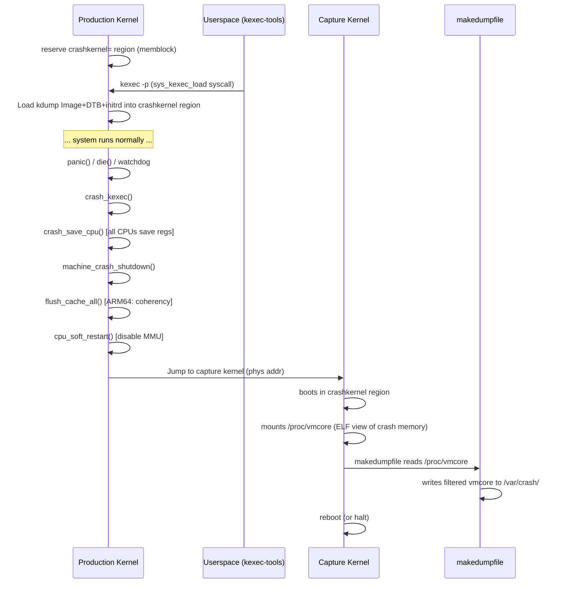

# Crash Dump (kdump) on ARM64 — Deep Dive for Kernel Engineers

---

## 1. WHY — The Motivation

### The Fundamental Problem
When the kernel panics, the system is in an undefined state. Without a mechanism to capture memory, **all evidence of the crash vanishes** when the machine reboots. You lose:
- The faulting instruction pointer (`pc`, `lr`, `sp`, `x0–x30`)
- The kernel stack of the crashing CPU
- The call chain that led to the fault
- Memory allocator state, lock owner info, RCU state, scheduler state
- Device driver state, DMA buffers

### What kdump Gives You
kdump gives you a **complete physical memory snapshot** (`vmcore`) of the crashed kernel's address space at the exact moment of panic. With it you can:
- Replay the exact stack trace with `crash(8)`
- Inspect every kernel data structure (task structs, skbs, inodes, etc.)
- Find the root cause: UAF, null deref, stack overflow, deadlock, memory corruption, etc.

---

## 2. WHEN — Trigger Points

kdump is invoked by the kernel at the following points:

| Trigger | Code Path |
|---|---|
| `panic()` | `kernel/panic.c` → `crash_kexec()` |
| `die()` (unhandled fault) | `arch/arm64/kernel/traps.c` → `die()` → `oops_end()` → `panic()` → `crash_kexec()` |
| Hard lockup / NMI watchdog | `kernel/watchdog.c` → `panic()` |
| RCU stall timeout | `kernel/rcu/*.c` → `panic()` |
| Explicit `sysrq-c` | sysrq-trigger → `handle_sysrq('c')` → `panic()` |
| Machine Check Exception | Platform-specific → `panic()` |
| `kexec -p` loaded and `echo c > /proc/sysrq-trigger` | direct trigger |

### The Key Kernel Call Chain

```
panic()
  └─ crash_kexec()                    [kernel/kexec_core.c]
       └─ machine_crash_shutdown()    [arch/arm64/kernel/machine_kexec.c]
            └─ cpu_soft_restart()     [arch/arm64/kernel/cpu-reset.S]
                 └─ capture kernel boots in kdump kernel
```

---

## 3. WHERE — The Architecture (Two-Kernel Approach)

This is the most critical concept. kdump uses **kexec** to boot a second, independent kernel *within* a pre-reserved physical memory region, while the crashed kernel's memory is left intact.

### Memory Layout on ARM64

```
Physical Memory Map (example: 8 GiB system)
┌───────────────────────────────────────────┐  0x0000_0000_0000_0000
│  First 1MB (usually reserved/BIOS/EFI)   │
├───────────────────────────────────────────┤  0x0000_0000_0010_0000
│                                           │
│         Production ("1st") Kernel         │
│         + all user processes              │
│         + all kernel data structures      │
│         (the "OLD" memory = crash memory) │
│                                           │
├───────────────────────────────────────────┤  e.g., 0x0000_0001_C000_0000
│                                           │
│    crashkernel reserved region            │  ← kdump kernel lives HERE
│    (e.g., crashkernel=256M@1G)            │
│    Contains:                              │
│      - kdump kernel Image                 │
│      - kdump initramfs                    │
│      - kdump kernel page tables           │
│      - device tree (DTB) copy             │
│                                           │
└───────────────────────────────────────────┘  0x0000_0002_0000_0000
```

### The crashkernel= Kernel Command Line Parameter

```bash
# Static reservation
GRUB_CMDLINE_LINUX="crashkernel=256M@512M"

# Auto-placement (kernel decides where)
GRUB_CMDLINE_LINUX="crashkernel=256M"

# ARM64-specific: high memory for large systems
GRUB_CMDLINE_LINUX="crashkernel=512M,high"
# The ',high' flag is important on ARM64 with >4GB RAM
# because the capture kernel must be in the low 4GB on some platforms
```

The reservation happens early in `setup_arch()`:

```c
// arch/arm64/mm/init.c
void __init arm64_memblock_init(void)
{
    ...
    reserve_crashkernel();   // calls memblock_reserve()
    ...
}
```

---

## 4. HOW — The Complete Mechanism

### Phase 1: Boot-time Setup (Production Kernel)

**Step 1: Reserve crashkernel memory**

```c
// kernel/crash_core.c
void __init reserve_crashkernel(void)
{
    unsigned long long crash_size, crash_base;

    // Parse crashkernel= cmdline
    ret = parse_crashkernel(boot_command_line, meminfo.total_size,
                            &crash_size, &crash_base);

    // Reserve via memblock (before buddy allocator starts)
    memblock_reserve(crash_base, crash_size);

    crashk_res.start = crash_base;
    crashk_res.end   = crash_base + crash_size - 1;
}
```

**Step 2: Load kdump kernel via kexec**

Userspace tool `kexec-tools` loads the capture kernel:

```bash
kexec -p /boot/vmlinuz \
      --initrd=/boot/initrd-kdump.img \
      --append="irqpoll maxcpus=1 reset_devices \
                systemd.unit=kdump.service \
                nr_cpus=1 usbcore.nousb \
                rd.neednet=0 \
                1 boot_delay=0"
```

The `kexec -p` (`-p` = panic kernel) syscall path:

```
sys_kexec_load()
  └─ kexec_load_purgatory()       // loads the "purgatory" trampoline
  └─ kexec_add_buffer()           // maps new kernel image into crash region
  └─ arch_kexec_apply_relocations_add()  // ARM64: applies ELF relocations
  └─ machine_kexec_prepare()      // arch/arm64/kernel/machine_kexec.c
```
Why do we need kexec_load_purgatory()?
When sys_kexec_load() prepares the system for a fast reboot, kexec_load_purgatory() is responsible for loading this intermediate binary into memory. This code executes two vital tasks before handing off control:

Sha256 Integrity Verification (The Most Critical Job): Before jumping into the new kernel, the purgatory code calculates a checksum of the new kernel's binary image in memory and compares it against a pre-calculated hash. If a memory corruption happened or a bad image was loaded, it stops the boot to prevent a catastrophic system panic.

Architecture Architecture Setup:
It sets up basic CPU registers and switches the processor mode (e.g., preparing page tables or setting up a minimal GDT on x86_64) so that the new kernel finds the CPU in the exact state it expects upon entry.

**What kexec stores in the crashkernel region:**

```
crashkernel region layout:
┌──────────────────────────────────┐ crashk_res.start
│  kexec_control_page             │  (one page, for CPU entry)
│  (machine_kexec_prepare sets     │
│   this to contain jump code)    │
├──────────────────────────────────┤
│  purgatory (trampoline code)    │  (SHA256 verify + arch setup)
├──────────────────────────────────┤
│  ARM64 Image (capture kernel)   │
├──────────────────────────────────┤
│  device tree blob (FDT)         │
│  (modified to show only          │
│   crashkernel mem range)        │
├──────────────────────────────────┤
│  initramfs (kdump initrd)       │
└──────────────────────────────────┘ crashk_res.end
```

---

### Phase 2: Crash Time — The Handoff

This is the most ARM64-specific part.

**Step 1: `crash_kexec()` is called**

```c
// kernel/kexec_core.c
void crash_kexec(struct pt_regs *regs)
{
    // Prevent recursive crash_kexec
    if (kexec_crash_image) {
        struct kimage *image = kexec_crash_image;

        // Save registers of the crashing CPU into
        // elfcorehdr (ELF PT_NOTE segments)
        crash_save_cpu(regs, smp_processor_id());

        machine_crash_shutdown(&regs);  // arch-specific
        machine_kexec(image);           // JUMP to capture kernel
    }
}
```

**Step 2: `machine_crash_shutdown()` — ARM64-specific**

```c
// arch/arm64/kernel/machine_kexec.c
void machine_crash_shutdown(struct pt_regs *regs)
{
    local_irq_disable();

    // 1. Crash-stop all other CPUs via IPI
    //    Each secondary CPU calls crash_save_cpu() for its own regs
    //    then goes into a holding pen (WFI loop)
    crash_smp_send_stop();

    // 2. Save the crashing CPU's registers
    crash_save_cpu(regs, smp_processor_id());

    // 3. Disable all external interrupts at GIC level
    machine_kexec_mask_interrupts();

    // 4. Flush caches to ensure all dirty data is in RAM
    //    CRITICAL on ARM64: capture kernel must see coherent memory
    //    Uses: DC CIVAC (clean+invalidate by VA to PoC)
    flush_cache_all();

    // 5. On systems with EFI: restore EFI memory map
    efi_reboot(REBOOT_UNDEFINED, NULL);
}
```

**Step 3: ARM64 Cache Coherency — The Critical Detail**

This is where many ARM64 kdump bugs live. ARM64 requires explicit cache maintenance because:

- The crash kernel boots with MMU/caches OFF initially
- If cache lines are dirty and not flushed, the capture kernel reads stale data from RAM
- `__flush_dcache_area()` and `dcache_clean_poc()` are called

```asm
/* arch/arm64/mm/cache.S */
/*
 * flush_cache_all - flush all caches (D+I) to PoC
 * Called during machine_crash_shutdown
 */
SYM_FUNC_START(flush_cache_all)
    mov x0, #0
    dc  cisw, x0    /* Clean+Invalidate by Set/Way */
    ...
SYM_FUNC_END(flush_cache_all)
```

**Step 4: `machine_kexec()` — The Jump**

```c
// arch/arm64/kernel/machine_kexec.c
void machine_kexec(struct kimage *kimage)
{
    void *reboot_code_buffer;

    // Get the control page (pre-allocated in crashkernel region)
    reboot_code_buffer = page_to_virt(kimage->control_code_page);

    // Copy the relocation code to control page
    // This code runs with MMU OFF and moves kernel segments
    // to their final positions
    memcpy(reboot_code_buffer, arm64_relocate_new_kernel,
           arm64_relocate_new_kernel_size);

    // Flush the control page to PoC (coherency point)
    __flush_dcache_area(reboot_code_buffer, arm64_relocate_new_kernel_size);
    flush_icache_range(reboot_code_buffer,
                       reboot_code_buffer + arm64_relocate_new_kernel_size);

    // Disable MMU, jump to purgatory/capture kernel
    cpu_soft_restart(virt_to_phys(reboot_code_buffer), ...);
}
```

**Step 5: `cpu_soft_restart()` — Point of No Return**

```asm
/* arch/arm64/kernel/cpu-reset.S */
SYM_FUNC_START(cpu_soft_restart)
    /* x0 = entry point (phys addr of relocation code) */
    /* x1 = new kernel entry (phys addr)               */
    /* x2 = dtb phys addr                              */

    /* Disable EL1 interrupts */
    msr daifset, #0xf

    /* Flush TLB and I-cache */
    tlbi vmalle1
    ic   ialluis
    dsb  sy
    isb

    /* Disable MMU: clear SCTLR_EL1.M bit */
    mrs  x4, sctlr_el1
    bic  x4, x4, #SCTLR_ELx_M
    msr  sctlr_el1, x4
    isb

    /* Jump to relocation code (now running physical addresses) */
    br   x0
SYM_FUNC_END(cpu_soft_restart)
```

---

### Phase 3: Capture Kernel Boots

The capture kernel is a minimal Linux kernel that boots in the crashkernel region. It sees:

1. **Its own RAM** = only the crashkernel reserved region (from DTB/FDT)
2. **The crash memory** = the entire old system RAM, accessible via mem or the `elfcore` mechanism

**`/proc/vmcore` — The ELF Core File**

The capture kernel exports `/proc/vmcore` which is a **synthesized ELF core file** representing the crashed kernel's memory:

```
ELF Header
PT_NOTE segments:
  - Per-CPU register dumps (from crash_save_cpu())
    Contains: struct elf_prstatus for each CPU
              x0-x30, pc, sp, pstate
PT_LOAD segments:
  - All physical memory ranges of the crashed kernel
    (described in elfcorehdr prepared by kexec-tools)
```

The `/proc/vmcore` implementation:

```c
// fs/proc/vmcore.c
static const struct proc_ops vmcore_proc_ops = {
    .proc_read   = read_vmcore,
    .proc_lseek  = default_llseek,
    .proc_mmap   = mmap_vmcore,   // supports zero-copy mmap
};
```

**Key data structures for vmcore:**

```c
// include/linux/crash_core.h
struct kimage {
    ...
    unsigned long elfcorehdr_addr;  // phys addr of ELF header
    unsigned long elfcorehdr_size;
    ...
};
```

---

### Phase 4: Collecting the Dump

In the capture kernel's initramfs, `makedumpfile` or `cp /proc/vmcore` runs:

```bash
# kdump initramfs runs:
makedumpfile -l --message-level 1 -d 31 \
    /proc/vmcore /var/crash/$(date +%Y%m%d-%H%M%S)/vmcore
```

`makedumpfile` uses:
- `--exclude-free`: skips free pages (huge size savings)
- `-d 31`: dumps only kernel pages (excludes user pages)
- Reads `System.map` or `vmlinux` for symbol offsets to find free page bitmap

---

## 5. ARM64-Specific Considerations

### 5.1 EFI and UEFI Systems

On ARM64 servers (SBSA/SBBR compliant), EFI runtime services must be handled:

```c
// arch/arm64/kernel/machine_kexec.c
static void machine_kexec_mask_interrupts(void)
{
    // Must disable EFI runtime services
    // otherwise EFI mappings conflict with capture kernel
    if (efi_enabled(EFI_RUNTIME_SERVICES))
        efi_reboot(REBOOT_UNDEFINED, NULL);
}
```

### 5.2 KASLR (Kernel Address Space Layout Randomization)

ARM64 enables KASLR by default. For crash analysis:

```bash
# crash(8) needs the exact KASLR offset
# It reads PHYS_OFFSET and PAGE_OFFSET from vmcore
# ARM64 stores KIMAGE_VADDR in: arch/arm64/include/asm/memory.h
#   TEXT_OFFSET (kernel load offset within image)
#   kimage_voffset (virt-to-phys delta, stored in a well-known symbol)
```

The capture kernel must be booted with `nokaslr` or must account for the crashed kernel's KASLR offset.

### 5.3 CPU Affinity and Secondary CPU Handling

On ARM64 SMP systems:

```c
// kernel/crash_core.c
void crash_smp_send_stop(void)
{
    // Sends IPI_CPU_CRASH_STOP to all online CPUs
    // Each CPU:
    //   1. Calls crash_save_cpu() — saves its pt_regs
    //   2. Disables local IRQs
    //   3. Enters WFI (Wait For Interrupt) — low power hold

    cpumask_copy(&mask, cpu_online_mask);
    cpumask_clear_cpu(smp_processor_id(), &mask);
    atomic_set(&waiting_for_crash_ipi, num_online_cpus() - 1);
    smp_call_function_many(&mask, ipi_cpu_crash_stop, NULL, false);

    // Wait up to 1 second for all CPUs to stop
    msecs = 1000;
    while ((atomic_read(&waiting_for_crash_ipi) > 0) && msecs) {
        mdelay(1);
        msecs--;
    }
}
```

### 5.4 GIC (Generic Interrupt Controller) Reset

ARM64 systems use GICv3/GICv4. Before kdump jump:

```c
// The GIC must be partially reset so the capture kernel
// can reinitialize it from scratch
// drivers/irqchip/irq-gic-v3.c: gic_cpu_sys_reg_init()
// is called during capture kernel's irq subsystem init
```

### 5.5 `crashkernel=X,high` on ARM64

On ARM64 with >4GB RAM, the `crashkernel=X,high` option:

```
crashkernel=128M,low   ← low memory for early boot mappings
crashkernel=512M,high  ← high memory for bulk kernel/initrd
```

This is needed because early ARM64 boot uses a limited address space mapping before enabling the MMU, and some devices (DMA-constrained) can only access low memory.

---

## 6. The `elfcorehdr` — Bridge Between Two Kernels

This is the data structure that tells the capture kernel where to find crash memory:

```c
// Prepared by kexec-tools (userspace) at load time
// Stored at a known physical address in crashkernel region

// ELF file structure:
//   Ehdr (ELF header)
//   Phdr[0] = PT_NOTE  → per-CPU register saves (crash_save_cpu output)
//   Phdr[1] = PT_LOAD  → physical RAM range 0
//   Phdr[2] = PT_LOAD  → physical RAM range 1
//   ...

// ARM64 note format for each CPU:
struct elf_prstatus {
    ...
    elf_gregset_t pr_reg;  // struct user_pt_regs for ARM64
                           // contains x0-x30, sp, pc, pstate
};
```

---

## 7. Debugging with `crash(8)` — Practical Workflow

```bash
# Install crash and kernel debug symbols
dnf install crash kernel-debuginfo

# Open the core
crash /usr/lib/debug/lib/modules/$(uname -r)/vmlinux \
      /var/crash/2024-01-15-10:30:00/vmcore

# Inside crash:
crash> bt          # backtrace of crashing CPU
crash> bt -a       # backtraces of ALL CPUs
crash> log         # kernel message buffer
crash> ps          # process list at crash time
crash> kmem -i     # memory info
crash> struct task_struct <addr>   # inspect any kernel struct
crash> dis <func>  # disassemble function
crash> rd <addr>   # read memory
crash> vm          # virtual memory info

# ARM64-specific: inspect registers
crash> info         # shows crashing CPU regs (x0-x30, pc, sp)
```

---

## 8. Common ARM64 kdump Failure Modes

| Symptom | Root Cause | Fix |
|---|---|---|
| Capture kernel hangs at boot | GIC not properly reset | Ensure `irqpoll maxcpus=1` in kdump cmdline |
| `/proc/vmcore` shows zeros | Cache flush incomplete before kexec | Check `flush_cache_all()` in `machine_crash_shutdown()` |
| Capture kernel can't find memory | DTB not correctly modified by kexec-tools | Update kexec-tools; check `crashkernel=` reservation |
| vmcore truncated | crashkernel region too small | Increase `crashkernel=` value |
| KASLR offset wrong in crash(8) | capture kernel KASLR randomized vmcore offsets | Add `nokaslr` to capture kernel cmdline |
| Secondary CPUs don't stop | `crash_smp_send_stop()` timeout | Add `nr_cpus=1` to capture kernel cmdline |
| EFI services crash in capture kernel | EFI runtime mappings collide | Add `efi=noruntime` to capture kernel cmdline |

---

## 9. Kernel Source Map (ARM64 kdump)

```
arch/arm64/kernel/
├── machine_kexec.c        ← machine_crash_shutdown(), machine_kexec()
├── cpu-reset.S            ← cpu_soft_restart() (MMU-off jump)
├── crash_dump.c           ← copy_oldmem_page() (read crash mem)
└── kexec_image.c          ← ARM64 Image format support

kernel/
├── kexec_core.c           ← kexec_load(), crash_kexec(), kimage mgmt
├── crash_core.c           ← crash_save_cpu(), reserve_crashkernel()
└── panic.c                ← panic() → crash_kexec()

fs/proc/
└── vmcore.c               ← /proc/vmcore ELF synthesis

arch/arm64/mm/
├── init.c                 ← arm64_memblock_init() → reserve_crashkernel()
└── cache.S                ← flush_cache_all(), dcache_clean_poc()
```

---

## 10. Summary Flow Diagram



---

This covers the complete lifecycle of kdump on ARM64. The key insight for a kernel engineer is that kdump is essentially a **kexec-powered emergency warm reboot into a pre-staged minimal kernel**, with the crashed kernel's entire physical memory preserved and accessible via the ELF core abstraction in `/proc/vmcore`.

# Crash Dump (kdump) on ARM64 — Theory & Analysis

---

## WHY — The Problem Statement

When a kernel panics, the system is **brain-dead**. The CPU cannot execute normal OS code anymore. The moment the machine reboots, every bit of evidence — the call stack, memory state, corrupted data structures, lock owners — is **permanently gone**.

A kernel engineer needs answers to:
- What instruction caused the fault?
- Which code path led there?
- What was the system's state at that exact moment?

Without a crash dump, you are debugging blind — guessing from logs that may not have even flushed to disk before the crash.

**kdump solves this by freezing a complete snapshot of physical memory at the moment of crash**, so you can do post-mortem forensics with full visibility.

---

## WHEN — What Triggers kdump

kdump activates on any **unrecoverable kernel fault**, including:

| Event | Example |
|---|---|
| Kernel panic | NULL pointer dereference in kernel space |
| Unhandled exception | Accessing an unmapped kernel address |
| Watchdog timeout | A CPU locks up and stops responding for >N seconds |
| RCU stall | A Read-Copy-Update grace period never completes |
| Hardware error | Uncorrectable memory error (ECC failure) |
| Manual trigger | `echo c > /proc/sysrq-trigger` (used for testing) |

The key point: kdump does **not** activate on user-space crashes (segfaults, OOM kills). It only activates when the **kernel itself** is the victim.

---

## WHERE — The Two-Kernel Architecture

This is the most important concept to understand. kdump is not a simple "save memory then reboot." It uses a completely different architectural approach.

### The Core Idea: Two Kernels in One Machine

```
┌─────────────────────────────────────────────────┐
│              Physical RAM (e.g. 8 GB)           │
│                                                 │
│  ┌──────────────────────────────────────────┐   │
│  │   Production Kernel + all running apps   │   │
│  │   (6 GB)  ← THIS is what crashes         │   │
│  └──────────────────────────────────────────┘   │
│                                                 │
│  ┌──────────────────────────────────────────┐   │
│  │   Crash Capture Kernel + tiny initramfs  │   │
│  │   (256 MB) ← pre-loaded, always waiting  │   │
│  └──────────────────────────────────────────┘   │
└─────────────────────────────────────────────────┘
```

The **capture kernel** (also called the kdump kernel or second kernel) is loaded into a **permanently reserved, isolated region** of RAM at boot time. It just sits there, doing nothing, waiting for a crash.

When the production kernel crashes, control is transferred to the capture kernel. The capture kernel boots normally in its small reserved region, but it can **see and read all of the crashed kernel's memory** — because that memory is still physically intact.

### Why This Design?

Why not just save memory directly from the crashing kernel?

- The crashing kernel is in an **undefined, untrustworthy state**. Its own memory allocator, filesystem driver, and network stack may be corrupt. You cannot trust it to write a file or send data over the network.
- The capture kernel is **completely independent** — fresh, untouched, fully functional. It can safely read the crashed kernel's memory and write it to disk or send it over the network.

This is the genius of kdump: **use a healthy kernel to do forensics on a dead one.**

---

## HOW — The Complete Theory

### Stage 1: Boot-Time Reservation

When the production kernel boots, before anything else runs, it carves out a block of physical RAM and marks it as **off-limits forever**. The memory allocator, drivers, and applications never touch this region. It is permanently reserved.

This is controlled by the `crashkernel=` kernel command line parameter:

```bash
# Reserve 256 MB anywhere the kernel chooses
crashkernel=256M

# Reserve 256 MB starting at physical address 512 MB
crashkernel=256M@512M

# ARM64 large memory systems (>4 GB): split reservation
crashkernel=128M,low crashkernel=512M,high
```

The `low/high` split is an **ARM64-specific concern**: early in the ARM64 boot process, before the MMU is fully configured, the hardware can only directly access the lower portion of RAM. The low reservation handles this constraint. Large ARM64 servers (64+ GB RAM) almost always need the split form.

---

### Stage 2: Loading the Capture Kernel (Pre-crash)

After boot, a userspace service (usually `kdump.service`) uses the `kexec` tool to **pre-load** a second kernel into the reserved region.

```bash
kexec -p /boot/vmlinuz \
      --initrd=/boot/initrd-kdump.img \
      --append="maxcpus=1 irqpoll reset_devices"
```

The `-p` flag means "panic kernel" — load this as the crash target, not as an immediate reboot target.

This command does several things:
1. Reads the kernel image and initramfs
2. Copies them into the reserved crashkernel memory region
3. Sets up all the metadata needed to boot them (device tree, memory map)
4. Registers the entry point with the kernel so it knows where to jump on crash

**After this point, the system is "armed."** A pre-staged, fully configured kernel is sitting in reserved memory, ready to take over instantly.

#### Capture Kernel Boot Parameters Explained

| Parameter | Why It Matters |
|---|---|
| `maxcpus=1` or `nr_cpus=1` | Avoids SMP initialization problems when other CPUs are in an unknown state |
| `irqpoll` | Re-polls for interrupts instead of relying on interrupt handlers — safer when the IRQ controller may be in a bad state |
| `reset_devices` | Forces device drivers to hard-reset hardware rather than assume it's in a known state |
| `nokaslr` | Disables address randomization so `crash(8)` can correctly map virtual addresses |

---

### Stage 3: The Crash — The Handoff Sequence

This is the most architecturally interesting part, and ARM64 has specific requirements here.

#### Step 1 — Panic is Declared

The kernel calls `panic()`. This is the point of no return.

#### Step 2 — Stop All Other CPUs

On an SMP system (which every ARM64 server is), the crashing CPU sends an inter-processor interrupt (IPI) to every other CPU, ordering them to stop immediately. Each CPU saves its own register state (program counter, stack pointer, all general-purpose registers) into a pre-allocated memory area.

This is critical: **every CPU's register state at the time of crash is preserved**, not just the panicking CPU's. This lets you see exactly what each CPU was doing.

The crashing CPU waits up to 1 second for all CPUs to confirm they've stopped. If they don't respond (perhaps because they're also frozen), it proceeds anyway.

#### Step 3 — ARM64 Cache Flush (Critical Architecture Detail)

On ARM64, this step has no equivalent on x86. It is **unique to ARM's memory model**.

ARM64 CPUs have large, multi-level caches. When a cache line is "dirty" (modified in cache but not yet written to RAM), only the cache knows the true value of that memory. If the system switches to the capture kernel before flushing, the capture kernel reads RAM — which has **stale, outdated data**. The vmcore would be corrupted with old values.

Therefore, before the jump, the crashing kernel performs a **full cache flush** — forcibly writing every dirty cache line back to physical RAM. Only after this is every byte of the crash snapshot guaranteed to be accurately in RAM.

This is one of the most common sources of ARM64 kdump bugs: if the cache flush is incomplete or skipped due to a very early crash (before the flush code is reachable), the vmcore may contain garbage.

#### Step 4 — MMU Off, Jump

The final step is a **controlled architectural reset** of the crashing CPU:

1. All interrupts are disabled at the CPU level
2. The MMU (Memory Management Unit) is disabled — the CPU now operates on raw physical addresses
3. Caches are disabled
4. The CPU jumps to the physical address of the capture kernel's entry trampoline

From this point, the crashed kernel is completely gone. The capture kernel owns the CPU.

**Why disable the MMU?** Because the production kernel's page tables are in its (potentially corrupt) memory. The capture kernel has its own page tables, and it needs to set those up from scratch. You cannot transition between two virtual address spaces; you must go through physical reality.

---

### Stage 4: The Capture Kernel Runs

The capture kernel boots exactly like a normal Linux kernel — device enumeration, memory initialization, driver loading — but with two key differences:

1. **It only sees its own reserved memory** as "normal" RAM (from its perspective, it has 256 MB and that's it)
2. **It exposes the entire crashed kernel's memory** through a special file: `/proc/vmcore`

#### What is `/proc/vmcore`?

`/proc/vmcore` is a **virtual file** (it doesn't exist on disk) that presents the entire physical memory of the crashed system as a standard ELF core dump file. Any tool that can read an ELF core file can read the crash dump.

It is structured as:
- A set of **notes** containing each CPU's register state (x0–x30, PC, SP, processor flags) at crash time
- A set of **memory segments** covering every physical RAM range of the crashed system

The capture kernel's job is essentially: **mount `/proc/vmcore`, copy it somewhere safe, then reboot.**

```bash
# The kdump initramfs script does something like this:
cp /proc/vmcore /mnt/storage/vmcore

# Or more efficiently with makedumpfile (filters out useless free pages):
makedumpfile -d 31 /proc/vmcore /mnt/storage/vmcore
```

`makedumpfile` with `-d 31` excludes free/zero pages — this can reduce a 64 GB vmcore to a few hundred MB, because most RAM at any given time is free.

---

### Stage 5: Post-Mortem Analysis

The vmcore is analyzed with `crash(8)` — a specialized debugger for kernel core files.

```bash
crash /usr/lib/debug/vmlinux /var/crash/vmcore
```

This gives you a full interactive debugger where you can:
- Walk every thread's stack trace
- Inspect any kernel data structure by address
- Read the kernel message buffer (including messages never flushed to disk)
- See the exact state of the memory allocator, scheduler, and networking subsystem

**The vmcore + matching debuginfo (vmlinux) = complete reproducible forensic environment.** You can share the vmcore file with any kernel engineer anywhere in the world and they can reproduce your exact investigation.

---

## ARM64-Specific Analysis: What Makes ARM64 Different from x86

| Aspect | x86-64 | ARM64 |
|---|---|---|
| Cache coherency at kexec | Handled by hardware more transparently | **Must explicitly flush D-cache to PoC** before MMU-off jump |
| Interrupt controller | APIC — simpler reset | **GICv3/GICv4** — complex state machine; capture kernel must fully reinitialize |
| Secondary CPU halt | INIT/SIPI mechanism | **WFI (Wait For Interrupt)** spin loop — each CPU parks itself |
| EFI runtime services | More mature/stable | **ARM SBSA servers**: EFI runtime mappings conflict with capture kernel; need `efi=noruntime` |
| Memory addressing | No low/high split needed | **`crashkernel=X,high`** needed for large memory systems |
| KASLR | Present | Present + **VA\_BITS variability** (48-bit vs 52-bit VA space) complicates offset calculation |
| Secure firmware (TF-A) | Not applicable | **Trusted Firmware-A (EL3)** must allow the kexec handoff; some platforms restrict this |

The GIC issue deserves special mention. The GICv3 is a sophisticated distributed interrupt controller. When the production kernel crashes mid-interrupt-handling, the GIC can be in an indeterminate state. The capture kernel cannot simply "continue" using the GIC — it must assert a hardware reset sequence and initialize the GIC from scratch, which is why `irqpoll` mode is often safer in the capture kernel.

---

## Common Failure Analysis

### "kdump capture kernel hangs at boot"
**Theory:** The GIC or another critical hardware block is in a state the capture kernel cannot recover from with a soft reset.
**Fix:** Add `irqpoll maxcpus=1` to the capture kernel cmdline; ensure the capture kernel version matches platform support.

### "vmcore is full of zeros or garbage"
**Theory:** The ARM64 cache flush before the MMU-off jump was incomplete. Dirty cache lines were never written to RAM. The capture kernel read the stale physical RAM.
**Fix:** Kernel bug — requires a patch to `machine_crash_shutdown()`.

### "vmcore is only a few MB, should be GB"
**Theory:** The `elfcorehdr` (the ELF header describing memory layout) was corrupted or incorrectly placed. The capture kernel only saw a tiny portion of the crash memory map.
**Fix:** Update kexec-tools; verify `crashkernel=` reservation is large enough.

### "crash(8) shows wrong addresses / symbols don't match"
**Theory:** KASLR randomized the production kernel's load address, and the capture kernel's vmcore contains addresses that `crash(8)` can't correlate to the vmlinux symbols.
**Fix:** Add `nokaslr` to the **production** kernel cmdline (acceptable trade-off in lab/debug environments), or use a crash version that auto-detects the KASLR offset from the vmcore.

---

## Summary: The Mental Model

Think of kdump as an **ambulance that is always parked in the hospital bay**, fully stocked, engine warm, just waiting for an emergency call.

- **Reservation** = parking the ambulance in a dedicated bay no one else can use
- **`kexec -p` load** = stocking the ambulance and briefing the paramedics
- **Crash** = the emergency call
- **CPU stop + cache flush** = securing the scene before the paramedics enter
- **MMU-off jump** = handing the scene to the capture team
- **Capture kernel boot** = the paramedics doing their work
- **`/proc/vmcore` copy** = collecting all evidence before it's disturbed
- **`crash(8)` analysis** = the forensic investigation

The ARM64 specificity is mostly in the **scene-securing phase** — ARM's cache architecture and GIC complexity require explicit, careful hardware state management before the handoff can safely happen. This is where the majority of ARM64-specific kdump bugs and platform quirks live.
