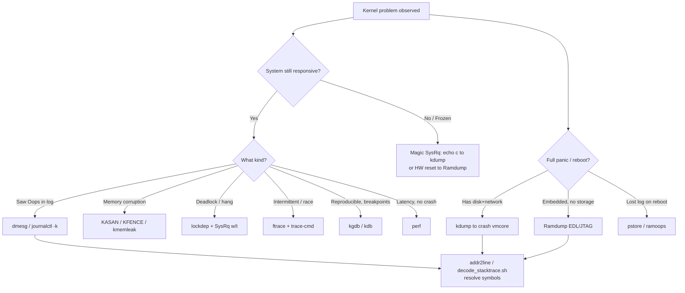

# Kernel Panic / Oops / Crash — Tooling Decision Document (ARM64)

> A from-scratch design & reference document for Kernel Engineers.
> Focus: **what each failure class is**, and **which tool to reach for — when, why, where, and how** — with ARM64 specifics.
> Companion to [01_Crash_Dump.md](01_Crash_Dump.md) (kdump/Ramdump deep dive).

---

## Table of Contents

1. [Taxonomy — Classify the Failure First](#1-taxonomy--classify-the-failure-first)
2. [Master Decision Matrix — Which Tool, When](#2-master-decision-matrix--which-tool-when)
3. [Tool-by-Tool Deep Dive](#3-tool-by-tool-deep-dive)
4. [The `panic_on_*` Control Knobs](#4-the-panic_on_-control-knobs)
5. [Decision Flow Diagram](#5-decision-flow-diagram)
6. [ARM64-Specific Quick Reference](#6-arm64-specific-quick-reference)
7. [End-to-End Worked Examples](#7-end-to-end-worked-examples)
8. [Interview Cheat Answers](#8-interview-cheat-answers)
9. [Kernel Source Map](#9-kernel-source-map)

---

## 1. Taxonomy — Classify the Failure First

Before picking a tool, classify the failure. The wrong classification leads to the wrong tool.

| Failure Class | Severity | Recoverable? | Definition | Kernel Entry Point |
|---|---|---|---|---|
| **Warning (WARN_ON)** | Low | Yes — system continues | A "should never happen" but non-fatal condition | `kernel/panic.c` → `__warn()` |
| **Oops** | Medium | Maybe — faulting task killed | Kernel detects an invalid operation (NULL deref, bad paging); kills the faulting context but tries to survive | `arch/arm64/kernel/traps.c` → `die()` |
| **Panic** | Fatal | No — system halts/reboots | Unrecoverable state; kernel cannot continue safely | `kernel/panic.c` → `panic()` |
| **Soft Lockup** | Medium | Usually | A task hogs a CPU > `watchdog_thresh` (default 20s) without scheduling | `kernel/watchdog.c` |
| **Hard Lockup** | Fatal | No | A CPU stops responding to interrupts (IRQs disabled too long) | `kernel/watchdog_hld.c` (NMI/PMU) |
| **Hung Task** | Medium | Maybe | A task stuck in `D` (uninterruptible) state > 120s | `kernel/hung_task.c` |
| **RCU Stall** | Medium→Fatal | Maybe | An RCU grace period never completes | `kernel/rcu/tree_stall.h` |
| **Deadlock** | Hang | No | Two+ paths waiting on each other's locks | detected by **lockdep** |

### Escalation Rules (memorize these)

- An **Oops becomes a Panic** if it occurs in:
  - interrupt context (`in_interrupt()`)
  - the idle task or init (PID 0 / PID 1)
  - when `panic_on_oops=1` is set
- A **Soft Lockup** escalates to a Panic with `softlockup_panic=1`.
- A **Hung Task** escalates to a Panic with `hung_task_panic=1`.
- An **RCU Stall** escalates to a Panic with `panic_on_rcu_stall=1`.

### The Oops vs Panic Distinction (one-liner)

> **Oops** = "kill the offender, keep the kernel alive." **Panic** = "the kernel itself is unsafe, stop everything."

---

## 2. Master Decision Matrix — Which Tool, When

This is the table interviewers want you to internalize.

| Situation | First Tool | Why | Backup Tool |
|---|---|---|---|
| System still alive, saw an Oops in logs | `dmesg` / `journalctl -k` | Stack trace + registers already printed | `pstore`/`ramoops` if log lost |
| Full panic, need complete memory state | **kdump** → `crash(8)` | Captures entire `vmcore` snapshot | Ramdump (embedded) |
| Embedded/Qualcomm ARM64, no disk/network | **Ramdump** (EDL/JTAG) | Pulls DDR externally over USB | kdump if storage exists |
| Panic but reboot wipes logs | **pstore / ramoops** | Persists dmesg across reboot in reserved RAM | kdump |
| Need to step through live, set breakpoints | **kgdb / kdb** | Interactive source-level debug | ftrace |
| Intermittent bug, need event timeline | **ftrace** / **trace-cmd** | Low-overhead function & event tracing | perf |
| Memory corruption (UAF, OOB) | **KASAN** | Catches the bug at the moment of corruption | KFENCE, kmemleak |
| Suspected lock ordering bug / deadlock | **lockdep** | Validates lock acquisition order at runtime | ftrace lock events |
| Frozen system, no response at all | **Magic SysRq** | Manually force crash/dump/backtrace | hardware reset + ramdump |
| Need symbol from raw address | `addr2line` / `decode_stacktrace.sh` | Map `pc`/`lr` to source line | `gdb`, `objdump` |
| Performance/latency, not a crash | **perf** | Sampling profiler, PMU counters | ftrace |
| Memory leak over time | **kmemleak** | Periodic unreferenced-object scan | tracing |

---

## 3. Tool-by-Tool Deep Dive

### 3.1 `dmesg` / `journalctl -k` — The First Responder

**WHEN:** Always first, if the system is still alive.
**WHY:** The Oops/panic message with registers and call trace is already in the kernel ring buffer (`printk` log buffer).
**WHERE:** `kernel/printk/printk.c`, ring buffer `__log_buf`.
**HOW:**
```bash
dmesg --level=err,warn        # filter by severity
dmesg -w                      # follow live
dmesg -T                      # human-readable timestamps
journalctl -k -b -1           # kernel log from the PREVIOUS boot
journalctl -k --since "5 min ago"
```

**Anatomy of an ARM64 Oops:**
```
Unable to handle kernel NULL pointer dereference at virtual address 0000000000000000
Mem abort info:
  ESR = 0x96000004                ← Exception Syndrome Register (fault cause)
  EC = 0x25: DABT (current EL)    ← Data Abort, current Exception Level
pc : my_buggy_func+0x2c/0x80      ← faulting instruction (WHERE it died)
lr : caller_func+0x40/0x120       ← link register (WHO called)
sp : ffff800012345678
x29: ...  x28: ...  ...  x0: ...   ← general-purpose register dump
Call trace:
 my_buggy_func+0x2c/0x80
 caller_func+0x40/0x120
 el0_svc_common+0x...
Code: aa0003e0 d2800001 ...        ← raw instruction bytes at pc
```

**Reading guide:**
- `pc` = exactly where it died; `lr` = who called it.
- `+0x2c/0x80` = offset `0x2c` into a `0x80`-byte function.
- `ESR`/`EC` decode the *type* of abort (data abort, instruction abort, alignment, etc.).
- `Call trace:` is the unwound stack — your primary lead.

---

### 3.2 kdump + `crash(8)` — Gold Standard for Full Postmortem

**WHEN:** Hard panic on a system with storage/network; you need *complete* memory state, not just the printed trace.
**WHY:** Captures the entire physical RAM (`vmcore`) so you can inspect every task, lock, allocator, and data structure offline.
**WHERE:** `kernel/kexec_core.c`, `arch/arm64/kernel/machine_kexec.c`, `fs/proc/vmcore.c`. (Full mechanism in [01_Crash_Dump.md](01_Crash_Dump.md).)
**HOW:**
```bash
# 1. Setup — reserve capture-kernel memory (ARM64 cmdline)
crashkernel=512M,high crashkernel=128M,low
systemctl enable --now kdump

# 2. Verify it is armed
cat /sys/kernel/kexec_crash_loaded   # must print 1

# 3. After a crash, analyze the vmcore
crash /usr/lib/debug/vmlinux /var/crash/*/vmcore
crash> bt -a          # backtrace ALL CPUs
crash> log            # in-memory dmesg (incl. unflushed lines)
crash> ps             # all tasks at crash time
crash> foreach bt     # every task's stack
crash> struct task_struct ffff0000c1234000
crash> kmem -i        # memory subsystem info
crash> dis my_func    # disassemble
```

**ARM64 gotcha:** cache flush (`flush_cache_all()` → `DC CISW`) before the MMU-off kexec jump. If incomplete, the vmcore contains stale RAM.

**Use kdump over ftrace/kgdb when:** the bug has *already crashed* the box and you need post-mortem completeness.

---

### 3.3 Ramdump (Embedded / Qualcomm ARM64)

**WHEN:** No disk/network, downstream vendor kernel, need EL3/TF-A or modem/DSP memory, or a very-early-boot crash.
**WHY:** Host PC pulls DDR directly over USB (Sahara/Firehose) after the SoC resets into **EDL mode** — no second kernel required.
**WHERE:** `drivers/soc/qcom/` (downstream), IMEM magic cookie `0x504D5344`.
**HOW:**
```bash
# Device panics → msm_restart() writes IMEM magic → SoC resets to EDL
# Host PC pulls DDR:
edl.py memory --start 0x80000000 --size 0x40000000 DDRCS0_0.BIN

# Reconstruct an ELF from raw DDR and analyze
python ramparse.py --ramfile DDRCS0_0.BIN --start-addr 0x80000000
crash vmlinux vmlinux_info.elf
```

| Dimension | kdump | Ramdump |
|---|---|---|
| Mechanism | kexec → 2nd kernel | SoC ROM → EDL mode |
| Collection | capture kernel writes `/proc/vmcore` | host PC reads DDR over USB |
| EL3 (TF-A) memory | not accessible | accessible |
| Subsystem (modem/DSP) | not accessible | accessible (PIL ramdump) |
| Needs on-device storage | yes | no |

---

### 3.4 pstore / ramoops — Surviving the Reboot

**WHEN:** Panic happens but reboot erases the ring buffer before you can read it, and you have no kdump.
**WHY:** Persists the last dmesg / Oops into a **reserved RAM region** (or hardware flash) that survives a warm reboot.
**WHERE:** `fs/pstore/`, `drivers/platform/chrome` / device-tree `ramoops` node.
**HOW:**
```dts
/* ARM64 device tree reserves a persistent region */
reserved-memory {
    ramoops@8f000000 {
        compatible = "ramoops";
        reg = <0x0 0x8f000000 0x0 0x100000>;  /* 1 MiB */
        record-size  = <0x20000>;
        console-size = <0x20000>;
    };
};
```
```bash
# After reboot, read the persisted Oops:
mount -t pstore pstore /sys/fs/pstore
cat /sys/fs/pstore/dmesg-ramoops-0
```
**Key insight:** pstore is the fallback when kdump is unavailable or too heavy (embedded). It saves only the *log*, not full memory.

---

### 3.5 kgdb / kdb — Interactive Live Debugging

**WHEN:** You can reproduce the bug and want to set breakpoints, single-step, inspect variables *live*.
**WHY:** Source-level (`kgdb`, host gdb over serial/USB) or built-in shell (`kdb`) debugging of a running kernel.
**WHERE:** `kernel/debug/`, `arch/arm64/kernel/kgdb.c`.
**HOW:**
```bash
# Kernel cmdline (ARM64 PL011 UART):
kgdboc=ttyAMA0,115200 kgdbwait

# On the host:
gdb vmlinux
(gdb) target remote /dev/ttyUSB0
(gdb) b my_func
(gdb) c
(gdb) bt
(gdb) p my_struct

# Or drop into the built-in kdb shell:
echo g > /proc/sysrq-trigger
kdb> bt
kdb> md ffff800010000000   # memory display
kdb> ps
```
**Use over kdump when:** the bug is *reproducible* and you want to watch it happen, not autopsy after death.

---

### 3.6 ftrace / trace-cmd — The Event Timeline

**WHEN:** Intermittent bug, race condition, "what was the sequence of events before the crash."
**WHY:** Lowest-overhead in-kernel tracer — function graph, event tracing, latency tracking.
**WHERE:** `kernel/trace/`, exposed at `/sys/kernel/tracing`.
**HOW:**
```bash
cd /sys/kernel/tracing
echo function_graph > current_tracer
echo my_subsys_* > set_ftrace_filter
echo 1 > tracing_on
cat trace

# Event tracing:
echo 1 > events/sched/sched_switch/enable

# KILLER COMBO — dump the trace buffer into dmesg at panic:
echo 1 > /proc/sys/kernel/ftrace_dump_on_oops
```
**Killer combo:** `ftrace_dump_on_oops=1` dumps the last N events before death into the Oops output. Pair it with kdump for both timeline + full state.

---

### 3.7 KASAN / KFENCE / kmemleak — Memory Bug Hunters

**WHEN:** Use-after-free, out-of-bounds, double-free, leaks. The crash trace is often misleading because corruption happens *before* the symptom.
**WHY:** Catch the bug at the **moment of corruption**, not the downstream crash.
**WHERE:** `mm/kasan/`, `mm/kfence/`, `mm/kmemleak.c`.

| Tool | Catches | Overhead | Use |
|---|---|---|---|
| **KASAN** | UAF, OOB, double-free | ~2–3x slow, ~1/8 RAM (shadow) | Dev / CI builds |
| **KFENCE** | Same, sampled | Near-zero | Production-capable |
| **kmemleak** | Leaks | High | Periodic scan |

```
CONFIG_KASAN=y     CONFIG_KASAN_INLINE=y
# Reproduce, KASAN prints BOTH stacks:
BUG: KASAN: use-after-free in my_func+0x2c/0x80
Freed by task 123:     kfree+0x... my_free_path+0x...   ← who freed
Allocated by task 122: kmalloc+0x... my_alloc_path+0x...← who allocated
```
**Interview point:** KASAN reports *both* the alloc and free stacks — that's why it beats a plain Oops for corruption bugs.

```bash
# kmemleak:
echo scan > /sys/kernel/debug/kmemleak
cat /sys/kernel/debug/kmemleak
```

---

### 3.8 lockdep — Deadlock & Lock-Ordering Validator

**WHEN:** Hang with no Oops, suspected deadlock, ABBA lock ordering.
**WHY:** Runtime validation of *every* lock acquisition order; reports a violation *before* the deadlock actually triggers.
**WHERE:** `kernel/locking/lockdep.c`.
**HOW:**
```
CONFIG_PROVE_LOCKING=y   CONFIG_DEBUG_LOCKDEP=y
# dmesg prints:
======================================================
WARNING: possible circular locking dependency detected
       CPU0                    CPU1
       ----                    ----
  lock(&A);                lock(&B);
                           lock(&A);   ← ABBA deadlock
  lock(&B);
```

---

### 3.9 Magic SysRq — Manual Override on a Frozen Box

**WHEN:** System is hung and unresponsive; you need to force action.
**WHY:** A kernel-level keyboard/console backdoor that works even when userspace is dead.
**WHERE:** `drivers/tty/sysrq.c`.
**HOW:**
```bash
echo 1 > /proc/sys/kernel/sysrq    # enable all functions
echo c > /proc/sysrq-trigger       # force a CRASH → triggers kdump
echo t > /proc/sysrq-trigger       # dump all task stacks
echo l > /proc/sysrq-trigger       # backtrace all active CPUs
echo w > /proc/sysrq-trigger       # dump blocked (D-state) tasks
echo m > /proc/sysrq-trigger       # dump memory info
# Physical console: Alt+SysRq+<key>; serial: BREAK then <key>
```
**`echo c`** is the standard way to *test* that kdump is correctly armed.

---

### 3.10 Symbol Resolution — `addr2line`, `decode_stacktrace.sh`, `objdump`, `gdb`

**WHEN:** You have a raw trace with offsets but no symbol names (stripped/production kernel).
**WHY:** Translate `func+0x2c` or a raw PC into a source file:line.
**WHERE:** `scripts/decode_stacktrace.sh` in the kernel tree.
**HOW:**
```bash
# Single address:
addr2line -e vmlinux -f 0xffff800010012abc

# Whole pasted Oops:
cat oops.txt | ./scripts/decode_stacktrace.sh vmlinux

# Disassemble around the faulting offset:
aarch64-linux-gnu-objdump -dS vmlinux | grep -A20 '<my_buggy_func>:'

# gdb source line:
gdb vmlinux -batch -ex 'list *(my_buggy_func+0x2c)'
```

---

### 3.11 perf — When It's Latency, Not a Crash

**WHEN:** No crash, but high latency / CPU spikes / scheduling anomalies.
**WHY:** Sampling profiler backed by ARM64 PMU (Performance Monitor Unit) counters.
**WHERE:** `kernel/events/`, `tools/perf/`.
**HOW:**
```bash
perf top                          # live hottest functions
perf record -g -a -- sleep 10     # system-wide with call graphs
perf report
perf stat -e cache-misses,cycles ./workload
```

---

## 4. The `panic_on_*` Control Knobs

Interviewers love these — they convert "soft" failures into capturable panics so kdump fires.

```bash
/proc/sys/kernel/panic            # seconds before reboot after panic (0 = halt forever)
/proc/sys/kernel/panic_on_oops    # 1 = turn every Oops into a panic
/proc/sys/kernel/hung_task_panic  # 1 = panic on hung task
/proc/sys/kernel/softlockup_panic # 1 = panic on soft lockup
/proc/sys/kernel/hardlockup_panic # 1 = panic on hard lockup
kernel.panic_on_rcu_stall = 1     # panic on RCU stall
kernel.panic_on_warn = 1          # panic on WARN_ON (aggressive CI)
kernel.softlockup_all_cpu_backtrace = 1   # backtrace every CPU on soft lockup
```
**Strategy:** In CI/debug environments, set these to `1` so any anomaly produces a `vmcore` you can analyze, rather than a silent hang.

---

## 5. Decision Flow Diagram



---

## 6. ARM64-Specific Quick Reference

| Concern | ARM64 Detail |
|---|---|
| **Registers in Oops** | `x0–x30`, `pc`, `lr`, `sp`, `pstate` (not x86's RIP/RSP) |
| **Fault syndrome** | `ESR_ELx` (Exception Syndrome Register), `EC` field = exception class |
| **Faulting addr line** | "Unable to handle kernel ... at virtual address ..." |
| **kdump cmdline** | `crashkernel=512M,high crashkernel=128M,low` |
| **Cache coherency** | `DC CISW` flush before MMU-off kexec jump (no x86 equivalent) |
| **Interrupt controller** | GICv3/v4 — capture kernel uses `irqpoll maxcpus=1` |
| **Serial for kgdb** | PL011 UART, e.g. `kgdboc=ttyAMA0,115200` |
| **KASLR** | `kimage_voffset` symbol needed for virt↔phys in dumps; `nokaslr` for clean analysis |
| **Exception levels** | EL0=user, EL1=kernel (kdump), EL2=hyp/KVM, EL3=TF-A (only ramdump/JTAG sees EL3) |
| **Stack unwinding** | Frame-pointer based (`CONFIG_UNWINDER_FRAME_POINTER`) |
| **Per-CPU reg save** | `crash_save_cpu()` writes `struct user_pt_regs` per CPU into PT_NOTE |

---

## 7. End-to-End Worked Examples

### Example A — "NULL pointer deref panic that reboots instantly"

1. `panic=0` so the box halts and keeps the trace on screen.
2. Read `pc`/`lr` from the Oops; `decode_stacktrace.sh` → source line.
3. If reboot already happened: `journalctl -k -b -1` or pstore.
4. For full state: ensure kdump armed (`kexec_crash_loaded == 1`), reproduce, analyze `vmcore` with `crash> bt -a`.

### Example B — "Random corruption, crash stack makes no sense"

1. Suspect heap corruption → rebuild with `CONFIG_KASAN=y`.
2. Reproduce. KASAN reports the alloc + free stacks at the exact corrupting access.
3. Fix the lifetime bug; verify clean under KASAN.

### Example C — "System hangs, no Oops, nothing in logs"

1. Magic SysRq `w` (D-state tasks) and `l` (all-CPU backtrace) over serial.
2. If lock-ordering suspected: `CONFIG_PROVE_LOCKING=y`, reproduce, read lockdep splat.
3. If a CPU is wedged with IRQs off: hard lockup detector / `hardlockup_panic=1` → kdump.

### Example D — "Qualcomm board, no storage, early-boot hang"

1. Configure Ramdump collection (downstream `MSM_RAMDUMP`).
2. Trigger watchdog bite or panic → SoC enters EDL.
3. Host PC pulls DDR over USB → `ramparse.py` → `crash(8)`.

---

## 8. Interview Cheat Answers

- **"Oops vs Panic?"** → Oops kills the faulting task and tries to survive; Panic is unrecoverable and halts. Oops escalates to Panic in IRQ/idle context or with `panic_on_oops=1`.
- **"How do you debug a panic that reboots instantly?"** → Set `panic=0` to halt; enable kdump for a vmcore; or pstore/ramoops to persist the log across reboot.
- **"kdump vs ftrace?"** → kdump = post-mortem full snapshot after death; ftrace = live event timeline leading up to death. Combine via `ftrace_dump_on_oops`.
- **"Found a UAF — plain trace or KASAN?"** → KASAN, because it reports both the alloc and free stacks at the moment of corruption, not the downstream symptom.
- **"System fully frozen, how to get a dump?"** → Magic SysRq `echo c` (forces panic → kdump); on embedded, hardware reset into EDL → Ramdump.
- **"Hang with no Oops?"** → Could be deadlock (lockdep), hung task (`hung_task_panic`), or hard lockup (NMI watchdog). Use SysRq `w`/`t`/`l` to dump stacks.
- **"What's ARM64-special about kdump?"** → Explicit `DC CISW` cache flush before the MMU-off kexec jump, GICv3 re-init in the capture kernel, and `crashkernel=,high/,low` split for large memory.

---

## 9. Kernel Source Map

```
kernel/
├── panic.c                 ← panic(), __warn(), WARN_ON path
├── watchdog.c              ← soft lockup detector
├── watchdog_hld.c          ← hard lockup detector (NMI/PMU)
├── hung_task.c             ← D-state hung task detector
├── kexec_core.c            ← crash_kexec(), kimage management
├── crash_core.c            ← crash_save_cpu(), reserve_crashkernel()
├── locking/lockdep.c       ← lock ordering validator
├── trace/                  ← ftrace core
├── rcu/tree_stall.h        ← RCU stall detection
└── debug/                  ← kgdb / kdb core

arch/arm64/kernel/
├── traps.c                 ← die(), Oops formatting, ESR decode
├── machine_kexec.c         ← machine_crash_shutdown(), machine_kexec()
├── cpu-reset.S             ← cpu_soft_restart() (MMU-off jump)
├── kgdb.c                  ← ARM64 kgdb backend
└── crash_dump.c            ← copy_oldmem_page()

mm/
├── kasan/                  ← KASAN shadow-memory checker
├── kfence/                 ← sampled UAF/OOB detector
└── kmemleak.c              ← leak detector

fs/
├── proc/vmcore.c           ← /proc/vmcore ELF synthesis
└── pstore/                 ← persistent store (ramoops backend)

drivers/tty/sysrq.c         ← Magic SysRq handlers
```

---

## 10. Summary — The Mental Model

| Phase | Question | Tool |
|---|---|---|
| **Classify** | What kind of failure is this? | Taxonomy table (§1) |
| **Triage live** | Is the system still alive? | dmesg, SysRq |
| **Capture** | Crashed — how do I freeze evidence? | kdump / Ramdump / pstore |
| **Reproduce** | Can I watch it happen? | kgdb, ftrace |
| **Root-cause class** | Corruption? Deadlock? Leak? | KASAN, lockdep, kmemleak |
| **Resolve symbols** | What source line is this? | addr2line, decode_stacktrace.sh |
| **Analyze** | Full offline autopsy | crash(8) on vmcore |

> **Core principle:** Match the tool to *both* the failure class **and** the system's liveness state. A dead system needs a *capture* tool (kdump/ramdump/pstore); a live-but-buggy system needs a *detection* tool (KASAN/lockdep/ftrace); a reproducible bug needs an *interactive* tool (kgdb).
